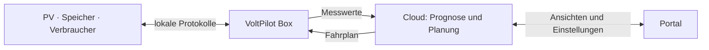

# VoltPilot EMS

VoltPilot verbindet PV-Anlagen, Speicher und steuerbare Verbraucher. Die Cloud plant den Betrieb; die Box vor Ort erfasst Messwerte, führt freigegebene Vorgaben aus und begrenzt sie anhand lokaler Schutzregeln.



**Im Repository vorhanden:** mandantenfähiges Portal mit Anmeldung, Geräteanbindung, Telemetrie, Prognosen, Speicher-/Verbraucherplanung, Automationen, OCPP-Ladepark und signierte Edge-Updates. Verfügbarkeit und Schreibfreigaben hängen von Anlage, Gerät und Konfiguration ab. Der Direktvermarktungsadapter ist weiterhin ein Stub.

## Lokal starten

Voraussetzungen: Docker mit Compose v2; Node.js 22 für das Portal. Befehle im Repository-Wurzelverzeichnis ausführen.

```bash
# Nur beim ersten Einrichten; eine vorhandene .env beibehalten.
cp .env.example .env
docker compose up -d --build
cd frontend/portal
npm install
npm run dev
```

Portal: <http://localhost:5173>. Lokale Demozugänge: `demo` / `demo`, `demo2` / `demo2`; Plattformverwaltung: `admin` / `admin`. Diese Zugänge gehören ausschließlich zur Entwicklungsumgebung.

| Benötigt | Compose-Aufruf im Repository-Wurzelverzeichnis |
|---|---|
| API und Infrastruktur | `docker compose up -d --build` |
| Simulierte Gerätedaten einschließlich Ingest/Writer | `docker compose --profile edge up -d --build` |
| Preise, Wetter und Prognosen | `docker compose --profile feeds up -d --build` |
| Zusätzlich Fahrpläne | `docker compose --profile feeds --profile optimize up -d --build` |

Der Basisstart zeigt vorbereitete Demodaten. Die Kunden-Box unter `edge-app/` ist ein eigener Stack; `edge/` enthält den lokalen Node-RED-/SunSpec-Testpfad.

## Dokumentation

| Ich möchte … | Einstieg |
|---|---|
| das System verstehen | [Architektur](docs/architecture.md) |
| entwickeln und testen | [Lokale Entwicklung](docs/development.md) |
| Cloud-Software ausrollen | [Deployment](docs/deploy.md) |
| eine Box anbinden | [Geräte verbinden](docs/connect-a-device.md) |
| die Box installieren | [Edge-App](edge-app/README.md) |
| MQTT-/API-Verträge nachschlagen | [Schnittstellen](docs/contracts/README.md) |
| das Portal bedienen | im Portal **Hilfe** oder `#/hilfe` |
| weitere Themen finden | [Dokumentationsübersicht](docs/README.md) |

Die technische Doku beschreibt den geprüften Repository-Stand. Der tatsächlich ausgerollte Stand ist im Deployment beziehungsweise am Gerät zu prüfen.
