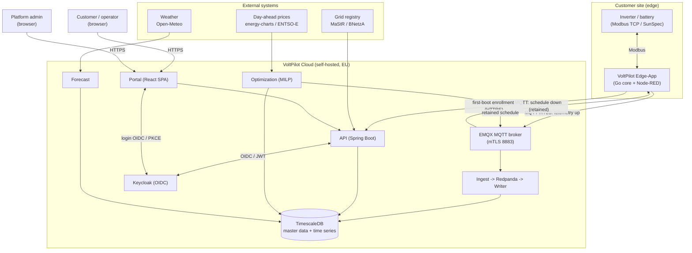
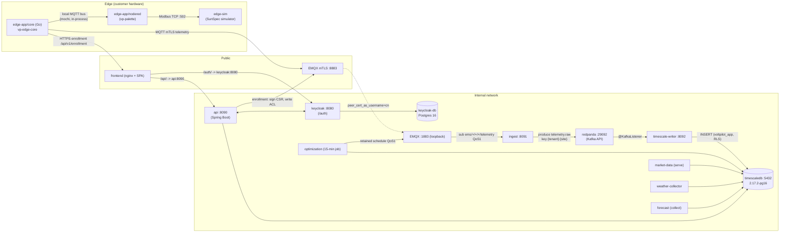
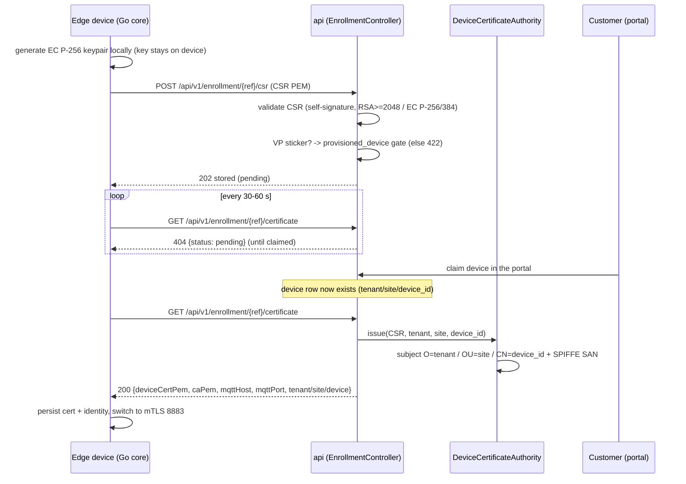
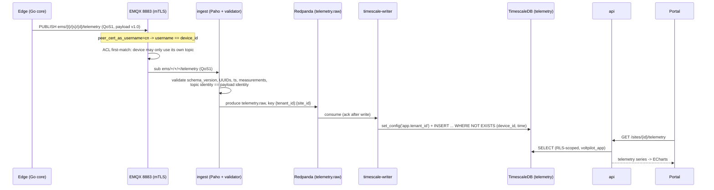
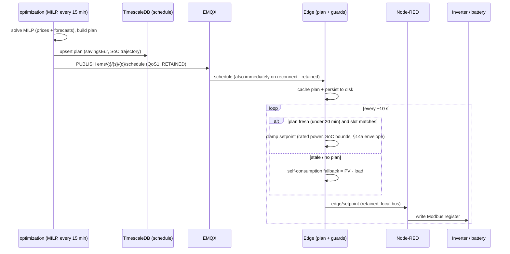
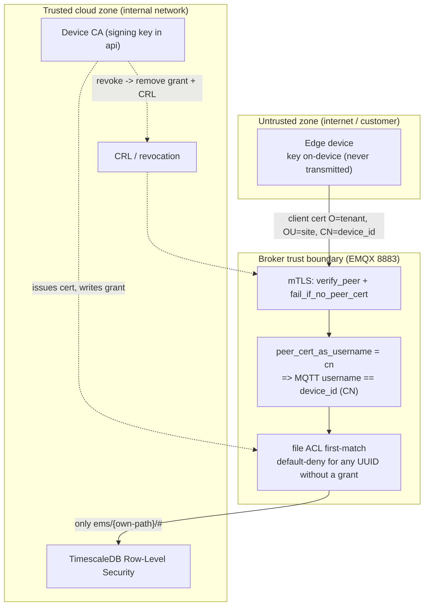
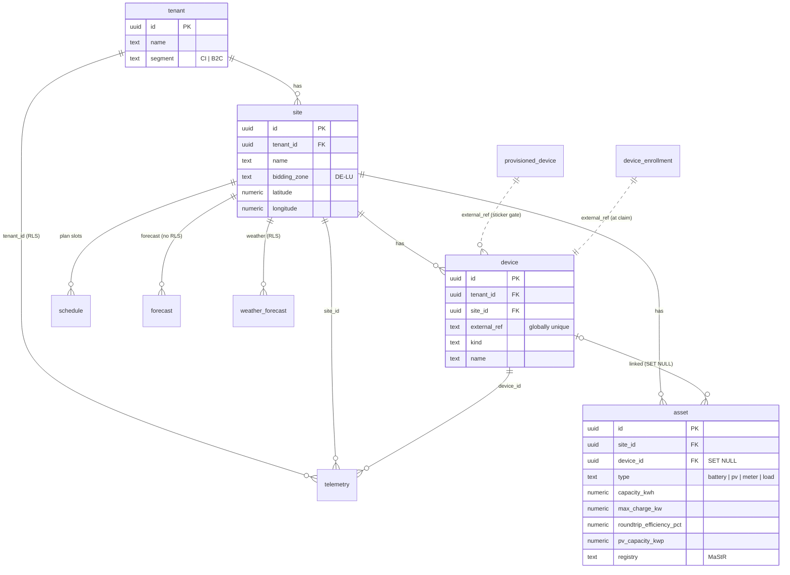

# VoltPilot-EMS

**Self-hosted, multi-tenant Energy Management System for PV, battery storage and load management in the DACH market.**

VoltPilot computes the economically optimal battery schedule per customer site - charge on cheap or PV-surplus power, discharge when power is expensive - maximizing self-consumption and, over time, marketing flexibility via a direct marketer.
The **intelligence lives in the cloud** (multi-tenant portal, optimization, forecasting); the **edge stays deliberately thin**, executing a 24-hour plan slot by slot and falling back to a safe self-consumption default whenever the cloud is unreachable.
Everything runs **self-hosted on EU infrastructure, GDPR-friendly by design**, and serves both **B2C** (private homes) and **C&I** (commercial) customers on one platform.

## System context

Who talks to whom: customer edge devices, the VoltPilot cloud, and the external data sources it consumes.



## Architecture

Every service and the protocols between them. In production only **two ports are public**: the frontend (HTTP behind a TLS-terminating reverse proxy) and EMQX `8883` (mTLS, for devices). Everything else lives on the internal network.



**What each service does:**

| Service | Path | Job |
|---|---|---|
| **api** | `services/api` | Portal backend: REST/WS, tenancy, business logic, device-enrollment CA |
| **ingest** | `services/ingest` | Consume MQTT, validate, publish to Redpanda |
| **timescale-writer** | `services/timescale-writer` | Redpanda -> TimescaleDB writer |
| **optimization** | `services/optimization` | Battery-dispatch MILP (Pyomo + HiGHS): 24h / 15-min plan |
| **forecast** | `services/forecast` | Load/PV forecast: active baselines + shadow-mode ML challengers |
| **market-data** | `services/market-data` | Day-ahead price adapter (energy-charts / ENTSO-E) |
| **weather-collector** | `services/forecast` | Open-Meteo weather forecasts (keyless, EU-hosted) |
| **marketing-adapter** | `services/marketing-adapter` | Direct-marketing adapter (stub) |
| **frontend** | `frontend/portal` | React SPA + nginx (single web entry point) |
| **edge-app/core** | `edge-app/core` | Go edge agent: enrollment, mTLS link, buffering, schedule execution + guards |
| **edge-app/nodered** | `edge-app/nodered` | Per-customer I/O flows (vp-palette) |

**Tech stack:**

| Concern | Choice | Version |
|---|---|---|
| JVM services | Java + Spring Boot (Maven) | Java 21, Boot 3.3.5 |
| Python services | setuptools + pyproject, pytest | Python 3.10+ |
| Optimization solver | Pyomo + HiGHS | pyomo 6.7+ |
| Frontend | React + Vite + TypeScript | React 18, Vite 5 |
| Edge core | Go | 1.24+ |
| Edge I/O | Node-RED | 4.0 |
| Time series + master data | TimescaleDB (Postgres 16) | 2.17.2-pg16 |
| MQTT broker | EMQX | 5.8.3 |
| Event log | Redpanda (Kafka API) | v24.2.7 |
| Auth (OIDC) | Keycloak | 26.0.5 |

## Edge ↔ Portal data flows

The heart of the product: three flows over the MQTT + HTTPS link between a customer's edge and the cloud.

### 1. First-boot enrollment (automatic mTLS)

A factory-fresh device knows only its printed reference and the portal URL. It generates its keypair locally - **the private key never leaves the device** - uploads a CSR, and polls. The moment the customer claims the reference in the portal, the api signs the certificate and the device switches to normal mTLS operation. No manual certificate copying.



### 2. Telemetry uplink

The core MVP data path: `edge -> EMQX (mTLS) -> ingest -> Redpanda -> writer -> TimescaleDB -> api -> portal`. Every message is validated (identity, schema) and written idempotently, so at-least-once delivery is safe.



### 3. Schedule / setpoint downlink

The optimizer solves a fresh plan every 15 minutes and publishes it **retained** on the schedule topic, so a reconnecting edge receives the current plan immediately. The edge caches it to disk, executes it slot by slot, and **clamps every setpoint** through local guards before any register write.



**Topics** (binding contracts in [`docs/contracts/`](docs/contracts/)):

```
ems/{tenant_id}/{site_id}/{device_id}/telemetry   Edge -> Cloud, QoS1
ems/{tenant_id}/{site_id}/{device_id}/status       Edge -> Cloud, heartbeat
ems/{tenant_id}/{site_id}/{device_id}/schedule     Cloud -> Edge, retained
ems/{tenant_id}/{site_id}/{device_id}/command      Cloud -> Edge, ad-hoc
ems/{tenant_id}/{site_id}/{device_id}/config       Cloud -> Edge, retained
provision/{ref}/hello   |   provision/{ref}/config  zero-touch onboarding handshake
```

## Security & multi-tenancy

Two reinforcing layers keep one customer's data invisible to another. On the wire, **mTLS binds identity into the certificate** and a per-device broker ACL locks each device to its own topics. In the database, **Postgres Row-Level Security** scopes every tenant-owned table - enforced by the DB, not by query filters, so an out-of-tenant row is simply invisible (a miss is a 404, never a 403).



- **mTLS transport** - EMQX on 8883 with `verify_peer` + `fail_if_no_peer_cert`. Devices connect outbound-only (no open edge ports).
- **Identity binding** - the certificate subject is `O=tenant_id, OU=site_id, CN=device_id`; the broker derives the MQTT username from the CN, so a device cannot spoof its identity.
- **Per-device ACL** - each device gets a generated grant allowing only its own `telemetry`/`status` (up) and `schedule`/`command`/`config` (down). Any identity without a grant is default-denied; cross-tenant publish is impossible.
- **Database RLS** - a request's `tenant_id` claim is stamped onto the connection (`set_config`), and `FORCE ROW LEVEL SECURITY` scopes every tenant table. The runtime role is `NOBYPASSRLS`, so even application bugs cannot cross tenants; a separate `BYPASSRLS` admin role stays behind `/api/v1/admin/**` only.

## Core data model

One Postgres/TimescaleDB instance serves both master data and time-series hypertables. Tenant-owned tables carry `tenant_id` and are RLS-scoped; market-wide and manufacturing tables deliberately are not.



Time series live in hypertables: `telemetry`, `telemetry_rollup_15m/1h/1d`, `forecast`, `day_ahead_prices`, `weather_forecast`, `schedule`. The schema is owned by Flyway migrations in `services/api` (RLS enforced), with `services/market-data` and `services/forecast` shipping their own.

## What the portal does

One unified shell for both roles - a left sidebar, a top bar with the tenant context, and one page at a time. Platform admins get an additive **Plattform** nav group and a tenant switcher; customers see a read-only tenant badge.

| Page | What it does |
|---|---|
| **Übersicht** | Money-first KPIs (planned savings, avg price), live telemetry, price + weather widgets |
| **Standorte** | Sites with detail drawers; asset section with MaStR grid-registry linking |
| **Geräte** | Zero-touch device add (site + reference only), live online status |
| **Marktpreise** | Day-ahead price chart (15-min bars, today/tomorrow) |
| **Wetter** | Temperature / cloud cover / irradiance forecast |
| **Fahrplan** | Battery schedule: setpoint bars over the price line + planned SoC |
| **Historie** | Day/week/month/year with money headline, daily protocol, plan-vs-actual |
| **Prognosequalität** | Active models, forecast-error series, shadow challenger progress |
| **Mandanten / Benutzer / Geräte-Registry** (admin) | Tenant, user and manufacturing-registry management |

**Behind the portal:**

- **Optimization** - a deterministic battery-dispatch MILP (Pyomo + HiGHS), MPC-style: rolling 24h horizon in 15-min slots, re-planned every 15 min. Minimizes grid cost against day-ahead prices and load/PV forecasts, honoring SoC bounds, charge/discharge limits and the observed §14a grid-limit envelope. Publishes a retained schedule and a projected-savings headline.
- **Forecast** - a measurable, swappable model registry: active baselines (seasonal persistence for load, a physical PV model) plus XGBoost challengers running in **shadow mode** with daily evaluation and a plain-German quality view. Promotion is a deliberate human decision, never automatic.
- **Market data & weather** - keyless, EU-hosted collectors (energy-charts day-ahead prices, Open-Meteo weather) feed the optimizer and portal; ENTSO-E is an optional keyed alternative.
- **Onboarding** - public self-registration with seamless auto-login into a guided 3-step wizard (site via address search → device by reference → connected), and optional MaStR asset linking that prefills PV/battery parameters from the public grid registry.

## Quickstart

Copy-paste path to a healthy full stack plus a working portal login. Full detail (LAN access, per-service builds, verification commands) is in [`docs/development.md`](docs/development.md).

**Prerequisites:** Docker with Compose v2, and Node 20+ for the portal.

```bash
cp .env.example .env                            # dev-only secrets; defaults work as-is
docker compose --profile edge up -d --build     # backbone + api + edge (Node-RED + SunSpec sim)
docker compose --profile edge ps                # wait until every service is healthy
```

The `edge` profile adds the Node-RED edge and simulated SunSpec source; drop it for a backbone-only bring-up. Two further profiles are opt-in: `feeds` (day-ahead prices + weather) and `optimize` (the battery optimizer). On first start the TimescaleDB init scripts run **once** and the api applies its Flyway migrations over that bootstrap.

Run the web portal (outside compose, via Vite):

```bash
(cd frontend/portal && npm install && npm run dev)   # http://localhost:5173
```

Open http://localhost:5173, click **Anmelden**, and log in with a seeded dev-only user - `demo`/`demo` (tenant A) or `demo2`/`demo2` (tenant B) for the customer portal, or `admin`/`admin` for the platform admin surface. Each customer sees only their own tenant's data (enforced by Postgres RLS). You can also self-register a fresh account via **Konto erstellen** and land in the onboarding wizard.

Tear down with `docker compose --profile edge down` (add `-v` to wipe data).

## Documentation

| Doc | Content |
|---|---|
| [`docs/architecture.md`](docs/architecture.md) | Canonical product architecture |
| [`docs/development.md`](docs/development.md) | Full local bring-up, verification, per-service builds |
| [`docs/contracts/`](docs/contracts/) | Binding interface contracts (MQTT telemetry/schedule/provisioning, Redpanda event, portal OpenAPI) |
| [`docs/connect-a-device.md`](docs/connect-a-device.md) | Connecting a real remote edge device over mTLS |
| [`docs/security-mqtt.md`](docs/security-mqtt.md) | Security model + hardening checklist |
| [`docs/deploy.md`](docs/deploy.md) | Single-VM production deployment (external TLS + Forgejo push-to-deploy) |
| [`edge-app/nodered/CUSTOM-INVERTER.md`](edge-app/nodered/CUSTOM-INVERTER.md) | Wiring a custom inverter into the edge |
| [`AGENTS.md`](AGENTS.md) | Durable stack/ports/run/build/test reference |
