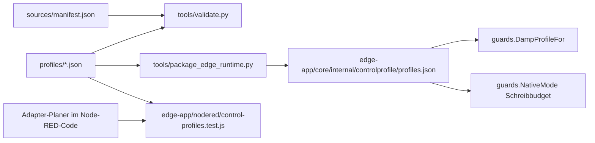

# Steuerprofile

Je Gerätefamilie ein **Steuerprofil**: welcher Hebel eine Absicht umsetzt (E, E↑, E↓, E~, N, H, A und die
Einspeisegrenze G), mit Schreibfolge, Beleg-Register und Rückfall, dazu Firmware-Bedingung, Zählerort,
Übergabe, Totmann, Schreibbudget und Dämpfung – jede Aussage mit Quellen und Sicherheit A–D. Grundlage ist das
Konzept „Der Wechselrichter regelt, die Box setzt Absicht und Grenzen“ (vp-wechselrichter-eigenregelung-k1,
24.09.2026, §4 „Profil statt Sonderfall“); der Startbestand sind alle 24 Zeilen seiner Entscheidungsmatrix.

**Ein Profil ist Wissen, keine Freigabe** (`"freigabe": "keine"`). Freigegeben wird weiter je Modell + Firmware +
Prüfnachweis über das Zertifikat in `edge-app/nodered/unplanned-load-native.js`
(`CERTIFIED_NATIVE_CAPABILITIES`, `certificateMatchesPlan`). Die Box bekommt aus den Profilen nur Einschwingzeit,
Messtakt und Tagesbudget – keinen Hebel, keine Schreibfolge, kein Zertifikatswort.



## Aufbau

| Pfad | Inhalt |
|---|---|
| `profiles/<id>.json` | ein Profil je Gerätefamilie, die einzige von Hand gepflegte Wahrheit |
| `sources/manifest.json` | Quellenmanifest: jede Quelle mit Titel, Art (`hersteller`, `feld`, `eigen`, `repo`), Stand und Ort; Repo-Quellen mit Pfaden |
| `vocabulary.json` | Absichten, Überlagerungen, Hebel, Rückfall und Sicherheitsstufen (die Enums des Schemas) |
| `schema/*.schema.json` | JSON-Schemata für Profil und Quellenmanifest |
| `tools/validate.py` | Schema plus Projekt-Invarianten |
| `tools/package_edge_runtime.py` | erzeugt die Box-Sicht für den Go-Core (`--check` im CI) |

## Lesart der Felder

- **Sicherheit**: A Herstellerdokument (Stand genannt) · B an unserem Gerät gemessen oder gelesen · C Feldquelle ·
  D unbelegt, am Gerät prüfen. Textblöcke aus der Matrix tragen die schwächste darin genannte Stufe; ohne Angabe D.
  `null` nur für den Text „–“ (trifft nicht zu).
- **Schreibfolge**: `null` = unbelegt, `[]` = nichts zu schreiben (etwa „Schreiben einstellen“). Ein Zahlenwert ist
  fest, ein Text („planwert“, „planabhängig“) hängt vom Plan ab. `speicher` sagt je Schritt, ob RAM oder
  Dauerspeicher beschrieben wird. Ziele sind Registernummern (dezimal) oder SunSpec-Punkte `Modell.Punkt` (Adresse
  immer per Discovery).
- **`adapter`**: der heutige Code-Stand der gebauten Familien (Deye Fernsteuer-Block und ToU, Fronius PV und GEN24,
  KOSTAL, KACO NH3). `adapter.folgen` sind die Folgen, die der Planer heute baut; eine Zelle mit `adapter_folge`
  trägt genau diese Folge. Die Reihenfolge ist nur dort verbindlich; in den übrigen Zellen steht sie so, wie die
  Quelle die Register nennt, und ist vor einem Adapter (K9) am Gerät zu prüfen. `abweichungen` benennt, wo Code und
  Herstellerdokument auseinanderliegen (Fronius GEN24).
- **`bindung`**: wie die Box das Profil findet – Marke, Registerfamilie und Modelle aus
  `edge-app/core/internal/inverter`, Steuerpfad aus der Rückmeldung von Layer 1 (`remote`/`tou` am Deye). Nur die
  im Repo angebundenen Familien sind gebunden; SMA, Fronius GEN24 und Huawei sind vollständig, aber ungebunden (K9).
- **`firmware_bedingung`**: immer vom Gerät gelesen (`"gelesen": true`), nie getippt – am Deye das Sonden-Urteil
  `remote-pr978` des Fernsteuer-Blocks.
- **`daempfung`**: `box_regelt: false` schaltet den gedämpften Folger ab (Dauerspeicher-Hebel, Konzept §6.5);
  Einschwingzeit und Messtakt nur mit Sicherheit A/B und Quelle, sonst gilt die Vorgabe der Box.
- **`schreibbudget.dauerspeicher_je_tag`**: höchstens 20 (Konzept §6.6, Prüffall F12). Das Profil kann das Budget
  enger fassen, nie weiter; ob ein Hebel Dauerspeicher schreibt, meldet weiter Layer 1 aus dem Zertifikat.

## Prüfen

Nur Standardbibliothek, ohne Netz- oder Gerätezugriff (der JSON-Schema-Evaluator ist der des Messpunktkatalogs):

```bash
python3 catalog/control-profiles/tools/validate.py
python3 -m unittest discover -s catalog/control-profiles/tests -p 'test_*.py'
python3 catalog/control-profiles/tools/package_edge_runtime.py --check
```

Dazu `go test ./internal/controlprofile/ ./internal/guards/` in `edge-app/core` (eingebettete Kopie gegen die
Profile, Bindungen gegen den Wechselrichter-Katalog, Dämpfer und Budget) und
`node --test edge-app/nodered/control-profiles.test.js` (Profil gegen Adapter und Zertifikat).

## Ändern

1. Profil unter `profiles/` bearbeiten; neue Quellen zuerst in `sources/manifest.json` eintragen.
2. `validate.py` ausführen. Ändert sich eine gebundene Familie (Bindung, Dämpfung, Budget), danach
   `package_edge_runtime.py` ausführen – das ist dann eine Box-Änderung und gehört zu einem Edge-Release.
   Reines Wissen (Texte, Quellen, ungebundene Familien) lässt die Box-Sicht bytegleich.
3. Ändert sich ein Adapter-Planer, gehört die neue Folge in dasselbe PR wie der Code; der Node-Test schlägt sonst fehl.
4. Ein neues Zertifikat braucht ein gebundenes Profil mit gelesener Firmware-Bedingung derselben Marke.
