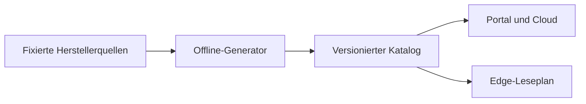

# Messpunktkatalog

Dieser Ordner ist die gemeinsame, versionierte Wahrheit für Messpunkte in Portal,
Cloud und Edge. Portal und Cloud verwenden ihn für die Messauswahl; die Edge liest zusätzliche Punkte über den [Messruntime](../../edge-app/nodered/measurements/README.md). Der Katalog selbst schreibt keine Register.



Das aktuelle, kanonische Artefakt ist
[`dist/measurement-point-catalog-2026.09.23.1.json`](dist/measurement-point-catalog-2026.09.23.1.json).
Es wird ohne Netz- oder Gerätezugriff ausschließlich aus den unter `sources/`
eingecheckten Snapshots erzeugt. `sources/manifest.json` pinnt Commit bzw.
Dokumentationsstand und SHA-256. Das Artefakt enthält keinen Erzeugungszeitstempel;
gleicher Checkout und gleiche Python-Standardbibliothek ergeben dieselben Bytes.

## Modell

Jede Familie trägt außerdem `single_reader`. Das ist eine reine Cloud-Regel für das Anlegen
von Datenquellen: `true` bedeutet, dass niemals zwei Boxen dasselbe physische Gerät gleichzeitig
lesen dürfen (Solarman-Logger, WAGO-Koppler-Weg). Das Feld gehört bewusst nicht zu `EDGE_FIELDS`.

Jede Familie trägt `rueckfall_ohne_box` (UEMS AP-15 IP-6, Regel G3): was ein Gerät dieser Familie tut,
wenn seine Box schweigt, je Richtung `einspeisung`/`bezug` — ein Wort des geschlossenen Vokabulars
`geraete_rueckfall` ([Vertrag](../../docs/contracts/v2/steuerungsverbund.md) §1a), `grund`, `quelle`,
`rueckfall_kw`, `nach_s`. `null` heißt: VoltPilot steuert die Familie nicht (`RUECKFALL_OHNE_BOX` in
`tools/cataloglib.py`). Heute steht bei jeder steuerbaren Familie `unbekannt` — die sichere Seite, sie
zählt mit Nennleistung; `grund` sagt, was belegt ist und warum die Familie das Verhalten nicht festlegt.
Ein anderes Wort verlangt eine Herstellerquelle mit Titel, Fassung und Stelle (`validate.py`); die
Bestätigung je Modell am Prüfstand (NW-7) trägt der Betreiber ein, nicht der Katalog. Der am Gerät
eingestellte Wert einer einzelnen Komponente steht in der api (`komponente_geraete_rueckfall`) und geht
dem Katalog vor. Cloud-only wie `single_reader`.

`core-channel-mirrors.json` ist die gesonderte Cloud-Zuordnung von Kern-Kanal und Katalogpunkt
am selben Register (AP-07 IP-17). Sie nennt Registry-Familie, Komponententyp, Kanal, Point-Key,
Register/Selektor und den geprüften Kern-Decoder. `python3 tools/check_core_mirrors.py` listet
die belegten Doppelwege und prüft Register sowie Decoder-Fingerabdruck; `--write` verpackt
dieselben Bytes ausschließlich für den Cloud-Writer. Die Box-Sicht, `EDGE_FIELDS`, der
Laufzeitstand und die bisherige SQL-Metadatenableitung bleiben unverändert. Der Prüfer listet
mögliche Registerwege, keine produktiven Messstellen oder Doppelzählungen. Grenzen und
Leser: [Kernspiegel](../../docs/agents/root/uems-kern-spiegel.md).

Jeder Eintrag besitzt mindestens:

- Identität: `family`, stabiler `point_key`, dessen `point_key_aliases`,
  `catalog_version`, `edge_min_version`;
- Zugriff: `source_kind`, `address` und/oder `selector`, `width_bits`,
  `value_type`, `signed`, `endian`, `scale`; optional `range` (Abschnitt „Wertebereich eines
  Rohwerts“);
- Bedeutung: `unit`, `group`, deutsches `label_de`, originales
  `label_source`, `semantic_status`, `aggregation_kind`, Größe `quantity` und
  Richtung `direction` (Abschnitt „Größe und Richtung“); optional am Zähler
  `wertebereich_modul` und `laeuft_ueber` (Abschnitt „Wertebereich eines Zählers“);
- Last/Aufbewahrung: `default_cadence_s`, `min_cadence_s`,
  `long_term_cadence_s`, `poll_group`;
- Provenienz: `source_url`, `source_commit` oder `source_revision` und
  `source_sha256`; optional `angaben` je Zahl (Abschnitt „WAGO-Energiekarten“).

Unbekanntes bleibt `null` und wird mit `semantic_status: unknown` oder
`vendor_label_only` sichtbar gemacht. Namen und Einheiten werden nicht aus
Registeradressen, API-Key-Kürzeln oder Beschreibungstext geraten. So bleibt etwa
die Einheit der 316 go-e-Keys bewusst leer. Für SunSpec ist `address.base` immer
`discovered`; insbesondere modelliert Model 160 jedes live entdeckte `module[i]`
über einen eigenen dynamischen Point-Key und relativen Offset.

`edge_min_version` ist pro Katalogpunkt hinterlegt. Ein Wert `unreleased` ist keine Zusage einer kompatiblen Geräteversion; die tatsächlich ausgelieferte Runtime und ihre Fähigkeiten zusätzlich prüfen.

Die JSON-Schemata liegen unter `schema/`. Der Standardbibliothek-Validator wertet
alle in ihnen verwendeten Draft-2020-12-Schlüssel tatsächlich aus und bricht bei
einem noch nicht unterstützten Schema-Schlüssel ab. `tools/validate.py` ergänzt
sie um projektbezogene Invarianten: eindeutige Point-Keys samt Alias-Namensraum,
Deye-Lock/Adress-/Decoder-Kollisionen, relative SunSpec-Adressen, Breiten,
Kadenzen, Quellen-Hashes, Shelly-Rohbelege und die dynamische Struktur von Model
160.

## Größe und Richtung

Jeder Punkt trägt `quantity` (WAS der Wert ist) und `direction` (in welche Richtung die
Energie fließt), beide aus einem geschlossenen Vokabular oder `null`. `tools/semantics.py`
vergibt sie deterministisch: zuerst eine Regel mit Beleg — ein genormter Name
(OCPP-Measurand, SunSpec-Punktname), ein wörtliches Herstellerlabel oder das Shelly-Feld samt
Rohbeleg —, sonst die belegte Einheit (ein Wert in V ist eine Spannung). Prozent ist keine
Größe: ein Ladestand steht nur über eine Regel im Katalog. Die go-e-Keys bleiben wie ihre
Einheit ohne Größe.

- Ohne Größe keine Richtung (`null`/`null`). Größen ohne Flussrichtung (Spannung, Frequenz,
  Temperatur, Leistungsfaktor, Scheinleistung, Ladestand, Kapazität) tragen `none`.
- **Jede Energie-Größe (`*energy*`) trägt eine Richtung**, und jede Energie-Einheit
  (Wh, kWh, MWh, mWh, „0,1 kWh“, Wmin, varh, VAh) trägt eine Energie-Größe. Ausgenommen sind
  nur die einzeln benannten Punkte in `ENERGY_WITHOUT_DIRECTION`, deren Quelle keine Richtung
  nennt (heute sechs: Deye „Today/Total Energy“, SunSpec 122 „Quadrant 1–4“) — `validate.py`
  lehnt jeden anderen Energiepunkt ohne Richtung ab.
- Ein Vorzeichen-Wert, dessen Quelle nur „Leistung am Netzpunkt“ oder „Speicherleistung“ nennt,
  trägt die zusammengefasste Richtung `import_export` bzw. `charge_discharge` — nie eine
  geratene Einzelrichtung. Nenn-, Grenz- und Einstellwerte (`Power.Offered`, „Program 1
  Power“ …) haben eine Größe, aber keine Richtung.

Die Wörter bilden sich eindeutig auf den Messstellen-Vertrag
([`docs/contracts/v2/messstelle.md`](../../docs/contracts/v2/messstelle.md) §2) ab — Größe auf
Größe, Richtung auf Richtung, je Wort höchstens ein Vertragswort. Nur `none` und
`import_export` teilen sich `richtungslos`. „—“ heißt:
der Vertrag kennt dieses Wort (noch) nicht, ein solcher Messwert speist keine Messstelle. Die
Vertrags-Größe „Volumen“ (Gas) erreicht der Katalog nicht, weil er keine Gaszähler führt.
`tests/test_semantics.py` und `MesskanalAbbildungTest` (api) lesen DIESE Tabelle:

| Feld | Katalog | Vertrag | Hinweis |
|---|---|---|---|
| `quantity` | `active_energy` | Wirkenergie | |
| `quantity` | `active_power` | Wirkleistung | |
| `quantity` | `reactive_energy` | Blindenergie | |
| `quantity` | `apparent_power` | Scheinleistung | |
| `quantity` | `soc` | Ladestand | |
| `quantity` | `apparent_energy` | — | keine Vertrags-Größe |
| `quantity` | `reactive_power` | — | keine Vertrags-Größe |
| `quantity` | `energy_capacity` | — | Nennwert, keine Menge |
| `quantity` | `voltage` | — | keine Vertrags-Größe |
| `quantity` | `current` | — | keine Vertrags-Größe |
| `quantity` | `frequency` | — | keine Vertrags-Größe |
| `quantity` | `temperature` | — | keine Vertrags-Größe |
| `quantity` | `power_factor` | — | keine Vertrags-Größe |
| `direction` | `import` | Bezug | |
| `direction` | `export` | Abgabe | |
| `direction` | `generation` | Erzeugung | |
| `direction` | `charge` | Laden | |
| `direction` | `discharge` | Entladen | |
| `direction` | `charge_discharge` | Laden / Entladen | Speicherleistung mit Vorzeichen |
| `direction` | `none` | richtungslos | |
| `direction` | `import_export` | richtungslos | Katalog-Richtung vorhanden; Vorzeichen-Wert am Netzpunkt, kein neuer Formel-Term bis zum Anteil-Leseweg; Bezug und Abgabe sind zwei Messstellen |

## Wertebereich eines Zählers

Die Überlauf-Erkennung (AP-08 Z6, `messreihe_zaehler_deklaration()`) rechnet nur mit einem
deklarierten Wertebereich. Der Katalog trägt ihn als zwei optionale Punktfelder:

| Feld | Typ | Bedeutung |
|---|---|---|
| `wertebereich_modul` | Ganzzahl ≥ 2 | bei diesem Stand beginnt der Zähler wieder bei 0 (16-Bit-Impulszähler: 65536, 32 Bit: 4294967296) |
| `laeuft_ueber` | Boolean | `true`: der Zähler läuft bei `wertebereich_modul` wirklich über; `false`: Bereich belegt, Überlauf nicht |

- Fehlen die Felder, ist nichts deklariert — nie `null`, nie ein Vorgabewert, nie aus `width_bits`
  geraten. Erlaubt sind sie nur bei `aggregation_kind: counter`; `laeuft_ueber` braucht
  `wertebereich_modul`. Schema und `validate.py` lehnen jede andere Form ab.
- Heute reicht nur die VoltPilot-eigene Quelle `sources/builtin/inverter-runtime.json` eine
  Deklaration je Punkt durch; Hersteller-Snapshots bleiben unverändert. Die Felder gehören nicht
  zu `RUNTIME_FIELDS`: eine Deklaration hebt nur den Inhaltsstand.
- Die Zähler OHNE Wertebereich listet (nach der Validierung, tabgetrennt Familie, Point-Key,
  `source_kind`, Einheit, dann eine Zählzeile; Exit 0, ein Bericht):

  ```bash
  python3 catalog/measurement-points/tools/validate.py --ohne-wertebereich
  ```

## Wertebereich eines Rohwerts

Optional `range {min, max, invalid}` (UEMS AP-05 IP-5): ganzzahlige ROHwerte vor `scale`. `min` … `max`
ist ein Wert, `invalid` heißt „kein Messwert“ — bei den WAGO-Karten der größte Wert des Datentyps
(Handbuch 750-495 S. 79 Tab. 27: UInt32 4 294 967 295, Int32 2 147 483 647; 0xFFFF 0xFFFF in einem
Int32-Feld ist −1 und ein Wert). Fehlt das Feld, ist nichts deklariert, nie `null`. `validate.py` verlangt
einen bekannten Ganzzahl-Datentyp, alle drei Zahlen in dessen Wertebereich und `invalid` AUSSERHALB von
`min` … `max`.

- ⚠ `range` ist ein Box-Feld (`EDGE_FIELDS`): an einem ausgelieferten Punkt hebt es den Laufzeitstand.
- Gelesen wird es erst vom Treiber aus AP-05 IP-6 (Edge-Test „INVALID-Wert führt zu keinem Messwert“);
  bis dahin trägt es nur eine Familie, die noch an keiner Box ist. Die api dekodiert keine Register.
- Die Quellenart `modbus_input` (Input-Register, Funktionscode 4) kennt die Box schon für Selbstbau-Werte;
  das Schema nimmt sie mit Adress-Art `modbus_input` an, heute trägt sie kein Katalogpunkt.

## WAGO-Energiekarten (Registerbild v1)

`sources/wago/registerbild-v1.json` ist die VoltPilot-Normalform des Vertrags
[`wago-registerbild.md`](../../docs/contracts/v2/wago-registerbild.md): je Kartentyp (`wago.pm494`,
`wago.pm495`) 27 Vorlagen `…karte[*].<feld>` — 12 Messwerte, 12 Statuswörter, Gültigkeit und die
Kartenregister 32/35 als Rohwert. Quellenart `wago_registerbild`, Adresse `registerbild_relative`
(`12+index*42+<offset>`): Basisadresse, Funktionscode (3 oder 4) und Wortfolge sind Parameter der Anlage
und darum weder `address.base` noch `source_kind` noch `endian`.

- **Herkunft je Zahl:** `angaben` nennt für Adresse, Messwert-ID, Datentyp, Skalierung und Bereich
  `festlegung` · `handbuch` (mit `gilt_fuer`) · `zu erheben` (mit `wo`) — wörtlich wie
  `docs/contracts/v2/wago-registerbild-vectors.json`.
- ⚠ **Die 750-494 erbt keine Zahl der 750-495** (AP-05 Befund 4): eine Handbuch-Angabe gilt nur für die
  Artikel in `gilt_fuer`. Was für eine Karte nicht belegt ist, steht als zu erheben: `value_type` und
  `scale` `unknown`, keine Einheit, kein `range`, `readable: false`. Heute sind bei der 750-494 alle zwölf
  Messwerte so; belegt sind Adressen, Statuswörter (Koppler-Handbuch 750-362) und die Rohwort-Felder.
  `validate.py` lehnt jede andere Form ab, `WagoQuelleTest` hält jede Angabe und jede Zahl gegen die
  Vektor-Datei.
- Faktoren, die vom Messbereich (1 A / 5 A) oder von Kartenregister 35 abhängen, stehen als
  `conditional_factor` mit ihrer Tabelle (nur die zitierten Register-Werte 0, 4, 6); die Box liefert dafür
  keinen dekodierten Wert. Das Vorzeichen der Wirkleistung ist zu erheben — sie trägt keine Richtung.
- Beide Familien sind noch an keiner Box (nächster Abschnitt).

## Zähler ohne Anzeige-Einheit

`unit` nennt die Einheit des **dekodierten** Werts (nach `scale`); gerechnet und gespeichert wird
`decoded`. Die Cloud spricht eine Zählermenge nur in einer Anzeige-Einheit des Vertrags
[`ergebnis-zustand`](../../docs/contracts/v2/ergebnis-zustand.md) §3 (Wh/kWh/MWh/Wmin → kWh,
varh/kvarh → kvarh, VAh/kVAh → kVAh, m³). Jeder Zähler, dessen Einheit dort fehlt, steht mit Art und
Grund in `ZAEHLER_OHNE_ANZEIGE_EINHEIT` (`tools/semantics.py`); `validate.py` lehnt einen
unbenannten Zähler ohne Einheit ab, `test_semantics.py` hält die Liste gegen den Vertrag. Heute 47:
29 ohne Energie (Zyklen, Ereignisse, Revisionen), 4 OCPP-Register mit der Einheit im konkreten
Schlüssel, 8 go-e-Keys mit der Einheit nur im Text, 4 KACO-Punkte in „0,1 kWh“ (der Faktor steht
schon an `scale`, der Name ist die Register-Einheit), 2 Zählerstände der WAGO 750-494, deren Faktor
zu erheben ist (`faktor_zu_erheben`, noch an keiner Box). ⚠ Ein Nachtrag an `unit` ändert ein Box-Feld
und hebt den Laufzeitstand (nächster Abschnitt) — die Box liest `unit` zwar nicht, aber die
Palette trägt es.

## Genauigkeit laut Hersteller

`models[].accuracy` und optional `points[].accuracy` sind reine Cloud-Angaben (UEMS AP-16 G4). Sie
nennen Zustand `belegt|nicht_belegt`, Klasse, Wert und Bezug sowie die öffentlich erreichbare
Herstellerquelle mit SHA-256. Bei `nicht_belegt` bleiben Klasse, Wert, Bezug und Quelle `null`; eine
Quelle hinter Anmeldung oder eine nicht nachprüfbare Zahl wird nicht übernommen. Die erste Fassung
belegt WAGO 750-494 und 750-495 mit ± 0,5 % vom Messbereichsendwert der Wirkleistung sowie die
MID-Modellreihe 879-30xx.

Die Cloud zeigt diese Angabe als „laut Hersteller“ getrennt von der am konkreten Einbau erhobenen
Klasse, Prüfung und dem Kundenbeleg. Sie ersetzt die Einbau-Angabe nie und wird nicht zu einer
Genauigkeit der Messkette verrechnet. `accuracy` gehört bewusst nicht zu `EDGE_FIELDS` oder
`RUNTIME_FIELDS`; `RUNTIME_VERSION`, Palette-Katalog und SQL-Metadaten bleiben unverändert.

## Inhaltsstand und Laufzeitstand

Das Artefakt trägt ZWEI Stände. `VERSION` → `catalog_version` ist der **Inhaltsstand**: er
steigt mit jeder inhaltlichen Änderung. `RUNTIME_VERSION` → `runtime_catalog_version` ist der
**Laufzeitstand**, den die Box spricht: die Palette lehnt jede Mess-Konfiguration ab, deren
`catalog_version` nicht exakt ihrem eigenen Katalog entspricht (`unsupported_catalog`,
`edge-app/nodered/measurements/measurement-planner.js`), und die api veröffentlicht, speichert
und zeigt deshalb den Laufzeitstand (`MeasurementCatalog.version()`).

- Der Laufzeitstand steigt NUR, wenn sich etwas ändert, das Box oder Writer lesen
  (`RUNTIME_FIELDS` in `tools/cataloglib.py`: Zugriff, Dekodierung, Kadenz, Aggregation,
  Punktbestand). `validate.py` beweist es: die Box-Sicht des Inhaltsstands ist gleich der des
  ausgelieferten Laufzeitstand-Artefakts — sonst schlägt er fehl.
- Eine rein cloud-seitige Version (wie 2026.09.17.1: `families[].single_reader`, 2026.09.21.1:
  `families[].rueckfall_ohne_box`, 2026.09.23.1: `models[].accuracy`) lässt
  `edge-app/nodered/measurements/catalog.json` und die Metadaten-Migration BYTE-GLEICH
  (`tools/package_edge_runtime.py --check`, Test `test_runtime_derivatives_are_byte_identical`).
  Keine Box sieht einen fremden Stand, kein Edge-Release ist nötig.
- Steigt der Laufzeitstand, gehört das zu einem **Edge-Release**: `RUNTIME_VERSION` heben,
  `package_edge_runtime.py` ausführen (neue Palette-`catalog.json`) und in
  `SQL_BY_RUNTIME_VERSION` eine NEUE, datums-versionierte Metadaten-Migration eintragen — die
  angewandte bleibt unverändert. Ab dem api-Deploy lehnen Boxen mit älterer Palette jede
  Messwert-Änderung ab, bis sie das Edge-Release haben; der Rollout gehört deshalb geplant.

### Familien noch nicht an der Box

Eine neue Quelle, deren Punkte keine ausgelieferte Box lesen kann, gehört in den Inhaltsstand, nicht in
den Laufzeitstand. `NOCH_NICHT_AN_DER_BOX` in `tools/cataloglib.py` nennt solche Familien mit Grund
(heute `wago.pm494`/`wago.pm495`, bis der Treiber aus UEMS AP-05 IP-6 mit einem Edge-Release kommt):

- Ihre Punkte stehen im Artefakt (`families[].an_der_box: false`), fehlen aber in der Box-Sicht
  (`runtime_projection`), in der Palette-`catalog.json` und in der Metadaten-Migration — `validate.py` und
  `package_edge_runtime.py --check` beweisen, dass beide byte-gleich bleiben. Der Laufzeitstand steigt
  dadurch NICHT.
- Die api lässt sie beim Laden aus (`MeasurementCatalog.familienNochNichtAnDerBox`): keine Suche, keine
  Auswahl, keine Mess-Konfiguration, die eine Box mit `unknown_point` ablehnen würde. Die Portal-Kopie
  `registerFamilie.ts` führt sie nicht.
- ⚠ Nie eine Familie eintragen, die schon an einer Box ist — `validate.py` lehnt das ab, sonst verschwänden
  ihre Punkte still aus Palette und Metadaten.
- Mit dem Edge-Release, das die Punkte liest, fällt der Eintrag: dann steigt `RUNTIME_VERSION` wie oben,
  und `range` geht als Box-Feld mit.

## Offline erzeugen und prüfen

Voraussetzung ist Python 3.10 oder neuer. Die reguläre Pipeline nutzt nur die
Standardbibliothek:

```bash
python3 catalog/measurement-points/tools/update_deye_key_lock.py --check
python3 catalog/measurement-points/tools/extract_shelly.py --check
python3 catalog/measurement-points/tools/generate.py
python3 catalog/measurement-points/tools/generate.py --check
python3 catalog/measurement-points/tools/validate.py
python3 -m unittest discover -s catalog/measurement-points/tests -p 'test_*.py'
```

Diese Befehle sind das CI-Gate. Sie installieren nichts und führen weder
Netzwerk- noch Gerätezugriffe aus. Insbesondere gehören der Deye-YAML-Normalizer
und die Remote-Quellenprüfung nicht in den normalen Build.

`normalize_deye.py` wird nur beim Austausch der vendorten YAML-Quellen benötigt.
Seine einzige Update-Abhängigkeit ist bewusst auf `PyYAML==6.0.2` festgelegt; ein
normaler Build oder Test parst kein YAML:

```bash
python3 -m pip install -r catalog/measurement-points/requirements-update.txt
python3 catalog/measurement-points/tools/normalize_deye.py
python3 catalog/measurement-points/tools/normalize_deye.py --check
```

`tools/verify_remote_sources.py` ist ebenfalls ausschließlich ein bewusster
Update-Schritt. Er vergleicht heruntergeladene Bytes mit den Pins; zum Beispiel
prüft `--source goe.api_v2` beide go-e-Dateien und damit auch den deutschen Pfad
unter `API_KEYS_FIRMWARE/`.

## Quellenbestand

- Deye: vier ha-solarman-Karten am Commit
  `ac1d88b83268beeb0511b8a1b7fc8e17deddc044`;
- SunSpec: 19 vollständige Modelle am Commit
  `90b4a331dcca1d6eac69c1bead952fddcc5852e0`;
- go-e: 316 API-v2-Keys der Firmwaretabelle 60.4 am Commit
  `b4d7f85325f5fd7243d007f7fd639ac2db16c5da`;
- Shelly: 210 direkt belegte Statusfelder der relevanten Gen1- sowie
  Gen2/Gen3/Gen4-Komponenten. 21 offizielle HTML-Seiten sind mit Abrufdatum und
  SHA-256 eingefroren; `extract_shelly.py` erzeugt daraus deterministisch die
  Normalform und bindet jeden Punkt an seine konkreten Rohseiten;
- OCPP: 22 MeterValues-Measurands und ihre Dimensionen aus dem im Projekt
  verwendeten `ocpp-go` v0.19.0 (`a1eec917af884db0585752f909a61893aa667480`).
  Die 16 Einheiten sind die OCPP-1.6-Werte; der zusätzlich in `ocpp-go`
  vorhandene Tippfehler `Celcius` bleibt ausdrücklich nur Bibliotheks-
  Kompatibilität und wird nicht als Standarddimension ausgegeben;
- WAGO: VoltPilot-Registerbild WAGO v1 für die Energiekarten 750-494 und 750-495, 54 Vorlagen mit
  Herkunft je Zahl (Handbuch 750-495 Version 1.3.0, 750-494 Version 1.5.0, 750-362 Version 1.1.1,
  abgerufen 10.09.2026) — noch an keiner Box.

Die mitkopierten Lizenzdateien gelten für Deye, SunSpec und OCPP. go-e- und
Shelly-Dateien werden als unveränderte bzw. quellennahe Fakten-Snapshots mit URL,
Revision und Prüfsumme geführt; bei einer Weitergabe ist die jeweilige
Herstellerlizenz erneut zu prüfen.

## Erweitern oder aktualisieren

1. Neue Quelle in `sources/` ablegen, Commit/Revision, URL und SHA-256 im Manifest
   aktualisieren. Nie einen beweglichen Branch als Provenienz eintragen. Optional
   danach die betroffene Quelle mit `verify_remote_sources.py --source <id>`
   gegen den Ursprung prüfen.
2. Deye-Updates zuerst normalisieren und dann
   `tools/update_deye_key_lock.py` ausführen. Der Lock ist append-only: bestehende
   kanonische Keys werden auch bei Quellgruppen-/Label-Umbenennung oder späteren
   Dubletten nicht neu berechnet. Den Lock-Diff fachlich prüfen; einen bewusst
   weiter akzeptierten alten Key nur als Alias am bestehenden Eintrag ergänzen.
3. Bei Shelly die unveränderten Herstellerseiten unter `sources/shelly/raw/`
   ablegen und `raw-manifest.json` aktualisieren. Vendorfelder stehen in
   `extraction-spec.json`, VoltPilot-Kadenz/Übersetzung getrennt in
   `annotations.json`; danach `extract_shelly.py` ausführen. Ein nicht in den
   Rohseiten belegbares Feld, Typ- oder Einheitenwissen darf nicht passieren.
4. Für eine neue Struktur einen kleinen Adapter in `tools/generate.py` ergänzen.
   Quelldaten bleiben vendort; Generatoren dürfen kein Netzwerk voraussetzen.
5. Unsichere Bezeichnung, Einheit oder Semantik als `null`/`unknown` erhalten.
   Deutsche Texte brauchen eine benannte Quelle oder eine überprüfbare,
   fachlich eindeutige Übersetzung.
6. `VERSION` erhöhen und ein neues `dist/measurement-point-catalog-<version>.json`
   erzeugen. Ein bereits ausgeliefertes Artefakt wird nicht nachträglich geändert.
   `RUNTIME_VERSION` nur heben, wenn sich die Box-Sicht ändert (Abschnitt „Inhaltsstand und
   Laufzeitstand“); dann auch `package_edge_runtime.py` ausführen.
7. Sollbestände und Quellenstände in `tests/expected_inventory.json` bewusst
   anpassen, danach Generator-Drift, Validator und Unit-Tests ausführen.

Portal, Cloud und Edge verwenden den Katalog oder daraus erzeugte Ableitungen. `tools/package_edge_runtime.py --check` prüft Runtime-JSON und SQL-Metadaten. Neue **Laufzeitstände** brauchen eine neue Migration; rein cloud-seitige Inhaltsstände nicht. Bereits angewandte SQL-Dateien bleiben unverändert.
