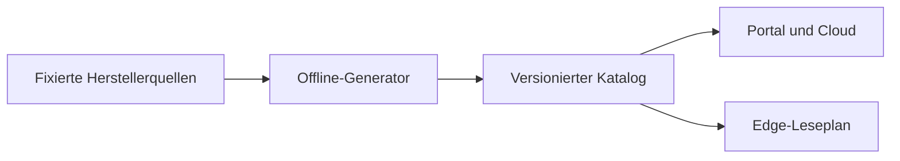

# Messpunktkatalog

Dieser Ordner ist die gemeinsame, versionierte Wahrheit für Messpunkte in Portal,
Cloud und Edge. Portal und Cloud verwenden ihn für die Messauswahl; die Edge liest zusätzliche Punkte über den [Messruntime](../../edge-app/nodered/measurements/README.md). Der Katalog selbst schreibt keine Register.



Das aktuelle, kanonische Artefakt ist
[`dist/measurement-point-catalog-2026.09.11.1.json`](dist/measurement-point-catalog-2026.09.11.1.json).
Es wird ohne Netz- oder Gerätezugriff ausschließlich aus den unter `sources/`
eingecheckten Snapshots erzeugt. `sources/manifest.json` pinnt Commit bzw.
Dokumentationsstand und SHA-256. Das Artefakt enthält keinen Erzeugungszeitstempel;
gleicher Checkout und gleiche Python-Standardbibliothek ergeben dieselben Bytes.

## Modell

Jeder Eintrag besitzt mindestens:

- Identität: `family`, stabiler `point_key`, dessen `point_key_aliases`,
  `catalog_version`, `edge_min_version`;
- Zugriff: `source_kind`, `address` und/oder `selector`, `width_bits`,
  `value_type`, `signed`, `endian`, `scale`;
- Bedeutung: `unit`, `group`, deutsches `label_de`, originales
  `label_source`, `semantic_status`, `aggregation_kind`, Größe `quantity` und
  Richtung `direction` (Abschnitt „Größe und Richtung“);
- Last/Aufbewahrung: `default_cadence_s`, `min_cadence_s`,
  `long_term_cadence_s`, `poll_group`;
- Provenienz: `source_url`, `source_commit` oder `source_revision` und
  `source_sha256`.

Unbekanntes bleibt `null` und wird mit `semantic_status: unknown` oder
`vendor_label_only` sichtbar gemacht. Namen und Einheiten werden nicht aus
Registeradressen, API-Key-Kürzeln oder Beschreibungstext geraten. So bleibt etwa
die Einheit der 316 go-e-Keys bewusst leer. Für SunSpec ist `address.base` immer
`discovered`; insbesondere modelliert Model 160 jedes live entdeckte `module[i]`
über einen eigenen dynamischen Point-Key und relativen Offset.

`edge_min_version` ist pro Katalogpunkt hinterlegt. Ein Wert `unreleased` ist keine Zusage einer kompatiblen Geräteversion; die tatsächlich ausgelieferte Runtime und ihre Fähigkeiten zusätzlich prüfen.

Die JSON-Schemata liegen unter `schema/`. Der Standardbibliothek-Validator wertet
alle in ihnen verwendeten Draft-2020-12-Schlüssel tatsächlich aus und bricht bei
einem noch nicht unterstützten Schema-Schlüssel ab. `tools/validate.py` ergänzt
sie um projektbezogene Invarianten: eindeutige Point-Keys samt Alias-Namensraum,
Deye-Lock/Adress-/Decoder-Kollisionen, relative SunSpec-Adressen, Breiten,
Kadenzen, Quellen-Hashes, Shelly-Rohbelege und die dynamische Struktur von Model
160.

## Größe und Richtung

Jeder Punkt trägt `quantity` (WAS der Wert ist) und `direction` (in welche Richtung die
Energie fließt), beide aus einem geschlossenen Vokabular oder `null`. `tools/semantics.py`
vergibt sie deterministisch: zuerst eine Regel mit Beleg — ein genormter Name
(OCPP-Measurand, SunSpec-Punktname), ein wörtliches Herstellerlabel oder das Shelly-Feld samt
Rohbeleg —, sonst die belegte Einheit (ein Wert in V ist eine Spannung). Prozent ist keine
Größe: ein Ladestand steht nur über eine Regel im Katalog. Die go-e-Keys bleiben wie ihre
Einheit ohne Größe.

- Ohne Größe keine Richtung (`null`/`null`). Größen ohne Flussrichtung (Spannung, Frequenz,
  Temperatur, Leistungsfaktor, Scheinleistung, Ladestand, Kapazität) tragen `none`.
- **Jede Energie-Größe (`*energy*`) trägt eine Richtung**, und jede Energie-Einheit
  (Wh, kWh, MWh, mWh, „0,1 kWh“, Wmin, varh, VAh) trägt eine Energie-Größe. Ausgenommen sind
  nur die einzeln benannten Punkte in `ENERGY_WITHOUT_DIRECTION`, deren Quelle keine Richtung
  nennt (heute sechs: Deye „Today/Total Energy“, SunSpec 122 „Quadrant 1–4“) — `validate.py`
  lehnt jeden anderen Energiepunkt ohne Richtung ab.
- Ein Vorzeichen-Wert, dessen Quelle nur „Leistung am Netzpunkt“ oder „Speicherleistung“ nennt,
  trägt die zusammengefasste Richtung `import_export` bzw. `charge_discharge` — nie eine
  geratene Einzelrichtung. Nenn-, Grenz- und Einstellwerte (`Power.Offered`, „Program 1
  Power“ …) haben eine Größe, aber keine Richtung.

Die Wörter bilden sich eindeutig auf den Messstellen-Vertrag
([`docs/contracts/v2/messstelle.md`](../../docs/contracts/v2/messstelle.md) §2) ab — Größe auf
Größe, Richtung auf Richtung, je Wort höchstens ein Vertragswort und keines doppelt. „—“ heißt:
der Vertrag kennt dieses Wort (noch) nicht, ein solcher Messwert speist keine Messstelle. Die
Vertrags-Größe „Volumen“ (Gas) erreicht der Katalog nicht, weil er keine Gaszähler führt.
`tests/test_semantics.py` und `MesskanalAbbildungTest` (api) lesen DIESE Tabelle:

| Feld | Katalog | Vertrag | Hinweis |
|---|---|---|---|
| `quantity` | `active_energy` | Wirkenergie | |
| `quantity` | `active_power` | Wirkleistung | |
| `quantity` | `reactive_energy` | Blindenergie | |
| `quantity` | `apparent_power` | Scheinleistung | |
| `quantity` | `soc` | Ladestand | |
| `quantity` | `apparent_energy` | — | keine Vertrags-Größe |
| `quantity` | `reactive_power` | — | keine Vertrags-Größe |
| `quantity` | `energy_capacity` | — | Nennwert, keine Menge |
| `quantity` | `voltage` | — | keine Vertrags-Größe |
| `quantity` | `current` | — | keine Vertrags-Größe |
| `quantity` | `frequency` | — | keine Vertrags-Größe |
| `quantity` | `temperature` | — | keine Vertrags-Größe |
| `quantity` | `power_factor` | — | keine Vertrags-Größe |
| `direction` | `import` | Bezug | |
| `direction` | `export` | Abgabe | |
| `direction` | `generation` | Erzeugung | |
| `direction` | `charge` | Laden | |
| `direction` | `discharge` | Entladen | |
| `direction` | `charge_discharge` | Laden / Entladen | Speicherleistung mit Vorzeichen |
| `direction` | `none` | richtungslos | |
| `direction` | `import_export` | — | Vorzeichen-Wert am Netzpunkt; Bezug und Abgabe sind zwei Messstellen |

## Inhaltsstand und Laufzeitstand

Das Artefakt trägt ZWEI Stände. `VERSION` → `catalog_version` ist der **Inhaltsstand**: er
steigt mit jeder inhaltlichen Änderung. `RUNTIME_VERSION` → `runtime_catalog_version` ist der
**Laufzeitstand**, den die Box spricht: die Palette lehnt jede Mess-Konfiguration ab, deren
`catalog_version` nicht exakt ihrem eigenen Katalog entspricht (`unsupported_catalog`,
`edge-app/nodered/measurements/measurement-planner.js`), und die api veröffentlicht, speichert
und zeigt deshalb den Laufzeitstand (`MeasurementCatalog.version()`).

- Der Laufzeitstand steigt NUR, wenn sich etwas ändert, das Box oder Writer lesen
  (`RUNTIME_FIELDS` in `tools/cataloglib.py`: Zugriff, Dekodierung, Kadenz, Aggregation,
  Punktbestand). `validate.py` beweist es: die Box-Sicht des Inhaltsstands ist gleich der des
  ausgelieferten Laufzeitstand-Artefakts — sonst schlägt er fehl.
- Eine rein cloud-seitige Version (wie 2026.09.11.1: nur `quantity`/`direction`) lässt
  `edge-app/nodered/measurements/catalog.json` und die Metadaten-Migration BYTE-GLEICH
  (`tools/package_edge_runtime.py --check`, Test `test_runtime_derivatives_are_byte_identical`).
  Keine Box sieht einen fremden Stand, kein Edge-Release ist nötig.
- Steigt der Laufzeitstand, gehört das zu einem **Edge-Release**: `RUNTIME_VERSION` heben,
  `package_edge_runtime.py` ausführen (neue Palette-`catalog.json`) und in
  `SQL_BY_RUNTIME_VERSION` eine NEUE, datums-versionierte Metadaten-Migration eintragen — die
  angewandte bleibt unverändert. Ab dem api-Deploy lehnen Boxen mit älterer Palette jede
  Messwert-Änderung ab, bis sie das Edge-Release haben; der Rollout gehört deshalb geplant.

## Offline erzeugen und prüfen

Voraussetzung ist Python 3.10 oder neuer. Die reguläre Pipeline nutzt nur die
Standardbibliothek:

```bash
python3 catalog/measurement-points/tools/update_deye_key_lock.py --check
python3 catalog/measurement-points/tools/extract_shelly.py --check
python3 catalog/measurement-points/tools/generate.py
python3 catalog/measurement-points/tools/generate.py --check
python3 catalog/measurement-points/tools/validate.py
python3 -m unittest discover -s catalog/measurement-points/tests -p 'test_*.py'
```

Diese Befehle sind das CI-Gate. Sie installieren nichts und führen weder
Netzwerk- noch Gerätezugriffe aus. Insbesondere gehören der Deye-YAML-Normalizer
und die Remote-Quellenprüfung nicht in den normalen Build.

`normalize_deye.py` wird nur beim Austausch der vendorten YAML-Quellen benötigt.
Seine einzige Update-Abhängigkeit ist bewusst auf `PyYAML==6.0.2` festgelegt; ein
normaler Build oder Test parst kein YAML:

```bash
python3 -m pip install -r catalog/measurement-points/requirements-update.txt
python3 catalog/measurement-points/tools/normalize_deye.py
python3 catalog/measurement-points/tools/normalize_deye.py --check
```

`tools/verify_remote_sources.py` ist ebenfalls ausschließlich ein bewusster
Update-Schritt. Er vergleicht heruntergeladene Bytes mit den Pins; zum Beispiel
prüft `--source goe.api_v2` beide go-e-Dateien und damit auch den deutschen Pfad
unter `API_KEYS_FIRMWARE/`.

## Quellenbestand

- Deye: vier ha-solarman-Karten am Commit
  `ac1d88b83268beeb0511b8a1b7fc8e17deddc044`;
- SunSpec: 19 vollständige Modelle am Commit
  `90b4a331dcca1d6eac69c1bead952fddcc5852e0`;
- go-e: 316 API-v2-Keys der Firmwaretabelle 60.4 am Commit
  `b4d7f85325f5fd7243d007f7fd639ac2db16c5da`;
- Shelly: 210 direkt belegte Statusfelder der relevanten Gen1- sowie
  Gen2/Gen3/Gen4-Komponenten. 21 offizielle HTML-Seiten sind mit Abrufdatum und
  SHA-256 eingefroren; `extract_shelly.py` erzeugt daraus deterministisch die
  Normalform und bindet jeden Punkt an seine konkreten Rohseiten;
- OCPP: 22 MeterValues-Measurands und ihre Dimensionen aus dem im Projekt
  verwendeten `ocpp-go` v0.19.0 (`a1eec917af884db0585752f909a61893aa667480`).
  Die 16 Einheiten sind die OCPP-1.6-Werte; der zusätzlich in `ocpp-go`
  vorhandene Tippfehler `Celcius` bleibt ausdrücklich nur Bibliotheks-
  Kompatibilität und wird nicht als Standarddimension ausgegeben.

Die mitkopierten Lizenzdateien gelten für Deye, SunSpec und OCPP. go-e- und
Shelly-Dateien werden als unveränderte bzw. quellennahe Fakten-Snapshots mit URL,
Revision und Prüfsumme geführt; bei einer Weitergabe ist die jeweilige
Herstellerlizenz erneut zu prüfen.

## Erweitern oder aktualisieren

1. Neue Quelle in `sources/` ablegen, Commit/Revision, URL und SHA-256 im Manifest
   aktualisieren. Nie einen beweglichen Branch als Provenienz eintragen. Optional
   danach die betroffene Quelle mit `verify_remote_sources.py --source <id>`
   gegen den Ursprung prüfen.
2. Deye-Updates zuerst normalisieren und dann
   `tools/update_deye_key_lock.py` ausführen. Der Lock ist append-only: bestehende
   kanonische Keys werden auch bei Quellgruppen-/Label-Umbenennung oder späteren
   Dubletten nicht neu berechnet. Den Lock-Diff fachlich prüfen; einen bewusst
   weiter akzeptierten alten Key nur als Alias am bestehenden Eintrag ergänzen.
3. Bei Shelly die unveränderten Herstellerseiten unter `sources/shelly/raw/`
   ablegen und `raw-manifest.json` aktualisieren. Vendorfelder stehen in
   `extraction-spec.json`, VoltPilot-Kadenz/Übersetzung getrennt in
   `annotations.json`; danach `extract_shelly.py` ausführen. Ein nicht in den
   Rohseiten belegbares Feld, Typ- oder Einheitenwissen darf nicht passieren.
4. Für eine neue Struktur einen kleinen Adapter in `tools/generate.py` ergänzen.
   Quelldaten bleiben vendort; Generatoren dürfen kein Netzwerk voraussetzen.
5. Unsichere Bezeichnung, Einheit oder Semantik als `null`/`unknown` erhalten.
   Deutsche Texte brauchen eine benannte Quelle oder eine überprüfbare,
   fachlich eindeutige Übersetzung.
6. `VERSION` erhöhen und ein neues `dist/measurement-point-catalog-<version>.json`
   erzeugen. Ein bereits ausgeliefertes Artefakt wird nicht nachträglich geändert.
   `RUNTIME_VERSION` nur heben, wenn sich die Box-Sicht ändert (Abschnitt „Inhaltsstand und
   Laufzeitstand“); dann auch `package_edge_runtime.py` ausführen.
7. Sollbestände und Quellenstände in `tests/expected_inventory.json` bewusst
   anpassen, danach Generator-Drift, Validator und Unit-Tests ausführen.

Portal, Cloud und Edge verwenden den Katalog oder daraus erzeugte Ableitungen. `tools/package_edge_runtime.py --check` prüft Runtime-JSON und SQL-Metadaten. Neue Katalogstände brauchen eine neue Migration; bereits angewandte SQL-Dateien bleiben unverändert.
