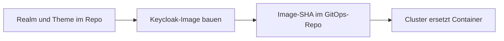

# Keycloak-Image

Das Projektimage enthält Produktions-Realm, Login-Theme und die vorbereitete Keycloak-Konfiguration. Forgejo baut es mit den anderen Images; GitOps pinnt den Stand im Cluster. [Deployment](../../docs/deploy.md)



| Eingabe | Verwendung |
|---|---|
| [Dockerfile](Dockerfile) | Build-Kontext ist der Repository-Stamm |
| [Produktions-Realm](../../infra/prod/keycloak/voltpilot-realm.json) | `/opt/keycloak/data/import/voltpilot-realm.json` |
| `themes/voltpilot` | `/opt/keycloak/themes/voltpilot` |

Build-Optionen: `KC_DB=postgres`, `KC_HEALTH_ENABLED=true`, `KC_HTTP_RELATIVE_PATH=/auth`. Datenbankzugang, öffentliche URL, Proxy-Einstellungen und Import-Secrets kommen zur Laufzeit. Gepinnte Keycloak-Version in Dockerfile und Compose gemeinsam pflegen.

```bash
docker build -f deploy/keycloak/Dockerfile   -t git.tecmaxx.de/mamotec/voltpilot-ems/keycloak:local .
```

Unveränderliche Images vermeiden veraltete Theme-Dateien im Containercache. Das [eigenständige Produktions-Compose](../../docs/deploy-compose.md) kann über `KEYCLOAK_IMAGE` einen vollständigen Image-Verweis verwenden; dieser ist unabhängig von `IMAGE_TAG`. Bind-Mounts können eingebettete Realm-/Theme-Dateien überlagern.

**Bestehende Realms werden durch `--import-realm` nicht aktualisiert.** Ein neues Image ändert das Theme, aber keine bereits gespeicherten Realm-Einstellungen. [Import und Pflege](../../infra/prod/keycloak/README.md)
