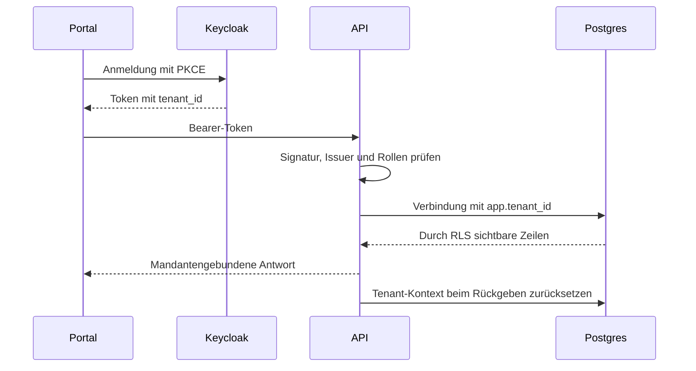

# API, Anmeldung und Datenbank

Die Spring-Boot-API verbindet Portal, Geräteverwaltung und Betriebsfunktionen. [OpenAPI](contracts/openapi.yaml) beschreibt die HTTP-Verträge; Controller, DTOs und Integrationstests belegen das Verhalten.

## Anmeldung und Mandant

- OIDC ist standardmäßig aktiv. Tests können es ausdrücklich deaktivieren.
- Der öffentliche Issuer und die interne JWKS-Adresse dürfen unterschiedliche Hosts verwenden. Der erwartete Issuer muss zum Token passen.
- `voltpilot_app` ist weder Superuser noch `BYPASSRLS`; ohne gesetzten Mandanten liefern geschützte Tabellen keine Kundenzeilen.
- Plattformverwaltung verwendet `voltpilot_admin` mit `BYPASSRLS` hinter einem Rollencheck. Kundenpfade verwenden diese Verbindung nicht.
- Die Selbst-Liste externer Konten (`/me.kundenbereiche`) ist die schmale Ausnahme für eigene Zugangsmetadaten: rollenbewacht, ausschließlich das verifizierte Subject, keine Kundendaten oder Freigabe. [Leser und Nachweise](agents/root/uems-unterstuetzung-portal.md).
- Standort-/Gerätebesitz wird aus dem authentifizierten Kontext bestimmt. Fremde, durch RLS unsichtbare Objekte erscheinen als 404.

Quellen: `TenantFilter`, `TenantAwareDataSource`, `SecurityConfig`, Migrationen und `PortalApiTest` im [API-Service](../services/api/).

## Registrierung und Sitzung

`POST /api/v1/registration` erstellt Mandant und Keycloak-Benutzer. Schlägt Keycloak fehl, wird der neue Mandant kompensierend gelöscht; Cleanup-Fehler dürfen den ursprünglichen Fehler nicht verdecken.

Die öffentliche Registrierung ist schaltbar und durch ein adressbezogenes sowie globales In-Memory-Limit begrenzt. Vertrauenswürdige Proxy-Hops müssen zur Infrastruktur passen. Anonyme Validierungsfehler brauchen einen erlaubten ERROR-Dispatch, sonst kann Spring sie als 401 verdecken.

Das Portal kann nach Registrierung direkt einloggen. SessionStorage hält Tokens tabbezogen und wird über Refresh aktualisiert; bei normalem Login gibt es zusätzlich die Keycloak-SSO-Sitzung. Realm-Änderungen wirken bei bestehenden Instanzen nicht durch erneuten Import. Details der Sitzungs-/Brute-Force-Einstellungen: [Keycloak](../infra/prod/keycloak/README.md).

## Geräteidentität

| Fall beim Claim | Verhalten |
|---|---|
| Referenz bereits im eigenen Mandanten | Vorhandenes Gerät am bisherigen Standort zurückgeben |
| Referenz in fremdem Mandanten | Globaler Unique-Konflikt: 409 |
| `VP-`-Sticker | Großschreibung, Eintrag in der Geräte-Registry erforderlich |
| Generierte `edge-`-Referenz | Kleinschreibung, sechs Nutzzeichen plus Prüfzeichen |
| Unbekannter Sticker / falsche Prüfziffer | 422 |

Die Prüfziffer gilt für Referenzen im generierten Format; freie Integrationsreferenzen bleiben kompatibel. Go-Generator und Java-Validator nutzen dieselben Vektoren. Das Portal normalisiert dieselben Präfixe. Enrollment ohne passenden Claim ist in der Plattformverwaltung sichtbar. Ablauf: [Geräte verbinden](connect-a-device.md).

## Schema und Migrationen

| Bestandteil | Regel |
|---|---|
| `db/migration` | Produktionsfähige API-Migrationen; angewandte Dateien unveränderlich |
| `db/dev` | Nur Profil `local`; Seeds müssen fehlende Demomandanten tolerieren |
| `infra/local/timescale` | Bootstrap für neue lokale Volumes; kein Updatepfad |
| Runtime / Flyway | Getrennte Zugangsdaten: eingeschränkte App-Rolle / Schemaeigentümer |
| Neue Kundentabelle | Rechte, RLS-Policy und `FORCE ROW LEVEL SECURITY` zusammen ergänzen |

`out-of-order: true` erlaubt später gemergte Migrationen mit kleinerer Versionsnummer. Eine neue Migration muss unabhängig von der Ankunftsreihenfolge funktionieren. Versionskollisionen und veraltete Buildkopien werden durch `MigrationHygieneTest` geprüft.

`UemsProduktionsreihenfolgeMigrationTest` spielt zusätzlich den vollständigen, eingecheckten
`main`-Migrationssatz und danach alle übrigen Migrationen mit `out-of-order` ein. Er vergleicht
Tabelleninhalte (`Bestandsschutz`), Spalten und Constraints einschließlich CHECK-Definitionen mit
einer frisch in Versionsreihenfolge migrierten Datenbank. Rollenereignisse werden vor dem Nachzug
gesät. Pflege der Liste und die einmalige Prüfsummenänderung der noch nicht produktiven
`V20260916150000`: [Produktionsreihenfolge](agents/root/uems-migration-produktionsreihenfolge.md).

Die `SelfHealingFlywayMigrationStrategy` repariert bestimmte Validierungsabweichungen einmalig und versucht die Migration erneut. Das richtet Prüfsummen aus, **führt bereits angewandtes SQL aber nicht erneut aus**. SQL-Fehler und fehlende Out-of-Order-Migrationen sind keine reparierbare Prüfsummendrift. Unerwartete Reparaturwarnungen prüfen; Migrationen niemals deshalb nachträglich bearbeiten.

`*:missing` toleriert aufgezeichnete, nicht mehr mitgelieferte Migrationen, etwa Dev-Seeds nach Profilwechsel. Ein leeres Produktionsprofil entfernt keine bereits vorhandenen Demodaten.

## Betrieb und Änderungspunkte

- API ist derzeit ein Singleton: In-Memory-Zustände, Listener und periodische Aufgaben vor Replikation prüfen.
- MQTT-Listener und Publisher müssen v1/v2-Topic-, Mandanten- und Geräteidentität erhalten.
- Löschungen berücksichtigen abhängige Daten, retained Konfiguration, Gerätezuordnung und Audit. Eine Löschvorschau ist keine Löschung.
- Geräte-/Messpunktbindungen über stabile Referenzen pflegen. Eine Aliasänderung darf weder Telemetrie trennen noch eine physische Verbindung neu anlegen.
- Begrenzte Zeitfenster und vorhandene Rollups für Historie/Erlöse verwenden; keine unbeschränkten Hypertable-Lesungen in regelmäßig abgefragten Portalpfaden.

Gezielte Belege: `PortalApiTest`, `RegistrationApiTest`, `AdminApiTest`, `EnrollmentApiTest`, `DevSeedGuardTest`, `FlywayOutOfOrderBootTest` und `SelfHealingFlywayMigrationStrategyTest`.
