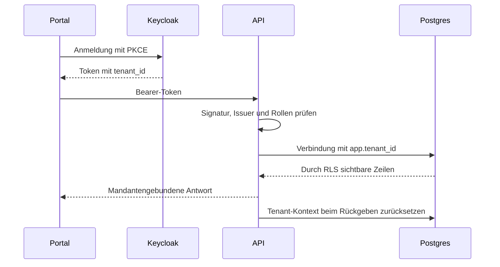

# API, Anmeldung und Datenbank

Die Spring-Boot-API verbindet Portal, Geräteverwaltung und Betriebsfunktionen. [OpenAPI](contracts/openapi.yaml) beschreibt die HTTP-Verträge; Controller, DTOs und Integrationstests belegen das Verhalten.

## Anmeldung und Mandant

- OIDC ist standardmäßig aktiv. Tests können es ausdrücklich deaktivieren.
- Der öffentliche Issuer und die interne JWKS-Adresse dürfen unterschiedliche Hosts verwenden. Der erwartete Issuer muss zum Token passen.
- `voltpilot_app` ist weder Superuser noch `BYPASSRLS`; ohne gesetzten Mandanten liefern geschützte Tabellen keine Kundenzeilen.
- Plattformverwaltung verwendet `voltpilot_admin` mit `BYPASSRLS` hinter einem Rollencheck. Kundenpfade verwenden diese Verbindung nicht.
- Die Selbst-Liste externer Konten (`/me.kundenbereiche`) ist die schmale Ausnahme für eigene Zugangsmetadaten: rollenbewacht, ausschließlich das verifizierte Subject, keine Kundendaten oder Freigabe. [Leser und Nachweise](agents/root/uems-unterstuetzung-portal.md).
- Standort-/Gerätebesitz wird aus dem authentifizierten Kontext bestimmt. Fremde, durch RLS unsichtbare Objekte erscheinen als 404.

Quellen: `TenantFilter`, `TenantAwareDataSource`, `SecurityConfig`, Migrationen und `PortalApiTest` im [API-Service](../services/api/).

## Registrierung und Sitzung

`POST /api/v1/registration` erstellt Mandant und Keycloak-Benutzer. Schlägt Keycloak fehl, wird der neue Mandant kompensierend gelöscht; Cleanup-Fehler dürfen den ursprünglichen Fehler nicht verdecken.

Die öffentliche Registrierung ist schaltbar und durch ein adressbezogenes sowie globales In-Memory-Limit begrenzt. Vertrauenswürdige Proxy-Hops müssen zur Infrastruktur passen. Anonyme Validierungsfehler brauchen einen erlaubten ERROR-Dispatch, sonst kann Spring sie als 401 verdecken.

Das Portal kann nach Registrierung direkt einloggen. SessionStorage hält Tokens tabbezogen und wird über Refresh aktualisiert; bei normalem Login gibt es zusätzlich die Keycloak-SSO-Sitzung. Realm-Änderungen wirken bei bestehenden Instanzen nicht durch erneuten Import. Details der Sitzungs-/Brute-Force-Einstellungen: [Keycloak](../infra/prod/keycloak/README.md).

## Geräteidentität

| Fall beim Claim | Verhalten |
|---|---|
| Referenz bereits im eigenen Mandanten | Vorhandenes Gerät am bisherigen Standort zurückgeben |
| Referenz in fremdem Mandanten | Globaler Unique-Konflikt: 409 |
| `VP-`-Sticker | Großschreibung, Eintrag in der Geräte-Registry erforderlich |
| Generierte `edge-`-Referenz | Kleinschreibung, sechs Nutzzeichen plus Prüfzeichen |
| Unbekannter Sticker / falsche Prüfziffer | 422 |

Die Prüfziffer gilt für Referenzen im generierten Format; freie Integrationsreferenzen bleiben kompatibel. Go-Generator und Java-Validator nutzen dieselben Vektoren. Das Portal normalisiert dieselben Präfixe. Enrollment ohne passenden Claim ist in der Plattformverwaltung sichtbar. Ablauf: [Geräte verbinden](connect-a-device.md).

## Schema und Migrationen

| Bestandteil | Regel |
|---|---|
| `db/migration` | Produktionsfähige API-Migrationen; angewandte Dateien unveränderlich |
| `db/dev` | Nur Profil `local`; Seeds müssen fehlende Demomandanten tolerieren |
| `infra/local/timescale` | Bootstrap für neue lokale Volumes; kein Updatepfad |
| Runtime / Flyway | Getrennte Zugangsdaten: eingeschränkte App-Rolle / Schemaeigentümer |
| Neue Kundentabelle | Rechte, RLS-Policy und `FORCE ROW LEVEL SECURITY` zusammen ergänzen |

`out-of-order: true` erlaubt später gemergte Migrationen mit kleinerer Versionsnummer. Eine neue Migration muss unabhängig von der Ankunftsreihenfolge funktionieren. Versionskollisionen und veraltete Buildkopien werden durch `MigrationHygieneTest` geprüft.

`UemsProduktionsreihenfolgeMigrationTest` spielt zusätzlich den vollständigen, eingecheckten
`main`-Migrationssatz und danach alle übrigen Migrationen mit `out-of-order` ein. Er vergleicht
Tabelleninhalte (`Bestandsschutz`), Spalten und Constraints einschließlich CHECK-Definitionen mit
einer frisch in Versionsreihenfolge migrierten Datenbank. Rollenereignisse werden vor dem Nachzug
gesät. Pflege der Liste und die einmalige Prüfsummenänderung der noch nicht produktiven
`V20260916150000`: [Produktionsreihenfolge](agents/root/uems-migration-produktionsreihenfolge.md).

Die `SelfHealingFlywayMigrationStrategy` prüft vor Migration und jeder Reparatur lesend die
Historie: unbekannte angewandte Kernversionen (`FUTURE_*` und `MISSING_*`) sowie physische
`DELETE`-Marker verweigern den Start. Auch eine unlesbare Diagnose bricht ab. Ein älteres Image
kann so keine neuere Historie reparieren und danach Bereitschaft melden. Eine datenbankweite
Advisory-Sperre hält Diagnose und Flyway-Aufrufe für alle Starts mit dieser Strategie zusammen;
ihr Schlüssel bleibt über Releases stabil. Sie liegt auf einer separaten lesenden Transaktion,
die auch bei Startabbruch endet. Manuelle Flyway-Aufrufe und alte Builds ohne Wächter nehmen
nicht an dieser Sperre teil und müssen betrieblich ausgeschlossen werden. Das schützt erst
Builds, die den Wächter enthalten; bereits laufende Prozesse hält er nicht an.

Bekannte Prüfsummen-/Beschreibungs-/Typabweichungen werden weiterhin einmal laut repariert.
Das richtet Metadaten aus, führt geändertes SQL aber nicht aus. Flyway `repair()` kann fehlende
Versionen außerdem als `DELETE` markieren; deshalb steht der Wächter vor diesem Schreibweg.
SQL-Fehler und `IGNORED`-Ankünfte ohne Out-of-Order-Freigabe sind keine heilbare Drift.

`*:missing` bleibt für den Profilwechsel erhalten, wird aber durch eine explizite Ausnahme im
Wächter begrenzt: die acht Dateien unter `db/dev` (Version UND exakter Skriptname) sowie
`V20260702000100__dev_provisioned_devices.sql` aus `8766260c` (heutige Fassung
`V20260702020100` aus `ec6d93a7`). Die Git-Historie enthält keine weiteren entfernten Dev-Seeds;
entfernte Kernskripte sind ausdrücklich keine Ausnahme. Ein leeres Produktionsprofil entfernt
keine vorhandenen Demodaten. Neue Dev-Seeds benötigen eine bewusste Aktualisierung dieser Liste.

**Lokaler Zweigwechsel:** `docker-compose.yml` setzt für die API ausdrücklich
`SPRING_PROFILES_ACTIVE=local`; die Produktionsvorlage lässt das Profil leer. Eine bleibende
Entwicklungsdatenbank kann Kernmigrationen eines anderen Zweigs tragen. Ausschließlich wenn
`local` das **einzige aktive Profil** ist UND `voltpilot.flyway.startwaechter=nur-warnen` gilt,
warnt der Wächter deshalb laut und setzt nach den bisherigen Flyway-Regeln fort. `application-local.yml`
belegt diesen Schalter vor; `VOLTPILOT_FLYWAY_STARTWAECHTER=streng` schaltet lokal auf den strengen
Wächter zurück. Vorgabe, leeres Profil, nur ein Default-Profil sowie gemischte Profile bleiben
streng, selbst mit `nur-warnen`. Niedrige unbekannte Versionen können lokal durch `*:missing`
weiter toleriert werden; FUTURE-Versionen und DELETE-Marker werden mit Versionen ausdrücklich
gewarnt. Eine lokale Reparatur kann dabei DELETE-Marker erzeugen und einen späteren Start brechen;
der Modus ist kein Kompatibilitätsnachweis und ausschließlich für Entwicklungsdaten gedacht.
SQL-Fehler oder unlesbare Diagnosen bleiben Startfehler, die Startsperre bleibt aktiv.

Bei einem Rolling Update mit neuer Migration kann ein neu startender alter Pod bis zu seiner
Ersetzung in CrashLoop gehen; er meldet keine Readiness. Der neue Pod kennt die Migrationen und
kann weiter starten. API-Welle 0 mit Readiness und `maxSurge: 1`/`maxUnavailable: 0` erlaubt diesen
Austausch, garantiert bei gleichzeitigem Ausfall des alten Pods aber keine unterbrechungsfreie
Verfügbarkeit. Sync-Wellen stoppen keine bereits laufenden alten Prozesse. Für den inkompatiblen
UEMS-Umstieg bleibt daher der nachgewiesene Nullbestand von API/Writer im Wartungsfenster nötig.
[Nachher-Blatt Z08](../tools/betriebsabfragen/README.md) prüft die Marker; bei Schaden vor Öffnung:
API/Writer anhalten, Befund sichern und geübten Rückweg auf den Wiederherstellungspunkt nutzen.

Nachweise: `FlywayStartupGuardTest` (vollständiger main-Satz → UEMS → alter Start ohne Schreibzugriff
→ neuer Start, kanonischer Historienfingerabdruck), `SelfHealingFlywayMigrationStrategyTest`,
`FlywayIgnoreMissingBootTest`, `FlywayOutOfOrderBootTest`, `BetriebsabfragenBlaetterTest`.

## Betrieb und Änderungspunkte

- API ist derzeit ein Singleton: In-Memory-Zustände, Listener und periodische Aufgaben vor Replikation prüfen.
- MQTT-Listener und Publisher müssen v1/v2-Topic-, Mandanten- und Geräteidentität erhalten.
- Löschungen berücksichtigen abhängige Daten, retained Konfiguration, Gerätezuordnung und Audit. Eine Löschvorschau ist keine Löschung.
- Geräte-/Messpunktbindungen über stabile Referenzen pflegen. Eine Aliasänderung darf weder Telemetrie trennen noch eine physische Verbindung neu anlegen.
- Begrenzte Zeitfenster und vorhandene Rollups für Historie/Erlöse verwenden; keine unbeschränkten Hypertable-Lesungen in regelmäßig abgefragten Portalpfaden.

Gezielte Belege: `PortalApiTest`, `RegistrationApiTest`, `AdminApiTest`, `EnrollmentApiTest`, `DevSeedGuardTest`, `FlywayOutOfOrderBootTest` und `SelfHealingFlywayMigrationStrategyTest`.
