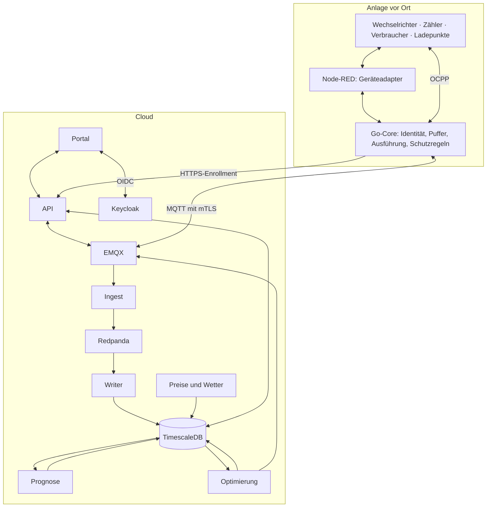
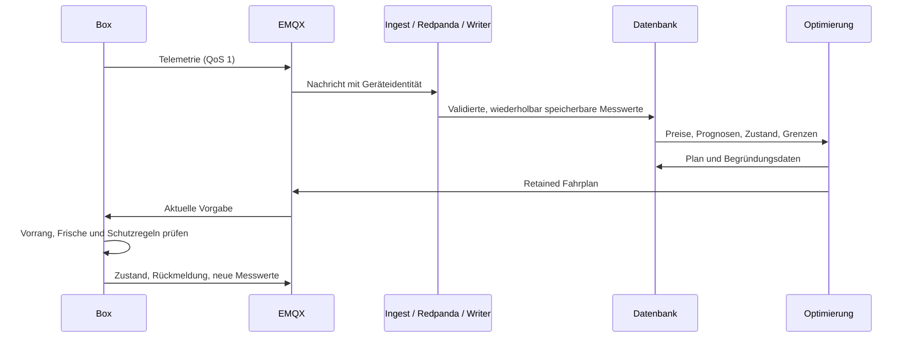
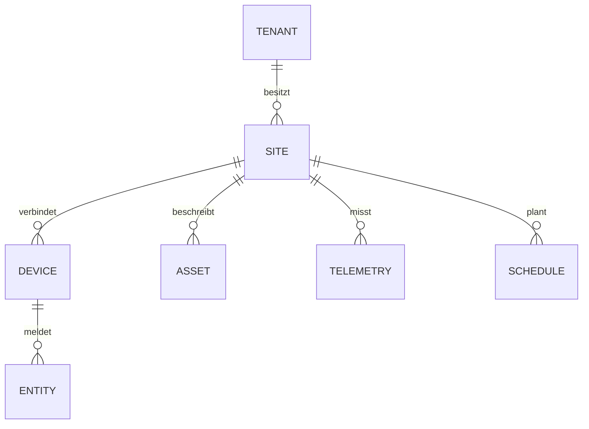

# Architektur

VoltPilot ist ein selbst betreibbares, mandantenfähiges EMS für PV, Speicher und Verbraucher. Dieses Dokument beschreibt den implementierten Aufbau; Deployment-Details stehen im [Betriebshandbuch](deploy.md).

## System und Zuständigkeiten

Die Cloud berechnet Fahrpläne aus Messungen, Preisen, Prognosen und Anlagenparametern. Der Go-Core setzt Vorgaben vor Ort um; Node-RED bindet Geräte ein. Lokale Schutzregeln bleiben auch bei Cloud-Ausfall wirksam. Die Box hat außerdem lokale Web-, MQTT- und OCPP-Schnittstellen; diese gehören ins Kundennetz.

## Bausteine

| Baustein | Aufgabe | Einstieg |
|---|---|---|
| API | Anmeldung prüfen, Mandanten, Anlagen, Geräte, Betriebsfunktionen | [API](../services/api/README.md) |
| Ingest / Writer | MQTT validieren, Ereignisse transportieren und speichern | [Ingest](../services/ingest/README.md), [Writer](../services/timescale-writer/README.md) |
| Forecast | Last-/PV-Prognosen, Modelltraining und Bewertung | [Prognose](forecasting.md) |
| Market-Data | Day-Ahead-Preise hinter einem Provider-Adapter | [Marktdaten](../services/market-data/README.md) |
| Optimization | Speicher und flexible Verbraucher planen | [Optimierung](../services/optimization/README.md) |
| Flow-Compiler | Validierte Flow-Graphen in Node-RED-Artefakte übersetzen | [flowc](../edge-app/nodered/flowc/README.md) |
| Edge-App | Geräte verbinden, Messwerte puffern, Vorgaben ausführen, OTA | [Edge](../edge-app/README.md) |
| Portal | Kunden- und Plattformoberfläche, kontextuelle Hilfe | [Portal](portal.md) |
| Marketing-Adapter | Schnittstelle für einen späteren Direktvermarkter; derzeit Stub | [Adapter](../services/marketing-adapter/README.md) |

## Messwerte und Steuerung

Eine bestätigte Nachricht ist noch kein physischer Wirkungsnachweis. Das Portal unterscheidet Plan, Geräteantwort und Messung. Fehlende Messwerte werden nicht als gemessene Null dargestellt.

v1 und v2 koexistieren auf getrennten MQTT-Topics. v2 verwendet mehrere Entitäten pro Box, Flow-Wünsche und einen lokalen Arbiter. Der Go-Core bleibt für die Ausführung zuständig. Verträge: [v1/v2](contracts/README.md), [Ausführungsverantwortung](contracts/v2/plan-execution-ownership.md).

## Daten und Mandanten

Das Diagramm zeigt fachliche Beziehungen, kein vollständiges SQL-Schema. `site` ist die Anlage, `device` die registrierte Box; Komponenten und Messpunkte verfeinern das Anlagenmodell. Ein Standort und eine Anlage können mehrere Boxen haben; für anlagenweite Aufgaben ist genau eine führende Box bestimmt, während Datenquellen ihrer jeweils zuständigen Box zugeordnet bleiben.

Keycloak liefert den Mandanten im JWT. Die API verwendet eine RLS-gebundene Datenbankrolle; administrative Zugriffe laufen getrennt. Flyway in der API besitzt das Anwendungsschema. Gemeinsame Markt-/Herstellerdaten haben andere Zugriffsregeln als Kundendaten. Details: [API und Datenbank](api.md).

## Laufzeit und Betrieb

- Lokal: Docker Compose, optional mit `edge`, `feeds` und `optimize`; das Portal läuft über Vite.
- Cloud-Release: Forgejo baut Images und aktualisiert das separate GitOps-Repository. Argo CD übernimmt den gewünschten Stand in den Cluster. Die tatsächliche Sync-Einstellung steht im GitOps-Repository.
- Datenebene: Die Compose-Konfiguration unterstützt separat betriebene Datenbanken, EMQX und Redpanda mit begrenztem LAN-Zugriff für den Cluster.
- Edge-Release: eigener signierter OTA-Pfad mit Verifikation, Selbsttest und Rücknahme. Kein Mender-Abhängigkeitspfad.
- Nicht alle Dienste sind beliebig replizierbar; API, Ingest und periodische Jobs haben Singleton-Grenzen. Siehe [Kubernetes-Betriebsvertrag](k8s-readiness.md).

Versionsquellen sind die Manifeste: Maven-POMs, Python-`pyproject.toml`, Portal-`package.json`, Go-`go.mod` und Compose-Images. Sie ersetzen mehrfach gepflegte Versionstabellen.

## Planungshorizont und Fachmodell

Die Optimierung fragt standardmäßig 192 Viertelstunden (48 h) an (`OPTIMIZER_HORIZON_SLOTS`). Tatsächlich geplant wird nur das von Preisen und realen Prognosen gedeckte Fenster; an die Box gehen die ersten 24 h. Details: [Optimierung](../services/optimization/README.md).

Das [UEMS-Fachmodell](fachmodell/README.md) ergänzt Unternehmen, Standorte, Gebäude, Messstellen und zeitgültige Zuordnungen. Die Übersicht oben zeigt die bestehende EMS-Strecke; sie ersetzt weder diese Verträge noch deren Umsetzungsbelege.
