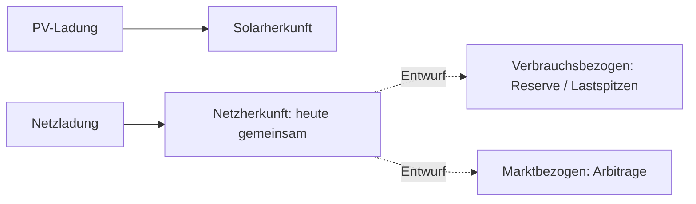

# Speicherherkunft: aktueller Stand und offener Entwurf

**Status: Der dritte Herkunftstopf ist nicht implementiert.** Die vorhandene Erlösberechnung führt Solar- und Netzherkunft in `EarningsRepository.arbitrageSplit`. Dieses Dokument hält ausschließlich die noch relevante Erweiterungsidee fest.

## Warum die Unterscheidung nützlich sein könnte

Netzstrom kann für verschiedene Zwecke gespeichert werden. Eine spätere Aufteilung könnte unterscheiden, welcher Anteil einer marktbezogenen Strategie und welcher einem Verbrauchszweck zuzurechnen ist. Dafür genügt die gemessene Energiemenge allein nicht: der tatsächlich zugrunde liegende Plan müsste einen belastbaren Zweck liefern.

## Grenzen des heutigen Standes

- Der vorhandene Rückblick ist keine Messung einzelner physischer Energiepakete.
- Fehlende Planabsicht darf keine abrechenbare Arbitrage erfinden.
- Startbestand, Messlücken, Verluste und mehrere Speicher benötigen explizite Regeln.
- Aus diesem Entwurf folgt weder eine implementierte Abrechnung noch eine rechtliche Herkunftszertifizierung.

Vor einer Umsetzung wären Zweckzuordnung, Verlust-/Bestandsbewertung und Abrechnungsbasis fachlich zu entscheiden. Eine Migration oder ein neuer API-Vertrag ist hier nicht vorgesehen.

Quelle: [EarningsRepository](../services/api/src/main/java/com/voltpilot/api/repo/EarningsRepository.java). [Optimierung](../services/optimization/README.md).
