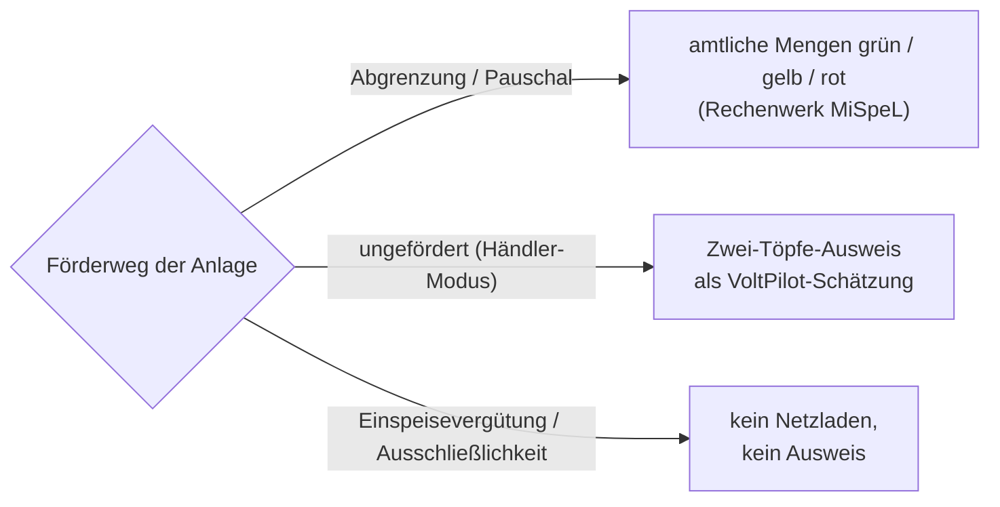

# Speicherherkunft: Formel statt Drei-Töpfe-Entwurf

**Status: Der Drei-Töpfe-Entwurf ist durch die MiSpeL-Formel ersetzt (Entscheid W5 vom 02.10.2026) und wird nicht
gebaut.** Welcher Anteil des Speicherstroms aus dem Netz stammt, bestimmt für Anlagen in der Abgrenzungs- oder
Pauschaloption die Festlegung der Bundesnetzagentur (MiSpeL, Az. 618-25-02, 01.10.2026). In der Abgrenzungsoption:
Speichervorrang je Viertelstunde, (1)¼ = MIN [ Z1NB¼ ; Z2V¼ ] (§ 21 Abs. 4 S. 3 EnFG; Anlage 1 S. 33), Monatsbilanz
und Abzug der EE-Speichererzeugung, (16) = MAX [ (13) – (15) ; 0 ] (Anlage 1 S. 36). In der Pauschaloption:
Jahrespauschalen ab (P1) = Pinst • 500 kWh/kW (Anlage 2 S. 28–33). Beide Anlagen kennzeichnen die Mengen mit
denselben Farben (Tenor S. 2 Ziff. 6). Zwei verschiedene Netzstrom-Anteile für
dieselbe Anlage wären widersprüchlich; die amtliche Rechnung zählt.

```mermaid
flowchart LR
    Foerderweg{"Förderweg der Anlage"} -->|"Abgrenzung / Pauschal"| Formel["amtliche Mengen grün / gelb / rot<br/>(Rechenwerk MiSpeL)"]
    Foerderweg -->|"ungefördert (Händler-Modus)"| Schaetzung["Zwei-Töpfe-Ausweis<br/>als VoltPilot-Schätzung"]
    Foerderweg -->|"Einspeisevergütung / Ausschließlichkeit"| Kein["kein Netzladen,<br/>kein Ausweis"]
```

| Förderweg | Herkunftsrechnung | Wo |
|---|---|---|
| `marktpraemie_abgrenzung`, `marktpraemie_pauschal` | nur die Formeln der Festlegung (grün, gelb, rot) | [MiSpeL-Fachdoku](mispel/README.md), [Vertrag Abgrenzung](contracts/v2/mispel-abgrenzung.md) |
| `ungefoerdert` | Zwei-Töpfe-Ausweis „davon durch Netzladen verdient“, beschriftet als Schätzung | `EarningsRepository.arbitrageSplit`, [Wegweiser](agents/root/arbitrage-ausweis-davon-arbitrage-gewinn.md) |
| `einspeiseverguetung`, `marktpraemie_ausschliesslichkeit` | keine — der Speicher lädt kein Netz | [Vertrag Förderweg](contracts/v2/mispel-foerderweg.md) |

**Seit MP-18** zeigt Verlauf › Erlöse für MiSpeL-Anlagen die Mengen der Formel und keinen Netzlade-Anteil mehr.
**Noch offen:** `arbitrageSplit` wählt die Anlagen in der API weiter über `netzladen_erlaubt`, nicht über den Förderweg
(Cockpit-Kachel „davon Arbitrage“), und der Ausweis trägt noch nicht das Wort „Schätzung“.

## Was vom Entwurf bleibt

Der Entwurf wollte die Netzherkunft weiter in „verbrauchsbezogen“ (Reserve, Lastspitzen) und „marktbezogen“
(Arbitrage) teilen. Für MiSpeL-Anlagen erübrigt sich das: die Festlegung unterscheidet nur förderfähig (gelb),
saldierungsfähig (rot) und den Rest des Netzbezugs, der als im Betrieb verbraucht gilt. Für den Händler-Modus
gelten die Grenzen der Schätzung unverändert:

- Der Rückblick ist keine Messung einzelner physischer Energiepakete.
- Fehlende Planabsicht darf keine abrechenbare Arbitrage erfinden.
- Aus der Schätzung folgt weder eine Abrechnung noch eine rechtliche Herkunftszertifizierung.

Quelle: [EarningsRepository](../services/api/src/main/java/com/voltpilot/api/repo/EarningsRepository.java),
[Optimierung](../services/optimization/README.md).
