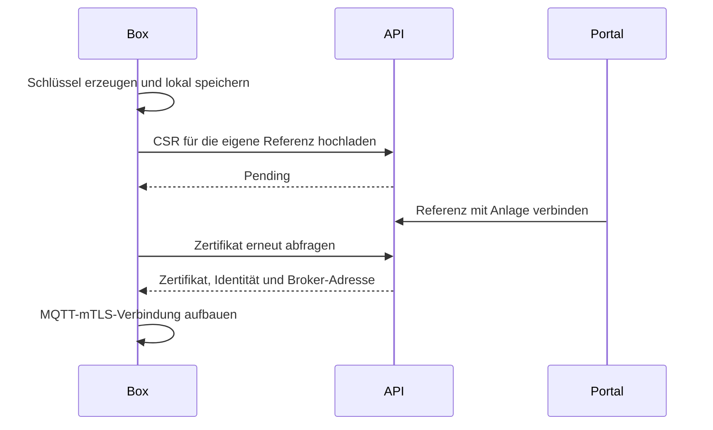

# Eine Box verbinden

Für Kundenboxen ist HTTPS-Enrollment mit anschließendem MQTT-mTLS der normale Weg. Die Box erzeugt ihren privaten Schlüssel selbst; im Portal wird ihre Geräte-ID der Anlage zugeordnet.

## Kundenweg

1. [Box installieren](../edge-app/DEPLOY.md) und `http://<box>:8484` öffnen.
2. Geräte-ID exakt übernehmen. Im Portal eine Anlage anlegen beziehungsweise wählen und die Box verbinden.
3. Warten, bis Zertifikat und Cloud-Verbindung bestätigt sind.
4. Komponenten zuordnen und frische Messwerte prüfen. Erst anschließend gegebenenfalls physische Steuerung freigeben.

`VP-`-Sticker müssen in der Plattform-Registry existieren. Selbst erzeugte `edge-`-IDs haben sechs Nutzzeichen plus Prüfzeichen. Erneuter Claim im eigenen Mandanten liefert dasselbe Gerät; fremder Besitz ergibt 409, unbekannter Sticker/falsche Prüfziffer 422.

## Technischer Vertrag

| Schritt | Endpunkt |
|---|---|
| CSR senden | `POST /api/v1/enrollment/{ref}/csr` |
| Zertifikat holen | `GET /api/v1/enrollment/{ref}/certificate` |
| Gerät beanspruchen | `POST /api/v1/devices/claim` |

Bis zum Claim bleibt die Zertifikatsabfrage pending. Die API bestimmt Zertifikatsidentität aus dem registrierten Gerät, nicht aus frei gewählten CSR-Subject-Feldern. Zulässige Schlüssel und Rückgaben stehen in [OpenAPI](contracts/openapi.yaml) und `EnrollmentApiTest`.

Die Box benötigt ausgehendes HTTPS und MQTT-mTLS `8883`. Ihre lokalen Web-/OCPP-Ports gehören ins Kundennetz; für Enrollment ist keine öffentliche Weiterleitung zur Box nötig.

## Diagnose

| Symptom | Ursache eingrenzen |
|---|---|
| ID nicht bekannt | Sticker-Registry oder Prüfziffer prüfen |
| Zertifikat bleibt aus | Claim, Referenznormalisierung und Portal-URL prüfen |
| Zertifikat vorhanden, MQTT scheitert | Broker-DNS/Port, CA, Zertifikatsidentität und ACL-Reload prüfen |
| Verbunden, keine Daten | Lokale Quelle, Protokoll, Gerätezuordnung und Ingest-/Writer-Pfad prüfen |

Plattformverwaltung kann ausstehende Enrollments ohne Claim sehen. Nicht als Abhilfe eine zweite ähnliche Referenz anlegen.

## Integrationen und Testgeräte

Der ältere `provision/{ref}/hello` → retained `provision/{ref}/config`-Handshake existiert weiterhin für Integrationen/Tests am dafür vorgesehenen Broker. Er ersetzt nicht die Authentifizierung durch Kunden-Enrollment/mTLS.

Für explizit vorprovisionierte mTLS-Geräte stehen [PKI-Werkzeuge](../tools/pki/README.md) bereit. Der [Standalone-Simulator](../tools/edge-simulator/README.md) unterstützt entsprechende Testpfade. Brokerkonfiguration und Widerruf: [MQTT-Sicherheit](security-mqtt.md).
