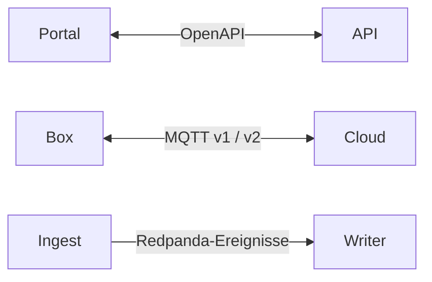

# Schnittstellenverträge

JSON-Schemas und OpenAPI beschreiben die gemeinsamen Grenzen zwischen Portal, API, Cloud und Box. Änderungen am Vertrag müssen mit Produzenten, Konsumenten und Fixtures kompatibel sein.

## Nachschlagen

| Grenze | Referenz |
|---|---|
| HTTP-API | [openapi.yaml](openapi.yaml) |
| v1-Telemetrie / Ereignis | [MQTT](mqtt-telemetry.schema.json), [telemetry.raw](telemetry-raw.event.schema.json) |
| v1-Fahrplan | [mqtt-schedule](mqtt-schedule.schema.json) |
| Provisioning | [Hello-/Config-Vertrag](mqtt-provisioning.schema.json) |
| v2: Entitäten, Flows, Verbraucher und Messpunkte | [v2-Übersicht](v2/README.md) |
| OCPP-Ereignisse und Befehle | [Ereignis](mqtt-ocpp-events.schema.json), [Command](mqtt-ocpp-command.schema.json) |
| OTA | [Manifest](ota-release-manifest.schema.json), [Signatur](ota-signature.schema.json), [Ziel](mqtt-ota-target.schema.json) |
| Ladepark | [Konfiguration](mqtt-charging-config.schema.json), [Boost](mqtt-charging-boost.schema.json) |
| Diagnose / Eingriff | [Probe](mqtt-probe.schema.json), [Registerauftrag](mqtt-register-write.schema.json), [Datenbereinigung](mqtt-data-purge.schema.json) |
| Beispiele | [v1-Fixtures](examples/README.md), [v2-Fixtures](v2/examples/README.md) |

Die Dateien in diesem Verzeichnis sind die vollständige Schemaablage; die Tabelle gruppiert die wichtigsten Grenzen.

## Versionsregeln

Versionen gehören zum jeweiligen Vertrag. Ein neuer v2-Plattformvertrag kann mit `schema_version: "1.0"` beginnen. Bestehende v1-Geräte müssen weiterhin bedient werden; v2-Themen leben getrennt unter `ems/{tenant}/{site}/{device}/v2/…`.

Breaking Changes ausdrücklich versionieren. Neue optionale Felder dürfen alte Konsumenten nicht beschädigen. Bekannte semantische Abweichungen nicht durch unbemerkte Schemaänderungen „bereinigen“: siehe [Netzladen-Default](v2/mqtt-schedule-2.0.md#netzladen).

Schema-Prüfung ergänzt, ersetzt aber keine semantischen Tests zu Identität, Grenzen, TTL, RLS oder tatsächlicher Gerätewirkung.
