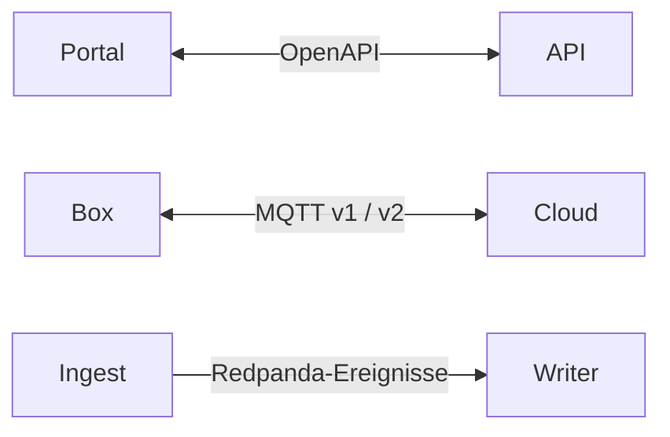

# Schnittstellenverträge

JSON-Schemas und OpenAPI beschreiben die gemeinsamen Grenzen zwischen Portal, API, Cloud und Box. Änderungen am Vertrag müssen mit Produzenten, Konsumenten und Fixtures kompatibel sein.

```mermaid
flowchart LR
    Portal["Portal"] <-->|OpenAPI| API["API"]
    Box["Box"] <-->|"MQTT v1 / v2"| Cloud["Cloud"]
    Ingest["Ingest"] -->|"Redpanda-Ereignisse"| Writer["Writer"]
```

## Nachschlagen

| Grenze | Referenz |
|---|---|
| HTTP-API | [openapi.yaml](openapi.yaml) |
| v1-Telemetrie / Ereignis | [MQTT](mqtt-telemetry.schema.json), [telemetry.raw](telemetry-raw.event.schema.json) |
| v1-Fahrplan | [mqtt-schedule](mqtt-schedule.schema.json) |
| Status-Herzschlag: Steuerstand des Speichers | [Vertrag](speicher-steuerstand.md), [Vektoren](speicher-steuerstand-vectors.json) |
| Provisioning | [Hello-/Config-Vertrag](mqtt-provisioning.schema.json) |
| v2: Entitäten, Flows, Verbraucher und Messpunkte | [v2-Übersicht](v2/README.md) |
| Energetische Bewertung (UEMS AP-16) | [Regeln](v2/bewertung.md), [Regel-Vektoren](v2/bewertung-vectors.json), [Messabdeckung Ahrenberg](v2/messabdeckung.json), [Schema](v2/bewertung.schema.json) |
| Bezugsbasis einer Kennzahl (UEMS AP-17) | [Regeln](v2/bezugsbasis.md), [Regel-Vektoren](v2/bezugsbasis-vectors.json), [Schema](v2/bezugsbasis.schema.json) |
| Ziele, Maßnahmen, Abweichungen (UEMS AP-18) | [Regeln](v2/verbesserung.md), [Regel-Vektoren](v2/verbesserung-vectors.json), [Schema](v2/verbesserung.schema.json) |
| Energiemanagement: Überprüfung, Wiedervorlage, Verzeichnis-Zeile (UEMS AP-19) | [Regeln](v2/energiemanagement.md), [Regel-Vektoren](v2/energiemanagement-vectors.json), [Schema](v2/energiemanagement.schema.json); Managementbewertung als [Vorlage Nr. 7](v2/bericht-vorlagen.json) im [Berichtsvertrag](v2/bericht.md), Rolle „Einsicht“ in der [Rechte-Matrix](v2/rechte-matrix.json), Herkunft der Maßnahme in [verbesserung.md](v2/verbesserung.md) |
| MiSpeL-Abgrenzungsoption: Formeln (1)–(33) der Formelsätze A1, A5, A10, A11 (MiSpeL MP-4) | [Regeln](v2/mispel-abgrenzung.md), [Vektoren](v2/mispel-abgrenzung-vectors.json), [Schema](v2/mispel-abgrenzung.schema.json) |
| MiSpeL-Pauschaloption: Formeln (P1)–(P22)R der Formelsätze P1–P5 mit Rumpfjahr und Tabelle 1, erst nach EU-Beihilfegenehmigung anwendbar (MiSpeL MP-24) | [Regeln](v2/mispel-pauschal.md), [Vektoren](v2/mispel-pauschal-vectors.json), [Schema](v2/mispel-pauschal.schema.json) |
| MiSpeL-Zählerrolle Z1/Z2/Z3 am Messstellen-Register: Zählpunkt, Messstellenbetreiber, Eichstatus, Wertequelle, Trennung hinter Z2/Z3 (MiSpeL MP-6) | [Regeln und Schnittstelle](v2/mispel-zaehlerrolle.md) |
| MiSpeL bidirektionaler Ladepunkt: Fähigkeit V2H/V2G als Fassungen, Einordnung nach Anlage 1, Z2 am Ladepunkt mit Eichstatus aus den Zählerrollen, Fahrzeugfenster (MiSpeL MP-31) | [Regeln und Schnittstelle](v2/mispel-ladepunkt-bidirektional.md) |
| MiSpeL-Förderweg je Einspeisestelle: fünf Werte nach EEG und Festlegung, Formelsatz mit Bindung bis Jahresende, Wechsel zum Monatsersten, Bestand aus `netzladen_erlaubt`/`plant_kind` (MiSpeL MP-5); AW-Differenzierung je Fassung für die AW>0-Liste (1.1, MP-12b) | [Regeln und Schnittstelle](v2/mispel-foerderweg.md) |
| OCPP-Ereignisse und Befehle | [Ereignis](mqtt-ocpp-events.schema.json), [Command](mqtt-ocpp-command.schema.json) |
| OTA | [Manifest](ota-release-manifest.schema.json) mit [Vektoren je Box-Art](ota-release-manifest-vectors.json), [Signatur](ota-signature.schema.json), [Ziel](mqtt-ota-target.schema.json) |
| Ladepark | [Konfiguration](mqtt-charging-config.schema.json), [Boost](mqtt-charging-boost.schema.json) |
| Diagnose / Eingriff | [Probe](mqtt-probe.schema.json), [Registerauftrag](mqtt-register-write.schema.json), [Datenbereinigung](mqtt-data-purge.schema.json) |
| Fernwartung | [Soll-Stand des Tunnel-Dienstes](fernwartung-soll-v1.example.json), Routen im OpenAPI-Tag `fernwartung`; [Schlüsselausgabe an die Box](fernwartung-schluessel-v1.md) mit [Vektor](fernwartung-schluessel-v1.example.txt) |
| Beispiele | [v1-Fixtures](examples/README.md), [v2-Fixtures](v2/examples/README.md) |

Die Dateien in diesem Verzeichnis sind die vollständige Schemaablage; die Tabelle gruppiert die wichtigsten Grenzen.

## Versionsregeln

Versionen gehören zum jeweiligen Vertrag. Ein neuer v2-Plattformvertrag kann mit `schema_version: "1.0"` beginnen. Bestehende v1-Geräte müssen weiterhin bedient werden; v2-Themen leben getrennt unter `ems/{tenant}/{site}/{device}/v2/…`.

Breaking Changes ausdrücklich versionieren. Neue optionale Felder dürfen alte Konsumenten nicht beschädigen. Bekannte semantische Abweichungen nicht durch unbemerkte Schemaänderungen „bereinigen“: siehe [Netzladen-Default](v2/mqtt-schedule-2.0.md#netzladen).

Schema-Prüfung ergänzt, ersetzt aber keine semantischen Tests zu Identität, Grenzen, TTL, RLS oder tatsächlicher Gerätewirkung.
