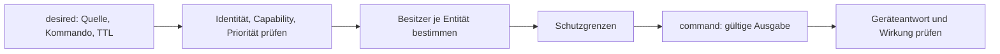

# Lokale Wünsche und Arbitration

Verbindlicher Vertrag: [edge-desired.schema.json](edge-desired.schema.json). Der normale Entitätssteuerpfad führt Wünsche über Go-Arbitration und Guards zu Gerätekommandos. Für explizite generische Modbus-Knoten gilt die gesonderte [Governance-Ausnahme](flow-graph.md#katalogausnahmen).

## Topic-Familie

Alle lokalen Topics beginnen mit `edge/entities/{id}/`. Payload-ID und Topic-ID müssen übereinstimmen. IDs sind topic-sicher gemäß Schema.

| Suffix | Richtung | Retained |
|---|---|---|
| `config` | Core → Adapter/Flows | ja; leere Payload löscht |
| `telemetry` | Adapter → Core | nein |
| `desired` | zugelassene Quelle → Core | nein |
| `arbitration` | Core → Beobachter | nein |
| `command` | Core → Adapter | ja |
| `readback` | Adapter → Core | nein |

Konfiguration, Telemetrie und Kommandos: [Entity-Vertrag](edge-entity-config.md). Die v1-Topics bestehen daneben weiter.

## Wunsch und Priorität

Kommandos: `setpoint_kw`, `on_off`, `limit_pct`, `limit_kw`, `mode`. Speicher: positive Leistung lädt, negative entlädt. Verbraucher: positive Leistung bedeutet Verbrauch. Limits begrenzen; sie fordern keine Erzeugung an. Capability-/Wertebereichsprüfung bleibt erforderlich.

| Rang | Klasse / Fall |
|---|---|
| 100 | `safety` — Geräteschutz, kein zugelassener externer Wunschproduzent |
| 90 | `grid` |
| 80 | `contract` |
| 75 | Handeingriff: `local-ui` + `override` |
| 70 | zugelassener `flow`-Override |
| 60 | `market` |
| 50 | `deadline-fallback`, ausschließlich Core-intern |
| 40 | `flow` |
| darunter | Entitäts-Failsafe |

`flow` und `local-ui` dürfen nur Klasse `flow` beanspruchen; `plan-executor` nur `market`; `cloud-command` die zugelassenen `grid`-/`contract`-/`market`-Klassen. Reserved Klassen belegen noch keine implementierte externe Anbieterintegration.

Ein Override ist auf höchstens 14.400 Sekunden begrenzt und hebt keine Guards auf. Der normale Katalogknoten `vp.entity.control` darf kein frei gesetztes `override` mitführen; generierte Pflichtregeln stempeln den erlaubten Override über den Policy-Compiler.

## Besitz und Ablauf

- Besitzeinheit ist die gesamte Entität, nicht ein einzelner Kommandotyp.
- Höhere Priorität verdrängt sofort. Noch gültige niedrigere Wünsche können anschließend wieder übernehmen.
- Innerhalb derselben Klasse behält – außer beim Handeingriff (D-6a) – der bisherige Besitzer die Entität; konkurrierender Wunsch wird abgewiesen, nicht auf eine Warteliste gelegt. Er muss später erneut gesendet werden.
- Die Quelle bestimmt ihren ersetzbaren Wunschslot; `request_id` korreliert Ereignisse. Wiederholtes Senden kann die TTL erneuern.
- `ttl_s` ist erforderlich: 1–86.400 Sekunden, zeitlich an `min(issued_at, Empfang)` gebunden. Zukunftsdatierung verlängert sie nicht.
- Nach Ablauf/Freigabe übernimmt der nächste gültige Wunsch, sonst der konfigurierte Failsafe. Keine Erinnerung an einen abgelaufenen Sollwert als Ersatz.
- Veraltete Pläne ziehen ihre Markt-Wünsche zurück; [Planfrische und Ausnahmen](mqtt-schedule-2.0.md) gelten zusätzlich.

## Rückmeldung und Vertrauensgrenze

Arbitration meldet unter anderem `accepted`, `clamped`, `rejected`, `superseded`, `expired`, `released`, `fallback`, angefragtes/gewährtes Kommando, Gründe und aktuellen Besitzer. Die konkrete Guard-Trace beschreibt tatsächlich wirksame Änderungen.

Arbitration belegt eine Entscheidung; Register-Readback belegt die Antwort des Geräts. Physische Wirkung benötigt die passende Messung. Diese Ebenen nicht gleichsetzen.

Der lokale Bus ist eine lokale Vertrauenszone. Katalog-/Compilerregeln und Core-Validierung sind nicht mit vollständiger Broker-AuthZ für beliebige fremde MQTT-Clients gleichzusetzen. Die geplante Trennung ist keine pauschale Sandbox-Zusage.

Quellen: `internal/desired`, `internal/guards`, `internal/localbus` im [Core](../../../edge-app/core/), [geteilte Beispiele](examples/README.md).

## Handeingriff (D-6a)

`local-ui` mit `override: true` hat Rang **75**: über Pflichtregeln (70), unter `contract` (80). Ein Paar aus Handeingriff und Regel ist von der Ablehnung innerhalb derselben Klasse ausgenommen: Der Handeingriff verdrängt die Regel, die gültige Regel bleibt gespeichert und kann nach Ablauf wieder übernehmen. Zwei Handeingriffe ersetzen sich im selben Quellslot. Regel gegen Regel bleibt unverändert; Vier-Stunden-Grenze, Anlagenpause und Guards gelten weiter.
