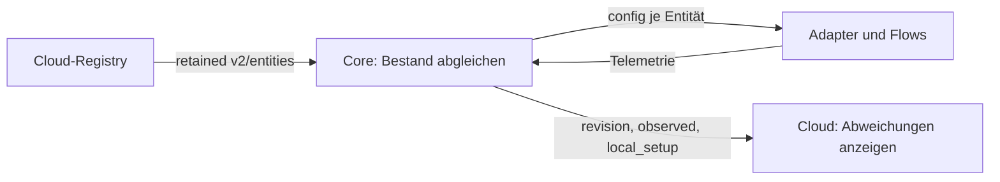

# Entity-Konfiguration und Registry-Push

Verbindlich: [edge-entity.schema.json](edge-entity.schema.json), Vertragsversion `1.0` innerhalb der v2-Plattform. Die Cloud sendet Sollkonfiguration; die Box meldet angewandten Stand und lokale Beobachtung zurück.

## Vollständiger Sollbestand

Topic: `ems/{tenant_id}/{site_id}/{device_id}/v2/entities`. Envelope: Identität, `revision`, `published_at`, vollständiges `entities`-Array.

`revision` ist opak und wird von der Box unverändert quittiert. Der Cloud-Pfad mit Datenquellen
verwendet `uems-registry:<sequence>` aus einer auch nach Rollback fortlaufenden DB-Sequenz;
Wanduhrversatz zwischen Cloud-Knoten darf keine alte Fassung als Entzug bestätigen.
Der Bestandsweg ohne Datenquellen behält seine Zeitstempel-Kennung. `published_at` bleibt der
Zeitpunkt; Form und Grenzen des Revisionsfelds ändern sich nicht (AP-06 IP-7, kein Edge-Release).

Neue/geänderte Deskriptoren erzeugen lokale retained Konfiguration. Entfernte Entitäten löschen lokale `config`- und `command`-Slots. Leeres Array bedeutet keine v2-Entitäten; eine leere Cloud-Payload löscht den retained Slot. Identität und zulässige Deskriptoren müssen geprüft werden.

Die Registry-Speicherung ist nicht von erfolgreichem MQTT-Publish abhängig. Nach fehlgeschlagenem Publish den tatsächlichen Push-/Reconcile-Stand prüfen; Retained-Zustellung hilft erst, wenn der Broker den gewünschten Stand erhalten hat.

## Deskriptor

| Feld | Bedeutung |
|---|---|
| `entity_type` | Offenes, wohlgeformtes Typvokabular; Katalog beschreibt bekannte Typen |
| `capabilities` | Messkanäle und unterstützte Stellkommandos mit Grenzen |
| `guards` | Leistungs-/SoC-Grenzen und Failsafe |
| `driver` | Transport-/Verbindungsdaten für Geräteanbindung |
| `edge_source_id` | Stabile lokale Quellzuordnung für die vorgesehene Anzeigeprojektion |
| `flex_requirements` | Aktive Fristaufgaben mit cloudseitig aufgelöster Leistung und Kommando |

Verhalten wird aus Fähigkeiten und Guards abgeleitet, nicht allein aus dem Typnamen. Generatorlimits reduzieren Erzeugung; Verbraucherkommandos bleiben im zulässigen Verbrauchsbereich. Failsafe-Verhalten: `self-consumption`, `off`, `release`, `measure-only` gemäß Schema.

Der Deadline-Fallback benötigt bestätigten eigenen Fortschritt und keinen frischen v2-Plan. Preis-/opportunistische Regeln werden nicht als beliebige Fristaufgaben übertragen. [Verbraucher](../../verbrauchssteuerung.md#offline-verhalten).

## Lokale Topics

Unter `edge/entities/{id}/`:

- `config`: retained Deskriptor; leere Payload löscht.
- `telemetry`: lokale numerische Kanäle und optionaler Messzeitpunkt, nicht retained.
- `command`: Core-Ausgabe mit `control_enabled`, `source` und `commands`, retained. Fehlende Limits geben vorherige Limits frei.
- `readback`: Geräteantwort nach dem Schreibvorgang; Bedeutung getrennt von Arbitration und Messwirkung.

[Wünsche und Arbitration](edge-desired-arbitration.md) beschreiben die übrigen Topics.

## Soll und Ist

Heartbeat-`entities` meldet `revision`, `applied_at`, `count`, `ids` sowie `observed` und gegebenenfalls `local_setup`.

`observed` zeigt angewandten Typ, tatsächlich beobachtete Kanäle und Frischezustand. Fehlendes ist kein erfundener Nullwert. `local_setup` beschreibt die lokale Einrichtung mit Typ, Familie, Transport und vollständiger Verbindung; Quellen können zusätzlich Kadenz, kWp und Registry-Zuordnung melden.

**Fehlendes `connection` bedeutet bei älteren Boxen „nicht gemeldet“, nicht „keine Verbindung“.** Eine Übernahme darf daraus keine neue Verbindung raten. Vollständige Übernahme muss bestehende Kennungen, Transportfelder und Leseparameter erhalten. Self-Build-Geräte haben ihren Leseplan im generierten Flow und dürfen andere Registry-Einträge nicht blockieren.

v1- und v2-Lokaltopics können koexistieren. Quellen: `internal/entities`, `internal/componentapply`, Statuslistener der API und [Fixtures](examples/README.md).

## Selbst angebundene Batterien und Schutzgrenzen

| `communication` | Lesepfad |
|---|---|
| `modbus_baukasten` | generierte `vp.modbus.read`-Knoten |
| `mqtt_local` | ein `vp.mqtt.read` je Batterie mit gemeinsamer Feldzuordnung |
| `http_local` | ein `vp.http.read` je Endpunkt; Geheimnis nur in Registry/Probe, nie im lesbaren Flow-Dokument |

Der Component-Applier überspringt diese selbstlesenden Treiber. Neue Werte zuerst auf der Box ausrollen; eine ältere Box kann sonst den gesamten Push ablehnen. `driver.connection` hält die Definition, der Flow den Lesepfad. Die explizite Speicherbindung wird in `role_assignment` materialisiert, siehe [Topologie](topology-read-model.md).

`vp.soc.derive` ergänzt `soc_pct` und `soc_source_code`: 1 = gemessen, 2 = Spannungskennlinie, 3 = Ladungszählung. Unbekannt bleibt abwesend. Direkte Werte werden unverändert übernommen; nach `hold_s` (Vorgabe 900 s) läuft ein gehaltener Wert aus und die Ladungszählung braucht einen neuen Anker.

`vp.bms.limit` kann `charge_limit_a`, `discharge_limit_a`, `charge_allowed`, `discharge_allowed` liefern. Jeder Kanal hat genau einen Autor. Die Werte begrenzen VoltPilot-Sollwerte in `guard:bms_limit`; Ampere werden nur mit gemessener Packspannung zu kW. 0 A sperren unabhängig von der Spannung. Fehlende/veraltete Grenzen entfallen als Kappe und bedeuten keine gemeldete Freigabe. Eine verriegelte Richtung meldet sowohl `allowed=0` als auch `limit_a=0`. Das schreibt keine Stromgrenzen ins Gerät; dafür bleibt der zertifizierte Steuerpfad zuständig.
