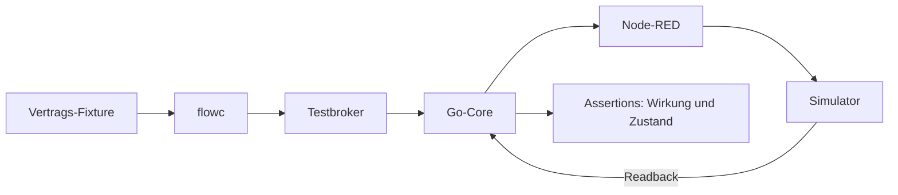

# v2-Simulatorprüfstand

Der implementierte Prüfstand untersucht Flow-Auslieferung, Arbitration, Schutzgrenzen und Geräteantworten ohne reale Hardware. Er ersetzt keine Herstellerzertifizierung.



## Start

Im Verzeichnis `edge-app`:

```bash
./test/e2e-v2-compose.sh
```

Das Skript und `test/docker-compose.e2e-v2.yml` definieren Isolation, Ports und tatsächliche Szenarien. Für v1: `./test/e2e-compose.sh`; für OCPP: `./test/e2e-ocpp.sh`.

## Nachweiskatalog

| Kennung | Erforderlicher Nachweis |
|---|---|
| P1 | Artefakt erzeugt Wunsch, Core meldet Annahme/Besitzer |
| P2 | Überhöhter Wunsch wird begrenzt; Readback zeigt den gewährten Wert |
| P3 | Gleichrangige Konkurrenz verdrängt den Besitzer nicht beliebig |
| P4 | Zulässiger Override endet mit TTL; Plan übernimmt wieder |
| P5 | Mehrere Entitäten, veralteter Plan und Entity-Failsafes |
| P6 | Artefakt anwenden, ersetzen, ablehnen, zurückziehen und bestätigen |
| P7 | v1/v2 behalten getrennte retained Planablagen |

Die Tabelle beschreibt die Prüfziele. Welche Szenarien ein konkreter Lauf tatsächlich ausführt, ergibt sich aus Skript und Laufprotokoll; ein grüner Teiltest belegt nicht automatisch die gesamte Matrix.

Unterhalb des Compose-Prüfstands sichern Go-In-Process-Tests Arbitration/Guards/TTL und Node-Tests Compiler, Palette und Protokolle ab. Verwendete Fixture-Formate: [Beispiele](examples/README.md).

Simulatorregister sind Testdetails. Eine reale Modellfreigabe verlangt den [Hardware-Prüfstand](../../../edge-app/nodered/CONTROL-BENCH.md).
