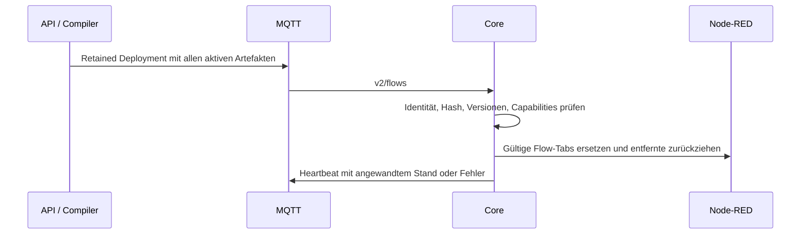

# Flow-Artefakt und Auslieferung

Verbindlich: [flow-artifact.schema.json](flow-artifact.schema.json). Ein kompiliertes Artefakt enthält Manifest und Node-RED-Tab-Bundle; die Cloud verteilt den vollständigen gewünschten Artefaktbestand je Box.

## Manifest

- Identität: `artifact_id`, `flow_id`, `flow_version`, `runtime`.
- `content_hash`: SHA-256 über JCS-kanonisiertes `bundle`. Core prüft vor Anwendung.
- `min_palette_version`, `min_core_version`: benötigte Laufzeitversionen; eine nicht passende Box meldet `unsupported`.
- `required_entities`: benötigte Entitäten und Fähigkeiten. Fehlende Voraussetzung verhindert dieses Artefakt, keine teilweise Anwendung innerhalb eines Flows.
- Ein reserviertes `signature`-Feld ist nicht mit der implementierten OTA-Release-Signaturkette gleichzusetzen.

## Bundle und Bestand

Format `nodered-tabs`; deterministische Tab-/Knoten-IDs ermöglichen Ersetzen statt Duplizieren. Artefakt-Tabs tragen `@vp-flow flow_id=… flow_version=…`. Unterstützte Knoten einschließlich Funktions-/Modbus-Ausnahmen stehen im [Graphvertrag](flow-graph.md#katalogausnahmen).

Budget: 256 KiB je Artefakt, 512 KiB je serialisiertem Deployment gemäß Schema-Anmerkungen. Größere Payloads nicht still in einen ungeprüften Downloadpfad auslagern.

`ems/{tenant_id}/{site_id}/{device_id}/v2/flows`: QoS 1, retained. Die Liste ist vollständiger Sollbestand, kein Patch. Leeres `artifacts` zieht alle Artefakt-Tabs zurück. Ungültige Artefakte melden `error`/`unsupported`; andere gültige Einträge können weiterhin angewandt werden.

Der Core persistiert Artefakte und aktualisiert Node-RED über dessen Admin-API. Zurückgezogene Wünsche laufen entsprechend ihrer TTL aus; der nächste gültige Besitzer beziehungsweise Failsafe übernimmt.

## Reseed und Bestätigung

Reseed erhält markierte `@vp-flow`-Tabs und erneuert die Herstellervorlagen getrennt. Die alte Behauptung, jeder Templatewechsel ersetze zwangsläufig alle Kundenflows, beschreibt nicht mehr den aktuellen Pfad.

Heartbeat-`flows.applied` enthält Flow-ID, Version, Hash und Zustand. Konvergenz liegt erst vor, wenn der passende Stand als angewandt gemeldet ist. Das Cloud-Soll allein genügt nicht.

Rücknahme veröffentlicht den vollständigen Bestand mit dem früheren Artefakt erneut. Belege: Core-`internal/flowdeploy`, Node-RED-Reseed und [v2-Prüfstand](edge-simulator-v2.md).
