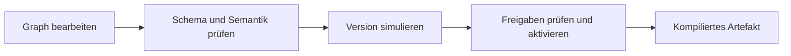

# Flow-Graph

Verbindliche Form: [flow-graph.schema.json](flow-graph.schema.json). Der Graph ist das versionierte Quelldokument des Editors; der Compiler erzeugt daraus ein [Flow-Artefakt](flow-artifact.md).

## Knoten, Ports und Claims

Knoten referenzieren Katalogtyp und `type_version`; der Graph definiert keine eigenen Katalogtypen. Steuernde Knoten tragen explizite `claims` auf Entitäten. `delegated: true` übergibt den Anspruch an die Cloud-Planung; direkte und delegierte Claims konkurrieren trotzdem um dieselbe exklusive Ressource.

Porttypen: `number`, `bool`, `timeseries`, `price`, `plan`, `event`, `entityRef`. Typgleiche Verbindungen und die erklärten Erweiterungen `price → timeseries` sowie `number → timeseries` sind möglich. Keine impliziten Einheitenumrechnungen; insbesondere `bool → number` und `timeseries → number` sind nicht automatisch erlaubt. `entityRef` ist eine Bindungsreferenz, kein beliebiger Laufzeitwert.

## Semantische Prüfungen

| Regel | Prüfung |
|---|---|
| V-1 | Portkompatibilität, erforderliche Inputs, höchstens eine Eingangskante je Port |
| V-2 | Ohne `feedback`-Kanten muss der Graph azyklisch sein |
| V-3 | Eindeutige IDs und vorhandene Knoten-/Portreferenzen |
| V-4 | Katalogtyp/-version, Parameter und Laufzeit unterstützt |
| V-5 | Keine kollidierenden Claims innerhalb eines Flows oder zwischen aktiven/aktivierenden Flows |
| V-6 | Messkanäle und Kommandos passen zu Entity-Capabilities |
| V-7 | Mindestens ein gültiger Trigger |
| V-8 | Nur Knoten der passenden Cloud-/Edge-Laufzeit |

Befunde nennen Regel und betroffene Knoten/Kanten. Editor und Server müssen dieselben fachlichen Regeln anwenden; Schema-Validierung allein genügt nicht.

## Auswertung und Lebenszyklus

Trigger: `interval`, `value-change`, `slot-boundary`, `event`. Auswertung je Flow ist nicht reentrant; währenddessen eintreffende Trigger werden zusammengefasst. Feedback übergibt den Wert der vorherigen Auswertung. Zeitüberschreitungen beenden die Auswertung; Wünsche laufen nach TTL aus.

Versionen durchlaufen `draft`, `simulated`, `active`, `retired`. Änderungen erzeugen neue Entwürfe; höchstens eine Version eines Flows ist aktiv. API-Zustand ist maßgeblich, das Graphfeld `lifecycle` nur eine Momentaufnahme. Rücknahme aktiviert ein vorhandenes früheres Artefakt erneut.

## Katalogausnahmen

- `vp.logic.function` ist vorhanden: ein Edge-Katalogknoten für begrenzten Kundencode mit Zeitwächter. Das ist keine beliebige Cloud-Codeausführung; die vorgesehenen Effekte gehen über Entitätswünsche.
- `vp.modbus.*` darf ausdrücklich Transport-/Registerparameter tragen. Generische Modbus-Zugriffe sind eine eigene, governancegebundene Ausnahme **außerhalb der normalen Entity-Arbitration**. Sie sind nicht automatisch ein zertifizierter Gerätepfad. Ziel-/LAN-Prüfungen bleiben nötig.
- `origin` wird für generierte Verbraucher-/Modbus-Artefakte serverseitig gestempelt. Kunden dürfen diesen Marker nicht selbst setzen.
- `vp.consumer.reactive` benötigt passende Herkunft; frei gesetztes `override` auf `vp.entity.control` wird abgelehnt.

Diese Ausnahmen ersetzen die früheren absoluten Aussagen „keine Codeknoten“ und „keine Register im Graph“. Belege: [flowc](../../../edge-app/nodered/flowc/README.md), API-/Portal-Validatoren und [Fixtures](examples/README.md).
