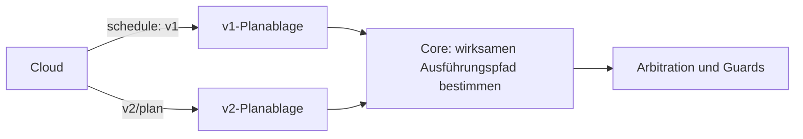

# Fahrplan 2.0

Verbindlich: [Schema](mqtt-schedule-2.0.schema.json). Der Plan enthält Kommandos pro Entität und reist retained mit QoS 1 auf `ems/{tenant_id}/{site_id}/{device_id}/v2/plan`.

## Koexistenz

v2 ersetzt keine retained Nachricht auf dem v1-Topic. Schattenbetrieb und Rücknahme benötigen getrennte Ablagen; alte Boxen erhalten keine Pflicht, v2 zu sprechen. Geräte-ACLs begrenzen den jeweiligen Unterbaum.

## Felder und Wirkung

| v1 | v2 |
|---|---|
| `slots[].battery_setpoint_kw` | `entities[].slots[].commands.setpoint_kw` |
| `slots[].pv_limit_kw` | `commands.limit_kw` / `limit_pct` an der Erzeugerentität |
| `grid_charge_allowed` | `entities[].charge_from_grid_allowed` |
| `peak_reserve_soc_pct` | `entities[].reserve_soc_pct` |
| `grid_import_limit_kw` | weiterhin anlagenweit — es ist das Lastspitzen-ZIEL, keine harte Grenze; in einer Anlage mit scharfer Gemeinsamer Steuerung trägt es nur das Dokument der führenden Box |

Slots liegen auf einem gemeinsamen aufsteigenden Zeitraster. Der Core führt den Slot aus, dessen halboffenes Intervall die aktuelle Zeit enthält. Kommandos bleiben Vorgaben für die Arbitration, keine unmittelbaren Registerschreibbefehle.

Fehlendes `limit_kw`/`limit_pct` bedeutet, eine vorherige entsprechende Begrenzung freizugeben. Limits dürfen Erzeugung beziehungsweise Verbrauch nur begrenzen. Eine aus einem neuen Plan entfernte Entität verliert ihren Markt-Wunsch; unbekannte Entitäten werden protokolliert und übersprungen.

## Gemeinsame Steuerung: ein Lauf, je Box ein Dokument (AP-15 IP-15)

Regeln P1, P2, Auflösung W8 ([Steuerungsverbund](steuerungsverbund.md)). Beide Felder sind wahlfrei und additiv; die Box überliest unbekannte Felder (`plan2.Parse`), eine Box ohne Gemeinsame Steuerung sieht sie nie.

- **Ohne scharfe Gemeinsame Steuerung** (keine, erklärt, geprüft, angehalten, aufgelöst) gilt alles wie bisher: ein Lauf → EIN Dokument an die Box des Speichers, ohne `lauf_nr`, ohne Block — Byte für Byte (NW-6, R22). Eine zweite Box der Anlage bekommt keinen Plan.
- **In `anteile_aktiv`** (mit gültiger führender Box) wird der EINE Lauf der Anlage geschnitten: je steuernder Box höchstens ein Dokument auf IHREM Topic `…/{device_id}/v2/plan`, alle mit derselben `plan_id`, demselben `generated_at` und derselben `lauf_nr`. Jede Entität steht in genau einem Dokument, dem der Box ihrer Komponente: der Speicher bei der Box seines Asset-Geräts (W2), die PV und die Verbraucher einer mitsteuernden Box bei ihr (dieselbe Zuordnung wie ihre Anteils-Nebenbedingung), alles andere bei der führenden. `grid_import_limit_kw` trägt nur die führende Box.
- `lauf_nr` (ganzzahlig ≥ 1): die Laufnummer der Anlage, aufsteigend (P1); gespeichert am Lauf (`site_plan_run.lauf_nr`, V20260922000000), vergeben für jeden Lauf, gesendet nur in der scharfen Anlage. Kann der Optimierer sie nicht vergeben (api noch nicht migriert), fehlt sie — der Plan geht trotzdem.
- `gemeinsame_steuerung`: `{"rolle": "fuehrt" | "steuert_mit"}`. Der Block trägt KEINE Anteile: die harte Grenze reist nur im Anteils-Dokument ([mqtt-verbund-anteile.md](mqtt-verbund-anteile.md), Y1).
- **Kein Dokument** bekommt eine mitsteuernde Box, die der Planer als belegt rechnet: stumm (90 s ohne Herzschlag, R7), nach dem Box-Tausch noch nicht vom Betreiber bestätigt (R17) oder ohne die gemeldete Fähigkeit `steuerungsverbund_anteil` (alter Edge-Stand, A12/R14). Ihre Entitäten stehen dann in keinem Dokument — nie im Dokument einer anderen Box.
- **Box ohne Entität im Lauf** (z. B. nur PV, die nicht abgeregelt wird): ein leeres Dokument lehnte sie ab (`keine_entitaeten`), sie bekommt also keins. Statt dessen nimmt die Cloud ihren gehaltenen Plan mit der leeren retained Nachricht zurück — die Freigabe-Regel des Erzeugers auf Dokument-Ebene, damit kein alter Deckel bis zur Veraltung weiterwirkt. Die leere Nachricht wird nicht quittiert und nicht als „veröffentlicht“ vermerkt.
- **Anhalten**: die mitsteuernden Boxen bekommen keinen Plan mehr; ihr letzter Plan veraltet nach 20 Minuten. Die führende steuert allein wie seit AP-06 (ein Dokument, wie oben). Die Anteile bleiben in Kraft.
- „veröffentlicht“ vermerkt der Optimierer je Box und Dokument (`plan_zustellung`, [Plan-Quittung](mqtt-plan-result.md)); der v1-Fahrplan bleibt, wo er heute fährt, und wird nicht berührt.

## Frische und Fallback

- Plan-Staleness: 20 Minuten ab Empfang, zusätzlich an das Alter von `generated_at` mit fünf Minuten Redelivery-Spielraum gebunden. Alte retained Zustellung darf den Plan nicht beliebig verjüngen.
- Bei Veraltung entfallen Markt-Wünsche. Der Failsafe stammt aus der Entity-Konfiguration und überlebt fehlende Pläne.
- Die zuletzt bekannte `grid_import_limit_kw` kann als Schutzgrenze im Fallback bestehen bleiben; ein neuer Plan ohne dieses Feld löscht sie.
- Die planbezogene Speicherreserve begrenzt gewöhnliche Fallback-Entladung; Peak-Verteidigung darf bis zum technischen SoC-Minimum gehen.
- Pläne werden dauerhaft gespeichert, damit ein Neustart ohne Netz nicht alle Planinformationen verliert.

## Netzladen

`charge_from_grid_allowed` erlaubt Netzladen ausschließlich bei **explizitem `true`**. Sonst gilt die Solar-only-Begrenzung auf gemessene verfügbare PV; unbekannte PV blockiert dieses Laden. Entladen wird durch diesen Schalter nicht freigegeben oder gesperrt.

Bekannte Vertragsabweichung: Der eingefrorene v1-Schematext beschreibt fehlendes `grid_charge_allowed` anders; der Go-Core verwendet auch dort den restriktiven Default. Diese Abweichung wird hier offengelegt, ohne den v1-Drahtvertrag still umzuschreiben.

[Ausführungsverantwortung](plan-execution-ownership.md), [Arbitration](edge-desired-arbitration.md), [Fixtures](examples/README.md).
