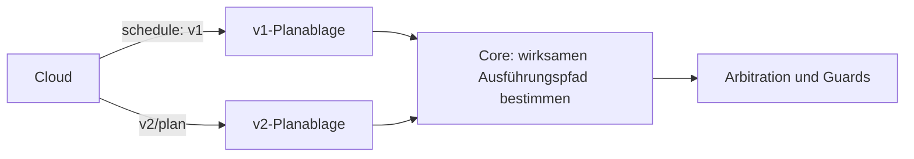

# Fahrplan 2.0

Verbindlich: [Schema](mqtt-schedule-2.0.schema.json). Der Plan enthält Kommandos pro Entität und reist retained mit QoS 1 auf `ems/{tenant_id}/{site_id}/{device_id}/v2/plan`.

## Koexistenz

v2 ersetzt keine retained Nachricht auf dem v1-Topic. Schattenbetrieb und Rücknahme benötigen getrennte Ablagen; alte Boxen erhalten keine Pflicht, v2 zu sprechen. Geräte-ACLs begrenzen den jeweiligen Unterbaum.

## Felder und Wirkung

| v1 | v2 |
|---|---|
| `slots[].battery_setpoint_kw` | `entities[].slots[].commands.setpoint_kw` |
| `slots[].pv_limit_kw` | `commands.limit_kw` / `limit_pct` an der Erzeugerentität |
| `grid_charge_allowed` | `entities[].charge_from_grid_allowed` |
| `peak_reserve_soc_pct` | `entities[].reserve_soc_pct` |
| `grid_import_limit_kw` | weiterhin anlagenweit |

Slots liegen auf einem gemeinsamen aufsteigenden Zeitraster. Der Core führt den Slot aus, dessen halboffenes Intervall die aktuelle Zeit enthält. Kommandos bleiben Vorgaben für die Arbitration, keine unmittelbaren Registerschreibbefehle.

Fehlendes `limit_kw`/`limit_pct` bedeutet, eine vorherige entsprechende Begrenzung freizugeben. Limits dürfen Erzeugung beziehungsweise Verbrauch nur begrenzen. Eine aus einem neuen Plan entfernte Entität verliert ihren Markt-Wunsch; unbekannte Entitäten werden protokolliert und übersprungen.

## Frische und Fallback

- Plan-Staleness: 20 Minuten ab Empfang, zusätzlich an das Alter von `generated_at` mit fünf Minuten Redelivery-Spielraum gebunden. Alte retained Zustellung darf den Plan nicht beliebig verjüngen.
- Bei Veraltung entfallen Markt-Wünsche. Der Failsafe stammt aus der Entity-Konfiguration und überlebt fehlende Pläne.
- Die zuletzt bekannte `grid_import_limit_kw` kann als Schutzgrenze im Fallback bestehen bleiben; ein neuer Plan ohne dieses Feld löscht sie.
- Die planbezogene Speicherreserve begrenzt gewöhnliche Fallback-Entladung; Peak-Verteidigung darf bis zum technischen SoC-Minimum gehen.
- Pläne werden dauerhaft gespeichert, damit ein Neustart ohne Netz nicht alle Planinformationen verliert.

## Netzladen

`charge_from_grid_allowed` erlaubt Netzladen ausschließlich bei **explizitem `true`**. Sonst gilt die Solar-only-Begrenzung auf gemessene verfügbare PV; unbekannte PV blockiert dieses Laden. Entladen wird durch diesen Schalter nicht freigegeben oder gesperrt.

Bekannte Vertragsabweichung: Der eingefrorene v1-Schematext beschreibt fehlendes `grid_charge_allowed` anders; der Go-Core verwendet auch dort den restriktiven Default. Diese Abweichung wird hier offengelegt, ohne den v1-Drahtvertrag still umzuschreiben.

[Ausführungsverantwortung](plan-execution-ownership.md), [Arbitration](edge-desired-arbitration.md), [Fixtures](examples/README.md).
