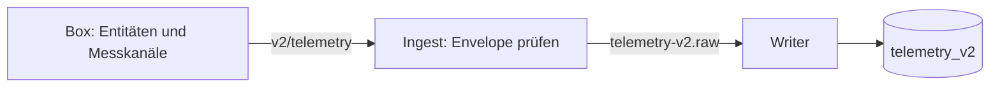

# Telemetrie 2.0

Verbindlich: [Schema](mqtt-telemetry-2.0.schema.json). Eine Nachricht enthält Messkanäle mehrerer Entitäten. v1 bleibt auf seinem eigenen Topic bestehen.

## Topic und Inhalt

`ems/{tenant_id}/{site_id}/{device_id}/v2/telemetry`: QoS 1, nicht retained, `schema_version: "2.0"`.

- `entities` ist nach Entitätskennung geordnet; jede Entität trägt eine flache numerische `channels`-Map. Optionales Entitäts-`ts` überschreibt den Envelope-Zeitpunkt.
- Fehlende Messungen werden weggelassen. Boolesche Zustände werden als 0/1 übertragen; keine erfundenen Nullwerte.
- Vorzeichen folgen der Capability: Batterie positiv laden, Netz positiv beziehen; Erzeugung nicht negativ.
- Ingest prüft Version, UUIDs, Zeitformat, Topic-/Payload-Identität sowie sichere Entitätskennungen und numerische Kanäle.
- Ingest verlangt keine bereits synchronisierte Registry-Entität und keine zentrale Kanal-Whitelist. Die fachliche Capability-Prüfung ist eine andere Grenze.

## Wiederholung und Frische

`ts` bleibt der ursprüngliche Messzeitpunkt, auch bei Replay. `received_at` beschreibt die Ankunft; Verbindungs-Liveness und Alter der Messung sind deshalb unterschiedliche Größen. Schreiben ist je `(entity_id, channel, time)` wiederholbar.

Ereignisvertrag: [telemetry-v2.raw](telemetry-v2-raw.event.schema.json). [Fixtures](examples/README.md), [Ingest](../../../services/ingest/README.md), [Writer](../../../services/timescale-writer/README.md).

## SoC-Herkunft und BMS-Grenzen

`soc_source_code` begleitet den jeweiligen SoC-Wert numerisch (1 gemessen, 2 Kennlinie, 3 Ladungszählung); unbekannt ist kein Code 0. Die Grenzkanäle `charge_limit_a`, `discharge_limit_a`, `charge_allowed` und `discharge_allowed` bleiben ebenfalls numerisch. Bedeutung und Alterung: [Entity-Vertrag](edge-entity-config.md#selbst-angebundene-batterien-und-schutzgrenzen).

Der Ingest übernimmt eine vorhandene `seq` und prüft v2-Werte einzeln. Zurückgewiesene Werte erzeugen Ereignisse auf `events.raw`; sie verwerfen nicht automatisch alle anderen Werte desselben Umschlags. [Datenannahme](../../../services/ingest/README.md).
