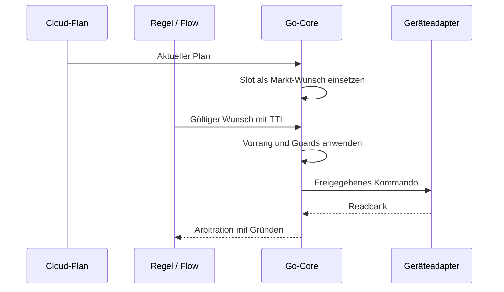
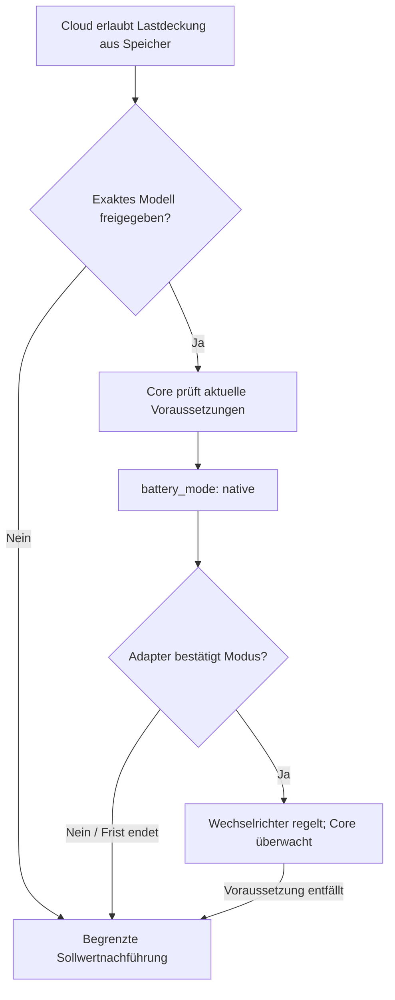

# Wer führt den Fahrplan aus?

**Der Go-Core bleibt Ausführer.** Der normale Entitätssteuerpfad lässt Flows Wünsche äußern; Treiber setzen das vom Core freigegebene Kommando um. Die explizite generische [Modbus-Ausnahme](flow-graph.md#katalogausnahmen) ist kein normaler zertifizierter Entitätspfad.

## Zuständigkeiten

| Aufgabe | Verantwortlich |
|---|---|
| Preise und wirtschaftliche Entscheidung | Cloud |
| Planempfang, Prüfung, Cache und Frische | Core |
| Slotwahl und Markt-Wunsch | Core |
| Vorrang, TTL, Konflikte und Guards | Core |
| Zertifizierte Registerfolge und Readback | Geräteadapter mit erforderlicher Freigabe |
| Regelbeitrag / normaler Entitätswunsch | Flow beziehungsweise Policy |

## Typische Fälle

- **Normaler Slot:** Core wählt den zeitlich gültigen Slot, prüft Grenzen und gibt das Kommando aus.
- **Zugelassener Override:** Zeitlich begrenzter Wunsch kann den Marktplan verdrängen, niemals höher priorisierte Grenzen. Nach Ablauf übernimmt der noch gültige Plan.
- **Cloud fehlt:** Veraltete Markt-Wünsche entfallen. Gültige lokale Wünsche oder Entity-Failsafe übernehmen; die dokumentierten Peak-Grenzen können bestehen bleiben.
- **Guard greift:** Das Arbitration-Ereignis nennt angefragtes und gewährtes Kommando sowie die wirksame Stufe. Eine positive Entscheidung ist kein physischer Wirkungsbeweis.

## Native Selbstregelung

Die Cloud entscheidet über Wirtschaftlichkeit (`cover_load_from_battery` / `unplanned_load_discharge`), der gerätespezifische Adapter über die belegte Registerfolge. Der Core behält die Aufsicht und kann den Modus jederzeit zurücknehmen.

`battery_mode: native` ist zunächst eine Absicht. Erst bestätigter nativer Readback erlaubt `execution.mode = autonomous_discharge`. Ohne Bestätigung oder bei fehlender Voraussetzung kehrt der Core zum geprüften Sollwertpfad zurück. Native Selbstregelung ist kein allgemeiner Ausfallmodus.

Belege: Core-`guards.NativeMode`, `unplanned-load-native.js`, [Prüfstand native Selbstregelung](../../../edge-app/nodered/UNPLANNED-LOAD-BENCH.md). [Planvertrag](mqtt-schedule-2.0.md), [Arbitration](edge-desired-arbitration.md).

## Gemessenes Defizit decken

Die lokale Ausführung kann eine Entladung zur Deckung des **gemessenen** Netzbezugs vertiefen (`deficit_cover`), wenn die Planvoraussetzungen gelten. Dies ist keine Preisentscheidung und erlaubt keinen Wechsel in einen unzertifizierten nativen Gerätemodus. Pause, anderer Besitzer, veralteter Plan/Messwert, Reserve und Schreibfreigaben bleiben wirksam. Eine Entladung zu verringern bleibt an die jeweiligen Cloud-Berechtigungen gebunden.
