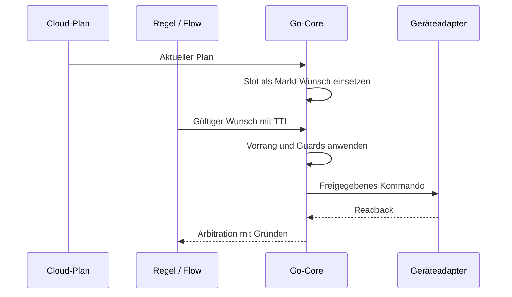
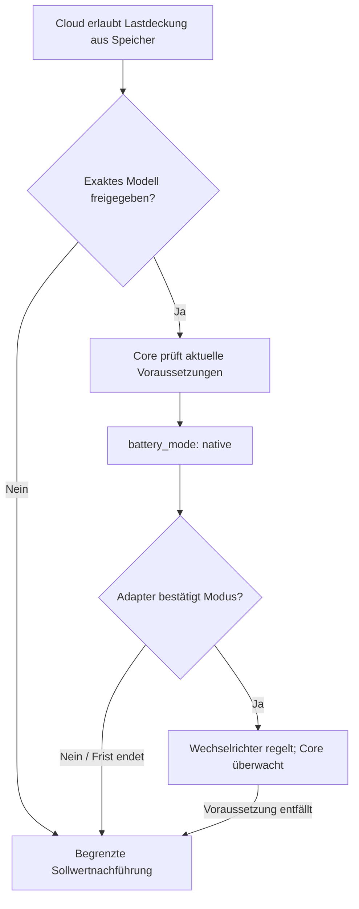

# Wer führt den Fahrplan aus?

**Der Go-Core bleibt Ausführer.** Der normale Entitätssteuerpfad lässt Flows Wünsche äußern; Treiber setzen das vom Core freigegebene Kommando um. Die explizite generische [Modbus-Ausnahme](flow-graph.md#katalogausnahmen) ist kein normaler zertifizierter Entitätspfad.

## Zuständigkeiten

| Aufgabe | Verantwortlich |
|---|---|
| Preise und wirtschaftliche Entscheidung | Cloud |
| Planempfang, Prüfung, Cache und Frische | Core |
| Slotwahl und Markt-Wunsch | Core |
| Vorrang, TTL, Konflikte und Guards | Core |
| Zertifizierte Registerfolge und Readback | Geräteadapter mit erforderlicher Freigabe |
| Regelbeitrag / normaler Entitätswunsch | Flow beziehungsweise Policy |

## Typische Fälle

- **Normaler Slot:** Core wählt den zeitlich gültigen Slot, prüft Grenzen und gibt das Kommando aus.
- **Zugelassener Override:** Zeitlich begrenzter Wunsch kann den Marktplan verdrängen, niemals höher priorisierte Grenzen. Nach Ablauf übernimmt der noch gültige Plan.
- **Cloud fehlt:** Veraltete Markt-Wünsche entfallen. Gültige lokale Wünsche oder Entity-Failsafe übernehmen; die dokumentierten Peak-Grenzen können bestehen bleiben.
- **Guard greift:** Das Arbitration-Ereignis nennt angefragtes und gewährtes Kommando sowie die wirksame Stufe. Eine positive Entscheidung ist kein physischer Wirkungsbeweis.

## Native Selbstregelung

Die Cloud entscheidet über Wirtschaftlichkeit (`cover_load_from_battery` / `unplanned_load_discharge`), der gerätespezifische Adapter über die belegte Registerfolge. Der Core behält die Aufsicht und kann den Modus jederzeit zurücknehmen.

`battery_mode: native` ist zunächst eine Absicht. Erst bestätigter nativer Readback erlaubt `execution.mode = autonomous_discharge`. Ohne Bestätigung oder bei fehlender Voraussetzung kehrt der Core zum geprüften Sollwertpfad zurück. Native Selbstregelung ist kein allgemeiner Ausfallmodus.

Jede Absicht mit offenem Leistungsfenster hat ihr eigenes Ausführungswort: **E↓** „nur Verbrauch decken“ `[−max ; 0]` → `autonomous_discharge`, **E↑** „nur aus Überschuss laden“ `[0 ; +max]` (nie aus dem Netz, keine Entladung) → `autonomous_charge`, **E** „Eigenverbrauch“ `[−max ; +max]` und **E~** „gedrosselt laden“ `[−max ; +x]` → `autonomous_selfconsumption`. Für alle drei gilt dieselbe Regel: gemeldet wird das Wort nur, wenn das Gerät den Modus im Rücklesen bestätigt hat; `planned_kw` ist dann der Referenzwert, den der Core schreiben würde, wenn er den Speicher im nächsten Takt zurücknimmt. Die Wörter sind additiv: die Cloud kennt sie vor der Box (ein älterer Listener verwirft ein unbekanntes Wort, eine ältere Box sendet es nie).

Belege: Core-`guards.NativeMode`, `unplanned-load-native.js`, [Prüfstand native Selbstregelung](../../../edge-app/nodered/UNPLANNED-LOAD-BENCH.md). [Planvertrag](mqtt-schedule-2.0.md), [Arbitration](edge-desired-arbitration.md).

## Absicht + Fenster (K4b, 24.09.2026)

Konzept „Der Wechselrichter regelt, die Box setzt Absicht und Grenzen“ (§3, §6.1). Kein Wolkenvertrag ändert sich; die Flaggen des Fahrplans werden auf der Box zu **einer** Absicht mit einem Leistungsfenster `[min ; max]` (+ Laden / − Entladen). Innerhalb des Fensters gilt immer: Netzpunkt → 0.

1. **Box ① Absicht + Fenster** (`guards.IntentFor`, rein): Abbildung und Vektoren in [`native-intent-window-vectors.json`](native-intent-window-vectors.json). Ein Punkt (N, H, A) ist ein fester Sollwert; offen sind E, E↑, E↓, E~. `guards.ClipWindow` schickt beide Grenzen durch dieselbe Guard-Kette wie einen Sollwert – eine Grenze, die einen Fluss **erzwingt**, und jeder Punkt durch die volle Kette; eine offene Grenze durch die geräteseitigen Stufen (Nennband, SoC-Fenster, BMS), weil das Gerät sie nur aus dem Überschuss erreicht. Die EEG-Regel eines offenen Fensters trägt der **belegte** Netzlade-Riegel des Geräts plus die Aufsicht „Laden bei Bezug“. Am Plattform-Boden schließt die Entladeseite.
2. **Box ② Weg wählen** (`guards.NativeMode`): Punkt → Sollwert; offen **und** Layer 1 meldet für genau diese Absicht einen zertifizierten Hebel (`native_capabilities`, ein Fenster enger als das natürliche braucht `window: true`) **und** das Fenster enthält 0 → „Gerät regelt“; sonst → Box gedämpft (`guards.FollowDamper`, E2 A). Ohne Meldung gibt es nur den bestehenden E↓-Weg (byte-gleich wie vor K4b). Die Box-Regel `deficit_cover` bleibt bei der Box: sie wird von einer Messung ausgelöst und würde das Gerät innerhalb eines Slots umschalten.
3. **Box ③ Aufsicht**, jede Rücknahme mit Grund aus dem geschlossenen Vokabular und deutschem Satz, gerastet bis Slotende: zusätzlich zu Reserve, Lastspitze, Messfrische, Rücklesen, Beleg und EEG jetzt `laden_bei_bezug` (Laden und Bezug beide > 0,5 kW länger als 60 s), `entladen_gegen_absicht` (Entladen > 0,5 kW länger als 60 s in E↑), `speicher_voll` (E↑ an der SoC-Obergrenze). `einspeisung_trotz_ladeleistung` ist nur ein Hinweis (der Gerätezähler sieht eine zweite PV-Anlage nicht). Verweigerungen ohne Rücknahme: `kein_hebel`, `fenster_geschlossen`, `fenster_erzwingt_fluss`, `schreibbudget`. Sichtbar im Zustand als `native_withheld`.
4. **Übergänge und Schreibbudget:** Das Gerät wird nur an Slotgrenzen umgeschaltet, an denen sich die Absicht ändert; innerhalb eines Slots wird das Fenster nur verengt, nie wieder geweitet. Jede Änderung dessen, was `edge/setpoint` vom Gerät verlangt, zählt als Schreibvorgang (`native.writes_today`); ein Dauerspeicher-Hebel (`persistent: true`) endet bei 20 je Tag, Eintritt und Austritt zusammen.

**Lokaler Bus, additiv** (`edge-app/core/internal/localbus/localbus.go`):

| Feld | Richtung | Bedeutung |
|---|---|---|
| `battery_mode` | Core → Layer 1 | `setpoint` \| `native` (E↓, unverändert) \| `native_window` (E↑, E, E~). Ein Layer 1 ohne K4b behandelt `native_window` als Sollwertpfad und bestätigt nie – der Core nimmt nach der Frist zurück (`nachweis_fehlt`). |
| `battery_native_intent` | Core → Layer 1 | `cover_load` \| `surplus_charge` \| `self_consumption` |
| `battery_window_min_kw` / `battery_window_max_kw` | Core → Layer 1 | das beschnittene Fenster |
| `battery_setpoint_kw` | Core → Layer 1 | bleibt Anzeige- und Rücknahme-Referenz; im Eigenmodus nicht geschrieben |
| `native.intent` | Layer 1 → Core | welche Absicht die belegte Primitive umsetzt; eine Fenster-Absicht gilt nur mit ihrem eigenen Wort als belegt |
| `native_capabilities` | Layer 1 → Core | `{intents, window, persistent}` – zertifizierte Hebel der aktuellen Auswahl; fehlt = unbekannt |

**Rückmeldung an die Wolke:** `execution.mode` = `autonomous_charge` (E↑), `autonomous_selfconsumption` (E, E~), `autonomous_discharge` (E↓) – nur nach bestätigtem Rücklesen, und das Wort fällt im selben Takt wie jede Rücknahme. `execution.planned_kw` ist die Referenz; `commanded_kw` und `confirmed_kw` sind in jedem `autonomous_*`-Modus **null** (die Box schreibt keinen Batteriewert). `execution.window_min_kw` / `window_max_kw` reisen nur bei `autonomous_charge` / `autonomous_selfconsumption`.

## Gemessenes Defizit decken

Die lokale Ausführung kann eine Entladung zur Deckung des **gemessenen** Netzbezugs vertiefen (`deficit_cover`), wenn die Planvoraussetzungen gelten. Dies ist keine Preisentscheidung und erlaubt keinen Wechsel in einen unzertifizierten nativen Gerätemodus. Pause, anderer Besitzer, veralteter Plan/Messwert, Reserve und Schreibfreigaben bleiben wirksam. Eine Entladung zu verringern bleibt an die jeweiligen Cloud-Berechtigungen gebunden.
