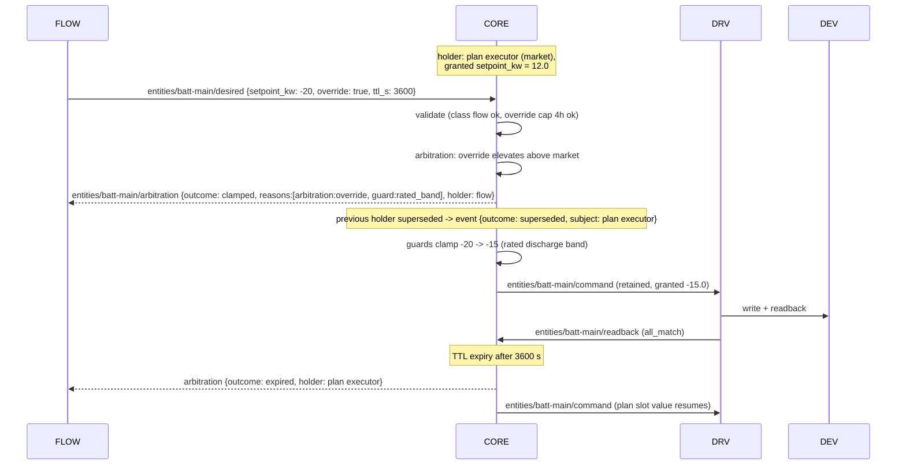
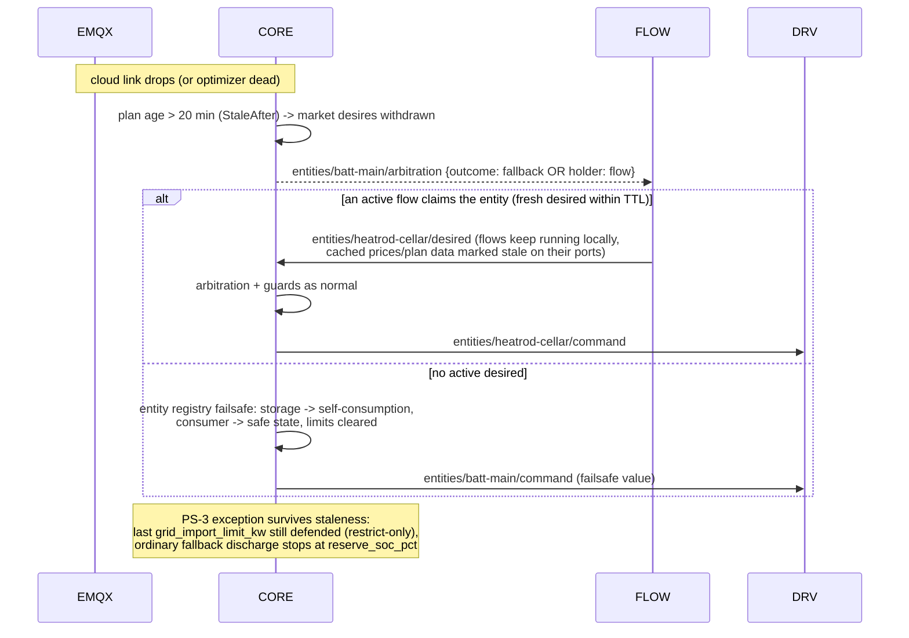
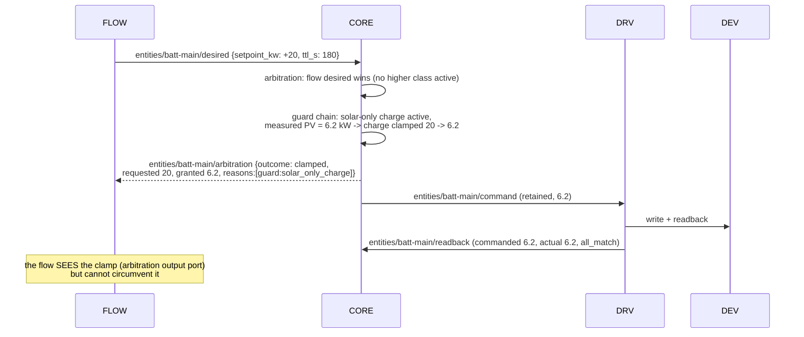

# Plan Execution Ownership (v2) — Decision Record

**Status: BINDING decision record (v2 track).**
Related contracts: [mqtt-schedule-2.0](./mqtt-schedule-2.0.md),
[edge-desired-arbitration](./edge-desired-arbitration.md), [flow-artifact](./flow-artifact.md).

## The decision

**The Go core (`vp-edge-core`) REMAINS the executor.** Slot selection, plan caching/staleness,
fallback behavior, arbitration, the guard chain, and the certified control path stay in the
core, exactly where they live in v1. The flow runtime (compiled flows in the Node-RED layer):

- **consumes** plan data (a read-only `plan`-typed input port fed from the core's cached plan),
  entity telemetry, prices, and arbitration events;
- **emits** desired values (`edge/entities/{id}/desired`) — nothing else;
- **never** writes registers, never publishes actuation topics, never executes slots.

The driver layer (vendor adapter flows) executes only the core-published, guard-clamped
`edge/entities/{id}/command`, behind the unchanged two-gate certification model (core
kill-switch + certified-family allowlist, verified in `inverter-control-routing.js`
`CERTIFIED_CONTROL_FAMILIES` and `agent.applySetpoint`'s `control_enabled`).

### Why

1. **The reliability substrate is the core's proven asset.** Plan cache (RAM + disk,
   reboot-without-network), the 20-min staleness window with `generated_at` aging, the
   self-consumption fallback, the restrict-only guard chain, PS-3 peak defense surviving plan
   silence — all verified, shipped behavior (`internal/plan`, `internal/guards`,
   `internal/agent`). Re-homing any of it into a runtime that customers reconfigure would put
   compliance behavior behind user-editable surface.
2. **Safety separation must be structural, not conventional** (captain D1: the editor is for
   everyone). A flow crash, a bad flow, or a runtime restart must degrade to the SAME failsafes
   as a cloud outage. That holds only if the executor is below the flow layer.
3. **Certification stays per driver, not per flow.** The write→readback proof chain
   (bench-certified families, register-level readback) is orthogonal to flow logic; flows above
   the arbitration line cannot invalidate a device certification.
4. **One brain for offline behavior.** Offline degradation (plan stale, prices stale, cloud
   dead) is defined once in the core, per entity, instead of per flow author.

## Sequence diagrams

Participants: `OPT` = cloud co-optimizer · `EMQX` = cloud broker · `CORE` = Go core (plan
executor + arbitration + guards) · `FLOW` = flow runtime (compiled user flow) · `DRV` = driver
layer (vendor adapter) · `DEV` = physical device.

### 1. Normal slot execution

```mermaid
sequenceDiagram
    participant OPT
    participant EMQX
    participant CORE
    participant DRV
    participant DEV
    OPT->>EMQX: v2/plan (retained, QoS1, schema 2.0)
    EMQX->>CORE: retained plan delivered
    CORE->>CORE: parse + validate, persist to disk (plan store)
    Note over CORE: slot boundary: entity batt-main,<br/>commands.setpoint_kw = 12.0
    CORE->>CORE: arbitration: market desired, no competitor -> holder
    CORE->>CORE: guards: band, SoC, solar-only, grid-limit envelope, band
    CORE->>DRV: edge/entities/batt-main/command (retained, granted 12.0, control_enabled)
    DRV->>DEV: certified adapter write (e.g. FC6) + readback read
    DEV-->>DRV: register values
    DRV->>CORE: edge/entities/batt-main/readback (commanded vs actual, all_match)
    CORE->>EMQX: status heartbeat (additive entities/flows blocks)
```

### 2. Flow-overridden slot (within guard bounds)

The plan (class `market`) holds the battery; the owner's boost flow emits an
`override: true` desired (class `flow`, elevated above `market` for its TTL, never above
`contract`/`grid`/`safety` — see [edge-desired-arbitration.md](./edge-desired-arbitration.md) §3–4).



### 3. Cloud-unreachable degradation



### 4. Guard clamp event



## Native self-regulation ("Selbstregel-Modus") - who owns the SETPOINT

In a slot the cloud marked worth covering from the battery
(`cover_load_from_battery` / `unplanned_load_discharge`) the edge may stop
writing a watt value altogether and hand the SETPOINT ITSELF back to the
inverter's own self-consumption loop. **No contract field was added for this**:
the cloud already says *whether* covering is economic, and *how* it is executed
has always been an edge decision - the `unplanned_load_discharge` wording in
`mqtt-schedule.schema.json` says so explicitly ("Native charge-block/autonomous-
discharge is permitted only for an exact certified model/firmware capability;
every other inverter uses the guarded exact-setpoint LoadFollower").

The ownership split INSIDE the edge is the part that needs stating:

| Concern | Owner |
|---|---|
| Is this slot worth covering at all (the price decision) | **cloud** (`slot_trim.py`) |
| May this device regulate itself (exact model/firmware certificate) | **Layer 1** (`unplanned-load-native.js`) - only it knows the registers |
| The register sequence into and out of the mode | **Layer 1 adapter** (`nativeSelfConsumption`) |
| Whether the mode is entered at all right now (supervision) | **core** (`guards.NativeMode`) |
| Taking the battery back | **core** - and it can, on every tick |
| Proving the device really is regulating itself | **Layer 1 readback** (`mode: "native"`), consumed by the core |

Two rules follow from that split, and they are what make the mode safe:

1. **The core publishes an INTENT, Layer 1 answers with EVIDENCE.** `edge/setpoint`
   carries the additive `battery_mode: "setpoint" | "native"` (absent = setpoint,
   so an older Layer 1 is byte-for-byte unchanged). Layer 1 executes the native
   primitive only with an exact certificate and then reports `mode: "native"` on
   `edge/control/readback`. **An intent that is never confirmed is withdrawn**
   after a bounded grace and the proven 10-second follower carries the slot -
   because otherwise "we stopped writing" and "we died" would be the same state.
   Only a CONFIRMED mode is reported to the cloud as
   `execution.mode = "autonomous_discharge"`.
2. **"Selbst regeln" means dropping the setpoint, not the supervision.** The guard
   chain protects a value we command; with no commanded value left, every guard
   that used to bite through the setpoint becomes an OBSERVATION with a
   TAKE-BACK. The core leaves the mode - immediately, on the tick it sees it -
   when the SoC reaches the full reserve floor (plus a margin), when the running
   quarter hour's measured import threatens the billing-peak target, when the
   measurement or the readback stops being fresh, when the slot ends or the plan
   goes stale, and on plant rest / a foreign arbitration holder / an owner claim.
   On an EEG site the device must additionally PROVE from its own configuration
   that it cannot charge from the grid; silence counts as not proven.

The SAFE STATE is unchanged: native is a wanted, proven mode, never a failsafe.
Whenever the supervision is in doubt the edge returns to the setpoint path, whose
safe value is the guard-clamped 0 kW / self-consumption computation that shipped
long before it.

## Boundary summary

| Concern | Owner |
|---|---|
| Plan receipt, validation, disk cache, staleness | core (`internal/plan` pattern) |
| Slot selection + market-desire injection | core (plan executor) |
| Arbitration (classes, TTL, conflicts, override) | core |
| Guard chain + peak defense | core (`internal/guards` per entity) |
| Certified register writes + readback | driver layer, gated by the core's `control_enabled` |
| Strategy inputs to the co-optimizer (what the plan optimizes) | flow (strategy nodes, delegated claims) |
| Direct entity control below plan level | flow (action nodes → desires) |
| Registers, actuation topics, guard parameters | **never** the flow |
