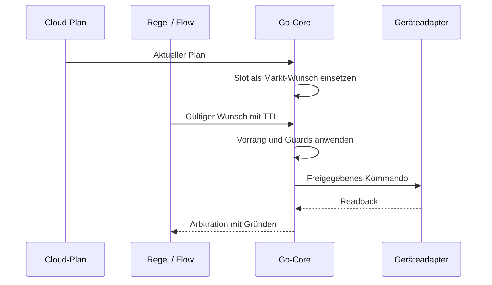
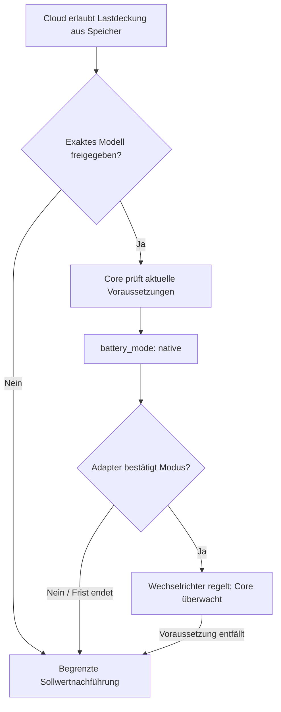

# Wer führt den Fahrplan aus?

**Der Go-Core bleibt Ausführer.** Der normale Entitätssteuerpfad lässt Flows Wünsche äußern; Treiber setzen das vom Core freigegebene Kommando um. Die explizite generische [Modbus-Ausnahme](flow-graph.md#katalogausnahmen) ist kein normaler zertifizierter Entitätspfad.

## Zuständigkeiten

| Aufgabe | Verantwortlich |
|---|---|
| Preise und wirtschaftliche Entscheidung | Cloud |
| Planempfang, Prüfung, Cache und Frische | Core |
| Slotwahl und Markt-Wunsch | Core |
| Vorrang, TTL, Konflikte und Guards | Core |
| Zertifizierte Registerfolge und Readback | Geräteadapter mit erforderlicher Freigabe |
| Regelbeitrag / normaler Entitätswunsch | Flow beziehungsweise Policy |

## Typische Fälle

- **Normaler Slot:** Core wählt den zeitlich gültigen Slot, prüft Grenzen und gibt das Kommando aus.
- **Zugelassener Override:** Zeitlich begrenzter Wunsch kann den Marktplan verdrängen, niemals höher priorisierte Grenzen. Nach Ablauf übernimmt der noch gültige Plan.
- **Cloud fehlt:** Veraltete Markt-Wünsche entfallen. Gültige lokale Wünsche oder Entity-Failsafe übernehmen; die dokumentierten Peak-Grenzen können bestehen bleiben.
- **Guard greift:** Das Arbitration-Ereignis nennt angefragtes und gewährtes Kommando sowie die wirksame Stufe. Eine positive Entscheidung ist kein physischer Wirkungsbeweis.

## Native Selbstregelung

Die Cloud entscheidet über Wirtschaftlichkeit (`cover_load_from_battery` / `unplanned_load_discharge`), der gerätespezifische Adapter über die belegte Registerfolge. Der Core behält die Aufsicht und kann den Modus jederzeit zurücknehmen.

`battery_mode: native` ist zunächst eine Absicht. Erst bestätigter nativer Readback erlaubt `execution.mode = autonomous_discharge`. Ohne Bestätigung oder bei fehlender Voraussetzung kehrt der Core zum geprüften Sollwertpfad zurück. Native Selbstregelung ist kein allgemeiner Ausfallmodus.

Jede Absicht mit offenem Leistungsfenster hat ihr eigenes Ausführungswort: **E↓** „nur Verbrauch decken“ `[−max ; 0]` → `autonomous_discharge`, **E↑** „nur aus Überschuss laden“ `[0 ; +max]` (nie aus dem Netz, keine Entladung) → `autonomous_charge`, **E** „Eigenverbrauch“ `[−max ; +max]` und **E~** „gedrosselt laden“ `[−max ; +x]` → `autonomous_selfconsumption`. Für alle drei gilt dieselbe Regel: gemeldet wird das Wort nur, wenn das Gerät den Modus im Rücklesen bestätigt hat; `planned_kw` ist dann der Referenzwert, den der Core schreiben würde, wenn er den Speicher im nächsten Takt zurücknimmt. Die Wörter sind additiv: die Cloud kennt sie vor der Box (ein älterer Listener verwirft ein unbekanntes Wort, eine ältere Box sendet es nie).

Belege: Core-`guards.NativeMode`, `unplanned-load-native.js`, [Prüfstand native Selbstregelung](../../../edge-app/nodered/UNPLANNED-LOAD-BENCH.md). [Planvertrag](mqtt-schedule-2.0.md), [Arbitration](edge-desired-arbitration.md).

## Absicht + Fenster (K4b, 24.09.2026)

Konzept „Der Wechselrichter regelt, die Box setzt Absicht und Grenzen“ (§3, §6.1). Kein Wolkenvertrag ändert sich; die Flaggen des Fahrplans werden auf der Box zu **einer** Absicht mit einem Leistungsfenster `[min ; max]` (+ Laden / − Entladen). Innerhalb des Fensters gilt immer: Netzpunkt → 0.

1. **Box ① Absicht + Fenster** (`guards.IntentFor`, rein): Abbildung und Vektoren in [`native-intent-window-vectors.json`](native-intent-window-vectors.json). Ein Punkt (N, H, A) ist ein fester Sollwert; offen sind E, E↑, E↓, E~. `guards.ClipWindow` schickt beide Grenzen durch dieselbe Guard-Kette wie einen Sollwert – eine Grenze, die einen Fluss **erzwingt**, und jeder Punkt durch die volle Kette; eine offene Grenze durch die geräteseitigen Stufen (Nennband, SoC-Fenster, BMS), weil das Gerät sie nur aus dem Überschuss erreicht. Die EEG-Regel eines offenen Fensters trägt der **belegte** Netzlade-Riegel des Geräts plus die Aufsicht „Laden bei Bezug“. Am Plattform-Boden schließt die Entladeseite.
2. **Box ② Weg wählen** (`guards.NativeMode`): Punkt → Sollwert; offen **und** Layer 1 meldet für genau diese Absicht einen zertifizierten Hebel (`native_capabilities`, ein Fenster enger als das natürliche braucht `window: true`) **und** das Fenster enthält 0 → „Gerät regelt“; sonst → Box gedämpft (`guards.FollowDamper`, E2 A). Ohne Meldung gibt es nur den bestehenden E↓-Weg (byte-gleich wie vor K4b). Die Box-Regel `deficit_cover` bleibt bei der Box: sie wird von einer Messung ausgelöst und würde das Gerät innerhalb eines Slots umschalten.
3. **Box ③ Aufsicht**, jede Rücknahme mit Grund aus dem geschlossenen Vokabular und deutschem Satz, gerastet bis Slotende: zusätzlich zu Reserve, Lastspitze, Messfrische, Rücklesen, Beleg und EEG jetzt `laden_bei_bezug` (Laden und Bezug beide > 0,5 kW länger als 60 s), `entladen_gegen_absicht` (Entladen > 0,5 kW länger als 60 s in E↑), `speicher_voll` (E↑ an der SoC-Obergrenze), seit K5 `pv_abgeregelt` (eine Primitive mit `native.curtails_own_pv` an der SoC-Obergrenze − 3 % oder länger als 60 s an der Ladegrenze bei Einspeisung, außer der Plan deckelt die PV selbst). `einspeisung_trotz_ladeleistung` ist nur ein Hinweis (der Gerätezähler sieht eine zweite PV-Anlage nicht). Verweigerungen ohne Rücknahme: `kein_hebel`, `fenster_geschlossen`, `fenster_erzwingt_fluss`, `schreibbudget`. Sichtbar im Zustand als `native_withheld`.
4. **Übergänge und Schreibbudget:** Das Gerät wird nur an Slotgrenzen umgeschaltet, an denen sich die Absicht ändert; innerhalb eines Slots wird das Fenster nur verengt, nie wieder geweitet. Jede Änderung dessen, was `edge/setpoint` vom Gerät verlangt, zählt als Schreibvorgang (`native.writes_today`); ein Dauerspeicher-Hebel (`persistent: true`) endet bei 20 je Tag, Eintritt und Austritt zusammen.

**Lokaler Bus, additiv** (`edge-app/core/internal/localbus/localbus.go`):

| Feld | Richtung | Bedeutung |
|---|---|---|
| `battery_mode` | Core → Layer 1 | `setpoint` \| `native` (E↓, unverändert) \| `native_window` (E↑, E, E~). Ein Layer 1 ohne K4b behandelt `native_window` als Sollwertpfad und bestätigt nie – der Core nimmt nach der Frist zurück (`nachweis_fehlt`). |
| `battery_native_intent` | Core → Layer 1 | `cover_load` \| `surplus_charge` \| `self_consumption` |
| `battery_window_min_kw` / `battery_window_max_kw` | Core → Layer 1 | das beschnittene Fenster |
| `battery_setpoint_kw` | Core → Layer 1 | bleibt Anzeige- und Rücknahme-Referenz; im Eigenmodus nicht geschrieben |
| `native.intent` | Layer 1 → Core | welche Absicht die belegte Primitive umsetzt; eine Fenster-Absicht gilt nur mit ihrem eigenen Wort als belegt |
| `native_capabilities` | Layer 1 → Core | `{intents, window, persistent}` – zertifizierte Hebel der aktuellen Auswahl; fehlt = unbekannt. Seit K5 meldet sie auch der Deye-Executor (heute `["cover_load"]`). |
| `native.curtails_own_pv` | Layer 1 → Core | K5: die belegte Primitive drosselt die **eigene** PV, sobald der Speicher nichts mehr aufnimmt (Deye `grid_zero`). Der Core nimmt dann bei SoC ≥ Obergrenze − 3 % oder „Laden an der Grenze und Einspeisung“ länger als 60 s zurück (`pv_abgeregelt`), außer der Plan deckelt die PV in diesem Slot selbst. |
| `native.candidate` | Layer 1 → Core | K5: welcher Übergabe-Kandidat lief (Deye: `grid_zero` \| `own_config`) |
| `native_refusal` | Layer 1 → Core | K5: deutscher Grund, warum ein gewünschter Eigenmodus in diesem Takt nicht übergeben wurde |
| `wrote` | Layer 1 → Core | Deye-Executor: in diesem Takt wurde mindestens ein Register geschrieben |
| `native_pilot` | Core → Layer 1 | K5: `{candidate, intent, run, seconds_remaining}` – nur im von Hand armierten Pilotfenster (`POST /api/native/pilot`, höchstens 15 min). Layer 1 fährt dann den Kandidaten **ohne** Zertifikat, aber mit Vorbedingung und EEG-Beleg; `grid_charge_allowed` ist dabei immer `false`. Drehbuch: [`edge-app/nodered/DEYE-LADESEITE-PILOT.md`](../../../edge-app/nodered/DEYE-LADESEITE-PILOT.md). |

**Rückmeldung an die Wolke:** `execution.mode` = `autonomous_charge` (E↑), `autonomous_selfconsumption` (E, E~), `autonomous_discharge` (E↓) – nur nach bestätigtem Rücklesen, und das Wort fällt im selben Takt wie jede Rücknahme. `execution.planned_kw` ist die Referenz; `commanded_kw` und `confirmed_kw` sind in jedem `autonomous_*`-Modus **null** (die Box schreibt keinen Batteriewert). `execution.window_min_kw` / `window_max_kw` reisen nur bei `autonomous_charge` / `autonomous_selfconsumption`.

## Mehrere Wechselrichter an einem Netzpunkt (K6, 24.09.2026)

Konzept §6.2–§6.4. Kein Wolken- und kein Busvertrag ändert sich; neu sind drei Angaben der Einrichtung (`balance.json`, `POST /api/balance`) und box-lokale Zustandsblöcke.

1. **Genau ein Führungsgerät je Netzpunkt** (`guards.LeaderFor`, rein). Führungsgerät ist die eine steuerbare Speicher-Auswahl der Box (`inverter.json`; ein zweiter steuerbarer Wechselrichter wird schon beim Anlegen abgewiesen). Es darf selbst regeln – jede Absicht des Eigenmodus, die bestehende Entladeseite E↓ eingeschlossen – nur, wenn (a) kein weiterer Speicher am selben Netzpunkt als `regelt_selbst` angegeben ist (weitere Speicher: `keine`, `folger` = Master/Slave des Herstellers, `halten` = Halten/fester Sollwert, `regelt_selbst`; ein unbekanntes Wort zählt wie `regelt_selbst`), (b) sein Zählerort als `netzpunkt` angegeben ist (Pflichtangabe; `woanders` ist dieselbe Tatsache wie die Experten-Ausnahme `primary_grid_not_site_total`, beide werden gleich gehalten; nicht angegeben = `unbekannt`) und (c) der Vergleich mit dem Netz-Zähler der Box nicht widerspricht (`guards.MeterCheck`: Median der Differenz über 10 min, mindestens 12 Paare über 2 min, Toleranz max(1 kW; 10 %)). Ohne Netz-Zähler bleibt (c) `ungeprueft` und die Box nennt den geführten Einmal-Test. Verweigerungen der Wegwahl: `zweiter_regler`, `zaehler_nicht_am_netzpunkt`, `zaehlerort_fehlt`, `zaehler_unplausibel` – eine Verweigerung, solange nichts übergeben ist; eine Rücknahme (gerastet bis Slotende), wenn sich das Urteil während des Eigenmodus ändert. Der K4b-Hinweis `einspeisung_trotz_ladeleistung` wird als Symptom eines falschen Zählerorts 24 h lang am Führungsgerät gezeigt (`leader.hint = zaehlerort_pruefen`); er setzt voraus, dass die Box die Einspeisung überhaupt sieht, also einen Netz-Zähler oder einen richtig sitzenden Gerätezähler.
2. **Reine PV-Wechselrichter** (Messpunkt-Quellen, z. B. Fronius Eco) tragen nie eine Speicher-Absicht; sie bleiben Stellglieder von Einspeisewächter und Abregelung (`pv_limit_kw` + `curtail`-Block).
3. **Kaskade** (`guards.ExportLimiter.CapCascade`, `guards/exportcascade.go`): regelt das Führungsgerät nachweislich selbst mit offener Ladeseite (E↑, E, E~), ist es der Innenkreis und der Einspeisewächter der Außenkreis. Hat der Speicher noch Luft (Ladeleistung mehr als 0,3 kW unter der Fenster-Obergrenze, SoC unter der Obergrenze, alles bekannt), zieht der Außenkreis nicht an und wartet bei Einspeisung über Grenze + 0,3 kW einen Takt (10 s) auf den Innenkreis; danach übernimmt er für den Rest des Slots (`innen_versagt`). Ist der Speicher ausgeschöpft, regelt er wie bisher, zielt aber nie unter Einspeisung 0. Bei der registrierten Grenze gibt er nur frei, was die Grenze selbst aufnehmen kann (an einer Nulleinspeise-Anlage je Takt 0,3 kW). Ohne Innenkreis ist `CapCascade` byte-gleich `Cap`. Der K5-Kandidat `grid_zero` (belegt `surplus_charge`/`self_consumption`, drosselt bei vollem Speicher die eigene PV) ist ohne Sonderfall Innenkreis: im Negativpreis-Slot halten Deye-PV und Fronius gemeinsam Einspeisung 0 ohne Aufschaukeln; bei positivem Preis nimmt K5 ihn mit `pv_abgeregelt` zurück und der Außenkreis hält die registrierte Grenze allein.
4. **Negativpreis / §51:** kappt der Plan den Slot (`pv_limit_kw`) und lädt das Führungsgerät selbst, ersetzt ein zweiter Wächter (Grenze 0 kW, wirtschaftlich: er gibt vorab frei, was der Speicher noch aufnehmen kann) die Vorwärtsregelung von `curtailtrack`, die den im Eigenmodus bedeutungslosen Sollwert zählt. Die Abregelung reist weiter nie mit der Übergabe: ohne `pv_limit_kw` im Slot läuft nichts davon. Der Einspeisewächter der registrierten Grenze und sein Herzschlag-Block bleiben unverändert.
5. **Rückhalt bei Box-Ausfall** (`guards.ExportBackstopFor`): `export_guard.backstop` warnt, solange die Grenze nicht geräteseitig gehalten wird – [Empfehlung für den Installateur](../../edge-runtime.md#rückhalt-der-einspeisegrenze-bei-box-ausfall-k6).

**Box-lokale Zustandsfelder, additiv** (`/api/state`, nicht im Herzschlag – das Zustandsvokabular des Einspeisewächters ist in der Wolke geschlossen):

| Feld | Bedeutung |
|---|---|
| `leader` | `{leads, reason, text, meter_location, further_storage, plausibility, deviation_kw, pairs, hint, hint_text}` |
| `export_guard.cascade` / `cascade_text` | `innen` \| `aussen` \| `innen_versagt` und der Satz dazu |
| `export_guard.backstop_covered` / `backstop_source` / `backstop` | gedeckt (`gemeldet` \| `geraet`) oder die Warnung |

## Gemessenes Defizit decken

Die lokale Ausführung kann eine Entladung zur Deckung des **gemessenen** Netzbezugs vertiefen (`deficit_cover`), wenn die Planvoraussetzungen gelten. Dies ist keine Preisentscheidung und erlaubt keinen Wechsel in einen unzertifizierten nativen Gerätemodus. Pause, anderer Besitzer, veralteter Plan/Messwert, Reserve und Schreibfreigaben bleiben wirksam. Eine Entladung zu verringern bleibt an die jeweiligen Cloud-Berechtigungen gebunden.
