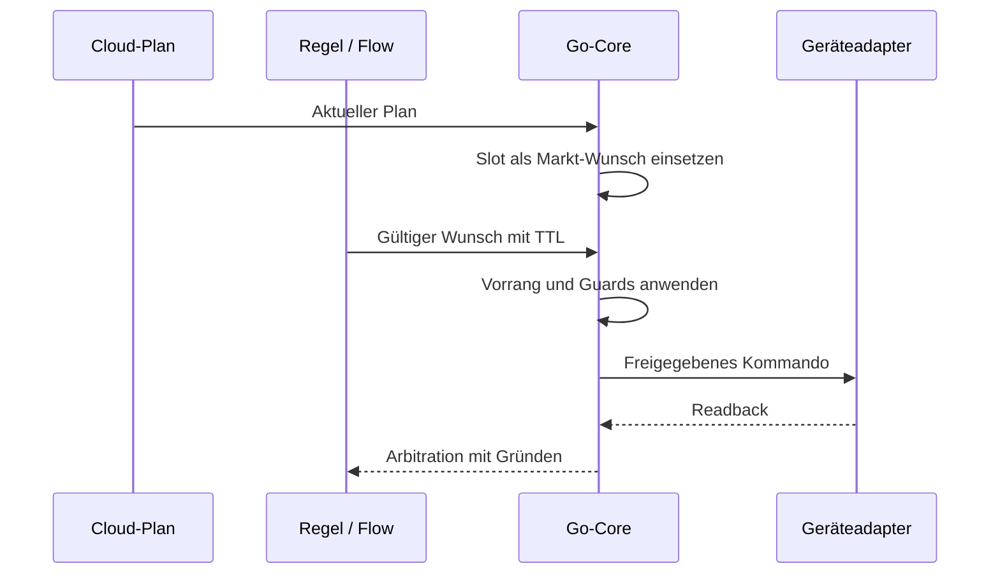
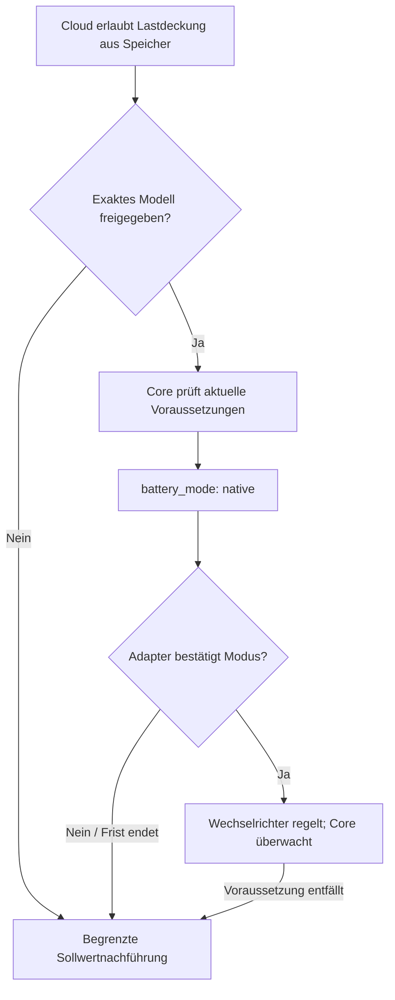
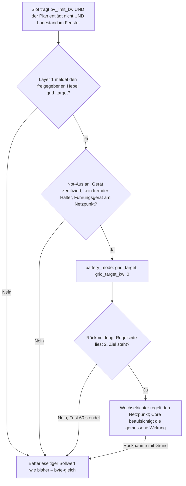

# Wer führt den Fahrplan aus?

**Der Go-Core bleibt Ausführer.** Der normale Entitätssteuerpfad lässt Flows Wünsche äußern; Treiber setzen das vom Core freigegebene Kommando um. Die explizite generische [Modbus-Ausnahme](flow-graph.md#katalogausnahmen) ist kein normaler zertifizierter Entitätspfad.

```mermaid
sequenceDiagram
    participant P as Cloud-Plan
    participant F as Regel / Flow
    participant C as Go-Core
    participant D as Geräteadapter
    P->>C: Aktueller Plan
    C->>C: Slot als Markt-Wunsch einsetzen
    F->>C: Gültiger Wunsch mit TTL
    C->>C: Vorrang und Guards anwenden
    C->>D: Freigegebenes Kommando
    D-->>C: Readback
    C-->>F: Arbitration mit Gründen
```

## Zuständigkeiten

| Aufgabe | Verantwortlich |
|---|---|
| Preise und wirtschaftliche Entscheidung | Cloud |
| Planempfang, Prüfung, Cache und Frische | Core |
| Slotwahl und Markt-Wunsch | Core |
| Vorrang, TTL, Konflikte und Guards | Core |
| Zertifizierte Registerfolge und Readback | Geräteadapter mit erforderlicher Freigabe |
| Regelbeitrag / normaler Entitätswunsch | Flow beziehungsweise Policy |

## Typische Fälle

- **Normaler Slot:** Core wählt den zeitlich gültigen Slot, prüft Grenzen und gibt das Kommando aus.
- **Zugelassener Override:** Zeitlich begrenzter Wunsch kann den Marktplan verdrängen, niemals höher priorisierte Grenzen. Nach Ablauf übernimmt der noch gültige Plan.
- **Cloud fehlt:** Veraltete Markt-Wünsche entfallen. Gültige lokale Wünsche oder Entity-Failsafe übernehmen; die dokumentierten Peak-Grenzen können bestehen bleiben.
- **Guard greift:** Das Arbitration-Ereignis nennt angefragtes und gewährtes Kommando sowie die wirksame Stufe. Eine positive Entscheidung ist kein physischer Wirkungsbeweis.

## Native Selbstregelung

```mermaid
flowchart TD
    Preis["Cloud erlaubt Lastdeckung aus Speicher"] --> Eignung{Exaktes Modell freigegeben?}
    Eignung -->|Nein| Soll["Begrenzte Sollwertnachführung"]
    Eignung -->|Ja| Core["Core prüft aktuelle Voraussetzungen"]
    Core --> Absicht["battery_mode: native"]
    Absicht --> Beleg{Adapter bestätigt Modus?}
    Beleg -->|Ja| Aufsicht["Wechselrichter regelt; Core überwacht"]
    Beleg -->|Nein / Frist endet| Soll
    Aufsicht -->|Voraussetzung entfällt| Soll
```

Die Cloud entscheidet über Wirtschaftlichkeit (`cover_load_from_battery` / `unplanned_load_discharge`), der gerätespezifische Adapter über die belegte Registerfolge. Der Core behält die Aufsicht und kann den Modus jederzeit zurücknehmen.

`battery_mode: native` ist zunächst eine Absicht. Erst bestätigter nativer Readback erlaubt `execution.mode = autonomous_discharge`. Ohne Bestätigung oder bei fehlender Voraussetzung kehrt der Core zum geprüften Sollwertpfad zurück. Native Selbstregelung ist kein allgemeiner Ausfallmodus.

Jede Absicht mit offenem Leistungsfenster hat ihr eigenes Ausführungswort: **E↓** „nur Verbrauch decken“ `[−max ; 0]` → `autonomous_discharge`, **E↑** „nur aus Überschuss laden“ `[0 ; +max]` (nie aus dem Netz, keine Entladung) → `autonomous_charge`, **E** „Eigenverbrauch“ `[−max ; +max]` und **E~** „gedrosselt laden“ `[−max ; +x]` → `autonomous_selfconsumption`. Für alle drei gilt dieselbe Regel: gemeldet wird das Wort nur, wenn das Gerät den Modus im Rücklesen bestätigt hat; `planned_kw` ist dann der Referenzwert, den der Core schreiben würde, wenn er den Speicher im nächsten Takt zurücknimmt. Die Wörter sind additiv: die Cloud kennt sie vor der Box (ein älterer Listener verwirft ein unbekanntes Wort, eine ältere Box sendet es nie).

Belege: Core-`guards.NativeMode`, `unplanned-load-native.js`, [Prüfstand native Selbstregelung](../../../edge-app/nodered/UNPLANNED-LOAD-BENCH.md). [Planvertrag](mqtt-schedule-2.0.md), [Arbitration](edge-desired-arbitration.md).

## Absicht + Fenster (K4b, 24.09.2026)

Konzept „Der Wechselrichter regelt, die Box setzt Absicht und Grenzen“ (§3, §6.1). Kein Wolkenvertrag ändert sich; die Flaggen des Fahrplans werden auf der Box zu **einer** Absicht mit einem Leistungsfenster `[min ; max]` (+ Laden / − Entladen). Innerhalb des Fensters gilt immer: Netzpunkt → 0.

1. **Box ① Absicht + Fenster** (`guards.IntentFor`, rein): Abbildung und Vektoren in [`native-intent-window-vectors.json`](native-intent-window-vectors.json). Ein Punkt (N, H, A) ist ein fester Sollwert; offen sind E, E↑, E↓, E~. `guards.ClipWindow` schickt beide Grenzen durch dieselbe Guard-Kette wie einen Sollwert – eine Grenze, die einen Fluss **erzwingt**, und jeder Punkt durch die volle Kette; eine offene Grenze durch die geräteseitigen Stufen (Nennband, SoC-Fenster, BMS), weil das Gerät sie nur aus dem Überschuss erreicht. Die EEG-Regel eines offenen Fensters trägt der **belegte** Netzlade-Riegel des Geräts plus die Aufsicht „Laden bei Bezug“. Am Plattform-Boden schließt die Entladeseite.
2. **Box ② Weg wählen** (`guards.NativeMode`): Punkt → Sollwert; offen **und** Layer 1 meldet für genau diese Absicht einen zertifizierten Hebel (`native_capabilities`, ein Fenster enger als das natürliche braucht `window: true`) **und** das Fenster enthält 0 → „Gerät regelt“; sonst → Box gedämpft (`guards.FollowDamper`, E2 A). Ohne Meldung gibt es nur den bestehenden E↓-Weg (byte-gleich wie vor K4b). Die Box-Regel `deficit_cover` bleibt bei der Box: sie wird von einer Messung ausgelöst und würde das Gerät innerhalb eines Slots umschalten.
3. **Box ③ Aufsicht**, jede Rücknahme mit Grund aus dem geschlossenen Vokabular und deutschem Satz, gerastet bis Slotende: zusätzlich zu Reserve, Lastspitze, Messfrische, Rücklesen, Beleg und EEG jetzt `laden_bei_bezug` (Laden und Bezug beide > 0,5 kW länger als 60 s), `entladen_gegen_absicht` (Entladen > 0,5 kW länger als 60 s in E↑), `speicher_voll` (E↑ an der SoC-Obergrenze), seit K5 `pv_abgeregelt` (eine Primitive mit `native.curtails_own_pv` an der SoC-Obergrenze − 3 % oder länger als 60 s an der Ladegrenze bei Einspeisung, außer der Plan deckelt die PV selbst), seit vp-wr-deye-tou-schreibbudget `speicher_einspeisung` (in E↓, E und E~: Speicher entlädt und Netzpunkt speist ein, der Speicheranteil min(Entladung, Einspeisung) > 0,5 kW länger als 60 s – keine dieser Absichten darf Speicherenergie verkaufen). `einspeisung_trotz_ladeleistung` ist nur ein Hinweis (der Gerätezähler sieht eine zweite PV-Anlage nicht). Verweigerungen ohne Rücknahme: `kein_hebel`, `fenster_geschlossen`, `fenster_erzwingt_fluss`, `schreibbudget`. Sichtbar im Zustand als `native_withheld`.
4. **Übergänge und Schreibbudget:** Das Gerät wird nur an Slotgrenzen umgeschaltet, an denen sich die Absicht ändert; innerhalb eines Slots wird das Fenster nur verengt, nie wieder geweitet. Jede Änderung dessen, was `edge/setpoint` vom Gerät verlangt, zählt als Schreibvorgang (`native.writes_today`); ein Dauerspeicher-Hebel (`persistent: true`) endet bei 20 je Tag, Eintritt und Austritt zusammen. Seit vp-wr-deye-tou-schreibbudget zählt auch der **Deye-ToU-Pfad** seine Planwechsel (Executor-Takte, die ein EEPROM-Register des Plans schreiben) gegen dasselbe Budget (`persistent_write_budget`, Vorgabe 20): ein Planwechsel braucht Platz für sich und die Rückgabe, der letzte Platz gehört der Rückgabe in die eigene Einstellung des Geräts, danach bis Mitternacht keiner mehr (Readback `blocked` mit Grund und `tou_budget`).
5. **Fenster-Bezugsgröße:** „enger als der Eigenmodus“ urteilen Box ① und Layer 1 über dieselbe Größe – das Nennband des Speichers (`MaxDischargeKw`/`MaxChargeKw`, `guards.NaturalWindow`), das der Core als `battery_window_natural_min_kw`/`_max_kw` mitgibt, mit der Toleranz von `classify` (0,05 kW). Das Typenschild (`rated_kw`) gilt nur noch bei einem Core ohne diese Felder.
6. **Deye E↓-Vorbedingung:** seit vp-wr-deye-tou-schreibbudget urteilt der Deye-E↓-Weg mit Zeile E der Eigenkonfigurations-Tabelle über das Blocklesen `0x008D..0x00B1` und das gerade gültige Programm; „Selling First“ mit aktivem ToU (darf Speicherenergie verkaufen) wird verweigert. Die Schreibbytes (`1100 ← 0`) sind unverändert.

**Lokaler Bus, additiv** (`edge-app/core/internal/localbus/localbus.go`):

| Feld | Richtung | Bedeutung |
|---|---|---|
| `battery_mode` | Core → Layer 1 | `setpoint` \| `native` (E↓, unverändert) \| `native_window` (E↑, E, E~) \| seit 08.10.2026 `grid_target` ([netzseitiger Drossel-Slot](#netzseitiger-drossel-slot-08102026)). Ein Layer 1 ohne K4b behandelt `native_window` als Sollwertpfad und bestätigt nie – der Core nimmt nach der Frist zurück (`nachweis_fehlt`). |
| `battery_native_intent` | Core → Layer 1 | `cover_load` \| `surplus_charge` \| `self_consumption` |
| `battery_window_min_kw` / `battery_window_max_kw` | Core → Layer 1 | das beschnittene Fenster |
| `battery_window_natural_min_kw` / `battery_window_natural_max_kw` | Core → Layer 1 | vp-wr-deye-tou-schreibbudget: die Bezugsgröße für „enger als der Eigenmodus“ – das Nennband des Speichers (−`MaxDischargeKw` / +`MaxChargeKw`), gegen das Box ① klassifiziert. Fehlt = Layer 1 nimmt das Typenschild. |
| `persistent_write_budget` | Core → Layer 1 | vp-wr-deye-tou-schreibbudget: Tagesbudget eines Dauerspeicher-Hebels aus dem Steuerprofil (Deye ToU: 20); Layer 1 nimmt nur Werte in (0, 20], fehlt = 20. |
| `tou_budget` | Layer 1 → Core | vp-wr-deye-tou-schreibbudget: `{day, changes, limit, held}` des Deye-ToU-Pfads auf dem Readback; `held` = Planwechsel zurückgehalten, Gerät in eigener Einstellung bis Mitternacht. |
| `battery_setpoint_kw` | Core → Layer 1 | bleibt Anzeige- und Rücknahme-Referenz; im Eigenmodus nicht geschrieben |
| `native.intent` | Layer 1 → Core | welche Absicht die belegte Primitive umsetzt; eine Fenster-Absicht gilt nur mit ihrem eigenen Wort als belegt |
| `native_capabilities` | Layer 1 → Core | `{intents, window, persistent}` – zertifizierte Hebel der aktuellen Auswahl; fehlt = unbekannt. Seit K5 meldet sie auch der Deye-Executor (am Pilot-Modell `["cover_load", "grid_target"]`; `grid_target` ist der Hebel des netzseitigen Drossel-Slots und keine Absicht des Eigenmodus). |
| `native.curtails_own_pv` | Layer 1 → Core | K5: die belegte Primitive drosselt die **eigene** PV, sobald der Speicher nichts mehr aufnimmt (Deye `grid_zero`). Der Core nimmt dann bei SoC ≥ Obergrenze − 3 % oder „Laden an der Grenze und Einspeisung“ länger als 60 s zurück (`pv_abgeregelt`), außer der Plan deckelt die PV in diesem Slot selbst. |
| `native.candidate` | Layer 1 → Core | K5: welcher Übergabe-Kandidat lief (Deye: `grid_zero` \| `own_config`) |
| `native_refusal` | Layer 1 → Core | K5: deutscher Grund, warum ein gewünschter Eigenmodus in diesem Takt nicht übergeben wurde |
| `wrote` | Layer 1 → Core | Deye-Executor: in diesem Takt wurde mindestens ein Register geschrieben |
| `native_pilot` | Core → Layer 1 | K5: `{candidate, intent, run, seconds_remaining}` – nur im von Hand armierten Pilotfenster (`POST /api/native/pilot`, höchstens 15 min). Layer 1 fährt dann den Kandidaten **ohne** Zertifikat, aber mit Vorbedingung und EEG-Beleg; `grid_charge_allowed` ist dabei immer `false`. Drehbuch: [`edge-app/nodered/DEYE-LADESEITE-PILOT.md`](../../../edge-app/nodered/DEYE-LADESEITE-PILOT.md). |

Die Felder Layer 1 → Core reisen über den Palettenknoten `vp-control-readback`. Seine Liste bleibt fest (ein unbekanntes Feld fällt weg) und reicht `mode: native`, `wrote`, `native`, `native_precondition`, `native_refusal` und `native_capabilities` nur mit dem Typ weiter, den der Core liest. Was der Deye-Executor meldet und was der Core erhält, steht in [`control-readback-vectors.json`](control-readback-vectors.json) (erzeugt vom Node-e2e, gelesen von Palette und Core). Bis zum 29.09.2026 fehlten diese Felder dort, und der Core sah keinen Übernahme-Beleg.

**Rückmeldung an die Wolke:** `execution.mode` = `autonomous_charge` (E↑), `autonomous_selfconsumption` (E, E~), `autonomous_discharge` (E↓) – nur nach bestätigtem Rücklesen, und das Wort fällt im selben Takt wie jede Rücknahme. `execution.planned_kw` ist die Referenz; `commanded_kw` und `confirmed_kw` sind in jedem `autonomous_*`-Modus **null** (die Box schreibt keinen Batteriewert). `execution.window_min_kw` / `window_max_kw` reisen nur bei `autonomous_charge` / `autonomous_selfconsumption`.

## Mehrere Wechselrichter an einem Netzpunkt (K6, 24.09.2026)

Konzept §6.2–§6.4. Kein Wolken- und kein Busvertrag ändert sich; neu sind drei Angaben der Einrichtung (`balance.json`, `POST /api/balance`) und box-lokale Zustandsblöcke.

1. **Genau ein Führungsgerät je Netzpunkt** (`guards.LeaderFor`, rein). Führungsgerät ist die eine steuerbare Speicher-Auswahl der Box (`inverter.json`; ein zweiter steuerbarer Wechselrichter wird schon beim Anlegen abgewiesen). Es darf selbst regeln – jede Absicht des Eigenmodus, die bestehende Entladeseite E↓ eingeschlossen – nur, wenn (a) kein weiterer Speicher am selben Netzpunkt als `regelt_selbst` angegeben ist (weitere Speicher: `keine`, `folger` = Master/Slave des Herstellers, `halten` = Halten/fester Sollwert, `regelt_selbst`; ein unbekanntes Wort zählt wie `regelt_selbst`), (b) sein Zählerort als `netzpunkt` angegeben ist (Pflichtangabe; `woanders` ist dieselbe Tatsache wie die Experten-Ausnahme `primary_grid_not_site_total`, beide werden gleich gehalten; nicht angegeben = `unbekannt`) und (c) der Vergleich mit dem Netz-Zähler der Box nicht widerspricht (`guards.MeterCheck`: Median der Differenz über 10 min, mindestens 12 Paare über 2 min, Toleranz max(1 kW; 10 %)). Ohne Netz-Zähler bleibt (c) `ungeprueft` und die Box nennt den geführten Einmal-Test. Verweigerungen der Wegwahl: `zweiter_regler`, `zaehler_nicht_am_netzpunkt`, `zaehlerort_fehlt`, `zaehler_unplausibel` – eine Verweigerung, solange nichts übergeben ist; eine Rücknahme (gerastet bis Slotende), wenn sich das Urteil während des Eigenmodus ändert. Der K4b-Hinweis `einspeisung_trotz_ladeleistung` wird als Symptom eines falschen Zählerorts 24 h lang am Führungsgerät gezeigt (`leader.hint = zaehlerort_pruefen`); er setzt voraus, dass die Box die Einspeisung überhaupt sieht, also einen Netz-Zähler oder einen richtig sitzenden Gerätezähler.
2. **Reine PV-Wechselrichter** (Messpunkt-Quellen, z. B. Fronius Eco) tragen nie eine Speicher-Absicht; sie bleiben Stellglieder von Einspeisewächter und Abregelung (`pv_limit_kw` + `curtail`-Block).
3. **Kaskade** (`guards.ExportLimiter.CapCascade`, `guards/exportcascade.go`): regelt das Führungsgerät nachweislich selbst mit offener Ladeseite (E↑, E, E~), ist es der Innenkreis und der Einspeisewächter der Außenkreis. Hat der Speicher noch Luft (Ladeleistung mehr als 0,3 kW unter der Fenster-Obergrenze, SoC unter der Obergrenze, alles bekannt), zieht der Außenkreis nicht an und wartet bei Einspeisung über Grenze + 0,3 kW einen Takt (10 s) auf den Innenkreis; danach übernimmt er für den Rest des Slots (`innen_versagt`). Ist der Speicher ausgeschöpft, regelt er wie bisher, zielt aber nie unter Einspeisung 0. Bei der registrierten Grenze gibt er nur frei, was die Grenze selbst aufnehmen kann (an einer Nulleinspeise-Anlage je Takt 0,3 kW). Ohne Innenkreis ist `CapCascade` byte-gleich `Cap`. Der K5-Kandidat `grid_zero` (belegt `surplus_charge`/`self_consumption`, drosselt bei vollem Speicher die eigene PV) ist ohne Sonderfall Innenkreis: im Negativpreis-Slot halten Deye-PV und Fronius gemeinsam Einspeisung 0 ohne Aufschaukeln; bei positivem Preis nimmt K5 ihn mit `pv_abgeregelt` zurück und der Außenkreis hält die registrierte Grenze allein.
4. **Negativpreis / §51:** kappt der Plan den Slot (`pv_limit_kw`) und lädt das Führungsgerät selbst, ersetzt ein zweiter Wächter (Grenze 0 kW, wirtschaftlich: er gibt vorab frei, was der Speicher noch aufnehmen kann) die Vorwärtsregelung von `curtailtrack`, die den im Eigenmodus bedeutungslosen Sollwert zählt. Die Abregelung reist weiter nie mit der Übergabe: ohne `pv_limit_kw` im Slot läuft nichts davon. Der Einspeisewächter der registrierten Grenze und sein Herzschlag-Block bleiben unverändert.
5. **Rückhalt bei Box-Ausfall** (`guards.ExportBackstopFor`): `export_guard.backstop` warnt, solange die Grenze nicht geräteseitig gehalten wird – [Empfehlung für den Installateur](../../edge-runtime.md#rückhalt-der-einspeisegrenze-bei-box-ausfall-k6).

**Box-lokale Zustandsfelder, additiv** (`/api/state`, nicht im Herzschlag – das Zustandsvokabular des Einspeisewächters ist in der Wolke geschlossen):

| Feld | Bedeutung |
|---|---|
| `leader` | `{leads, reason, text, meter_location, further_storage, plausibility, deviation_kw, pairs, hint, hint_text}` |
| `export_guard.cascade` / `cascade_text` | `innen` \| `aussen` \| `innen_versagt` und der Satz dazu |
| `export_guard.backstop_covered` / `backstop_source` / `backstop` | gedeckt (`gemeldet` \| `geraet`) oder die Warnung |

## Netzseitiger Drossel-Slot (08.10.2026)

Konzept `vp-deye-netzseitig-drossel-k2`, Paket P3 – nach dem bestandenen Netz-Sollwert-Test an Herzogau (08.10.2026). Kein Wolkenvertrag ändert sich: die Cloud plant `pv_limit_kw` wie bisher, ohne zu wissen, wer drosseln kann. Neu ist eine **Ausführungsart** der Box für genau eine Slot-Art.

```mermaid
flowchart TD
    Slot["Slot trägt pv_limit_kw UND der Plan entlädt nicht UND Ladestand im Fenster"] --> Hebel{Layer 1 meldet den freigegebenen Hebel grid_target?}
    Hebel -->|Nein| Soll["Batterieseitiger Sollwert wie bisher – byte-gleich"]
    Hebel -->|Ja| Tore{"Not-Aus an, Gerät zertifiziert, kein fremder Halter, Führungsgerät am Netzpunkt?"}
    Tore -->|Nein| Soll
    Tore -->|Ja| Absicht["battery_mode: grid_target, grid_target_kw: 0"]
    Absicht --> Beleg{"Rückmeldung: Regelseite liest 2, Ziel steht?"}
    Beleg -->|"Nein, Frist 60 s endet"| Soll
    Beleg -->|Ja| Aufsicht["Wechselrichter regelt den Netzpunkt; Core beaufsichtigt die gemessene Wirkung"]
    Aufsicht -->|"Rücknahme mit Grund"| Soll
```

1. **Wann** (`guards.GridTargetMode`, rein): netzseitig nur, wenn der Slot eine Abregelung trägt (`pv_limit_kw`) **und** der Plan die Batterie nicht entlädt (Sollwert ≥ −0,05 kW) **und** der Ladestand bekannt ist und über Reserve + 3 Prozentpunkten liegt. Reserve = max(`effective_floor_soc_pct`, technischer Boden); ohne `effective_floor_soc_pct` gibt es den Modus nicht. Nie für die registrierte Einspeisegrenze – die halten die abregelbaren PV-Wechselrichter, der Einspeisewächter bleibt ihrer.
2. **Was der Wechselrichter dann tut:** er regelt den Netzanschluss selbst auf das Ziel **0 W**, lädt den Überschuss zuerst in den Speicher und drosselt für den Rest seine **eigene** PV. Der Core kommandiert keinen Batterie-Sollwert; `battery_setpoint_kw` bleibt die Referenz, die er im Takt der Rücknahme schreibt. Trim, Lastfolge, Defizit-Deckung, Überschuss-Aufnahme, „Auto vor Speicher“ und der Lastspitzen-Wächter sind im Slot freigegeben – sie haben keinen Sollwert, auf dem sie arbeiten könnten.
3. **Das Ziel ist nie ein Bezugs-Ziel:** höchstens +0,05 kW (`guards.ClampGridTarget`, in Layer 1 noch einmal und nach dem Runden auf Register-Einheiten). Ein positiver Netz-Sollwert lüde den Speicher aus dem Netz.
4. **Freigabe und Beleg liegen bei Layer 1:** die Freigabe ist ein Eintrag je Modell mit Prüfnachweis (`edge-app/nodered/deye-grid-target.js` `GRID_TARGET_RELEASES`), gemeldet als Wort `grid_target` in `native_capabilities.intents`. Ohne gemeldeten Hebel fragt der Core nicht. Belegt ist der Modus durch die **Register** der Rückmeldung – Rolle `power_control_mode` liest 2, Rolle `grid_power` hält das Ziel –, nicht durch ein eigenes Wort (`mode` bleibt `normal`). Eine unbelegte Absicht wird nach 60 s zurückgenommen (`nachweis_fehlt`).
5. **Aufsicht und Rücknahmen**, jede mit Grund aus dem geschlossenen Vokabular und deutschem Satz, gerastet bis zum Slot-Ende: `reserve_boden` (Ladestand ≤ Reserve + 3 %; netzseitig entlädt das Gerät sonst bis 0 %), `messung_nicht_frisch`, `keine_rueckmeldung`, `nachweis_fehlt`, `netz_folgt_nicht` (Netzpunkt länger als 60 s mehr als 0,5 kW vom Ziel), dazu die K6-Gründe, wenn das Führungsgerät-Urteil kippt, und `gemeinsame_steuerung` (siehe Punkt 9). Ohne Rasten enden den Modus `fremder_halter` (Pause, Regel, Handeingriff), `nicht_freigegeben` (Not-Aus, Zertifikat), `abgeschaltet` und das gewöhnliche `slot_ende`; aufeinanderfolgende Abregel-Slots schalten das Gerät **nicht** um. **Nach oben gibt es keine Rücknahme:** Laden bis 100 % ist im Slot akzeptiert – ein voller Speicher ist der Zustand, in dem der Modus die eigene PV drosselt, und eine Rücknahme gäbe sie bei negativem Preis wieder frei.
6. **„Netz folgt nicht“ rechnet nur dem Gerät zu, was das Gerät beantworten kann.** Bezug über dem Band zählt immer. Einspeisung zählt nur, soweit sie aus dem eigenen Anteil des Geräts stammt (eigene PV − Speicherladung > 0,5 kW; ein entladender Speicher zählt dazu, ein unbekannter Anteil auch). Speist das Gerät selbst nichts mehr ein, stammt der Rest von den anderen Erzeugern: keine Rücknahme, sondern der Hinweis `eigener_anteil_ausgeschoepft` (Live-Befund 08.10.2026: „Ziel 0“ stellt nur den eigenen Anteil).
7. **Kaskade mit den abregelbaren PV-Wechselrichtern:** der belegte Slot ist der Innenkreis von Abschnitt „Mehrere Wechselrichter an einem Netzpunkt“, Punkt 3/4 – der Null-Einspeise-Wächter lässt dem Speicher den Vortritt und zielt nie unter das Ziel des Geräts (keine Doppeldrosselung). Als Batterie-Term der Abregelung gilt die **gemessene** Batterieleistung; als Obergrenze des Ladestands 100 % statt der konfigurierten Grenze.
8. **Kein Tor wird umgangen**, und der von Hand armierte Netz-Sollwert-Test bleibt unverändert und hat Vorrang: läuft er, trägt der Produktivpfad keinen Zustand.
9. **Nicht unter gemeinsamer Steuerung:** hält die Box ein Anteile-Dokument ([Verbund-Anteile](mqtt-verbund-anteile.md)), gibt es den Modus nicht (`gemeinsame_steuerung`; trifft das Dokument im belegten Slot ein, ist es eine Rücknahme). Mehrere Boxen halten dort einen Netzanschluss über Anteile – mit den Hebeln, die die Box selbst stellt (Batterie-Sollwert, PV-Kappen). Netzseitig hielte das Gerät denselben Zähler und gliche jede Verstellung der Box aus; Anteil-Wächter, Einfrierprobe und Sprungprobe läsen dann einen Zähler, der ihnen nicht mehr antwortet (im Test: ein Netzpunkt auf dem Ziel galt nach 60 s als eingefroren). Beides zusammen ist nicht entworfen; der Slot bleibt mit Dokument auf der Batterie-Seite, Byte für Byte wie ohne diesen Modus.

**Lokaler Bus, additiv** (`edge/setpoint`, Core → Layer 1):

| Feld | Bedeutung |
|---|---|
| `battery_mode: grid_target` | drittes Wort neben `setpoint` und `native`/`native_window`: `battery_setpoint_kw` nicht schreiben, den Netzanschluss regeln. Ein Layer 1 ohne dieses Wort fährt den Sollwertpfad, belegt nie – und meldet den Hebel gar nicht erst. |
| `grid_target_kw` | das Ziel am Netzanschluss, `+` Bezug / `−` Einspeisung; heute immer 0, nie über 0,05 |
| `grid_target_neutralize` | `true` in jedem Takt, in dem die Netzseite noch nicht belegt ist: Layer 1 schreibt dann den Neutralschritt (`1109 ← 0`) vor dem Seitenwechsel |
| `native_capabilities.intents` enthält `grid_target` | Layer 1 → Core: dieses Modell trägt den freigegebenen Hebel |

Registerfolge des Deye-Fernsteuerblocks: `1101` Totmann → (`1109 ← 0` Neutralschritt) → `1115 ← 999` → `1104 ← 2` → `1109 ← Ziel` → `1100 ← 1`. Rückkehr = der gewöhnliche Fernsteuer-Plan. Einzelheiten: [`edge-app/nodered/DEYE.md`](../../../edge-app/nodered/DEYE.md#der-netzseitige-drossel-slot-produktivpfad-seit-08102026).

**Rückmeldung an die Wolke** (Status-Herzschlag, additiv):

| Feld | Bedeutung |
|---|---|
| `control.execution.mode: grid_target` | nur belegt, fällt im Takt jeder Rücknahme. `planned_kw` ist die Referenz der Rücknahme; `commanded_kw`/`confirmed_kw` sind null; kein einseitiges Messziel (weder Hausdefizit noch PV-Überschuss). |
| `curtailment.units` / `certified_units` | der Primäre zählt als Abregel-Einheit, sobald Layer 1 den Hebel meldet |
| `curtailment.per_unit[]` Eintrag des Primären | `source_id: inverter`, `certified` (das Steuer-Tor des Cores), **`mode: grid_target`** dauerhaft (wie die Einheit abregelt), **`target_kw`** nur solange die Absicht steht (fehlt = kein Ziel aktiv, nie 0), **`match`** nur belegt: die **gemessene** Wirkung (Netzpunkt im Band von 0,5 kW um das Ziel), kein Register-Echo. `applied_cap_kw` fehlt. |
| `curtailment.active` / `all_match` | der belegte Slot zählt als aktiv; `all_match` schließt die gemessene Wirkung des Primären ein |

Die api lernt das Ausführungswort (`ControlStatusListener`, ein unbekanntes Wort verwirft sie) und reicht den Eintrag je Einheit als `mode` / `targetKw` / `match` durch (`CurtailmentStatusListener`, Tabelle `device_curtailment_unit`, `CurtailmentUnit` in `openapi.yaml`); ein unbekannter `mode` fällt allein weg, ein Ziel ohne sein Wort ist keines.

**Box-lokale Zustandsfelder** (`/api/state`): `grid_target` `{active, proven, target_kw, reference_kw, following, grid_kw, reason, text, hint, hint_text}` solange die Absicht steht, `grid_target_withheld` `{reason, text, ended}` für einen Abregel-Slot, den das Gerät könnte, aber nicht netzseitig fährt.

Wörter, Grenzen, Gründe mit ihren Sätzen, Regelfälle, Registerfolgen und Herzschlag-Beispiele stehen in [`grid-target-vectors.json`](grid-target-vectors.json) – gelesen von Core (Go), Layer 1 (Node-RED) und api (Java). Die Rückmeldung eines netzseitigen Takts, wie sie beim Core ankommt, steht in [`control-readback-vectors.json`](control-readback-vectors.json) (`netzseitig_takt1_eintritt`, `netzseitig_takt2_herzschlag`).

## Gemessenes Defizit decken

Die lokale Ausführung kann eine Entladung zur Deckung des **gemessenen** Netzbezugs vertiefen (`deficit_cover`), wenn die Planvoraussetzungen gelten. Dies ist keine Preisentscheidung und erlaubt keinen Wechsel in einen unzertifizierten nativen Gerätemodus. Pause, anderer Besitzer, veralteter Plan/Messwert, Reserve und Schreibfreigaben bleiben wirksam. Eine Entladung zu verringern bleibt an die jeweiligen Cloud-Berechtigungen gebunden.
