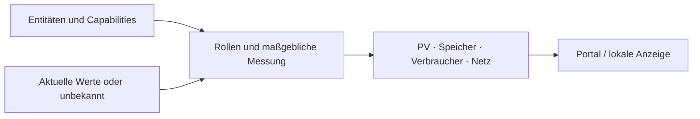

# Topologie-Lesemodell

Die gemeinsame Ableitung gruppiert Entitätsfähigkeiten zu PV, Speicher, Verbrauchern und Netz. API, Portal und Edge verwenden dafür die [gemeinsamen Testvektoren](topology-vectors.json).

## Rollen und Zuordnung

| Rolle | Aggregation | Richtung |
|---|---|---|
| `pv` | Summe zugeordneter Erzeugung | zur Anlage |
| `storage` | Summe Batterieleistung; maßgeblicher SoC | positiv laden: von Anlage; negativ entladen: zur Anlage |
| `consumer` | Summe zugeordneter Last | von Anlage |
| `grid` | Maßgeblicher Netzwert, **keine Summe** | positiv Bezug: zur Anlage; negativ Einspeisung: von Anlage |

`pv_power_kw → pv`, `battery_power_kw`/`soc_pct → storage`. `power_kw` folgt der Kategorie: Speicher → `storage`, Erzeuger → `pv`, Verbraucher → `consumer`, Zähler → `grid`. Sonstige Informationskanäle erhalten nicht automatisch eine Flussrolle. Ein Hybrid kann mehrere Rollen beitragen.

`primary` wählt maßgeblichen Netzwert beziehungsweise SoC. Ohne explizite Auswahl gilt der vorgesehene erste Kandidat. PV und Verbraucher summieren ihre Mitglieder.

## Form und Unbekannt

Eingabe: Entitäten mit Typ, Kategorie, Gesundheit und Fähigkeiten (`channel`, aufgelöste `role`, `primary`, `value`). Unbekannte Eingabewerte bleiben unbekannt.

Ausgabe: `schema_version: "1.0"`, `nodes` in Reihenfolge PV, Speicher, Verbraucher, Netz. Knoten enthalten Rolle, Mitglieder, gegebenenfalls `value_kw`, `soc_pct`, Flussrichtung und `flow_active`.

- Nur vorhandene Rollen erscheinen.
- Anzeigebetrag ist nicht negativ; Mitglieder behalten ihre vorzeichenbehafteten Beiträge.
- kW werden auf drei Dezimalstellen gerundet. Totband: 0,05 kW.
- Unbekannte optionale Werte werden ausgelassen, nicht durch Null ersetzt. `soc_pct` ist kein zusätzlicher Leistungsbeitrag.

Die exakte Serialisierung und Sonderfälle stehen in den Vektoren und Ableitungen, nicht in einem zweiten parallel gepflegten JSON-Beispiel.

## Schnittstellen

- `GET /api/v1/sites/{siteId}/topology`: Entitäten und abgeleitete Topologie, mandantengebunden.
- Edge-`/api/state` beziehungsweise `/api/stream`: lokale Topologie zusätzlich zu kompatiblen skalaren Feldern.
- `PUT /api/v1/admin/sites/{siteId}/topology-roles`: Rollen-/Primary-Overrides in `entity_role_assignment`.

Lokale Standardableitung und Cloud-Overrides nicht gleichsetzen. Quellen: Go-`internal/topology`, Portal-`topology.ts`, API-`TopologyDeriver`.

## Eigene Batterie ausdrücklich zuordnen

Selbstbau-Typen (`modbus-generic`, `modbus-load`, `user-defined-battery`) erhalten **keine automatische Rolle**, auch nicht durch einen passenden Kanalnamen.

| `binding.mode` | Wirkung |
|---|---|
| `unbound` | eigene Messwerte außerhalb der Energiebilanz |
| `feeds_inverter` | SoC und BMS-Grenzen für `inverter_entity_id`; Leistung weiterhin vom Wechselrichter |
| `standalone` | SoC, Grenzen und eigene Leistung als Speicher |

Die Cloud speichert Rollen je Kanal mit `is_primary` und überträgt sie als `role_assignment`. `soc_source` benennt den tatsächlichen SoC-Lieferanten, auch bei Ersatz durch einen anderen Kandidaten. `limits` kommen aus genau einer ausgewählten Quelle. Stromgrenzen und Freigaben werden nie als kW-Mitglieder summiert; unbekannte Felder bleiben abwesend.
