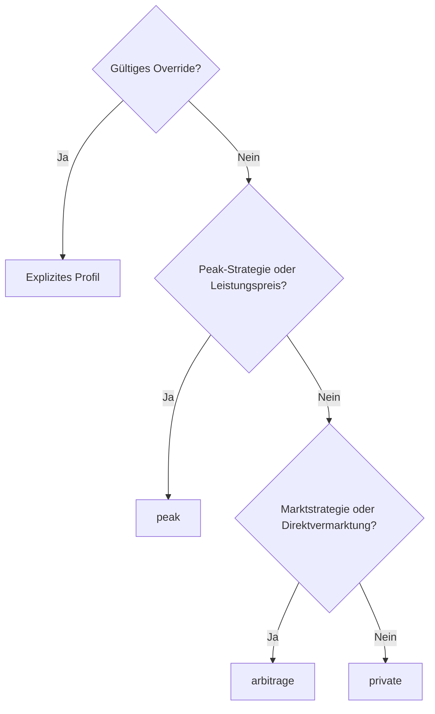

# Nutzungsprofil

Das Nutzungsprofil gewichtet fachliche Schwerpunkte einer Anlage. Es ist eine Ableitung aus Strategien und Stammdaten mit optionaler Übersteuerung; die aktuelle Portalnavigation folgt zusätzlich ihrem eigenen [Bedienmodell](../../portal.md).

## Ableitung

| Profil | money | peak | flow | devices |
|---|---|---|---|---|
| `arbitrage` | prominent | hidden | secondary | secondary |
| `peak` | secondary | prominent | secondary | secondary |
| `private` | minimal | hidden | prominent | prominent |

Eingaben: vorhandene Entitäten/Fähigkeiten, aktive Strategieknoten, `plant_kind`, Leistungspreis und `usage_profile_override`. Ein unbekannter Standort fällt auf `private` zurück. Der Profilname allein aktiviert keinen Geräte-Schreibpfad.

## Governance und Starter

Katalogknoten mit `gated` können im Entwurf stehen, verlangen aber passende anlagenbezogene Freigabe vor Aktivierung. Maßgeblich sind Katalog und `flow_gated_node_enablement`; die Freigabe eines Knotentyps ist keine automatische physische Gerätefreigabe.

Starterflows werden idempotent als Entwurf angelegt, wenn die Voraussetzungen erfüllt sind und noch kein Flow vorhanden ist. Arbitrage verwendet den Marktstarter, Peak den Peakstarter. `private` benötigt keinen eigenständigen Selbstverbrauchs-Strategieknoten und liefert `no_template`.

Die früheren Hinweise, Peak-Kompilierung sei generell noch ungebaut, sind überholt. Welche Knoten tatsächlich ausführbar sind, bestimmen aktueller Katalog, Compiler und Aktivierungsprüfung.

## HTTP und gemeinsame Vektoren

| Schnittstelle | Aufgabe |
|---|---|
| `GET /api/v1/sites/{siteId}/profile` | Effektives/abgeleitetes Profil, Override, Gewichtung und Signale |
| `PUT /api/v1/sites/{siteId}/profile` | Override `arbitrage`, `peak` oder `null` setzen |
| Admin `flow-node-governance` | Knotenfreigaben je Anlage lesen/setzen |
| Admin `flows/auto-start` | Passenden Starterentwurf anlegen |

`private` ist der abgeleitete Default, kein zulässiges explizites Override. `null` stellt Ableitung wieder her. Kundenpfade bleiben RLS-gebunden.

`UsageProfileDeriver` und `usageProfile.ts` verwenden [usage-profile-vectors.json](usage-profile-vectors.json). Ableitungsänderungen müssen Implementierungen und Vektoren gemeinsam aktualisieren.
