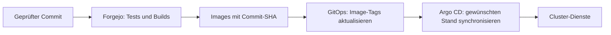
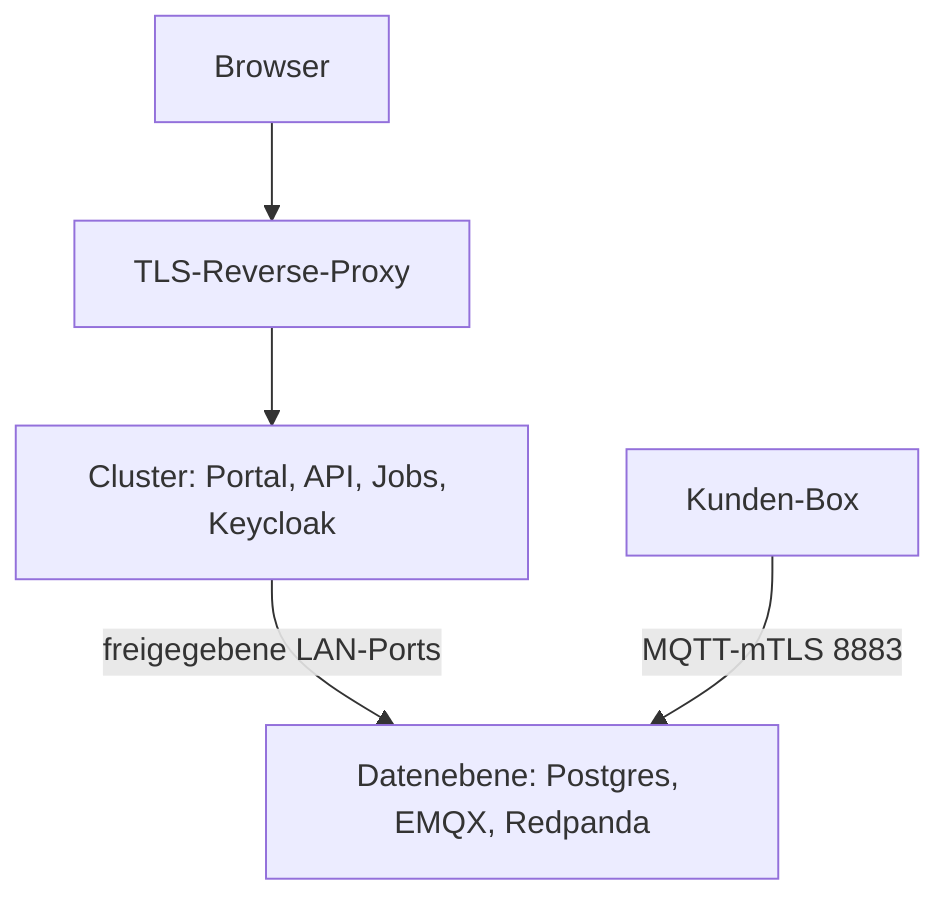

# Cloud deployen

Der im Repository implementierte Releaseweg ist **Forgejo → Registry → GitOps → Argo CD**. Die separate [Compose-Anleitung](deploy-compose.md) gilt für einen bewusst eigenständigen VM-Betrieb; sie ist kein zusätzlicher Deployment-Schritt für den Cluster.

## Releaseweg



1. Den Workflow **Build & Deploy** auslösen. Er führt Tests aus und baut die Cloud-Images. **Build & Deploy (fast)** überspringt Tests und setzt bereits erfolgte Prüfung voraus.
2. Den Job `gitops-tag-bump` prüfen: Er aktualisiert `apps/voltpilot/overlays/prod/kustomization.yaml` im separaten Repository `mamotec/gitops` auf den gebauten Commit-SHA.
3. Den gewünschten Stand in Argo CD synchronisieren und Rollout/Readiness prüfen. Die aktuelle Sync-Policy und Cluster-Manifeste sind im GitOps-Repository maßgeblich; ein erfolgreicher Image-Build belegt noch keinen Rollout. **Zwei Eigenschaften der Produktions-Application gehören dazu:** sie läuft auf Auto-Sync — ein gemergter Commit rollt selbsttätig aus —, und die Dienste tragen Sync-Wellen (`api` Welle 0, `timescale-writer`/`ingest`/`frontend` Welle 1). **Wellen ordnen die Aktualisierung, sie halten keine alten Pods an:** wer alten Code sicher aus dem Weg haben muss, setzt Replikas auf null und belegt den Nullstand.
4. Nach dem Rollout Anmeldung, aktuelle Telemetrie, Preisabdeckung und Fahrplanalter prüfen.

Quellen: [Workflow](../.forgejo/workflows/deploy.yaml), [Fast-Workflow](../.forgejo/workflows/deploy-fast.yaml), [Tag-Bump-Werkzeug](../tools/deploy/gitops-image-bump.sh).

## CI-Zugangsdaten

| Secret | Zweck |
|---|---|
| `FORGEJO_USERNAME`, `FORGEJO_PASSWORD` | Registry |
| `DOMAIN` | Öffentliche Portal-/Auth-Adresse für den Build |
| `GITOPS_PUSH_TOKEN` | Schreibzugriff auf das GitOps-Repository |
| `GITOPS_PUSH_USER` | Optionaler Benutzername für den GitOps-Push |

Ohne `GITOPS_PUSH_TOKEN` wird der Bump ausdrücklich übersprungen; der Build kann trotzdem grün sein. Der Workflow deployt nicht per SSH auf eine VM. Cloud und Edge haben getrennte Releasewege: [Edge-Signaturen](ota-signing.md).

## Datenebene und Cluster



Die Produktions-Compose-Datei unterstützt eine getrennte Datenebene mit `DATA_PLANE=enabled` und verpflichtendem `DATA_PLANE_HOST`. Das aktiviert das [LAN-Overlay](../infra/prod/dataplane/enabled.yml).

| Host-Port, Standard | Zweck |
|---|---|
| 5432 | TimescaleDB |
| 5433 | Eigene Keycloak-Datenbank |
| 1883 | Interner MQTT-Verkehr |
| 18083 | EMQX-Verwaltung / Authz-Reload |
| 29092 | Redpanda-EXTERNAL-Listener; intern Containerport 29093 |

Die Bindung muss an die tatsächliche LAN-Adresse erfolgen. Firewallzugriff auf die vorgesehenen Cluster-Nodes begrenzen. Kafka-Clients brauchen auch die annoncierte Adresse; bei abweichendem DNS `DATA_PLANE_ADVERTISED_HOST` prüfen. `ExternalName` setzt keine Portnummer um: Keycloak benötigt den passenden Datenbankport.

Auf einer reinen Daten-VM ausschließlich die benötigten Datendienste verwalten. **Kein ungezieltes `compose up` des gesamten Stacks:** sonst können API/Jobs und insbesondere ein zweiter Optimierer neben dem Cluster starten.

## Datenbank und Wiederherstellung

- Produktion verwendet standardmäßig ein leeres `SPRING_PROFILES_ACTIVE`. `local` ergänzt Demomigrationen.
- Angewandte Migrationen unverändert lassen. `out-of-order: true` erlaubt später eintreffende Versionen; nicht umnummerieren.
- Selbstheilende Prüfsummenkorrektur ersetzt keine SQL-Migration. Unerwartete Flyway-Warnungen untersuchen. [Migrationen](api.md#schema-und-migrationen).
- **Die Grenze der Selbstheilung:** `SelfHealingFlywayMigrationStrategy` ruft nach einer gescheiterten Validierung `repair()` auf. Startet damit ein **älterer** Build gegen ein neueres Schema, markiert Flyway jede ihm unbekannte angewandte Migration in `flyway_schema_history` als `type='DELETE'` — die Tabellen bleiben, aber der neue Build sieht diese Versionen danach als `PENDING`, migriert sie erneut und **bricht beim Start ab** (`relation … already exists`, Exit 1). Ein einziger alter Fehlstart nach einer Migration legt also den neuen Betrieb lahm. Der Schutz ist der belegte Nullstand vor der Migration, nicht die Selbstheilung.
- Rücknahme eines App-Releases: vorherigen geprüften Image-Stand im GitOps wiederherstellen und synchronisieren. Das setzt die Datenbank nicht zurück. **Das trägt nur bei additiven Migrationen** (Expand-Contract). Hat das Release eine Spalte umbenannt, eine Spalte oder einen Primärschlüssel fallen lassen, ist ein Image-Revert **kein** Rückweg: er stellt den alten Code auf das neue Schema. Dann gilt die Reihenfolge api und Writer auf null und belegt null → Wiederherstellung auf den Punkt → Gegenprobe → erst dann alte Images.
- Vor zustandsverändernden Wartungsarbeiten eine zur Umgebung passende, getestete Wiederherstellung für Datenbank, CA, ACL und Konfiguration bereithalten.
- Die erste UEMS-Produktfreigabe ist die benannte Ausnahme mit Wartungsfenster und Wiederherstellungspunkt; ihr wörtlicher Ablauf steht im [Rollout-Drehbuch](rollout/uems-erste-freigabe.md). Danach gilt Expand-Contract wirklich — bewacht von `MigrationHygieneTest`: eine neue Migration mit `RENAME COLUMN`, `DROP COLUMN` oder `DROP CONSTRAINT …_pkey` braucht den Marker `-- freigabe: fenster`, mit dem sie ausdrücklich ein Wartungsfenster anmeldet.

## Kundenbereich löschen (Vertragsende)

**Regel BT5 (UEMS AP-20, gilt ab sofort, auch auf `main`):** kein Löschen eines Kundenbereichs ohne schriftlichen Auftrag des Kunden und angebotene Mitnahme seiner Daten. Den Auftrag legt der Betreiber zu den Vertragsunterlagen; keine Route prüft ihn — er ist die Hand des Betreibers. Es wird nicht anonymisiert: nach Vertragsende, Mitnahme und Frist wird gelöscht (E10 = A, BT4).

1. **Beenden:** `POST /api/v1/admin/tenants/{id}/beenden` mit Auftrag, Begründung, Name eintippen und Frist in Tagen (Startwert 90; die geltende steht im Vertrag). Danach schreibt niemand mehr in den Bereich, nur der Kundenadministrator liest. Innerhalb der Frist nimmt `…/wiederaufnehmen` ihn zurück — derselbe Bereich, kein neuer.
2. **Mitnahme anbieten:** der Kundenadministrator lädt den Gesamtabzug (`GET /api/v1/unternehmen/abzug`; im Portal im Hinweis „beendet“ und unter „Unternehmen › Einstellungen“). Jeder abgeschlossene Abruf steht mit Prüfsumme im Protokoll `kundenbereich_abzug`.
3. **Nach der Frist löschen:** `POST /api/v1/admin/tenants/{id}/delete` (Name eintippen). Vorher antwortet die Route `409 kundenbereich_nicht_beendet` bzw. `409 frist_laeuft` mit `loeschung_fruehestens` — bevor ein Konto gesperrt wird.
4. **Der Löschnachweis bleibt:** `mandant_loeschnachweis`, Kennzeichen `LN-JJJJ-nnnn`, auch im Bericht der Route unter `loeschnachweis`: Kennung des Bereichs, beendet am, Frist, gelöscht am und von wem (Betrieb), Zeilen je Tabelle, `verblieben` und die Prüfsumme des letzten Gesamtabzugs — ohne Namen, Konten oder Auftragstexte des Kunden. Niemand ändert oder löscht ihn; nur die Admin-Rolle der Datenbank liest ihn.

- **`verblieben` ist leer:** die append-only-Protokolle ohne Fremdschlüssel (`ort_aenderung`, `messstelle_aenderung`, `data_source_aenderung`, `component_change_event`, `device_site_assignment`) tragen Firmen- und Personennamen und gehen im Löschzug nach der Mandantenzeile mit. Ihr Trigger lässt ein Löschen nur zu, wenn die Mandantenzeile nicht mehr existiert — während der Vertragslaufzeit, auch „beendet“, ändert oder löscht sie niemand (`V20260925234500`). Nennt ein Nachweis trotzdem eine Tabelle, ist das ein Befund. Zeilen früher gelöschter Mandanten (vor dieser Regel) liegen noch und sind jetzt löschbar; das ist ein eigener, bewusster Handgriff des Betreibers, kein Teil des Löschwegs.
- **Sicherungen** ([Backup-Runbook](backup-restore.md)) enthalten den Bereich weiter, bis sie nach ihrer eigenen Aufbewahrung wegfallen; der Löschweg erreicht sie nicht.
- `POST …/offboarding/cleanup` löscht nur übrige Keycloak-Konten eines schon gelöschten Bereichs und verweigert, solange der Bereich existiert.

## Betrieb prüfen

[Kubernetes-Betriebsvertrag](k8s-readiness.md): Probes, Singleton-Grenzen, Shutdown und Metriken. [MQTT-Sicherheit](security-mqtt.md): Zertifikate, ACL-Mounts und Reload.

Keycloak übernimmt Realm-Änderungen nur in einen neuen Realm (`--import-realm`); den laufenden Realm `voltpilot` stellt der Betreiber von Hand um. Die Anmelde-Härtung (Ereignisse, Passwort-Vorgabe, zweiter Faktor für `platform-admin`; UEMS AP-20 E12) hat dafür ein Prüfskript und eine Bestätigung mit Datum: [Live-Realm = Import](../infra/prod/keycloak/live-realm-import.md).

```bash
bash tools/deploy/test-gitops-image-bump.sh
bash tools/deploy/test-gitops-bump-workflow.sh
```

Diese Selbstchecks testen den Deployment-Code offline. Sie prüfen keinen Live-Cluster.

## Backup der Datenebene

`DB_BACKUP=enabled` und `DB_BACKUP_DIR` aktivieren das Backup-Overlay in `infra/prod/backup/`: physische TimescaleDB-Sicherung mit WAL-Archiv sowie täglicher Keycloak-DB-Dump. Einrichtung und Wiederherstellung: [Backup-Runbook](backup-restore.md). Der isolierte Nachweis steht in `tools/backup/test-backup-restore.sh`.
