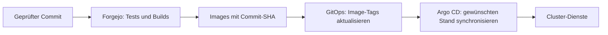
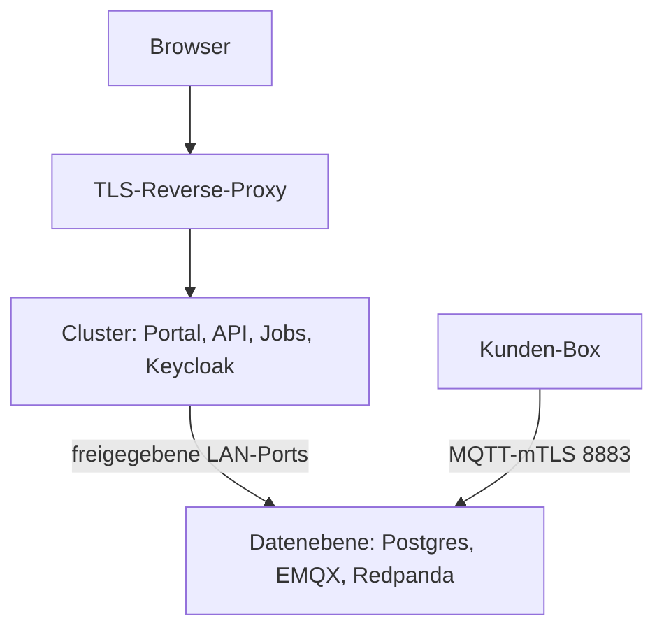

# Cloud deployen

Der im Repository implementierte Releaseweg ist **Forgejo → Registry → GitOps → Argo CD**. Die separate [Compose-Anleitung](deploy-compose.md) gilt für einen bewusst eigenständigen VM-Betrieb; sie ist kein zusätzlicher Deployment-Schritt für den Cluster.

## Releaseweg



1. Den Workflow **Build & Deploy** auslösen. Er führt Tests aus und baut die Cloud-Images. **Build & Deploy (fast)** überspringt Tests und setzt bereits erfolgte Prüfung voraus.
2. Den Job `gitops-tag-bump` prüfen: Er aktualisiert `apps/voltpilot/overlays/prod/kustomization.yaml` im separaten Repository `mamotec/gitops` auf den gebauten Commit-SHA.
3. Den gewünschten Stand in Argo CD synchronisieren und Rollout/Readiness prüfen. Die aktuelle Sync-Policy und Cluster-Manifeste sind im GitOps-Repository maßgeblich; ein erfolgreicher Image-Build belegt noch keinen Rollout.
4. Nach dem Rollout Anmeldung, aktuelle Telemetrie, Preisabdeckung und Fahrplanalter prüfen.

Quellen: [Workflow](../.forgejo/workflows/deploy.yaml), [Fast-Workflow](../.forgejo/workflows/deploy-fast.yaml), [Tag-Bump-Werkzeug](../tools/deploy/gitops-image-bump.sh).

## CI-Zugangsdaten

| Secret | Zweck |
|---|---|
| `FORGEJO_USERNAME`, `FORGEJO_PASSWORD` | Registry |
| `DOMAIN` | Öffentliche Portal-/Auth-Adresse für den Build |
| `GITOPS_PUSH_TOKEN` | Schreibzugriff auf das GitOps-Repository |
| `GITOPS_PUSH_USER` | Optionaler Benutzername für den GitOps-Push |

Ohne `GITOPS_PUSH_TOKEN` wird der Bump ausdrücklich übersprungen; der Build kann trotzdem grün sein. Der Workflow deployt nicht per SSH auf eine VM. Cloud und Edge haben getrennte Releasewege: [Edge-Signaturen](ota-signing.md).

## Datenebene und Cluster



Die Produktions-Compose-Datei unterstützt eine getrennte Datenebene mit `DATA_PLANE=enabled` und verpflichtendem `DATA_PLANE_HOST`. Das aktiviert das [LAN-Overlay](../infra/prod/dataplane/enabled.yml).

| Host-Port, Standard | Zweck |
|---|---|
| 5432 | TimescaleDB |
| 5433 | Eigene Keycloak-Datenbank |
| 1883 | Interner MQTT-Verkehr |
| 18083 | EMQX-Verwaltung / Authz-Reload |
| 29092 | Redpanda-EXTERNAL-Listener; intern Containerport 29093 |

Die Bindung muss an die tatsächliche LAN-Adresse erfolgen. Firewallzugriff auf die vorgesehenen Cluster-Nodes begrenzen. Kafka-Clients brauchen auch die annoncierte Adresse; bei abweichendem DNS `DATA_PLANE_ADVERTISED_HOST` prüfen. `ExternalName` setzt keine Portnummer um: Keycloak benötigt den passenden Datenbankport.

Auf einer reinen Daten-VM ausschließlich die benötigten Datendienste verwalten. **Kein ungezieltes `compose up` des gesamten Stacks:** sonst können API/Jobs und insbesondere ein zweiter Optimierer neben dem Cluster starten.

## Datenbank und Wiederherstellung

- Produktion verwendet standardmäßig ein leeres `SPRING_PROFILES_ACTIVE`. `local` ergänzt Demomigrationen.
- Angewandte Migrationen unverändert lassen. `out-of-order: true` erlaubt später eintreffende Versionen; nicht umnummerieren.
- Selbstheilende Prüfsummenkorrektur ersetzt keine SQL-Migration. Unerwartete Flyway-Warnungen untersuchen. [Migrationen](api.md#schema-und-migrationen).
- Rücknahme eines App-Releases: vorherigen geprüften Image-Stand im GitOps wiederherstellen und synchronisieren. Das setzt die Datenbank nicht zurück; Expand-Contract-Kompatibilität beachten.
- Vor zustandsverändernden Wartungsarbeiten eine zur Umgebung passende, getestete Wiederherstellung für Datenbank, CA, ACL und Konfiguration bereithalten.

## Betrieb prüfen

[Kubernetes-Betriebsvertrag](k8s-readiness.md): Probes, Singleton-Grenzen, Shutdown und Metriken. [MQTT-Sicherheit](security-mqtt.md): Zertifikate, ACL-Mounts und Reload.

```bash
bash tools/deploy/test-gitops-image-bump.sh
bash tools/deploy/test-gitops-bump-workflow.sh
```

Diese Selbstchecks testen den Deployment-Code offline. Sie prüfen keinen Live-Cluster.

## Backup der Datenebene

`DB_BACKUP=enabled` und `DB_BACKUP_DIR` aktivieren das Backup-Overlay in `infra/prod/backup/`: physische TimescaleDB-Sicherung mit WAL-Archiv sowie täglicher Keycloak-DB-Dump. Einrichtung und Wiederherstellung: [Backup-Runbook](backup-restore.md). Der isolierte Nachweis steht in `tools/backup/test-backup-restore.sh`.
