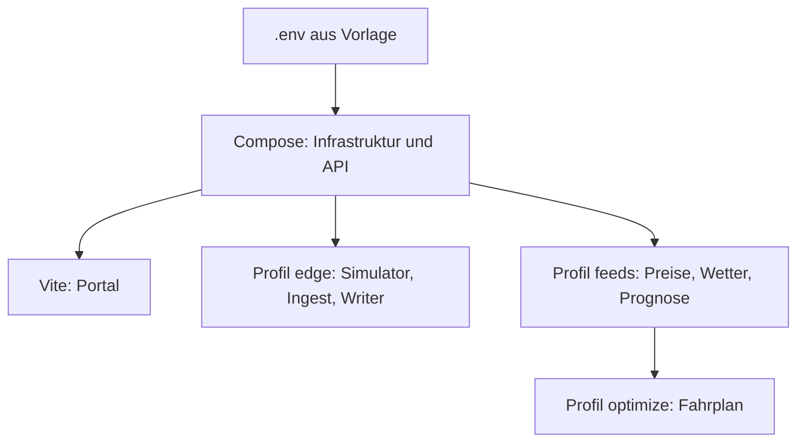

# Lokal entwickeln

Der lokale Stack enthält Infrastruktur und API. Profile ergänzen Simulator, Datenfeeds und Optimierung; die installierbare Kunden-Box läuft separat.

## Voraussetzungen

Docker mit Compose v2 und Node.js 22. Für Builds außerhalb der Container: Java 21, Python ab 3.10 und Go gemäß `edge-app/core/go.mod`. Verbindliche Versionen stehen in den jeweiligen Build-Manifesten.



## Start

Im Repository-Wurzelverzeichnis:

```bash
cp .env.example .env  # einmalig; bestehende Datei nicht überschreiben
docker compose --profile edge --profile feeds --profile optimize up -d --build
docker compose --profile edge --profile feeds --profile optimize ps
```

Für API und Demodaten genügt `docker compose up -d --build`. Das Profil `edge` startet den Testpfad unter `edge/`; die [Kunden-Box](../edge-app/README.md) ist ein eigener Stack.

```bash
cd frontend/portal
npm install
npm run dev
```

Portal: <http://localhost:5173>. `demo`/`demo` und `demo2`/`demo2` gehören zu verschiedenen Mandanten; `admin`/`admin` öffnet die Plattformverwaltung. Die lokale Realm-Vorlage und das Spring-Profil `local` liefern die Demo-Grundlage.

## Adressen

| Dienst | Standard am Host |
|---|---|
| API / Ingest / Writer | 8090 / 8091 / 8092 |
| Postgres | 5432 |
| Keycloak | 8081 |
| MQTT / TLS / WebSocket | 1883 / 8883 / 8083 |
| EMQX-Verwaltung | 18083 |
| Redpanda / Console | 9092 / 8080 |
| Node-RED / SunSpec-Simulator im Profil `edge` | 1880 / 15020 |

Portkonflikte über `.env` lösen, beispielsweise `API_PORT`. Danach die Portal-Adresse `VITE_API_BASE` entsprechend setzen. Container verwenden die internen Adressen, insbesondere `redpanda:29092`, nicht `localhost:9092`.

## Datenbank und Anmeldung

- Init-SQL unter `infra/local/timescale/` läuft nur auf einem leeren Volume. Die API führt anschließend die aktuellen Flyway-Migrationen aus; Versionsnummern nicht manuell umsortieren.
- Bei fehlenden Tabellen zuerst API-/Flyway-Logs und Migrationsstand prüfen. Ein Volume-Neustart ist keine reguläre Aktualisierungsmethode.
- Keycloak überschreibt beim Import keinen vorhandenen Realm. Geänderte Realm-Einstellungen auf Bestandsinstanzen gezielt übernehmen.
- `KC_HOSTNAME` und `OIDC_ISSUER_URI` müssen zur Browser-Adresse passen. `OIDC_JWK_SET_URI` muss für die API erreichbar sein.
- LAN-Zugriff benötigt außerdem passende Redirect-URIs, Web-Origins, CORS und `VITE_*`-Werte. Beispiel-IP-Adressen nicht als feste Infrastruktur behandeln.

## Prüfen

```bash
curl -fsS http://localhost:8090/health
curl -s -o /dev/null -w '%{http_code}\n' http://localhost:8090/api/v1/sites
# Ohne Anmeldung: 401.
docker compose logs --tail=80 api
```

Nach Login sollen beide Demobenutzer ausschließlich ihre eigenen Anlagen sehen. Mit `edge` müssen frische Messwerte eintreffen. Preise und Fahrpläne benötigen erfolgreiche Collector-/Optimizer-Läufe; ein gesunder Prozess allein belegt keine aktuellen Daten.

## Tests und Builds

Befehle im jeweils genannten Verzeichnis ausführen:

| Bereich | Befehl |
|---|---|
| `services/api`, `services/ingest`, `services/timescale-writer` | `./mvnw test` |
| Python-Service | virtuelle Umgebung, `pip install -e '.[dev]'`, danach `pytest` |
| Optimierung | zusätzlich `pip install -e '.[dev,solver]' -e ../forecast`; `pytest -m 'not slow'` entspricht dem CI-Kurzlauf |
| Forecast mit ML | `pip install -e '.[dev,ml]'` |
| `frontend/portal` | `npm run typecheck`, `npm test`, `npm run build` |
| `edge-app/core` | `go test ./...` |
| `edge-app` | `node --test nodered/*.test.js nodered/deye/*.test.js` |

Testcontainers-Tests können ohne Docker übersprungen werden; das ist kein bestandener Integrationstest. Weitere Prüfstände stehen in den jeweiligen READMEs. Die [Portal-Hilfe](../frontend/portal/src/help/README.md) hat eigene Screenshot- und Browserprüfungen.

## Stoppen

```bash
docker compose --profile edge --profile feeds --profile optimize down
```

Volumes bleiben erhalten. `down -v` löscht die lokalen Daten und ist nur für einen bewusst gewählten vollständigen Reset geeignet.
