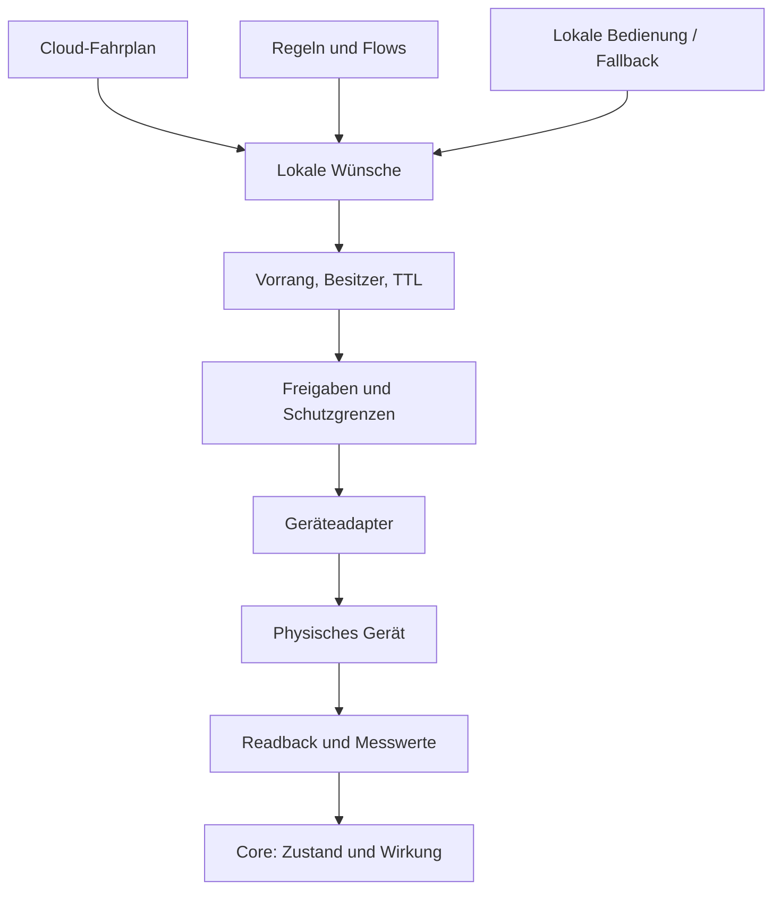

# Edge-Laufzeit

Der Go-Core hält Identität, Cloud-Verbindung, Puffer und Steuerungsverantwortung. Node-RED übernimmt Geräte-I/O; der OTA-Updater tauscht signierte Softwarestände aus.

## Ausführung

Nicht jede Quelle darf jede Priorität beanspruchen. Der normale Entitätsflow schreibt keine Register am Arbiter vorbei. Explizite generische Modbus-Knoten sind die gesonderte [Governance-Ausnahme](contracts/v2/flow-graph.md#katalogausnahmen), kein automatisch zertifizierter Steuerpfad. Verbindliche Reihenfolge und Ausnahmen stehen in [Arbitration](contracts/v2/edge-desired-arbitration.md) und [Ausführungsverantwortung](contracts/v2/plan-execution-ownership.md).

## Messwerte

Die Standortbilanz wird in dieser Reihenfolge gebildet: frische PV-Quellen addieren, frischen Standort-Netzzähler gegenüber dem primären Wechselrichter bevorzugen, gemessene Batterieleistung übernehmen und Hauslast ableiten:

`Hauslast = PV + Netzbezug − Batterieladung`

Die Vorzeichen folgen dem lokalen Vertrag. Der primäre Netzwert wird standardmäßig als Standortbilanz verwendet; `PrimaryGridNotSiteTotal` ist der ausdrückliche Ausweg bei anders platziertem CT.

- Batterie wird gemessen, nicht aus der Bilanz als Messwert rekonstruiert.
- Ein nachweislich batterieloses Modell erlaubt Batterie = 0. Bei einem Hybrid ohne Batteriemessung bleibt die abgeleitete Hauslast unbekannt.
- Unbekannte Gerätekategorien und fehlende Standortbilanz verwenden den vorhandenen, gerätespezifischen Rohlastpfad; keine pauschale Ersatzformel ergänzen.
- Quellwechsel und veraltete Messungen müssen im Zustand nachvollziehbar bleiben. Eine Komponente behält Kennung und Historie bei Aliasänderung.

Quellen: `agent.onLocalTelemetry`, `sources.BalanceSettings`, `inverter.FamilyHasBattery` im [Core](../edge-app/core/internal/).

## Schutzgrenzen

Die konkrete Kette steht unter `internal/guards`. Sie berücksichtigt Nennleistung, SoC, Netzgrenzen sowie aktivierte Betriebsregeln. Solar-only-Laden wird an der **gemessenen PV-Leistung** begrenzt; fehlende PV erlaubt dabei keine Ladung. Die Hauslast darf im PV-Bus-Modell gleichzeitig aus dem Netz versorgt werden.

Weitere lokale Funktionen sind Lastnachführung, PV-Überschussaufnahme, Einspeisebegrenzung, Zyklenschutz, oberer PV-Puffer und native Selbstregelung. Ihre Wirkung ist nicht pauschal „nur weniger Sollwert“: einzelne Funktionen dürfen innerhalb der Schutzgrenzen einen Bedarf erhöhen. Sie brauchen ihre eigenen Voraussetzungen und Tests.

Die messwertgeführten Korrekturen (Trim, Überschuss-Speichern/-Aufnahme, Lastnachführung, Defizitdeckung) laufen hinter dem **gedämpften Folger** (`guards/followdamper.go`): Sie sehen ein neues Messpaar Netz/Batterie erst, wenn beide Hälften nach dem letzten Schreibbefehl plus Einschwingzeit gemessen wurden; die teure Seite (Laden aus dem Netz, Entladen ins Netz) wird sofort verlassen, die billige in Rampen mit Reserve angefahren. Einschwingzeit und Messtakt stehen je Gerätefamilie im Profil (Deye gemessen: 15 s / 25 s, sonst diese Vorgabe). Ohne gewähltes Gerät und auf Dauerspeicher-Hebeln (Deye-ToU) ist er aus. Schutzgrenzen klemmen den gedämpften Wert weiterhin in jedem Takt mit der Live-Messung.

**Absicht + Fenster** (`guards/intent.go`, K4b): die Box übersetzt die Flaggen eines Slots in eine Absicht mit Leistungsfenster und lässt ein offenes Fenster das Gerät selbst regeln, sobald Layer 1 für genau diese Absicht einen zertifizierten Hebel meldet und ihn im Rücklesen belegt; sonst regelt sie gedämpft wie oben. Umgeschaltet wird nur an Slotgrenzen. Vertrag, Aufsicht und Schreibbudget: [Wer führt den Fahrplan aus?](contracts/v2/plan-execution-ownership.md#absicht--fenster-k4b-24092026). Simulatorbelege ersetzen keinen Hardware-Prüfstand; freigegeben für echte Geräte ist weiterhin nur die Entladeseite des Deye-Piloten.

**Steuerprofile** (`catalog/control-profiles`, K7): je Gerätefamilie beschreibt ein Profil Hebel, Schreibfolge, Beleg, Rückfall, Totmann, Schreibbudget und Dämpfung je Absicht, mit Quellen und Sicherheit A–D – Wissen, keine Freigabe. Die Box liest daraus nur Einschwingzeit/Messtakt des gedämpften Folgers und das Tagesbudget eines Dauerspeicher-Hebels (`internal/controlprofile`, eingebettet); Schreibfolgen bleiben Code im Adapter, `edge-app/nodered/control-profiles.test.js` hält beide zusammen. Freigegeben wird weiter je Modell + Firmware + Prüfnachweis über das Zertifikat.

**Mehrere Wechselrichter an einem Netzpunkt** (`guards/leader.go`, `guards/exportcascade.go`, K6): Führungsgerät ist die eine steuerbare Speicher-Auswahl der Box; selbst regeln darf sie nur mit Zähler **am Netzpunkt** (Pflichtangabe der Einrichtung, bei vorhandenem Netz-Zähler nachgemessen) und ohne einen weiteren, selbst regelnden Speicher am selben Zähler. Reine PV-Wechselrichter bleiben Stellglieder von Einspeisewächter und Abregelung. Der Einspeisewächter ist der Außenkreis einer Kaskade: er greift erst, wenn der Speicher nichts mehr aufnimmt; im Negativpreis-Slot regelt er die PV auf Einspeisung 0. Einzelheiten: [Wer führt den Fahrplan aus?](contracts/v2/plan-execution-ownership.md#mehrere-wechselrichter-an-einem-netzpunkt-k6-24092026).

### Rückhalt der Einspeisegrenze bei Box-Ausfall (K6)

Eine Einspeisegrenze hält der Einspeisewächter nur, solange die Box lebt. Was danach geschieht, entscheidet der Totmann jedes Geräts (Konzept `vp-wechselrichter-eigenregelung-k1` §6.4, `matrix.json`; A = Hersteller, B = an unserem Gerät gemessen, C = Feldquelle):

| Gerät | Totmann | nach Box-Ausfall | hält die Einspeisegrenze? |
|---|---|---|---|
| Deye mit Fernsteuer-Block (1100–1121) | 1101 = 60 s (B) | eigene Konfiguration (Work Mode, Energy Pattern, ToU) | nur die eigene Erzeugung, über 0x00E7 (EEPROM, von der Box nur gelesen) |
| Deye über ToU (EEPROM) | keiner | zuletzt geschriebener Zeitplan bleibt | wie oben |
| Fronius Eco/Symo/Tauro/Primo (Model 123) | `WMaxLimPct_RvrtTms` = 60 s (B) | volle Leistung | **nein** |
| Fronius GEN24 (Model 124) | keiner dokumentiert (A) | gesetzte Lade-/Entladegrenze bleibt | nur mit eigener dynamischer Leistungsreduzierung |
| SMA (41195, Vorgabe 600 s) | Rückfall-Fenster 44035/44037 (A) | Rückfall-Fenster | über den Home Manager (C) |
| SolarEdge (0xE00B) | Standardmodus 0xE00A (A) | Standardmodus | Export-Steuerblock, im Fernsteuermodus aus (A) |

Die Box schreibt keinen Rückhalt in ein Kundengerät (E5 A). Sie **warnt** im Einspeisewächter (`export_guard.backstop`, Karte „Einspeisegrenze“ auf `:8484`, Log), solange die Grenze nicht geräteseitig gedeckt ist. Gedeckt ist sie, wenn der Installateur auf der Einrichten-Seite „Hält die Anlage die Einspeisegrenze auch ohne Box? – Ja“ angibt, oder wenn die gelesene eigene Grenze des Führungsgeräts (Deye 0x00E7) höchstens 0,5 kW über der Einspeisegrenze liegt, sein Zähler am Netzpunkt sitzt und die weiteren Erzeuger zusammen (Nennleistung) die Grenze allein nicht überschreiten können.

**Empfehlung für den Installateur:**

1. Einen geräteseitigen Rückhalt einrichten, der den **ganzen** Netzpunkt sieht: z. B. die Fronius-eigene dynamische Leistungsreduzierung mit einem Fronius-Zähler am Einspeisepunkt (bei mehreren Fronius die Mehrgeräte-Variante des Herstellers), bei SMA über den Home Manager. Die eigene Grenze eines Hybrid-Wechselrichters reicht nur, wenn die übrigen Erzeuger die Grenze allein nicht überschreiten können.
2. Als Wert die gemeldete Einspeisegrenze einstellen. Die Box regelt auf Grenze − Reserve (2 %, mindestens 0,3 kW); der geräteseitige Rückhalt liegt damit über ihrem Ziel und greift nur, wenn die Box ausfällt – kein zweiter Regler im Normalbetrieb. Die Fronius-Priorität (E/A → dynamische Reduzierung → Modbus, `edge-app/nodered/FRONIUS.md`) lässt eine kleinere Box-Vorgabe weiter wirken.
3. Den Rückhalt auf der Einrichten-Seite als vorhanden angeben; die Warnung verschwindet.

Herzogau: 2 × Fronius Eco 27 (54 kWp) gegen 30 kW Grenze; der Deye hält mit 0x00E7 (gelesen 33,0 kW) nur seine eigene Erzeugung. Ohne Fronius-seitigen Rückhalt gilt nach einem Box-Ausfall nach 60 s keine Grenze mehr – am Gerät zu prüfen und einzurichten.

**Geführter Einmal-Test des Zählerorts** (ohne eigenen Netz-Zähler der Box kann sie ihn nicht nachmessen): Speicher auf Halten, eine bekannte Last (z. B. 2 kW) zuschalten und prüfen, dass der Netzbezug in der Anzeige des Wechselrichters und am Zähler des Hausanschlusses um denselben Betrag steigt; läuft eine weitere PV-Anlage, muss der Wechselrichter deren Einspeisung als Einspeisung zeigen. Erst dann „Am Netzpunkt“ angeben. Mit Netz-Zähler vergleicht die Box beide Zähler laufend (Median über 10 min, Toleranz 1 kW bzw. 10 %).

Bei Cloud-Ausfall gelten Frische-/Fallbackregeln pro Plan und Entität. Eine generelle Zusage „jeder Verbraucher läuft autonom weiter“ wäre falsch. Der [Deadline-Fallback](verbrauchssteuerung.md#offline-verhalten) startet nur bei belegtem Bedarf und zulässiger Ausführung.

## I/O und physische Freigabe

- Poll, Probe und Schreiben teilen den vorgesehenen Verbindungsmanager. Ein langsamer Poll darf keinen zweiten konkurrierenden Socket erzeugen.
- Palette-Knoten prüfen die Struktur. Routing entscheidet, ob ein Transport unterstützt wird, und meldet unverdrahtete Quellen sichtbar.
- Physische Geräteidentität, Connection und Registerziel getrennt erhalten. Eine Auswahl darf keine zweite Quelle erzeugen oder einen fremden Registerauftrag umlenken.
- Plattform-/Modellfreigabe, gerätespezifische Kalibrierung und Laufzeitflags zusammen auswerten. Steuerung muss auch wieder sauber freigegeben werden können.
- Deye-ToU benötigt bekannte Leistungsskalierung. Fronius-PV-Steuerung braucht die belegte Blockschreibfolge. [Deye](../edge-app/nodered/DEYE.md), [Fronius](../edge-app/nodered/FRONIUS.md), [Prüfstand](../edge-app/nodered/CONTROL-BENCH.md).
- Readback bewertet Semantik vor Zahlenvergleich: Füllwerte sind ungelesen, Watchdog-Zähler haben eigene Regeln, signed Register benötigen passende Toleranz. Eine fehlende Antwort ist kein abweichender Messwert.

## OCPP und lokale Netze

Die Box ist OCPP-Central-System auf `ws://<box>:8887/ocpp/<kennung>`. Nur registrierte Kennungen werden angenommen. `VP_OCPP_ENABLED` aktiviert den Server; die optimierte Verteilung benötigt zusätzlich `VP_CONTROL_ENABLED` und `VP_CONSUMER_CONTROL_ENABLED`.

Das Sicherheitsprofil der Säule bleibt bei Box-Ausfall wirksam. Protokollannahme und tatsächliches Laden werden separat erfasst; echte Modelle benötigen einen Prüfstandnachweis.

Web `8484`, Node-RED-Editor `1881` und OCPP `8887` gehören ins Kundennetz. Der lokale MQTT-Bus ist im Standard am Host nur über Loopback `1884` erreichbar. Für Cloud-Verbindung braucht die Box ausgehendes HTTPS und MQTT-mTLS, keine öffentliche Portweiterleitung.

## Prüfpunkte

- `go test ./...` im Core: Guards, Arbitration, Enrollment, Puffern, OCPP und OTA.
- Node-RED-Modul-/Palette-Tests: Routing, Protokolle, eingebettete Flows, Readback.
- `test/e2e-compose.sh`: vollständiger Simulatorpfad.
- `test/e2e-ocpp.sh`: OCPP-Protokoll, Budget und Ausfallverhalten.
- [OTA-Soak](../edge-app/test/ota-soak/README.md): unterbrochene Updates und Rücknahme.

Installationsregeln: [Edge-Deployment](../edge-app/DEPLOY.md). Signatur-/Updatepfad: [OTA](ota-autonomie.md).
