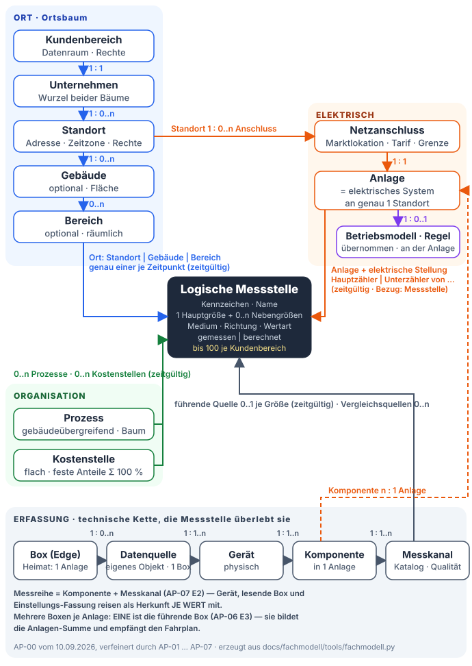

<!-- ERZEUGT von docs/fachmodell/tools/build_fachmodell.py aus fachmodell.py — nicht von Hand ändern. -->

# Fachmodell — Beziehungen, Kardinalität, Zeitgültigkeit

Die Beziehungsliste des Fachmodells. **Zeitgültig = ja** heißt: die Beziehung hat „gültig ab“ und „gültig bis“ und wird nie überschrieben, sondern beendet und neu begonnen — ein Bericht liest immer die Zuordnungen seines Zeitraums. **Zeitgültig = nein** heißt: eine Änderung ist ein NEUES Objekt.

Die Spalte **Herkunft** nennt „AP-00“, wo der Stand vom 10.09.2026 unverändert gilt, und sonst das Paket samt Entscheid, der die Zeile verfeinert oder (⚠ ERSETZT) ersetzt hat. Die zeitliche Auflösung einer Gültigkeit ist der TAG, wirksam 00:00 Uhr in der Zeitzone des Standorts (AP-02 E9); einzige Ausnahme ist die Quellenbindung einer Messstelle, die einen Zeitpunkt auf die Minute trägt (AP-04 E2).

| Von | Kardinalität | Nach | Zeitgültig | Bemerkung | Herkunft |
|---|---|---|---|---|---|
| Kundenbereich | 1 : 1 | Unternehmen | nein | erster Umfang; 1 : n für Konzerne vorbereitet (E2) | AP-00 E2 |
| Unternehmen | 1 : 0..n | Standort | nein | Standorte werden archiviert, nicht gelöscht — Löschen nur ohne jede Historie | AP-00 · AP-02 E1/E12 |
| Standort | 1 : 0..n | Gebäude | ja | Gebäudeebene optional (E3); Umordnen ist selten, aber möglich — alte Berichte bleiben; „gültig ab“ ist ein Tag, wirksam 00:00 Uhr in der Zeitzone des Standorts | AP-00 E3 · AP-02 E9 |
| Gebäude oder Standort | 1 : 0..n | Bereich | ja | räumlich, nicht verschachtelt (E4); optional — nur wo Messstellen feiner als das Gebäude verortet werden; beim Verschieben ziehen Bereiche mit, Messstellen bleiben an ihrem Knoten | AP-00 E4 · AP-02 E7/E11 |
| Standort | 1 : 0..n | Netzanschluss | ja | Anschluss kann hinzukommen oder wegfallen | AP-00 E6 |
| Netzanschluss | 1 : 1 | Anlage (elektrisches System) | ja | erster Umfang; gekoppelte Systeme mit 1..n Anschlüssen vorbereitet (E6) | AP-00 E6 |
| Standort | 1 : 0..n | Anlage | ja | Bestandsanlage wird ab Datum zugeordnet; Umzug ist die Ausnahme. Die Funktionen „Messen & Auswerten“ und „Steuern & Optimieren“ gelten JE STANDORT — jede Anlage nimmt einzeln teil | AP-00 · AP-01 E6 = C |
| Anlage | 1 : 0..n | Gebäude (versorgt) | ja | abgeleitet aus den Orten der Messstellen des Systems — keine Pflege von Hand | AP-00 |
| Anlage | 1 : 0..n | Box | ja | Heimat-Anlage der Box = Topic-Adresse (E7) | AP-00 E7 |
| Anlage | 1 : 0..1 | führende Box | ja | gespeicherter, sichtbarer Fakt — nie geraten: Vorgabe ist die Box des primären Speichers, sonst die einzige Box; bei zwei Boxen ohne Speicher wählt der Kundenadministrator sie ausdrücklich. Die führende Box bildet die Anlagen-Summe und empfängt den Fahrplan | AP-06 E3 (neu) |
| Box | 1 : 0..n | Datenquelle (zuständig) | ja | die Zuständigkeit hängt an der DATENQUELLE, nicht am Gerät und nicht an der Komponente: alle Geräte hinter einem Erfassungsweg liest dieselbe Box, ein Wechsel nimmt alle mit | AP-00 · AP-06 E2 |
| Datenquelle | 1 : 1..n | Gerät | nein | Gerätewechsel = neues Gerät. Die Datenquelle ist seit AP-06 ein EIGENES Objekt (Kennzeichen DQ-x, Anlage, Protokoll, Adresse, Netzlage, Lesetakt) — Komponenten verweisen additiv darauf | AP-00 · AP-06 E1 (neu) |
| Gerät | 1 : 1..n | Komponente | nein | ein Wechselrichter speist Erzeuger + Speicher; eine Energiekarte speist einen Zähler (E12). Identität einer Karte = (Gerät, Steckplatz) | AP-00 E12 · AP-05 E4 |
| Anlage | 1 : 0..n | Komponente | ja | Umzug einer Komponente in ein anderes System ist die Ausnahme | AP-00 |
| Komponente | 1 : 1..n | Messkanal | nein | aus dem Messpunkt-Katalog | AP-00 |
| Komponente + Messkanal | 1 : 1 | Messreihe | nein | ⚠ ERSETZT AP-00 §6.4 „die Reihe bleibt am Gerät geschlüsselt“: die Reihe ist an der KOMPONENTE geschlüsselt; Gerät samt Einbau, lesende Box, Einstellungs-Fassung und Katalogstand reisen als Herkunft JE WERT mit; eine Gerätegrenze ist ein Ereignis | AP-07 E2 (ersetzt, AP-07 W1) |
| Messstelle | 1 : 1 | Hauptgröße | nein | ⚠ ERSETZT AP-00 §4.2 „Messstelle 1 : 1 Messgröße“: die 1 : 1-Regel gilt für die HAUPTGRÖSSE — identitätsstiftend, nie änderbar | AP-04 E1 (ersetzt, AP-04 W1) |
| Messstelle | 1 : 0..n | Nebengröße | nein | desselben Messortes, jede mit eigener führender Quelle; Nebengrößen tragen nie Bilanz oder Bericht. Bei einer Energiekarte ist der Zählerstand die Hauptgröße, die Wirkleistung eine Nebengröße | AP-04 E1 (neu) · AP-05 E3 |
| Messkanal | 0..1 : 0..1 | Messstelle (führende Quelle) | ja | je Zeitpunkt höchstens eine führende Quelle je Größe; Vergleichsquellen 0..n mit Zweck (Plausibilität · Ersatz bei Ausfall · Abrechnungszähler), beide Werte werden nebeneinander gezeigt — ohne Bewertung, ohne Ersatz. Wandlerfaktor und Einstellungen hängen an der QUELLE, die Messstelle bleibt hardwarefrei | AP-00 · AP-04 E1/E3/E4 · AP-05 E4 |
| Messstelle | n : 1 | Ort (Standort \| Gebäude \| Bereich) | ja | genau ein Ort je Zeitpunkt; direkt am Standort erlaubt (E3) | AP-00 E3 |
| Messstelle | n : 0..1 | Anlage + elektrische Stellung (Hauptzähler \| Unterzähler von … \| Erzeuger \| Speicher \| Abzweig) | ja | berechnete und nicht-elektrische Messstellen ohne Stellung. „Unterzähler von …“ bezieht sich auf die übergeordnete MESSSTELLE derselben Anlage, nicht auf eine Komponente | AP-00 · AP-04 E12 |
| Messstelle | n : 0..n | Prozess | ja | eine Messstelle kann mehreren Prozessen dienen (Ausnahme), ein Prozess vielen Messstellen (Regel) | AP-00 E5 |
| Messstelle | n : 0..n | Kostenstelle (mit festem Anteil, Summe 100 %) | ja | Rechenregel in AP-10 | AP-00 E5 |
| Messstelle (berechnet) | 1 : 1..n | Messstelle (Eingang) | ja | Identität ja, Formel in AP-10; bis dahin bietet der Dialog „berechnet“ nicht an | AP-00 · AP-04 E9 |
| Anlage | 1 : 0..1 | laufendes Betriebsmodell | ja | „läuft seit“; keines = reine Messung oder Eigenverbrauchs-Fahrplan. Eine Anlage ohne aktive Teilnahme ist im Ruhe-Zustand ohne Enddatum — alles bleibt gespeichert, nur Fahrplan, Regeln und Steuerarten wirken nicht | AP-00 · AP-01 E7/E8 |
| Komponente | 1 : 0..1 | Steuer-Freigabe | ja | freigegeben am / zurückgenommen am | AP-00 |
| Benutzer | n : 1 | Kundenbereich | nein | Ausnahme: das Partner-Konto eines Unterstützers hat keinen Heimat-Kundenbereich und sieht nur gewährte Unterstützungen | AP-00 · AP-03 E7 |
| Benutzer | n : 0..n | Rolle × Standort (Zuweisung, befristbar) | ja | Rollen: Kundenadministrator und Energiemanager unternehmensweit; Bearbeiter, Bedienberechtigt und Leser je Standort; Unterstützer (Installateur \| VoltPilot) befristet. Standort-Zuweisung ist eine ausdrückliche Liste — neue Standorte müssen zugewiesen werden | AP-00 · AP-03 E1/E3/E5/E11 |
| Bezugsgröße | n : 1 | Geltungsbereich (Unternehmen \| Standort \| Gebäude \| Prozess) | ja | AP-09; Bezugsfläche als Intervall je Standort, Gebäude, Bereich | AP-00 · AP-02 E3 |

## Das Diagramm

## Offene Spannungen aus AP-00

### W1 — „Eine Edge je Anlage liest alle Punkte“ vs. mehrere Boxen

- **Bisher:** Multi-Source-Konzept: „Devices/certs/claim … unchanged (all points read through the one edge)“ (DATA/vp-multisource-edge-design/report.md:245); höchstens EINE `control=true`-Quelle je Anlage (:228-232).
- **Neu:** Plan „Bereits entschieden“: gemeinsame Optimierung mehrerer Edges innerhalb eines verbundenen elektrischen Systems (AP-15); Referenzfall 3 mit zwei Edges an einem Standort.
- **Auflösung:** Kein Widerspruch für Referenzfall 3: zwei Boxen an einem Standort liegen in zwei Anlagen. Mehrere Boxen in EINER Anlage sind ab AP-06 zugelassen (Lesen) und ab AP-15 (Steuern); bis dahin gilt der alte Satz je Anlage weiter. Das Fachmodell trägt die Beziehung Anlage 1 : 0..n Box bereits jetzt.

### W2 — „Areas/Floors bewusst NICHT in V1“ vs. Ortsbaum

- **Bisher:** Einheitsmodell: „Areas/Floors — bewusst NICHT in V1: die Anlage ist der Scope; ‚Bereiche' sind ein Später-Kandidat“ (DATA/vp-komponenten-einheit-h2/report.md:268).
- **Neu:** Plan vom 10.09.2026: Standorte, Gebäude, Bereiche werden Objekte (AP-02).
- **Auflösung:** Der alte Satz war eine Abgrenzung für das Komponenten-Modell, kein Verbot; der Plan hebt ihn auf. Die Komponente bleibt anlagengebunden — der Ortsbaum ordnet Messstellen zu, nicht Komponenten.

### W3 — Realm-Rolle `site-admin` heißt wie ein künftiges Standortrecht

- **Bisher:** Keycloak-Rolle `site-admin` ist eine mandantenweite Realm-Rolle ohne Anlagen- oder Standortbezug (infra/local/keycloak/voltpilot-realm.json:37; geprüft in services/api/src/main/java/com/voltpilot/api/web/SiteOcppControlController.java:51).
- **Neu:** AP-03: standortbezogene Leser, Bearbeiter, Bedienberechtigte.
- **Auflösung:** Kein fachlicher Widerspruch, aber eine Namensfalle: AP-03 muss die Rolle umbenennen oder ausdrücklich als „Bedienberechtigt (mandantenweit)“ führen. AP-00 merkt es nur an.

### W4 — „Standort“ ist heute ein Feld der Anlage

- **Bisher:** Portal-Feld „Standort“ = Koordinaten + Gebotszone (PORTAL/pages/AnlageTechnik.tsx:508, :1207).
- **Neu:** Standort wird ein Objekt mit Adresse, Zeitzone, Gebäuden.
- **Auflösung:** E9, entschieden am 10.09.2026: Option B — beide Bedeutungen bleiben; die Unterscheidung leistet der Kontext der Fläche (heute schon „Standort auf der Karte“, PORTAL/pages/AnlageTechnik.tsx:1207). AP-01/AP-02 formulieren jede Fläche so, dass klar ist, ob die Lage einer Anlage oder das Objekt Standort gemeint ist.

## Was AP-00 den Nachbarpaketen vorgibt

| Paket | Aus AP-00 verbindlich | Bleibt dort |
|---|---|---|
| AP-01 Portalaufbau | die Objekte und Zustände, die die Navigation zeigt (Unternehmen → Standort → Anlage; sichtbar/begonnen/aktiv = Entwurf/eingerichtet/aktiv) | wie Einstieg, Assistenten und Startansichten aussehen |
| AP-02 Ortsstruktur | Standort, Gebäude, Bereich als Objekte, ihre Kardinalitäten und dass Zuordnungen zeitgültig sind | Anlegen, Bearbeiten, Verschieben, Archivieren, Stammdatenfelder, Historiendarstellung |
| AP-03 Rechte | Geltungsbereiche „Unternehmen“ und „Standort“ als Objekte; Benutzer gehört zu einem Kundenbereich | die Rechte-Matrix, Rollen, Unterstützerzugriff, Entzug |
| AP-04 Messstellenregister | Messstelle, Messkanal, Gerät, Datenquelle, führende Quelle als Begriffe; Zuordnungen zu Ort, Prozess, System; Zählerwechsel ändert die Quelle, nie die Messstelle | Anlegen, Wandlerfaktoren, Vergleichsquellen, Austauschabläufe, Zuständigkeitswechsel |
| AP-05 WAGO | Controller = Gerät, Energiekarte speist eine Komponente (E12), Datenquelle = Erfassungsweg | welche Hardware, welche Register, welche Skalierung |
| AP-06 Mehrere Edges | Box hat eine Heimat-Anlage; Zuständigkeit je Datenquelle ist zeitgültig (E7) | Konfigurationszustellung, Rückmeldung je Box, Ausfallsichtbarkeit, VLANs |
| AP-07 Messdatenstrecke | die Reihe bleibt am Gerät geschlüsselt; die Messstelle liegt darüber | Herkunft je Stufe, Nachlieferung, Speicherklassen |
| AP-08 Verbrauchsbildung | Wertart (Zählerstand, Intervallmenge, Momentanwert) und Richtung als Attribute der Messstelle | Rechenregeln, Zählerrücksprung, Ersatzwerte |
| AP-09 Bezugsgrößen | Bezugsgröße hat einen Geltungsbereich aus dem Fachmodell | Eingabe, CSV, Kanalbindung |
| AP-10 Bilanzen | elektrische Stellung (Hauptzähler, Unterzähler von …), Kostenstellen-Anteile, berechnete Messstellen als Begriffe | Rechenregeln für Summen, Differenzen, Anteile, Bilanzdifferenz |
| AP-11 Kennzahlen | Messstellen und Bezugsgrößen als Eingänge; Geltungsbereiche | Formeln, Vorlagen, Editor |
| AP-12 Berichte | Berichte lesen zeitgültige Zuordnungen ihres Zeitraums | Vorlagen, Freigabe, Revision |
| AP-13 Oberflächen | die drei Sichten (Ort, Organisation, elektrisch) auf dieselben Messstellen | Layout, Drilldown, leere Zustände |
| AP-14 Bestandsübernahme | das Zielbild je Bestandsanlage (Standort + Netzanschluss entstehen, Anlage bleibt) | Vorschau, Rücknahme, Pilot, Freigabe |
| AP-15 Verbund | Verbund = mehrere Boxen INNERHALB eines elektrischen Systems (einer Anlage), nie über Systeme hinweg | Planer, Aufteilung, Ausfallmatrix |
