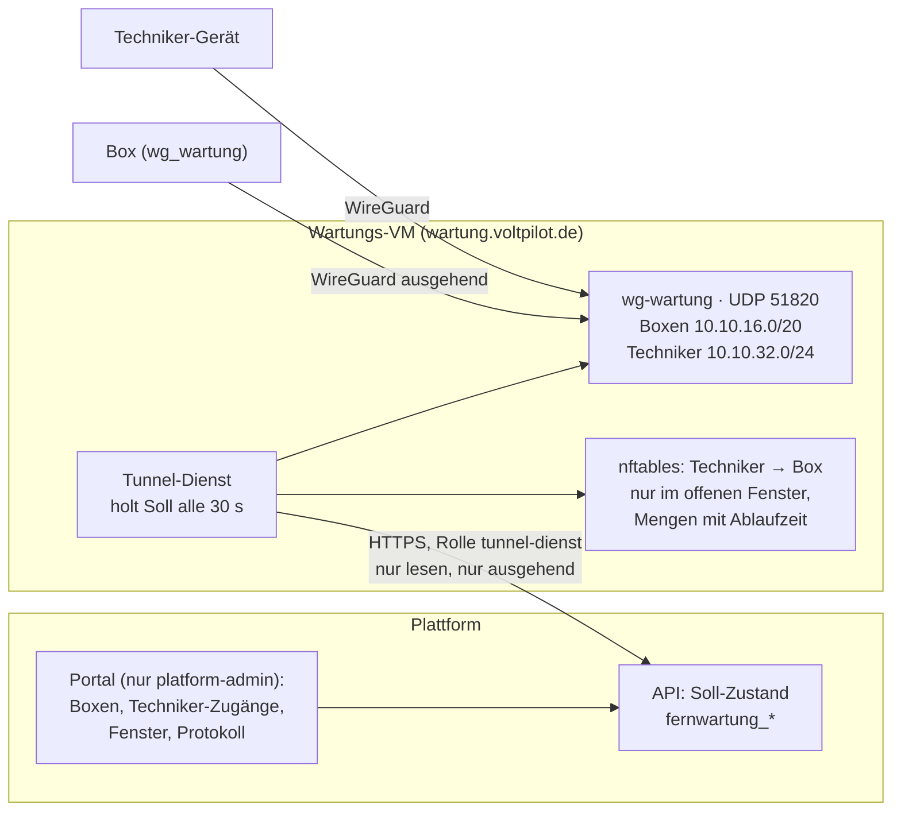

# Fernwartung: Wartungstunnel über das Portal

Der Wartungstunnel der VoltPilot-Boxen wird im Portal verwaltet. Das Portal führt den **Soll-Zustand**; ein kleiner **Tunnel-Dienst** auf einer eigenen VM holt ihn regelmäßig ab und setzt ihn auf WireGuard und nftables um. Die Plattform schreibt nie selbst auf den Server.

Grundlage sind die Entscheide des Kapitäns vom 07.10.2026:

- **E5:** Fernwartung über das Portal verwalten.
- **Endpunkt:** ein neuer Name auf einer eigenen kleinen VM (Vorgabe `wartung.voltpilot.de`, konfigurierbar). Dort läuft WireGuard ohne Weboberfläche plus der Tunnel-Dienst; Techniker bekommen dort eigene Zugänge. **`vpn.voltpilot.de` mit WireGuard UI bleibt unberührt.**
- **O3:** Der Kunde stimmt der Fernwartung einmal generell zu (Vertrag/AGB) und sieht die einzelnen Zeitfenster nicht. Intern wird jedes Fenster mit Grund, Techniker und Zeit protokolliert.

## Netze und Server

| Einstellung | Vorgabe | API (`voltpilot.fernwartung.*`) |
|---|---|---|
| Box-Netz, Server auf `.1` | `10.10.16.0/20` | `box-netz` / `VP_FERNWARTUNG_BOX_NETZ` |
| Techniker-Netz, Server auf `.1` | `10.10.32.0/24` | `techniker-netz` / `VP_FERNWARTUNG_TECHNIKER_NETZ` |
| Längstes Fenster | 24 h (Datenbank-Grenze 7 Tage) | `max-fenster-dauer` / `VP_FERNWARTUNG_MAX_FENSTER_DAUER` |
| Servername | `wartung.voltpilot.de` | `server-endpunkt` / `VP_FERNWARTUNG_SERVER_ENDPUNKT` |
| UDP-Port | `51820` | `server-port` / `VP_FERNWARTUNG_SERVER_PORT` |
| Öffentlicher Server-Schlüssel | leer, bis die VM steht | `server-public-key` / `VP_FERNWARTUNG_SERVER_PUBLIC_KEY` |

Beide Netze überschneiden sich nicht mit dem alten Service-VPN `10.10.1.0/24`; ein Techniker-Gerät kann in beiden VPNs zugleich hängen. Die Netze müssen mit der Konfiguration des Tunnel-Dienstes übereinstimmen, sonst verwirft er den Soll-Stand. Ein widersprüchliches Netz bricht den Start der API ab.

## Datenmodell

Migration `V20261007163700__fernwartung.sql`; plattformweite Betriebsdaten ohne `tenant_id`.

| Tabelle | Inhalt |
|---|---|
| `fernwartung_zugang` | ein WireGuard-Peer: `art` `box` (mit `edge_ref`) oder `techniker` (mit `name`); öffentlicher Schlüssel und `/32`-Adresse, beide über **beide Arten** eindeutig; `status` `aktiv`/`gesperrt` |
| `fernwartung_fenster` | Box, Techniker, Grund, Beginn, Ende, wer geöffnet und wer geschlossen hat; zusammengesetzte Fremdschlüssel erzwingen „Box“ und „Techniker“ |
| `fernwartung_protokoll` | jede Änderung, append-only per Trigger und ohne `UPDATE`/`DELETE`-Recht |
| `fernwartung_dienst_abruf` | wann welcher Tunnel-Dienst den Soll-Stand zuletzt abgeholt hat |

- **O3 an der Datenbankgrenze:** Die App-Rolle hat auf keine dieser Tabellen ein Recht; RLS ohne Policy ist der zweite Riegel. Geschrieben und gelesen wird nur über `voltpilot_admin`.
- **Nichts wird gelöscht.** Eine Adresse bleibt ihrem Zugang, auch gesperrt. Eine wiedervergebene Adresse ließe einen Techniker bei einem fremden Gerät landen.

## Routen und Rollen

| Route | Rolle | Zweck |
|---|---|---|
| `/api/v1/admin/fernwartung/**` | `platform-admin` | Boxen, Techniker-Zugänge, Fenster, Protokoll, Übersicht |
| `GET /api/v1/fernwartung/soll` | `tunnel-dienst` | Soll-Stand für den Tunnel-Dienst, sonst nichts |

Das Dienstkonto ist der Keycloak-Client `voltpilot-tunnel-dienst` (nur `client_credentials`) im Muster von `voltpilot-release-publisher`. Seine Route liegt bewusst **nicht** unter `/api/v1/admin/**`: Die Rückfallregel des Admin-Baums lässt nur `platform-admin` und `edge-release-publisher` durch, und das soll so bleiben. Kunden-, Publisher- und Admin-Token bekommen auf der Leseroute 403. Vertrag: [OpenAPI](contracts/openapi.yaml), Tag `fernwartung`.

## Regeln

- **Schlüssel entstehen auf dem Gerät.** Hier kommen nur öffentliche WireGuard-Schlüssel an, für Boxen wie für Techniker.
- **Box-Schlüssel hinterlegen** (`PUT …/boxen/{ref}/schluessel`) ist der Übergang bis zur Werkstatt-Registrierung D2; D2 soll genau diese Regel aufrufen.
  - Neu: Adresse aus dem Box-Netz zuteilen.
  - Derselbe Schlüssel noch einmal: unverändert.
  - Ein anderer Schlüssel: nur mit `schluesselTausch: true`. WireGuard verschiebt die Adresse dann zum neuen Peer.
  - Referenz wie bei der Kopplung: `edge-` mit Prüfzeichen, sonst muss die Plattform die Referenz kennen.
- **Fenster:** Box, Techniker-Zugang, Grund (3–500 Zeichen) und Dauer sind Pflicht.
  - Dauer höchstens `max-fenster-dauer`; Beginn jetzt oder bis 30 Tage im Voraus.
  - Ein überlappendes Fenster für dasselbe Paar wird abgelehnt: erst schließen, dann neu öffnen.
  - Vorzeitig schließen jederzeit; ein geplantes Fenster wird damit abgesagt.
- **Sperren** einer Box oder eines Zugangs schließt deren offene und geplante Fenster. Der Tunnel-Dienst entfernt den Peer beim nächsten Abruf.

## Soll-Stand

`GET /api/v1/fernwartung/soll` liefert Version 1, Vektor: [`fernwartung-soll-v1.example.json`](contracts/fernwartung-soll-v1.example.json).

- `peers`: alle aktiven Zugänge mit `art`, `id`, `kennung`, `publicKey`, `adresse`.
- `fenster`: nur die **jetzt** offenen Fenster, deren Box und Techniker aktiv sind. Sie verweisen über `boxId`/`technikerId` auf Peers.
- Geplante Fenster stehen bewusst nicht darin. Der Dienst öffnet nur, was ein frisch abgeholter Stand jetzt verlangt.

Den Vektor lesen beide Seiten: `FernwartungRegelnTest` (Java) prüft die Felder der Serialisierung, der Tunnel-Dienst liest ihn in seinem Test streng ein.

## Was das Portal weiß und was nicht

- **Weiß:** den Soll-Zustand und wann der Tunnel-Dienst ihn zuletzt abgeholt hat.
- **Weiß nicht:** ob ein Fenster auf dem Server wirkt und ob die Box gerade verbunden ist. Der Dienst hat nur Leserecht und meldet nichts zurück. Diese Lücke benennt die Oberfläche, statt sie zu überspielen.

## Bausteine

- Tunnel-Dienst mit Installationsanleitung: `services/tunnel-dienst/`.
- Box-Seite und beaufsichtigter Wechsel des Piloten: `edge-light/openwrt/service-tunnel.sh`, `edge-light/docs/mango.md`.
