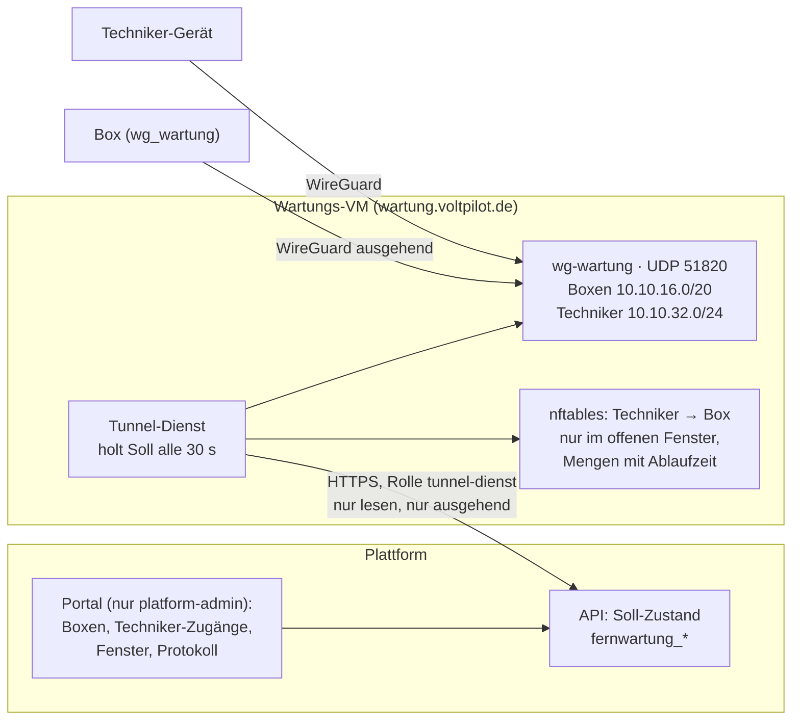

# Fernwartung: Wartungstunnel über das Portal

Der Wartungstunnel der VoltPilot-Boxen wird im Portal verwaltet. Das Portal führt den **Soll-Zustand**; ein kleiner **Tunnel-Dienst** auf einer eigenen VM holt ihn regelmäßig ab und setzt ihn auf WireGuard und nftables um. Die Plattform schreibt nie selbst auf den Server.

Grundlage sind die Entscheide des Kapitäns vom 07.10.2026:

- **E5:** Fernwartung über das Portal verwalten.
- **Endpunkt:** ein neuer Name auf einer eigenen kleinen VM (Vorgabe `wartung.voltpilot.de`, konfigurierbar). Dort läuft WireGuard ohne Weboberfläche plus der Tunnel-Dienst; Techniker bekommen dort eigene Zugänge. **`vpn.voltpilot.de` mit WireGuard UI bleibt unberührt.**
- **O3:** Der Kunde stimmt der Fernwartung einmal generell zu (Vertrag/AGB) und sieht die einzelnen Zeitfenster nicht. Intern wird jedes Fenster mit Grund, Techniker und Zeit protokolliert.



## Netze und Server

| Einstellung | Vorgabe | API (`voltpilot.fernwartung.*`) |
|---|---|---|
| Box-Netz, Server auf `.1` | `10.10.16.0/20` | `box-netz` / `VP_FERNWARTUNG_BOX_NETZ` |
| Techniker-Netz, Server auf `.1` | `10.10.32.0/24` | `techniker-netz` / `VP_FERNWARTUNG_TECHNIKER_NETZ` |
| Längstes Fenster | 24 h (Datenbank-Grenze 7 Tage) | `max-fenster-dauer` / `VP_FERNWARTUNG_MAX_FENSTER_DAUER` |
| Servername | `wartung.voltpilot.de` | `server-endpunkt` / `VP_FERNWARTUNG_SERVER_ENDPUNKT` |
| UDP-Port | `51820` | `server-port` / `VP_FERNWARTUNG_SERVER_PORT` |
| Öffentlicher Server-Schlüssel | leer, bis die VM steht | `server-public-key` / `VP_FERNWARTUNG_SERVER_PUBLIC_KEY` |

Der Servername zeigt direkt auf die öffentliche Adresse des Servers (kein HTTP-Proxy davor: WireGuard ist UDP), und die VM hat eine feste Adresse, an der eine Portweiterleitung hängen kann. Der Tunnel-Dienst sichert nur den Verkehr durch den Tunnel; eine eigene Firewall der VM richtet er nicht ein ([Installation](../services/tunnel-dienst/README.md#installation-auf-der-vm)).

Beide Netze überschneiden sich nicht mit dem alten Service-VPN `10.10.1.0/24`; ein Techniker-Gerät kann in beiden VPNs zugleich hängen. Die Netze müssen mit der Konfiguration des Tunnel-Dienstes übereinstimmen, sonst verwirft er den Soll-Stand. Ein widersprüchliches Netz bricht den Start der API ab.

## Datenmodell

Migrationen `V20261007163700__fernwartung.sql`, `V20261008213500__fernwartung_zugang_loeschen.sql` und `V20261009074500__fernwartung_ssh_schluessel.sql`; plattformweite Betriebsdaten ohne `tenant_id`.

| Tabelle | Inhalt |
|---|---|
| `fernwartung_zugang` | ein WireGuard-Peer: `art` `box` (mit `edge_ref`) oder `techniker` (mit `name`); öffentlicher Schlüssel und `/32`-Adresse, beide über **beide Arten** eindeutig; `status` `aktiv`/`gesperrt`, für Techniker-Zugänge zusätzlich `geloescht`; für Techniker-Zugänge wahlweise `ssh_public_key`, nicht eindeutig |
| `fernwartung_fenster` | Box, Techniker, Grund, Beginn, Ende, wer geöffnet und wer geschlossen hat; zusammengesetzte Fremdschlüssel erzwingen „Box“ und „Techniker“ |
| `fernwartung_protokoll` | jede Änderung, append-only per Trigger und ohne `UPDATE`/`DELETE`-Recht |
| `fernwartung_dienst_abruf` | wann welcher Tunnel-Dienst den Soll-Stand zuletzt abgeholt hat |

- **O3 an der Datenbankgrenze:** Die App-Rolle hat auf keine dieser Tabellen ein Recht; RLS ohne Policy ist der zweite Riegel. Geschrieben und gelesen wird nur über `voltpilot_admin`.
- **Keine Zeile wird entfernt, keine Adresse neu vergeben.** Eine Adresse und ein Schlüssel bleiben ihrem Zugang, gesperrt wie gelöscht. Eine wiedervergebene Adresse ließe einen Techniker bei einem fremden Gerät landen. Die Admin-Rolle hat auf keiner Tabelle ein `DELETE`-Recht.
- **„Löschen“ ist ein Zustand, kein `DELETE`.** Ein gelöschter Techniker-Zugang trägt `status = 'geloescht'`; seine Zeile hält Adresse und Schlüssel über die `UNIQUE`-Constraints fest, und Fenster wie Protokoll verweisen weiter auf sie. Ein Trigger macht den Zustand endgültig: gelöscht wird nur aus `gesperrt`, und eine gelöschte Zeile ändert sich nie wieder. Eine Box kann den Zustand nicht annehmen (`CHECK`).

## Routen und Rollen

| Route | Rolle | Zweck |
|---|---|---|
| `/api/v1/admin/fernwartung/**` | `platform-admin` | Boxen, Techniker-Zugänge, Fenster, Protokoll, Übersicht |
| `GET /api/v1/fernwartung/soll` | `tunnel-dienst` | Soll-Stand für den Tunnel-Dienst, sonst nichts |

Das Dienstkonto ist der Keycloak-Client `voltpilot-tunnel-dienst` (nur `client_credentials`) im Muster von `voltpilot-release-publisher`. Seine Route liegt bewusst **nicht** unter `/api/v1/admin/**`: Die Rückfallregel des Admin-Baums lässt nur `platform-admin` und `edge-release-publisher` durch, und das soll so bleiben. Kunden-, Publisher- und Admin-Token bekommen auf der Leseroute 403. Vertrag: [OpenAPI](contracts/openapi.yaml), Tag `fernwartung`.

## Regeln

- **Schlüssel entstehen auf dem Gerät.** Hier kommen nur öffentliche Schlüssel an: WireGuard für Boxen und Techniker, dazu der SSH-Schlüssel des Technikers ([Anmeldung an der Box](#anmeldung-an-der-box-fenster-schlüssel)).
- **Box-Schlüssel hinterlegen** (`PUT …/boxen/{ref}/schluessel`) ist der Übergang bis zur Werkstatt-Registrierung D2; D2 soll genau diese Regel aufrufen.
  - Neu: Adresse aus dem Box-Netz zuteilen.
  - Derselbe Schlüssel noch einmal: unverändert.
  - Ein anderer Schlüssel: nur mit `schluesselTausch: true`. WireGuard verschiebt die Adresse dann zum neuen Peer.
  - Referenz wie bei der Kopplung: `edge-` mit Prüfzeichen, sonst muss die Plattform die Referenz kennen.
- **Fenster:** Box, Techniker-Zugang, Grund (3–500 Zeichen) und Dauer sind Pflicht.
  - Dauer höchstens `max-fenster-dauer`; Beginn jetzt oder bis 30 Tage im Voraus.
  - Ein überlappendes Fenster für dasselbe Paar wird abgelehnt: erst schließen, dann neu öffnen.
  - Vorzeitig schließen jederzeit; ein geplantes Fenster wird damit abgesagt.
- **Sperren** einer Box oder eines Zugangs schließt deren offene und geplante Fenster. Der Tunnel-Dienst entfernt den Peer beim nächsten Abruf.
- **Löschen** (`DELETE …/techniker/{id}`) gibt es nur für einen **gesperrten Techniker-Zugang**; ein aktiver muss erst gesperrt werden (409). Es ist endgültig.
  - Der Zugang fehlt danach in jeder Liste, Auswahl und Zählung des Portals und lässt sich nicht mehr entsperren; jede Route antwortet für ihn mit 404.
  - Seine Adresse und sein Schlüssel bleiben dauerhaft vergeben. Wer denselben Schlüssel noch einmal einträgt, bekommt 409 mit dem Hinweis, auf dem Gerät ein neues Schlüsselpaar zu erzeugen.
  - Das Protokoll bekommt den Eintrag `techniker_geloescht` mit Zeit und Akteur. Frühere Fenster- und Protokolleinträge bleiben lesbar und nennen den Zugang weiter beim Namen.
  - Für den Tunnel-Dienst ändert sich nichts: Schon der gesperrte Zugang stand nicht mehr im Soll-Stand.
  - Boxen lassen sich nicht löschen.

## Anmeldung an der Box (Fenster-Schlüssel)

Ein offenes Fenster öffnet den **Netzweg** zur Box. Die **Anmeldung** an der Box ist eine zweite Schranke: Ihr SSH-Server im Tunnel (Dropbear, Port 2222) lässt nur hinein, wessen öffentlicher Schlüssel auf der Box liegt. Entscheid des Kapitäns vom 09.10.2026: Der Techniker hinterlegt seinen öffentlichen SSH-Schlüssel einmal im Portal; solange ein Fenster offen ist, holt sich die Box ihn über den Wartungstunnel und behält ihn nur bis zum Ende des Fensters.

| Schritt | Inhalt | Stand |
|---|---|---|
| 1 | Portal und API: der SSH-Schlüssel steht am Techniker-Zugang und geht im Soll-Stand mit | umgesetzt |
| 2 | Tunnel-Dienst: gibt einer Box die Schlüssel der Techniker aus, für die gerade ein Fenster zu ihr offen ist | umgesetzt; auf der Wartungs-VM erst eingeschaltet, wenn dort `VP_TUNNEL_SCHLUESSEL_PORT` gesetzt ist |
| 3 | Box (`service-tunnel.sh`): holt die Schlüssel ab, hält sie nur im Arbeitsspeicher und führt die Frist selbst | offen |

**Bis Schritt 3 ausgeliefert ist, holt keine Box einen Schlüssel ab.** Die Anmeldung gelingt so lange nur mit einem Schlüssel, der schon auf der Box liegt. Das Portal sagt das auf der Seite und an jedem offenen Fenster.

**Die Schlüsselausgabe des Tunnel-Dienstes** (Schritt 2): Eine Box fragt im Tunnel die Server-Adresse im Techniker-Netz (`10.10.32.1`, eigener Port) und bekommt die Schlüssel der Paare, die gerade in der Kernel-Menge `fenster` stehen, mit deren Restlaufzeit. Der Dienst prüft jeden Schlüssel noch einmal selbst, antwortet nur Box-Adressen und gibt ohne frisch abgeholten Soll-Stand keine Liste aus. Einzelheiten, Grenzen und das Einschalten auf der VM: [Tunnel-Dienst](../services/tunnel-dienst/README.md#schlüsselausgabe); Anfrage und Antwort für das Box-Skript: [Vertrag](contracts/fernwartung-schluessel-v1.md).

- **Der Schlüssel am Zugang** (`sshPublicKey` beim Anlegen, `PUT`/`DELETE …/techniker/{id}/ssh-schluessel`) ist freiwillig. Ohne ihn öffnet ein Fenster für diesen Zugang nur den Netzweg; das Portal nennt das in der Zugangsliste, beim Öffnen eines Fensters und unter der Box, solange das Fenster offen ist.
- **Nur RSA, 2048 bis 4096 Bit.** Der Dropbear der Boxen (OpenWrt 25.12.5 auf der Mango) nimmt nur `ssh-rsa` an. Ein Ed25519-, ECDSA- oder FIDO-Schlüssel wird mit dem Befehl abgelehnt, der einen passenden erzeugt (`ssh-keygen -t rsa -b 3072`). 4096 Bit ist die größte Länge, mit der die Anmeldung an diesem Dropbear belegt ist.
- **Eine Zeile, keine Optionen davor.** Mehrzeiliges, ein privater Schlüssel und Optionen wie `command="…"` werden abgelehnt. Das Portal prüft dieselben Regeln schon im Browser; ein versehentlich eingefügter privater Schlüssel verlässt ihn nicht.
- **Gespeichert wird die Normalform** `ssh-rsa <Base64>`: ohne Kommentar, der Schlüssel neu kodiert. Dropbear vergleicht Bytes; nur die Normalform passt sicher zu dem, was der SSH-Client anbietet. Regeln: `SshSchluessel.java`, grob als `CHECK` in der Migration, im Portal `sshSchluesselPruefen`.
- **Der Fingerabdruck** ist der von `ssh-keygen -lf` (`SHA256:…`). Das Portal zeigt ihn am Zugang und nennt den Befehl zum Vergleich; im Protokoll steht nur er, nie der Schlüssel.
- **Nicht eindeutig.** Zwei Zugänge desselben Technikers dürfen denselben SSH-Schlüssel tragen. Wer im Box-Log unterscheiden will, welches Gerät sich angemeldet hat, gibt jedem Gerät einen eigenen.
- **Protokoll:** `techniker_ssh_schluessel_gesetzt` (mit neuem und vorherigem Fingerabdruck) und `techniker_ssh_schluessel_entfernt`; beim Anlegen steht der Fingerabdruck im Eintrag `techniker_angelegt`. Derselbe Schlüssel noch einmal ändert nichts und steht nicht im Protokoll.
- **Sperren und Löschen** ändern den Schlüssel nicht. Ein gesperrter oder gelöschter Zugang steht nicht im Soll-Stand, sein SSH-Schlüssel also auch nicht.
- **Befehle im Portal.** Der Dialog am Zugang nennt die Befehle zum Erzeugen für Windows (PowerShell) und Linux/macOS, mit dem Dateinamen `id_rsa_voltpilot`, damit kein vorhandener Schlüssel überschrieben wird. Unter einer Box mit offenem Fenster stehen die fertigen Befehle, je Fenster mit dem Satz, ob der Zugang einen SSH-Schlüssel trägt: `ssh -i ~/.ssh/id_rsa_voltpilot -p 2222 root@<Box-Adresse>` und für die Web-App der Box dieselbe Anmeldung mit `-L 8484:127.0.0.1:8484`, danach `http://127.0.0.1:8484` im eigenen Browser.

**Wer das Portal verwaltet, verwaltet damit die Anmeldung.** Sobald die Boxen Fenster-Schlüssel abholen, genügt ein Konto mit der Rolle `platform-admin`, um als root auf eine verbundene Box zu kommen: Zugang mit eigenem Schlüssel anlegen, Fenster öffnen. Vorgesehen sind deshalb ein zweiter Faktor für Portal-Administratoren vor der ersten Kundenbox auf diesem Weg und, vorgemerkt, vom Portal signierte Freigaben. Beides ist nicht umgesetzt.

## Web-App der Box im Fenster

Entscheid des Kapitäns vom 09.10.2026: Die Web-App der Box (Port 8484) ist im offenen Fenster für **jeden** Techniker frei, nicht mehr je Techniker-Adresse. `service-tunnel.sh` gibt sie beim Einrichten des Tunnels für das ganze Techniker-Netz frei.

- **Die Schranke ist allein das Fenster am Wartungsserver.** Die Box prüft nur, dass ein Paket durch den Tunnel und aus dem Techniker-Netz kommt. Wer es ist und ob ein Fenster offen ist, prüft sie nicht. Einzelheiten und die engere Wahl: [mango.md](../edge-light/docs/mango.md#was-die-box-im-tunnel-selbst-prüft).
- **Die Web-App hat keine Anmeldung.** Anders als bei SSH gibt es hier keine zweite Schranke. Ein Konto mit der Rolle `platform-admin` genügt damit schon heute, um die Web-App einer verbundenen Box zu bedienen: Zugang anlegen, Fenster öffnen.
- **Im Browser des Technikers:** `http://<Box-Adresse>:8484`, solange das Fenster offen ist. Das Portal nennt bisher nur den Weg über `ssh … -L 8484:127.0.0.1:8484`; er funktioniert weiter und braucht die Anmeldung an der Box.
- **Eine Box, deren Tunnel vor dem 09.10.2026 eingerichtet wurde,** bekommt die Freigabe, wenn die Befehlszeile aus dem Portal noch einmal läuft. Der Lauf fasst den Tunnel nicht an, wenn sich an ihm nichts ändert.

## Entscheide zum Betrieb (09.10.2026)

Nach dem Gesamttest mit der Labor-Box hat der Kapitän entschieden:

| Punkt | Entscheid | Stand |
|---|---|---|
| SSH zur Wartungs-VM | aus `192.168.0.0/24` und `192.168.178.0/24` erlaubt, sonst von nirgends | Regel in `/etc/nftables.d/vm-firewall.nft` auf der VM; am 09.10. aus beiden Netzen geprüft |
| Web-App 8484 im Tunnel | im offenen Fenster für alle Techniker | Box-Seite umgesetzt ([oben](#web-app-der-box-im-fenster)) |
| Paket `nftables` auf der VM | von den automatischen Updates ausgenommen, wird von Hand aktualisiert | `/etc/apt/apt.conf.d/53vp-nftables-von-hand` auf der VM |
| Labor-Mango `edge-5t2dcy6` | bleibt als Test-Box am Wartungsserver | verbunden, `10.10.16.2` |

**`nftables` von Hand aktualisieren.** Das Paket startet bei einer Aktualisierung `nftables.service` neu. Das leert den ganzen Regelsatz und schließt offene Fenster, bis der Tunnel-Dienst sie wieder öffnet ([Betrieb](../services/tunnel-dienst/README.md#betrieb)). `unattended-upgrades` übergeht deshalb `nftables` und die versionsgleiche Bibliothek `libnftables1`; alle anderen Sicherheitsupdates laufen weiter von selbst. Von Hand, wenn kein Fenster offen ist:

```bash
vp-tunnel-dienst status          # Offene Fenster: 0
apt update && apt install --only-upgrade nftables libnftables1
vp-tunnel-dienst status          # Firewall-Basis stimmt: ja
```

## Soll-Stand

`GET /api/v1/fernwartung/soll` liefert Version 1, Vektor: [`fernwartung-soll-v1.example.json`](contracts/fernwartung-soll-v1.example.json).

- `peers`: alle aktiven Zugänge mit `art`, `id`, `kennung`, `publicKey`, `adresse`. Gesperrte und gelöschte Zugänge stehen nicht darin.
- `sshPublicKey` an einem Techniker-Peer: sein öffentlicher SSH-Schlüssel in Normalform. Das Feld steht nur dort, wo einer hinterlegt ist; sonst fehlt es ganz, an einer Box immer. Für WireGuard und die Firewall spielt es keine Rolle.
- `fenster`: nur die **jetzt** offenen Fenster, deren Box und Techniker aktiv sind. Sie verweisen über `boxId`/`technikerId` auf Peers.
- Geplante Fenster stehen bewusst nicht darin. Der Dienst öffnet nur, was ein frisch abgeholter Stand jetzt verlangt.

Den Vektor lesen beide Seiten: `FernwartungRegelnTest` (Java) prüft die Felder der Serialisierung, der Tunnel-Dienst liest ihn in seinem Test streng ein.

**Der Soll-Stand wächst nur additiv, die Version bleibt 1.** Im Betrieb überliest der Dienst Felder, die er nicht kennt; sein Test liest den Vektor dagegen streng. Ein neues Feld braucht deshalb Vektor, Java-Test und Go-Struktur in derselben Änderung. Vor dem Ausliefern des Portals belegt `services/tunnel-dienst/test/vertraeglichkeit.sh <commit>`, dass der Stand, der gerade auf der VM läuft (`vp-tunnel-dienst version`), den heutigen Vektor genauso umsetzt wie ohne die neuen Felder. Für `sshPublicKey` ist das mit dem Stand `db32a784ce55` belegt: Das Portal darf vor dem Tunnel-Dienst ausgeliefert werden.

## Was das Portal weiß und was nicht

- **Weiß:** den Soll-Zustand und wann der Tunnel-Dienst ihn zuletzt abgeholt hat.
- **Weiß nicht:** ob ein Fenster auf dem Server wirkt, ob die Box gerade verbunden ist und ob sie den SSH-Schlüssel eines Fensters abgeholt hat. Der Dienst hat nur Leserecht und meldet nichts zurück. Diese Lücke benennt die Oberfläche, statt sie zu überspielen. Eine Rückmeldung des Dienstes ans Portal ist entschieden (09.10.2026), aber noch nicht gebaut. Auf der VM selbst zeigt `vp-tunnel-dienst status`, wann eine Box zuletzt nach Schlüsseln gefragt hat, und das Journal, welcher Schlüssel ihr ausgegeben wurde.

## Bausteine

- Tunnel-Dienst mit Installationsanleitung: `services/tunnel-dienst/`. Erste Einrichtung auf einer echten VM (Debian 13) am 08.10.2026; was dabei belegt wurde und was offen ist, steht dort unter „Prüfen“.
- Box-Seite und beaufsichtigter Wechsel des Piloten: `edge-light/openwrt/service-tunnel.sh`, `edge-light/docs/mango.md`.
