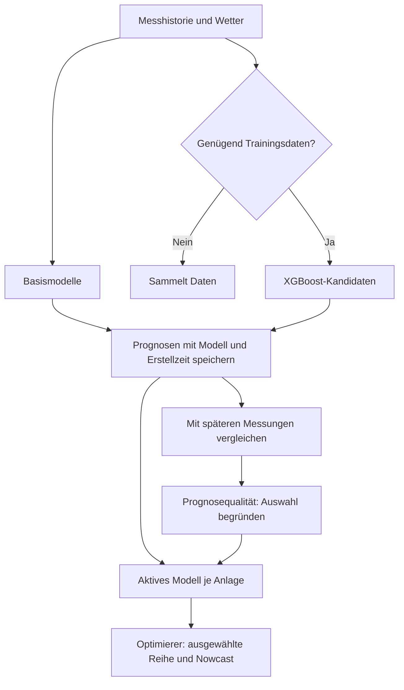

# Prognosen und Modellwahl

VoltPilot erzeugt mehrere Prognosereihen, verwendet für die Planung aber jeweils das ausgewählte Last- und PV-Modell. Kandidaten können parallel bewertet werden, ohne den laufenden Betrieb zu ändern.

## Modelle

| Modellkennung | Aufgabe |
|---|---|
| `load-persistence` | Last aus vorhandener Historie / Baseline |
| `pv-physical` | Physikalische PV-Prognose |
| `load-xgb` | Gelernte Lastprognose |
| `pv-residual-xgb` | Gelernte Korrektur der physikalischen PV-Prognose |

Trainingsvoraussetzungen und Defaults stehen in [Registry](../services/forecast/voltpilot_forecast/registry.py) und [ML](../services/forecast/voltpilot_forecast/ml.py). Ohne ausreichende Daten wird `collecting` mit Fortschritt gemeldet; der Kandidat liefert dann keine vorgetäuschte Prognose. Training und Bewertung verwenden den vorgesehenen Berlin-Tagesbezug.

## Auswahl und Rücknahme

Die wirksame Auswahl folgt dieser Reihenfolge:

1. Letzte Entscheidung der Anlage in `site_forecast_model_choice`.
2. Plattformvorgabe in `forecast_model_choice`.
3. `VOLTPILOT_ACTIVE_LOAD_MODEL` beziehungsweise `VOLTPILOT_ACTIVE_PV_MODEL`.
4. Basismodell der Registry.

Die Auswahl im Portal gilt nur für diese Anlage und wird append-only protokolliert. Ein späterer Env-Wechsel überschreibt sie nicht. Die API prüft auch serverseitig, ob ein Kandidat noch sammelt beziehungsweise ob eine Tagesbewertung vorliegt. Rücknahme erfolgt durch erneute Wahl eines verfügbaren Modells.

API, Collector und Optimierer müssen dieselbe Auswahl auflösen. Quellen: `ForecastModels`, `model_choice.py`, `inputs.py`.

## Qualität richtig lesen

Pro Viertelstunde zählt die jüngste Prognose, die **vor oder zum Slotbeginn** vorlag. Spätere Vorhersagen dürfen den Rückblick nicht verbessern.

| Kennzahl | Bedeutung |
|---|---|
| MAE | Mittlere absolute Abweichung in kW |
| nMAE | Normierte Abweichung; bei nicht sinnvoller Bezugsgröße unbekannt |
| Bias | Vorzeichenbehaftete mittlere Abweichung |
| Skill | Vergleich mit dem aktiven Modell dieser Anlage; positiv bedeutet besser |

Die historische Spalte `skill_vs_baseline` trägt weiterhin ihren Namen, obwohl die Referenz das aktive Modell sein kann. `plan_accuracy` vergleicht nur Slots mit den erforderlichen Plan-, Mess- und Preisdaten. Fehlende Daten sind keine Nullabweichung.

## PV-Nowcast

Der Optimierer kann den nahen PV-Horizont anhand des jüngsten gemessenen Fehlers korrigieren. Diese begrenzte, abklingende Korrektur wird nicht unter dem Namen des ursprünglichen Prognosemodells zurückgeschrieben.

Daher misst `forecast_accuracy` die gespeicherte Modellprognose; die tatsächlich zur Planung verwendete Korrektur gehört in die Plandiagnose. Schalter und Grenzen: `OPTIMIZER_PV_ANCHOR_*` in [config.py](../services/optimization/voltpilot_optimization/config.py), Berechnung in [nowcast.py](../services/optimization/voltpilot_optimization/nowcast.py).

## Betrieb

[Forecast-Service](../services/forecast/README.md) nennt Start- und Testbefehle. Tabellen und Rechte werden über die API-Migrationen gepflegt. Modellwahl und Kundenauswertung sind mandantengebunden; Backend-Collector haben eigene Schreibzugänge.

Eine neue Modellidee ist erst verfügbar, wenn Registry, Datengrundlage, Trainings-/Bewertungsweg und Tests existieren. Automatische Beförderung wird durch dieses Dokument nicht zugesagt.
