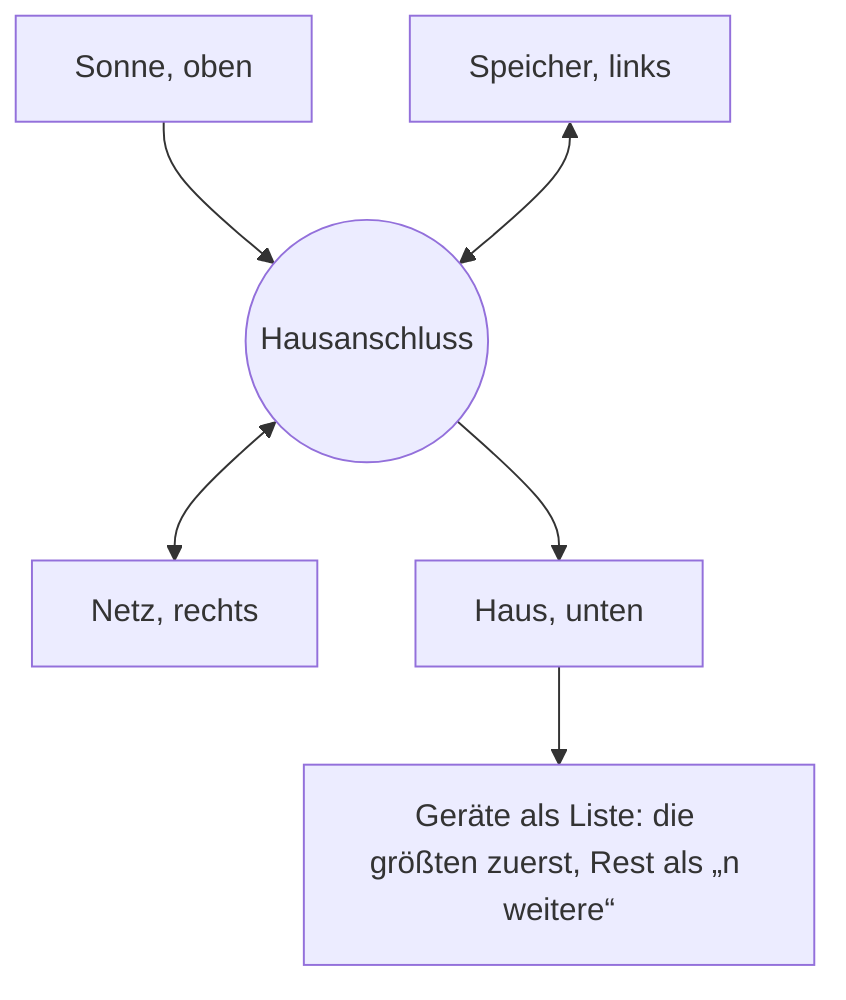

# Cockpit als Tagesfilm (Konzeptentwurf)

**Status: Entwurf vom 29.09.2026. Nichts davon ist umgesetzt.** Der klickbare Prototyp liegt daneben: [prototyp.html](prototyp.html). Die Datei im Browser öffnen; sie funktioniert ohne Server. Alle Zahlen darin sind erfunden. Die Anlagennamen „Sonnenhof“ und „Werk Ahrenberg“ stammen aus den fiktiven Test-Fixtures.

## Zweck

Das Cockpit ist die erste Seite nach der Anmeldung. Heute zeigt es Kreise um einen Knoten und darunter viele Karten. Wer wissen will, womit die Wallbox lädt oder warum der Speicher mittags aus dem Netz lädt, sucht an mehreren Stellen. Das Konzept beantwortet beides in einem Energiefluss wie auf einem Leitungsplan: woher der Strom kommt, wohin er fließt und welche Geräte ihn gerade verbrauchen. Das gilt jetzt und für jede Viertelstunde des Tages. Darunter folgen Kacheln, die zum Betriebsmodell passen. Zuerst ist das Konzept fürs Telefon gebaut, danach für den Rechner.

Vorgaben aus der Abstimmung am 29.09.2026:

- Der Energiefluss soll lebendig, aber ruhig und seriös wirken. Zwei Fassungen wurden verworfen: fließende Teilchen waren zu unruhig, eine Bilanz aus zwei Balken mit Bändern war zu trocken. Das Antippen mit Einzelheiten und die Listen „im Detail“ aus der zweiten Fassung bleiben.
- Die Umschaltung „Jetzt · kW / Heute · kWh“ bleibt.
- Es muss mit beliebig vielen Verbrauchern funktionieren.
- Das Cockpit bleibt reine Anzeige. Eingriffe laufen über Steuerung und Fahrplan.
- Kachel-Vorschläge erscheinen nur im Dialog „Cockpit anpassen“.
- Beim ersten Besuch gibt es keine Einführung. Das Cockpit muss sich selbst erklären.

## Die Idee



- **Vier feste Plätze.** Sonne oben, Haus unten, Speicher links, Netz rechts, jeweils als Knoten mit Symbol; der Speicher als Batterie mit Füllstand. Wert und Zustand stehen in Worten am Knoten. Die Plätze wechseln nie.
- **Eine Spur je Weg.** Jeder der sieben möglichen Wege (Sonne → Haus, Sonne → Speicher, Sonne → Netz, Speicher → Haus, Speicher → Netz, Netz → Haus, Netz → Speicher) ist eine eigene Spur, so breit wie seine Leistung. Die Spuren laufen gebündelt zum Hausanschluss in der Mitte und biegen dort mit Radius ab. Sonne → Haus bleibt senkrecht, Speicher ↔ Netz waagrecht; wo beide kreuzen, liegt die senkrechte Spur mit hellem Rand darüber.
- **Farbe heißt Herkunft.** Jede Spur trägt die Farbe ihrer Quelle. Damit ist auch die Richtung eindeutig: Grün kommt immer aus dem Speicher, Petrol immer aus dem Netz. Mischfarben gibt es nicht.
- **Jetzt und Heute.** „Jetzt“ zeigt Leistung in kW, „Heute“ die Energie seit Mitternacht in kWh, im selben Bild. In „Heute“ stehen alle Wege des Tages nebeneinander, am Speicher und am Netz auch beide Richtungen.
- **Beliebig viele Geräte.** Unter dem Fluss stehen die Geräte als Liste, sortiert nach Leistung (bzw. Energie heute). Am Telefon sind es höchstens vier Zeilen (sonst drei und „n weitere“), am Rechner sechs (sonst fünf). Das ganze Verzeichnis öffnet sich im Blatt, nach Art gruppiert (Laden, Wärme, Maschinen, Gebäude, Sonstiges) und mit Gruppensummen. Mit mehr als einer PV-Fläche gibt es dieselbe Liste für die Erzeugung.
- **Schraffiert heißt Plan.** Die Tagesleiste springt zu jeder Viertelstunde. Rechts von „Jetzt“ sind die Spuren schraffiert und die Knoten gestrichelt. Für den Plan gibt es keine Aufteilung je Gerät; die Liste zeigt dann nur „Verbrauchsprognose“ und „PV-Prognose“.
- **Bewegung heißt live.** Nur im Jetzt wandern kleine helle Punkte langsam (etwa 16 px pro Sekunde) die Spuren entlang, von der Quelle zum Ziel. Auf Spuren unter 2,5 px entfallen sie, damit nichts wie eine gestrichelte Planlinie aussieht. Zurückgezogen, im Plan und bei „Heute“ steht das Bild still. Werte gleiten beim Wechsel in 200 ms; mit `prefers-reduced-motion` springen sie sofort, und die Punkte entfallen.
- **Antippen zeigt Einzelheiten.** Jeder Knoten und jede Zeile öffnet am Telefon ein Blatt (`BottomSheet`), am Rechner das zentrierte `Modal`. Am Rechner nennt jede Spur beim Überfahren Weg und Wert.

## Aufbau

**Telefon:** Kopf mit Anlage, Datenstand und Betriebsmodell. Darunter die Bühne mit Uhrzeit, Umschalter „Jetzt · kW / Heute · kWh“, einem Satz zum Moment, dem Energiefluss (Ladestand, Netz, Ziel oder Börsenpreis stehen an den Knoten), „Verbrauch im Detail“, „Erzeugung im Detail“, der Tagesleiste und „Zahlen als Liste“. Am Fuß der Bühne steht die Steuerzeile. Danach folgen das Kachelraster (zwei Spalten, „klein“ oder „breit“), die leise Zustandszeile und „Cockpit anpassen“. Unten sitzt die vorhandene Leiste mit den fünf Bereichen.

**Rechner:** Die Bühne steht zweispaltig. Links sind Energiefluss, die beiden Listen nebeneinander und die Tagesleiste. Rechts steht „Dieser Moment“ mit vier Werten, darunter die Leitkachel. Das Kachelraster hat vier Spalten.

## Energiefluss: Regeln der Bühne

| Thema | Regel |
|---|---|
| Datenquellen | `/topology` (Rollen, Mitglieder, `value_kw`), `/sources` (PV je Wechselrichter), `/consumers` und `/consumer-status`, `/chargers`. Das Portal fragt heute alle 10 s ab (`LIVE_POLL_MS`). |
| Herkunft | Bilanziell mit Vorrang: Sonne zuerst in den Verbrauch, dann in den Speicher, dann ins Netz. Speicherentladung zuerst in den Verbrauch. Netzbezug zuerst in den Verbrauch, dann in den Speicher. Das Blatt nennt diese Regel. Offen ist, ob stattdessen anteilig verteilt wird. |
| Maßstab | Die Breite einer Spur folgt der Leistung, bezogen auf die größte Leistung des Tages (bei „Heute“ auf den größten Tageswert). So bleiben Spuren über den Tag vergleichbar. Höchstens 12 px am Telefon und 16 px am Rechner, damit das Bild leicht bleibt, kleinste sichtbare Spur 1,5 px. |
| Beschriftung | An jedem Knoten: Wert fett, darunter der Zustand in Worten. Sonne und Haus rechts daneben, Speicher und Netz darunter. Die Spuren tragen keine Zahlen. |
| Totband | Unter 0,05 kW gibt es keine Spur, wie heute. |
| Veraltet | Außerhalb des 5-Minuten-Fensters steht eine Uhrzeit („Stand: 13:31 Uhr“), keine Dauer. |
| Fehlend | „—“ mit Grund. Fehlt ein Teil der Rest-Rechnung, wird kein Rest gebildet; die Liste zeigt den Rest zusammen als „nicht aufgeteilt“ (siehe `verbrauchKomposition.ts`). |
| Gemessene Null | Neben erzeugenden Flächen: „liefert gerade keine Erzeugung“. Nachts wird nichts gekennzeichnet. |
| Richtung | Aus der Herkunftsfarbe, live zusätzlich aus den Punkten, und als Wort (lädt, entlädt, Bezug, Einspeisung), nie als Minuszeichen. |
| Ziel und Grenze | Lastspitzenkappung und § 14a: Das Ziel steht am Netz-Knoten, mit einer kleinen Skala für den Bezug; die Tiefe liefert die Kachel „Lastspitze“. |

### Farben der Rollen

Die heutige Flusspalette fällt bei der Farbprüfung (Methode des Dataviz-Validators, OKLab) durch. Netz `#0ea5a3` und Speicher `#16a34a` liegen auch bei normalem Farbsehen nur ΔE 12,2 auseinander; die Grenze ist 15. PV `#f59e0b` hat auf Weiß 2,15 : 1. Aus vorhandenen Tokens besteht diese Zuordnung alle Prüfungen:

| Rolle | Spuren, Linien, Symbole | Token |
|---|---|---|
| PV | `#e65100` | `--vp-chart-pv-line` / `--vp-c-chart-pv` |
| Speicher | `#166534` | `--vp-flow-batt-ink` / `--vp-c-chart-soc` |
| Netz | `#0ea5a3` | `--vp-flow-grid` |
| Verbrauch | `#8b5cf6` | `--vp-flow-load` |

Der schwächste Abstand unter Farbenblindheit (Protanopie) liegt bei ΔE 7,9, zwischen Speicher und PV. Beschriftung und Symbol bleiben deshalb Pflicht. Im Fluss kommt die feste Lage hinzu: Grün beginnt immer links, Orange immer oben. Flächen behalten die hellen `-soft`-Töne.

## Tagesleiste

| Betriebsmodell | Spuren |
|---|---|
| Eigenverbrauchs-Fahrplan | PV als Fläche, Verbrauch als Linie |
| Marktoptimierung | oben Börsenpreis je Viertelstunde (grün: Laden laut Plan, rot: Verkaufen laut Plan), unten Speicher laden und abgeben |
| Lastspitzenkappung | Netzbezug, „ohne Speicher“ gestrichelt, Ziel als Linie, gekappte Fläche grün |

Links von „Jetzt“ stammen die Werte aus `/history?range=day` (Viertelstunden). Rechts davon kommen sie aus `/schedule` (`pvKw`, `loadKw`, `batteryKw`, `gridKw`, `socPct`, `slotRole`, `priceEurMwh`). Bedienung: ziehen, Pfeiltasten (mit Umschalt eine Stunde), Pos1 und Ende, „Tag abspielen“ und „Zurück zu Jetzt“. Die Leiste ist ein `role="slider"` mit Wertetext.

## Anpassung je Betrieb

| | Eigenverbrauchs-Fahrplan (privat) | Marktoptimierung | Lastspitzenkappung | Ladepark-Lastmanagement | Anlage beobachten |
|---|---|---|---|---|---|
| Leitkachel (Stern) | Unterm Strich | Börsenpreis | Lastspitze | Ladebudget | keine |
| Kacheln zu Beginn | Autarkie, Eigenverbrauch, Speicher, Wärmepumpe, Sonne, Laden, Fahrplan | Börsenpreis, Sonne, Speicher, Handel, Unterm Strich, Netz heute | Lastspitze, Lastspitzen-Reserve, Sonne, Unterm Strich, Netz heute | Ladebudget, Laden, Netz heute | Sonne, Netz heute, Autarkie |
| Geld | eine Zahl, Ton „sparen“ | eine Zahl, Ton „verdienen“ | eine Zahl, Ton „verdienen“ | kein Geld | kein Geld (reine Messanlage) |

Neu gegenüber heute: Bei Marktoptimierung führt der Börsenpreis statt des Geldes. Das folgt dem Wunsch, dass unter dem Fluss zuerst Börsenpreis, Sonne und Speicher stehen. Die heutige Reihenfolge der Leitblöcke steht in `leadSlot.ts` (Lastspitze, dann Geld, dann Fluss). Atypische Netznutzung bekommt weiterhin keinen Baustein.

## Kachelkatalog

Jede Kachel ist gleich aufgebaut. Oben steht der Kopf mit Symbol, Name und Ziel. Darunter folgen eine Zahl mit Einheit und eine kleine Grafik aus echten Werten. Eine Marke sagt, ob der Wert gemessen, geplant oder erwartet ist. Neu ist die Größe „klein“ oder „breit“; die Lastspitze ist zusätzlich hoch.

| Kachel | zeigt | Daten | verfügbar, wenn |
|---|---|---|---|
| Unterm Strich | eine Geldzahl, netto; Heute, Monat, Jahr | `/earnings` | Erzeuger oder Speicher |
| Autarkie | Anteil selbst gedeckt; Haus füllt sich nach Herkunft | `/history` (`autarkiePct`) | Verbrauch gemessen |
| Eigenverbrauch | wohin die Erzeugung ging (Haus, Speicher, Netz) | `/history` (`eigenverbrauchPct`) | PV gemessen |
| Speicher | Ladestand, Leistung, Tätigkeit laut Plan, „voll gegen“ | `/topology`, `/schedule` | Speicher |
| Sonne | Sonnenstärke, PV heute gemessen und erwartet, morgen | `/weather`, `/schedule` | PV |
| Börsenpreis | Preis mit Urteil, Tageskurve, Planfenster, morgen | `/prices`, `/schedule` | Marktoptimierung oder dynamischer Tarif |
| Handel | Lade- und Verkaufsfenster mit Ø-Preis, Vollzyklen | `/schedule`, `/history` | Marktoptimierung |
| Lastspitze | Viertelstundenmittel, Ziel, Monatsspitze, Wert ohne Speicher | `/telemetry`, `/schedule` (`peakTargetKw`), `/earnings` (`peakShaving`) | Lastspitzenkappung |
| Lastspitzen-Reserve | Ladestand gegen Reserve | `/topology`, Einstellung „Lastspitzen-Reserve“ | Lastspitzenkappung |
| Laden | Ladepunkt, Steuerart, Energie heute | `/chargers` | Ladepunkt |
| Wärmepumpe | Freigabe „Anlaufempfehlung“ (SG-Ready), Leistung, wenn gemessen | `/consumers`, `/consumer-status` | Wärmepumpe |
| Fahrplan (Tagesuhr) | Tätigkeiten des Plans über 24 Stunden | `/schedule` (`slotRole`) | Speicher |
| Netz heute | Bezug und Einspeisung in kWh | `/history` | Netzmessung |
| Wetter | Temperatur und Bewölkung | `/weather` | Standort bekannt |
| Eigene Kachel | ein Messwert mit Einheit und Zeitbezug | `/eigene-auswertung` | immer |
| Zustand | leise, wenn alles läuft; sonst Befund mit Weg | Gesundheitsprüfung | immer (Pflicht) |

Die Steuerzeile am Fuß der Bühne trennt Auftrag, Geräteantwort und gemessene Wirkung (`/control-status`).

## Anpassen und Vorschläge

- Der Dialog hat zwei Reiter: „Anordnen“ und „Kacheln hinzufügen“.
- Vorschläge stehen nur dort, jeweils mit einem Grund aus der Anlage, zum Beispiel „Wärmepumpe und Wallbox werden einzeln gemessen“.
- Kacheln ohne Datenquelle lassen sich nicht anordnen. Sie stehen unter „Noch nicht möglich auf dieser Anlage“ mit der fehlenden Voraussetzung. Die Ehrlichkeitsgrenze `verfuegbar` bleibt bestehen.
- Ordnen geht mit ▲ ▼ wie heute, ohne Ziehen als einzigen Weg. Das Auge blendet aus, der Stern setzt die Leitkachel, neu ist die Größe.
- „Zurücksetzen“ sagt, worauf es zurückfällt. Gespeichert wird nur die Absicht (Reihenfolge, Sichtbarkeit, Leitkachel, Größe), serverseitig über `/cockpit-layout`.

## Ehrlichkeitsregeln im Bild

- Messung und Plan haben verschiedene Formen: gefüllt gegen schraffiert, durchgezogen gegen gestrichelt.
- kW gilt für „jetzt“, kWh für „heute“. Die Einheit steht am Umschalter und an jedem Wert.
- Pro Schirm steht eine Geldzahl („Unterm Strich“).
- Sätze beschreiben, was gemessen wurde. Eine Ursache nennen sie nur mit Plan-Angabe („Plan: Günstig aus dem Netz laden“).
- Verkauft ist, was den Netzanschluss verlässt, nicht was den Speicher verlässt.
- Die Tätigkeit des Speichers ist eine Aussage des Plans, keine Messung.

## Befunde im heutigen Cockpit

| heute | im Konzept |
|---|---|
| Verbraucher stehen an bis zu fünf Stellen: Flussknoten, Komponenten-Zeilen, Aufklapper, steuerbare Verbraucher, Laden. Mit jedem Gerät wird das Bild voller. | einmal in der Liste unter dem Fluss, das ganze Verzeichnis im Blatt; eine eigene Kachel „Größte Verbraucher“ braucht es nicht |
| Der Plan steht am Rechner bis zu viermal: Bühne, Börsenpreis-Streifen, Fahrplan-Band, Handel. | eine Kachel (Tagesuhr bzw. Börsenpreis), dazu das Plan-Wort in der Tagesleiste |
| Der Stern ändert kaum etwas (nur `.is-lead` an einer Kachel). | Die Leitkachel steht am Rechner neben dem Fluss, am Telefon zuerst. |
| Die Flusspalette fällt bei der Farbprüfung durch (siehe oben). | Linienstufen aus vorhandenen Tokens |
| Das Netz hat zwei Symbole (`zap` in `adaptive.ts`, `activity` in `komponenten.ts`), die Wärmepumpe keines. | ein Strommast für das Netz, ein Symbol für die Wärmepumpe, der Blitz nur für Steuerung |
| Der Block `eigenverbrauch` ist deklariert, wird aber nie erzeugt; das Widget `erloes` entfällt seit E11. | aufräumen |
| Alle Kacheln sind gleich groß. | „klein“ und „breit“ |

## Umsetzung in Schritten

1. Palette und Symbole: Linienstufen der Rollen, Strommast und Wärmepumpe in `designsystem/components/core/Icon.jsx`. Kein Backend.
2. Bühne „Jetzt“: Energiefluss und Gerätelisten aus vorhandenen Endpunkten, Blätter über `BottomSheet` und `Modal`. Die Gruppe eines Geräts (Laden, Wärme, Maschinen, Gebäude) kommt aus seiner Art. Kein Backend.
3. Tagesleiste: `/history?range=day` und `/schedule`. Für die Vergangenheit je Gerät braucht es einen Verlaufsabruf je Komponente; die Last ist zu prüfen.
4. Katalog und Größen: `anwendungen/catalog.json` (beide Kopien), `cockpitLayout.ts`, Layout-Dokument additiv um die Größe erweitern.
5. Voreinstellung je Betriebsmodell statt nur „privat“ und „gewerbe“.
6. Rechner-Bühne; Prüfung bei 375 und 1440 px, mit reduzierter Bewegung und Tastatur.

## Offene Entscheidungen

- Herkunftsregel der Spuren: Vorrang wie oben oder anteilig?
- Wie viele Geräte die Liste zeigt, bevor „weitere“ greift, und ob Kunden Geräte anheften dürfen, die immer oben stehen.
- Trendleistung bis zum Ende der Viertelstunde für die Lastspitze: eine neue Ableitung aus `/telemetry`.
- Reichen zwei Kachelgrößen?
- Kundenname der Funktion: „Tagesleiste“ oder „Tagesfilm“.

## Quellen der Marktrecherche

- sonnen App-Blog, Live-Energiefluss zurück auf der Startseite (14.02.2024): <https://sonnen-app-blog.medium.com/die-evolution-der-sonnen-app-warum-der-live-energiefluss-zur%C3%BCck-auf-der-startseite-ist-a87c0bec2492>
- Victron Dynamic ESS: <https://www.victronenergy.com/live/drafts:dynamic_ess> und Community: <https://community.victronenergy.com/articles/270649/dynamic-ess-on-vrm.html>
- Home Assistant Energy Dashboard: <https://www.home-assistant.io/dashboards/energy/>
- evcc Energy UI: <https://github.com/evcc-io/evcc/pull/33989>
- Tibber Strompreise in der App: <https://support.tibber.com/de/articles/4895076-strompreise-in-der-tibber-app>
- gridX Peak Shaving: <https://www.gridx.ai/knowledge/peak-shaving>, TESVOLT: <https://www.tesvolt.com/en/applications/peak-shaving.html>
- Berg GmbH, Trendleistung: <https://berg-energie.de/blog/was-ist-der-unterschied-zwischen-lastmanagement-und-energiemanagement/>
- Solar Manager, Geräte-Autarkie: <https://www.solarmanager.ch/neues-feature-geraete-autarkie/>
- Ofgem, Smart-Metering-Verbraucherstudie (2010): <https://www.ofgem.gov.uk/ofgem-publications/63554/smart-metering-consumer-fds-report.pdf>

## Prototyp neu bauen

Der Prototyp ist eine einzelne HTML-Datei. Er bettet die Portal-Schriften (Plus Jakarta Sans, Inter) und die Wortmarke aus `frontend/portal/designsystem/assets` ein. Eine kleine Simulation erzeugt drei Beispielanlagen, deren Energiebilanz in jeder Viertelstunde aufgeht. Die Quellen liegen in `quelle/`: `style.css`, `body.html`, `sim.js` für die Beispieldaten und `app.js` für Bühne, Kacheln und Dialoge.

```bash
python3 docs/konzepte/cockpit-tagesfilm/build.py
```

Das Skript schreibt `prototyp.html` neu. Der Prototyp ist kein Teil des Portal-Bundles.
