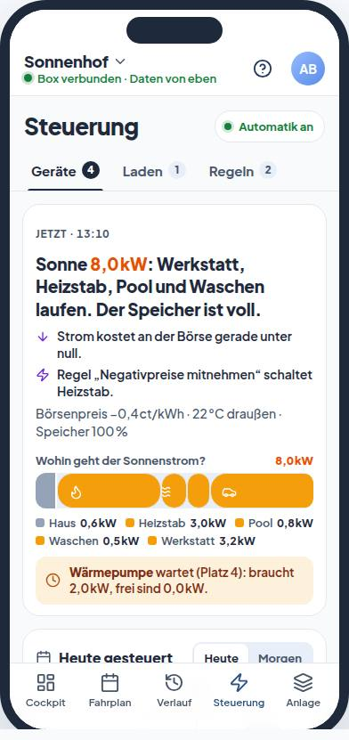
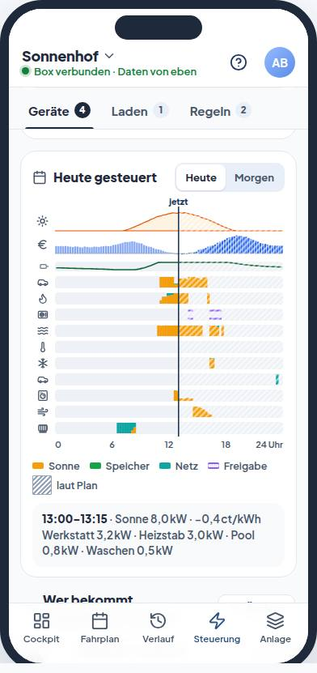
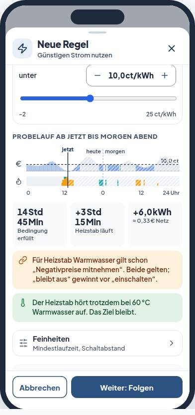
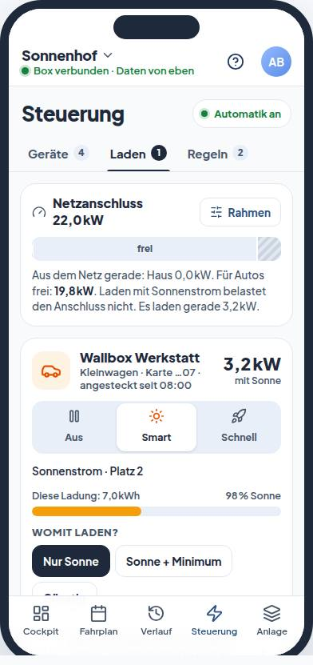

# Steuerung neu gedacht (Konzeptentwurf)

**Status: Entwurf vom 29.09.2026, Fassung 1, noch nicht abgenommen.** Der klickbare Prototyp liegt daneben: [prototyp.html](prototyp.html). Die Datei funktioniert im Browser ohne Server. Alle Zahlen darin sind erfunden. Die Anlage „Sonnenhof“ stammt aus den fiktiven Test-Fixtures.

Zur Besprechung mit Lavish: `npx -y lavish-axi docs/konzepte/steuerung/prototyp.html`. Die offenen Entscheidungen am Ende lassen sich dort als Rückmeldung abschicken; ohne Lavish werden sie in die Zwischenablage kopiert.

<p>




</p>

## Zweck

Vorgaben aus dem Auftrag vom 29.09.2026:

- Die Steuerung ist der eine Ort, an dem Kunden ihre Verbraucher steuern. Beispiel: „Wenn der Börsenpreis unter 10 ct/kWh liegt, schalte Gerät X ein.“
- Das Lademanagement der Wallboxen wird dort zentral verwaltet.
- Reihenfolgen lassen sich anlegen, und Geräte sollen möglichst weit voneinander abhängig gesteuert werden können.
- Die Seite ist intuitiv, interaktiv und fürs Telefon gebaut. Der Anspruch ist ein sehr hohes Niveau.
- Das Konzept zeigt alle Verbraucher, die man in VoltPilot anlegen kann, und was Steuerung im EMS-Sinn bewirken kann.
- Es berücksichtigt, wie andere Produkte das lösen.

## Befunde heute

Aufgenommen mit den Hilfe-Fixtures bei 375 × 812 Pixeln (`e2e/help.html#/anlage/help-site/steuerung`). Die Bilder liegen in `quelle/bilder/heute-*.jpg`. Die Befunde stammen aus Portal, API und Box.

| Thema | Heute | Im Konzept |
|---|---|---|
| Länge | 4.349 px am Telefon (gut fünf Bildschirme), mit zwei Einführungskästen: „Drei Zonen, drei Fragen“ nennt drei Zonen, die Seite hat vier; dazu „Neu: Jedes Gerät hat jetzt eine Steuerart“. | Drei Reiter (Geräte · Laden · Regeln). Die Seite erklärt sich durch Bild und Satz, nicht durch Kästen. |
| Modell | Vier Mechanismen steuern dieselben Geräte: Wenn/Dann-Regel (Flow), Verbraucher-Regel (Policy), Steuerart und Betriebsmodell. | Ein Gerät, drei Zustände (Aus · Smart · Ein), ein Auftrag. Regeln gehören zum Auftrag des Geräts. |
| Telefon | Neue Regeln lassen sich unter 720 px nicht aktivieren. Die Prüfung zum Ausrollen fehlt (`FlowEditorPage.tsx`), der Kartenschalter scheitert mit 409 „Bitte zuerst simulieren“, und dort steht noch „Automation“. | Probelauf und Folgenkarte im Blatt; Aktivieren am Telefon. |
| Reihenfolge | Auf der Box teilen sich nur Ladepunkte (und go-e) den Überschuss nach Rang (`lastmgmt`). Heizstab, Pumpe und Lasten lesen denselben `site.pv_surplus_kw` unabhängig voneinander. In der Oberfläche steckt die Reihenfolge in einem Aufklapper mit 34-px-Knöpfen. | Die Geräteliste ist die Reihenfolge, mit Speicher, ▲ ▼ (44 px) und Griff. Die Folgen stehen vor dem Speichern da. Die Box verteilt an alle Geräte (Stufe 5). |
| Bild | Zeilen mit Zustand und Grund, aber kein Bild vom Tag. Die Jetzt-Zone lädt nicht nach, Fehler bei Eingriffen werden verschluckt. | Jetzt-Kopf mit Sonnenstrom-Leiste und „wer wartet“; Tagesbild mit Plan und Ist aller Geräte, gefärbt nach Herkunft. |
| Baukasten | Höchstens 3 Bedingungen, nur über/unter, Rohnamen wie `soc_pct`, kein Wetter, kein anderes Gerät, keine günstigsten Stunden. Der Börsenpreis ist an die Marktoptimierung gekoppelt. „Solar-Überschuss“ springt auf das falsche Gerät (`templateConsumer()`). | Satzbaukasten mit farbigen Bausteinen, Probelauf über heute und morgen, Hinweise zu Konflikten und Unbekanntem. |
| Laden | Verteilt auf Steuerung, Fahrplan › Ladevorgänge und Geräteseite. Der Anlagen-Standard ist nur lesbar, `priorityChargePointIds` hat keinen Schreibweg, Fahrzeugprofile kennen kein Ziel. Eine go-e aus dem Gerätekatalog wird zur `generic-load` und fehlt im Ladepark. | Reiter „Laden“ mit Aus · Smart · Schnell, Quelle, Ladeziel mit Plan, Netzanschluss-Band, Speicher-Vorrang bis Ladestand und Fahrzeugen. |
| Anlegen | Die Steuerung legt selbst Komponenten an: „Komponente anlegen“ in der Regeln-Kapsel und im Dialog „Neue Regel“ öffnet `VerbraucherAnlegenDrawer` (verbunden oder als Entwurf), neben Anlage › Aufbau. | Die Steuerung legt nichts an. Was in der Anlage verbunden ist, erscheint von selbst; die Steuerung entscheidet nur, was es tut. |
| Ungenutzt | `POST /steuerung-vorschau` nutzen nur die Vorschläge; „Was bringt das?“ erscheint nie. `/consumer-deviation` und der Setzwert beim Eingriff haben keine Oberfläche. | Vorschau für Folgen, Reihenfolge und Probelauf. |
| Schalter | Verbrauchersteuerung ist in API, Optimierer und Box standardmäßig aus: `VOLTPILOT_CONSUMER_CONTROL_ENABLED`, `VOLTPILOT_CONSUMER_POLICY_COMPILER_ENABLED`, `OPTIMIZER_CONTROLLABLE_LOADS_ENABLED`, `VOLTPILOT_V2_PLAN_SITES`, `VP_CONTROL_ENABLED`, `VP_CONSUMER_CONTROL_ENABLED`. | Vor jeder Stufe die Produktionswerte prüfen. |

## Die Idee

### Ein Gerät, drei Zustände, ein Auftrag

- **Aus · Smart · Ein.** Benannt nach dem, was passiert, wie bei evcc seit September 2026. Beim Laden heißt es Aus · Smart · Schnell, bei der SG-Ready-Wärmepumpe Normal · Smart · Anheben, beim Speicher Halten · Smart · Laden.
- **Aus und Ein sind Eingriffe mit Ende.** 30 Min, 1, 2 oder 4 Std, beim Laden „bis Abstecken“; danach übernimmt wieder Smart. Das nutzt die vorhandenen Eingriffe (`/consumers/{id}/override`, `/charging-boost`, `/battery-override`).
- **Smart ist ein Auftrag, lesbar als Satz.** „Heizstab läuft mit Sonnenstrom, bis 60 °C, auch wenn der Börsenpreis unter 0 ct liegt, Platz 3.“ Er hat vier Teile:
  - Womit: die bisherige Steuerart.
  - Ziel: Menge, Laufzeit oder Temperatur bis Uhrzeit.
  - Bedingungen: auch wenn, nie wenn, nur wenn, danach.
  - Platz in der Reihenfolge.

### Wer gewinnt

Schutz › Ihr Eingriff › Regel › Frist und feste Zeit › Reihenfolge. Das entspricht den Rängen auf der Box (`docs/contracts/v2/edge-desired-arbitration.md`). Jede Warum-Zeile nennt die Stufe, die gerade gewinnt. Bei zwei Regeln auf dasselbe Gerät gewinnt „bleibt aus“ vor „einschalten“.

### Vom Wunsch zur Wirkung

Das Blatt jedes laufenden Geräts zeigt vier getrennte Schritte: Wunsch (Plan, Regel, Eingriff), Box hat angenommen (Go-Core, Schutzgrenzen), Gerät hat bestätigt (Relais, Register, OCPP) und Wirkung (gemessen oder „nicht gemessen“). Die SG-Ready-Wärmepumpe zeigt „Freigabe“, nie kW.

### Die Anlage verbindet, die Steuerung entscheidet

Ein Gerät wird genau einmal angelegt, in Anlage › Aufbau:

1. **Anlegen und verbinden.** Dort sagt der Kunde, was es ist (Gerätevorlage, etwa „Spülmaschine“), und wie es angebunden ist.
2. **Schalten freigeben.** Das geschieht bei freigegebenen Modellen von selbst, bei eigenen Schaltgeräten mit dem Schalttest (30 Sekunden).
3. **In der Steuerung entscheiden.** Die Komponente erscheint dort von selbst als Karte „Neu in Ihrer Anlage“. Die Karte enthält einen Vorschlag aus der Gerätevorlage mit seinen Folgen. Der Kunde tippt auf „Übernehmen“, „Anders einstellen“ oder „Nicht steuern, nur messen“.

| Zustand in der Steuerung | Was man sieht | Wo es sich löst |
|---|---|---|
| Neu, noch ohne Auftrag | Karte „Neu in Ihrer Anlage“ mit Vorschlag | hier: Übernehmen, Anders einstellen, Nur messen |
| Gesteuert | Karte in der Liste, Aus · Smart · Ein | hier |
| Nur gemessen | Zeile unter „in der Anlage, noch nicht gesteuert“ | hier: „Steuern“ |
| Schalten nicht freigegeben | Zeile mit Grund („misst nur“) | Anlage › Aufbau: Steuern freigeben |
| Nicht verbunden | Zeile mit Grund | Anlage › Aufbau: Verbindung prüfen |

Der Knopf am Ende der Liste heißt „Gerät fehlt? In der Anlage anbinden“. Er erklärt die drei Schritte und führt nach Anlage › Aufbau.

Die Daten liefern `/verbraucher` (Steuerart, `optionen.schreibbar`) und die Komponenten der Anlage. Ob eine Steuerart schon bewusst gewählt wurde, braucht ein eigenes Merkmal; das heutige `herkunft` unterscheidet nur Anlagen-Standard und abweichend.

Im Prototyp ist die Spülmaschine neu, die Lüftung Werkstatt misst nur und die Sauna ist nicht verbunden.

### Ein Modul, viele Geräte

Beispiel: I/O-Modul Ebyte M31 mit acht Relais-Ausgängen. Drei Ausgänge schalten die drei Stufen eines Heizstabs, fünf weitere Pumpen über potenzialfreie Kontakte.

- **Anlage › Aufbau:** Das Modul zeigt seine Ausgänge als Klemmleiste (DO1–DO8). Je Ausgang wählt man, was daran hängt: „Heizstab Warmwasser, Stufe 1, +1 kW“, „Zirkulationspumpe“ oder „frei“. Neu zugeordnete Ausgänge gehen mit einem Schalttest von 30 Sekunden in Betrieb.
- **Steuerung:** Das Modul taucht dort nicht auf, nur die Geräte dahinter.
  - Der Heizstab ist ein Gerät mit Stufen (1 / 2 / 3 kW) und einer Karte. Die Warum-Zeile lautet etwa „Stufe 2 von 3, 2 kW Sonnenstrom“.
  - Zirkulation, Heizkreis, Brunnen, Zisterne und Teichfilter sind fünf einzelne Geräte mit eigenem Auftrag.
  - Die Ausgangsnummern stehen nur unter „Technik“.
- **Box:** Aus dem Sollwert wird die höchste passende Stufe; die Ausgänge schließen der Reihe nach.
  - Zuschalten einzeln mit Abstand, Abschalten sofort.
  - Mindestlaufzeit und Starts je Ausgang.
  - Der Watchdog öffnet nach 60 Sekunden ohne Verbindung alle Ausgänge.
  - Ein Eingang kann einen ausgelösten Sicherheitstemperaturbegrenzer oder die Rückmeldung einer Pumpe melden.

Heute ist die Grenze: Ein Verbraucher bindet genau einen Ausgang (`consumer_profile.io_entity_id` + `io_channel`, `V20260924120000`). Der Box-Treiber schaltet je Ausgang nur ein oder aus; ein Sollwert unter der Nennleistung heißt aus (`ebyte/control.go`, `PlanFor`).

- **Pumpen** auf fünf Ausgängen gehen also heute schon.
- **Der Stufen-Heizstab** ginge nur als drei einzelne Verbraucher, die denselben Überschuss für sich lesen und dabei takten.

Umbau:

- neue Tabelle für die Ausgänge eines Verbrauchers (Ausgang, Leistung, Reihenfolge; eindeutig je Modul und Ausgang), in die die bestehende Einzelbindung übernommen wird (neue Flyway-Version)
- Registry-Treiber mit einer Liste von Ausgängen (additive Vertragsänderung)
- `PlanFor` für mehrere Ausgänge, mit Tests
- die Klemmleiste als Oberfläche in Anlage › Aufbau

## Aufbau am Telefon

**Reiter „Geräte“**

- **Neu in Ihrer Anlage.** Karten für frisch verbundene Komponenten, mit Vorschlag und Folgen (siehe oben).
- **Jetzt.** Oben steht ein kurzer Satz („Sonne 8,0 kW: Werkstatt, Heizstab, Pool und Waschen laufen. Der Speicher ist voll.“). Darunter stehen Zusätze: negativer Börsenpreis, greifende Regel, Eingriff, Pause.
  - Eine Leiste zeigt, wohin der Sonnenstrom geht, in dieser Folge: Haus mit den nicht gemessenen Geräten, Pflichten, dann nach Reihenfolge, Speicher, Einspeisung.
  - Wer als Nächstes dran wäre, steht dabei („Wärmepumpe wartet (Platz 4): braucht 2,0 kW, frei sind 0,0 kW“).
  - Nachts zeigt der Kopf, woher der Strom kommt und was als Nächstes startet.
- **Tagesbild.** Oben Sonne, Börsenpreis und Ladestand, darunter eine Zeile je Gerät, gefärbt nach Herkunft (Sonne, Speicher, Netz). Freigaben sind umrandet, geplante Viertelstunden schraffiert.
  - Wischen, Tippen oder Pfeiltasten wählen eine Viertelstunde (Umschalt springt eine Stunde, Pos1/Ende, Esc zurück). Der Jetzt-Kopf folgt der Auswahl.
  - Heute und Morgen lassen sich umschalten. Am Rechner stehen die Gerätenamen an den Zeilen.
- **Geräteliste = Reihenfolge.** Die Geräte, die Sonnenstrom nach Reihenfolge bekommen, stehen mit Platznummer oben. Darunter folgt „nach Zeit, Frist oder Preis“.
  - Jede Karte zeigt Zustand, kW, die Warum-Zeile mit nächstem Ereignis („endet um 16:00“) und den Smart-Satz.
  - „Ändern“ öffnet den Reihenfolge-Modus mit Folgen ab jetzt.
  - Am Ende stehen die Komponenten, die in der Anlage vorhanden, aber noch nicht gesteuert sind, und der Weg in die Anlage.
- **Was immer gilt.** Wer gewinnt?, Speicher mit Betriebsmodell, Netzanschluss, § 14a, Negativpreis-Abregelung.

**Reiter „Laden“** (nur mit Ladepunkten)

- Das Netzanschluss-Band zeigt Haus, Laden aus dem Netz, frei und Sicherheitsabstand.
- Je Ladepunkt: Aus · Smart · Schnell, „Womit laden?“ (nur Sonne, Sonne + Minimum, günstig), Ladeziel mit voraussichtlichem Ende und ein Ladeplan über 24 Stunden.
- „Wohin geht der Überschuss zuerst?“ als Satz, mit „Speicher zuerst bis 20/50/80 % oder immer“.
- Fahrzeuge je Ladekarte; Verweis auf die Ladevorgänge.

**Reiter „Regeln“**

- „Neue Regel“, dazu Vorlagen:
  - günstigen Strom nutzen
  - Negativpreise mitnehmen
  - die günstigsten Stunden
  - nur bei Hitze kühlen
  - Speicher schützen
  - nachts Ruhe
- Szenen (Urlaub, Unterwegs, Sparen).
- Regelkarten als Satz, mit Schalter, Zustand und einem Streifen, wann die Bedingung heute gilt.
- „Heute passiert“ mit den Schaltvorgängen der Regeln und Eingriffe.

**Blätter**

- **Geräteblatt:** Aus · Smart · Ein mit Dauer und Folgen vor dem Bestätigen, Jetzt mit Warum und Kette, Heute mit Verlauf und Anteilen.
  - „Smart heißt hier“ mit den Arten, die der Typ kann; neue sind markiert.
  - Dazu Ziel, Bedingungen und Abhängigkeiten, „Speicher darf aushelfen“, Platz in der Reihenfolge und Technik.
- **Regelbaukasten** mit Folgenkarte.
- **Ladeziel.**
- **Netzanschluss:** Ladepark-Rahmen.
- **Speicher:** Betriebsmodell und Reserve.
- **Wer gewinnt?**
- **Szene.**
- **Neues Gerät steuern:** Auftrag für eine neu verbundene Komponente wählen.
- **Gerät fehlt?** Der Weg über Anlage › Aufbau in drei Schritten.
- **Automatik pausieren.**

Blätter nutzen die Form `BottomSheet` am Telefon und `Modal` am Rechner. Auswahlen sind Chips und Stepper, keine nativen Felder (`VpPicker`-Regel).

## Satzbaukasten

Eine Regel ist ein Satz aus antippbaren Bausteinen: **Wenn** (Bedingung, blau) … **dann** (Gerät und Tat, violett). Weitere Bedingungen hängt man mit „und“ oder „oder“ an, höchstens vier; verschachtelt geht es nur im Expertenweg. Vor dem Aktivieren läuft die Regel über heute und morgen zur Probe:

- wann die Bedingung erfüllt ist
- wie lange das Gerät dadurch läuft
- Energie und Netzkosten zum Börsenpreis
- Hinweise: trifft nie zu (mit niedrigstem Preis), Preise für morgen fehlen, andere Regel auf demselben Gerät, Ziel des Geräts, nicht gemessen

Danach kommt die Folgenkarte (Das passiert · Das bleibt · Zurücknehmen) und „Regel aktivieren“.

| Baustein | Einheit | Woher | Stand |
|---|---|---|---|
| Börsenpreis | ct/kWh | `market.spot_price_ct_kwh`, `vp.price.current` | da, im Baukasten an Marktoptimierung gekoppelt |
| Mein Bezugspreis | ct/kWh | `market.import_price_ct_kwh` | da |
| Günstigste Stunden | Std | aus den Preisen vorberechnet wie die Preisfenster (36 h) | Rechnung da, Baustein neu |
| Sonnen-Überschuss | kW | `site.pv_surplus_kw` | da; muss das gesteuerte Gerät herausrechnen |
| Ladestand Speicher | % | `storage.soc_pct` | da |
| Netzbezug/Einspeisung | kW | `site.grid_power_kw` | da |
| Uhrzeit, Wochentage | Uhr | heute nur als Zeitfenster; halboffen, über Mitternacht | als Baustein neu |
| Außentemperatur | °C | `/weather` (`WeatherPointDto`) | Daten da, Signal neu |
| Anderes Gerät läuft | ja/nein | `/consumer-status`, lokal auf der Box | neu |
| Auto angesteckt | ja/nein | `consumer.vehicle_connected` | Signal da, kein Treiber meldet es |
| Messwert eines Fühlers | °C, bar, l/min | Modbus-Eigenbau, `vp.entity.read` | im Expertenweg da |
| Szene | an/aus | Zustand der Anlage | neu |

Taten: einschalten, voll einschalten (Stufen, stufenlos) und sperren. Beim Auto heißt es schnell laden oder nicht laden, bei der Wärmepumpe anheben oder nicht anheben. Die Mindestlaufzeit ist wählbar. Den Schaltabstand (Hysterese) wählt VoltPilot selbst und nennt ihn. Unbekannt startet nie.

## Reihenfolge und Abhängigkeiten

- **Reihenfolge:** Wer oben steht, bekommt Sonnenstrom zuerst. Passt ein großes Gerät nicht, darf ein kleineres weiter unten vor; das sagt die Warum-Zeile.
  - Ein Gerät startet ab seiner Schwelle und hört unter ¾ davon auf.
  - Der Überschuss muss das gesteuerte Gerät herausrechnen. Heute rechnet `site.pv_surplus_kw` es mit ein, sodass sich ein Gerät selbst wieder abschalten kann.
- **Nur wenn:** eine Bedingung am Auftrag („Pool-Wärmepumpe nur, wenn die Poolpumpe läuft“).
- **Nie wenn:** eine Sperre („Klima nie, wenn der Speicher unter 20 % hat“).
- **Danach:** eine Folge („Trockner nach der Waschmaschine“). Der Plan legt den Trockner hinter das Ende; fertig heißt, die gemessene Leistung liegt unter der Ruheschwelle.
- **Nie gleichzeitig:** eine Verriegelung für kleine Anschlüsse. Neu.
- **Szene:** ein Zustand der Anlage, den Regeln abfragen können. Neu.
- **§ 14a und Netzanschluss:** Bei knapper Leistung wird nach Reihenfolge von unten gekürzt.

## Laden

| Im Konzept | Heute im System |
|---|---|
| Aus (bis Abstecken oder Dauer) | `POST /charging-boost` Aktion `pause`, höchstens 240 Min |
| Smart · nur Sonne | Steuerart `ueberschuss`, Modus `pausieren`; Box-Spur `nur_sonne` |
| Smart · Sonne + Minimum | `ueberschuss` + `mindestleistung`; Spur `sonne_zuerst` |
| Smart · günstig | Steuerart `guenstig` |
| Ladeziel +kWh bis Uhrzeit | Ziel `bis_uhrzeit` (`flexible_task`, `required_by_deadline`) |
| Schnell (nur diese Ladung, „immer so“ = Sofort) | Boost `voll` bzw. Steuerart `sofort`; Spur `schnell` |
| Speicher zuerst bis x % | `storage_priority` nur ja/nein; Schwelle neu |
| Fahrzeuge mit Ziel | Profil je Ladekarte nur Sofort/Überschuss; Ziel neu |
| Netzanschluss, Verteilung, Vorrang-Ladepunkte | `/chargers`, `/charging-config`; `PUT` nimmt `priorityChargePointIds` an, die Oberfläche schreibt nur die Grenze |

Den Ladestand des Autos kennt VoltPilot nicht (OCPP meldet ihn höchstens je Ladung). Das Ziel ist deshalb eine Menge in kWh mit ungefähren Kilometern.

Die Aufschrift „Sonne zuerst, Netz wenn günstig“ der Box verspricht eine Preislogik, die `lastmgmt` nicht hat. Das Konzept trennt deshalb „Sonne + Minimum“ und „günstig“.

## Alle Gerätearten

Die sieben steuerbaren Komponententypen aus `services/api/src/main/resources/entitytypes/catalog.json`, dazu die übrigen Typen. Steuerarten laut `SteuerartSatz.java`.

| Typ | Befehle | Gemessen | Smart heute | Neu im Konzept |
|---|---|---|---|---|
| Wallbox `wallbox` | Ladestrom, ein/aus, Grenze; go-e 1-/3-phasig | Leistung, Energie | Sofort, Überschuss (nur Sonne / + Minimum), günstig; Ziel kWh bis | Aus · Smart · Schnell; go-e aus dem Katalog als Wallbox |
| Ladepunkt `ev-charger` | Ladegrenze (OCPP 1.6J), Start/Stopp, Karten | Leistung, Energie, Ladestand je Ladung | wie Wallbox | Ziel je Fahrzeug, Speicher-Vorrang bis Ladestand |
| Heizstab `heating-rod` | ein/aus, Sollwert, Grenze | Leistung | Überschuss, feste Zeiten, günstig, ohne; Laufzeit bis | Ziel in °C mit Fühler, Stufen eingeben |
| Wärmepumpe `heat-pump-sgready` | Anheben (SG-Ready 3) | nichts | Freigabe bei Überschuss/günstig, ohne | Normal · Smart · Anheben; Freigabe im Tagesbild ohne kW |
| Pumpe `pump` | ein/aus, Sollwert, Grenze | Leistung | feste Zeiten, ohne; Laufzeit bis | Sonne zuerst mit Laufzeit bis Uhrzeit |
| Steuerbare Last `generic-load` | ein/aus, Grenze kW oder % | Leistung | Überschuss, feste Zeiten, günstig, ohne | Frist („fertig bis“), Programm am Stück, „danach“ |
| Eigenes Schaltgerät `modbus-load` | ein/aus oder Sollwert nach Schalttest | selbst definiert | wie Steuerbare Last | wie Steuerbare Last |
| Speicher `battery-hybrid` | Sollwert, Grenze | Leistung, Ladestand | Betriebsmodell, Rangliste | Vorrang bis Ladestand; Halten/Laden als Eingriff |
| PV `producer` | Grenze kW oder % | Leistung | nur Schutz | bleibt Schutz, sichtbar |

Kunden denken nicht in Typen. Das Konzept schlägt deshalb **27 Gerätevorlagen** in Kundensprache vor (`quelle/geraete.js`, `KATALOG`). Der Kunde wählt sie beim Anlegen in der Anlage („Was ist das?“); die Steuerung macht daraus den Smart-Vorschlag. Jede Vorlage hat Typ, Fähigkeiten, Smart-Vorschlag, Anbindung und Stand:

- **Laden:** Wallbox (go-e), Ladepunkt (OCPP), E-Bike-/Rollerlader.
- **Wärme und Kälte:** Heizstab, Wärmepumpe (SG-Ready), Warmwasser-Wärmepumpe, Infrarot-/Elektroheizung, Klimagerät, Nachtspeicherheizung.
- **Haushalt:** Waschmaschine, Wäschetrockner, Spülmaschine, Gefriertruhe.
- **Garten, Pool und Wasser:** Poolpumpe, Pool-Wärmepumpe, Zirkulationspumpe, Bewässerung/Brunnenpumpe.
- **Betrieb und Gewerbe:** Ladepark, Kühlraum/Kälteanlage, Druckluft-Kompressor, Lüftung, Prozesswärme.
- **Eigenbau und Sonstiges:** eigenes Schaltgerät (Modbus), freier Schaltausgang, Steuerbare Last.
- **Anlage selbst:** Batteriespeicher, PV-Wechselrichter.

Nicht angebunden sind heute EEBus, die SG-Ready-Zustände 1 und 4, Hersteller-Schnittstellen von Wärmepumpen, stufenlose Heizstab-Regler (my-PV, Ohmpilot), ein § 14a-Empfänger, ISO 15118 und V2G. Treiber gibt es für go-e, Shelly, Ebyte M31, OCPP und selbst gebaute Modbus-Schalter.

## Was Steuerung bewirken kann

Sechs Ziele, im Prototyp mit Beispielsätzen und Stand:

- **Sonne selbst nutzen:** Heizstab bis 60 °C, Auto nur Sonne, Wärmepumpe anheben, Überschuss nach Reihenfolge verteilen.
- **Kosten senken:** Börsenpreis unter x, die günstigsten Stunden, Negativpreise mitnehmen, Marktoptimierung.
- **Komfort sichern:** Ladeziel bis Abfahrt, Poolpumpe 6 Std am Tag, Waschmaschine fertig bis, danach Trockner, Szene Urlaub.
- **Netz schonen und Pflichten:** Netzanschluss, § 14a mit Band und Verlauf, Einspeisegrenze, Negativpreis-Abregelung, Verriegelung.
- **Speicher klug einsetzen:** Vorrang bis Ladestand, nicht ins Auto entladen, Reserve per Regel, Halten/Laden als Eingriff.
- **Gewerbe:** Lastspitze mit Lastabwurf, Ladepark mit Vorrang, Kälte als Speicher, Prozesswärme bis Schichtbeginn.

## Wie es andere machen

Quellen sind Anleitungen, Versionshinweise, Übersetzungsdateien und Foren (Stand 29.09.2026). Die Bildschirme sind aus den Quellen erschlossen, nicht selbst bedient. Links stehen im Prototyp.

- **evcc** (v0.316): Aus · Smart · Schnell, Sonnenanteil-Regler statt Watt, Speicher-Vorrang als Satz, Warum-Zeile mit Countdown, § 14a-Band mit Verlauf.
- **SMA Sunny Home Manager:** Laufzeitfenster „muss/kann“, Tagesbild angefragt (hell) gegen gelaufen (dunkel). Die Priorität als Regler zeigt die entstehende Reihenfolge nicht.
- **SOLARWATT Manager flex, Solar Manager:** Prioritätsliste mit Griff; ein kleineres Gerät darf vor.
- **SolarEdge ONE:** veröffentlichte Rangfolge Manuell › Zeitplan › Smart Save › Überschuss.
- **Home Assistant 2026.7:** Automationen nach Absicht mit Zweck-Bausteinen, Verlauf der letzten Läufe, Vorlagen.
- **Homey:** Kunden bestimmen, was günstig heißt. Und- und Dann-Karten sind schwer zu unterscheiden, daher im Konzept farbige Bausteine.
- **OpenEMS/FEMS:** Betriebsweisen als Apps; Tarif-Bänder über den Preisbalken.
- **Tibber, Octopus, Victron, Enphase:** Ziel und Abfahrt sind gelernt. Häufige Klagen: Auto morgens nicht geladen, fremde Zeitpläne, KI ohne Warum.

Übernommene Muster:

- benannt nach dem Ergebnis
- Ziele statt Mechanik
- eine sortierbare Liste
- Folgen live
- Warum mit Zeit
- Eingriffe laufen aus
- Netzbetreiber-Ereignisse sichtbar
- Vorlagen vor freien Regeln

## Regeln im Bild

- Wunsch, Auftrag, Geräteantwort und Wirkung bleiben getrennt.
- Unbekannt ist keine Null: „nicht gemessen“, „—“ mit Grund. Fehlen die Preise für morgen, schaltet eine Preisregel dort nicht.
- Gemessenes ändert sich nie; neue Einstellungen rechnen ab jetzt.
- Folgen vor jedem Aktivieren (Regel, Szene, Eingriff, Reihenfolge, Betriebsmodell). Ausschalten fragt nie nach.
- Jeder Eingriff hat ein Ende.
- Farbe heißt Herkunft: Sonne orange, Speicher grün, Netz petrol; schraffiert ist Plan. Wort und Legende tragen die Bedeutung mit.
- Keine Taste, die nicht wirken kann: ohne Freigabe oder Verbindung steht dort der Grund.
- Kundensprache laut Glossar: Regel, Betriebsmodell, Komponente, Ladestand, Börsenpreis.
- Bedienbar ohne Ziehen: 44-px-Pfeile, Tastatur im Tagesbild, Haptik nur als Zugabe (`haptik.ts`).
- Einheit am Wert: kW, kWh, ct/kWh; € nur als Näherung zum Börsenpreis.

## Daten und Umsetzung

| Angabe | Quelle | Stand |
|---|---|---|
| Jetzt, Warum | `/consumer-status` (Grundcodes), `/control-status`, `/schedule` | vorhanden |
| Tagesbild gemessen | `/history?range=day`, Verlauf je Komponente | vorhanden, Last prüfen |
| Tagesbild Plan | `/consumer-schedule` (v2-Plan, 15 Min) | vorhanden, im Portal ungenutzt |
| Reihenfolge | `/verbraucher` (Rangliste), `PUT /rangliste` | vorhanden |
| Folgen, Probelauf | `POST /steuerung-vorschau`, Flow-Simulation | vorhanden, auf Regelentwürfe erweitern |
| Eingriffe | `/consumers/{id}/override`, `/charging-boost`, `/battery-override`, `/automation-pause` | vorhanden |
| Laden | `/chargers`, `/charging-config`, `/fahrzeuge` | Backend da, Oberfläche neu |
| Smart-Auftrag | `PUT /verbraucher/{id}/steuerart`, `consumer_policy` (Baum `any`/`all`/`not`, `reset_value`) | vorhanden, Baukasten neu |
| Neue Signale | Außentemperatur, anderes Gerät, günstigste Stunden, fertig, Szene | neu |

Die Stufen sind so geschnitten, dass jede allein ausgeliefert werden kann:

1. **Reiter und Jetzt, ohne neues Backend.**
   - Reiter, Jetzt-Kopf mit Leiste, Warum-Zeile aus den Grundcodes, Nachladen alle 10 s, sichtbare Fehler.
   - Geräteliste als Rangliste mit ▲ ▼ und Griff, Folgen über `/steuerung-vorschau`.
   - Aus · Smart · Ein auf die vorhandenen Eingriffe gelegt; die Einführungskästen entfallen.
   - „Komponente anlegen“ verlässt die Steuerung. Neue Komponenten erscheinen als „Neu in Ihrer Anlage“, nicht steuerbare mit Grund und Weg in die Anlage.
2. **Tagesbild.** Gemessen aus dem Verlauf, geplant aus `/consumer-schedule`, dazu Bedienung per Wischen und Tasten. Zu prüfen sind die Last und leere Pläne ohne v2.
3. **Laden an einem Ort.**
   - Reiter Laden.
   - `PUT /charging-config` für Vorrang-Ladepunkte und Speicher-Vorrang.
   - Schwelle „Speicher bis x %“ (Box-Spur, Migration).
   - go-e aus dem Katalog als `wallbox`.
4. **Satzbaukasten am Telefon.**
   - Ein Baukasten auf `consumer_policy` statt Flow-Builder und Verbraucher-Regel.
   - Probelauf, Folgenkarte und Aktivieren im Blatt.
   - Börsenpreis ohne Kopplung (E5); der freie Editor bleibt.
5. **Neue Bausteine und Verteiler.**
   - Signale für Temperatur, anderes Gerät, günstigste Stunden und fertig.
   - Überschuss nach Rang für alle Geräte in der Box; `site.pv_surplus_kw` ohne das gesteuerte Gerät.
   - Ziel in °C, Frist für Steuerbare Lasten, Sonne für Pumpen.
6. **Szenen, Gewerbe, Netzbetreiber.** Szenen mit Ende, Verriegelung, Lastabwurf, § 14a-Band mit Verlauf (Empfänger später) und Benachrichtigungen, sobald es einen Zustellweg gibt.

Risiken:

- **Sechs Schalter:** Ohne die Produktionswerte der Flags zeigt die Seite Wünsche, die nie ankommen.
- **Ohne Cloud:** Offline führt die Box heute nur Fristen aus. Neue Regeln müssen als lokale Knoten laufen oder ihr Offline-Verhalten nennen.
- **Schreibfreigabe je Modell:** Die meisten Typen sind `simulator_only`; Simulatornachweise ersetzen keinen Prüfstand.
- **Ein Steuerer je Gerät (V-5):** bleibt gewahrt, weil alle Bedingungen im einen Auftrag des Geräts landen.
- **Datenbank und Vertrag:** Neue Felder brauchen neue Flyway-Versionen (nie alte ändern), neue Signale eine additive Vertragsversion mit Vektoren.

## Offene Entscheidungen

Der Prototyp zeigt jeweils Option A.

- **E1 · Bedienung eines Geräts.** A: Aus · Smart · Ein je Gerät. B: Steuerart-Karten wie heute, Eingriffe im Menü.
- **E2 · Reichweite der Reihenfolge.** A: alle Geräte und Speicher; die Box verteilt an alle. B: nur Ladepunkte und Speicher wie heute.
- **E3 · Ort der Regeln.** A: im Auftrag des Geräts, Übersicht im Reiter Regeln. B: eigene Objekte wie heute, eine je Gerät.
- **E4 · Reiter.** A: Geräte · Laden · Regeln. B: eine lange Seite mit Sprungmarken.
- **E5 · Börsenpreis für jede Anlage.** A: ja, mit Hinweis auf den eigenen Tarif. B: nur mit Marktoptimierung wie heute.
- **E6 · Szenen.** A: Urlaub, Unterwegs, Sparen mit Ende. B: keine.
- **E7 · Ladeziel.** A: kWh bis Uhrzeit. B: Ladestand in %, wo das Auto ihn meldet.
- **E9 · Mehrere Ausgänge je Gerät.** A: ja, ein Gerät mit Stufen über mehrere Ausgänge. B: je Ausgang ein Gerät wie heute.
- **E8 · Was der Kunde beim Anlegen in der Anlage sagt.** A: Gerätevorlage in Kundensprache; die Steuerung macht daraus den Vorschlag. B: technischer Typ wie heute, ohne Vorschlag.

## Prototyp

Der Prototyp ist eine einzelne HTML-Datei. Er bettet die Portal-Schriften (Plus Jakarta Sans, Inter) aus `frontend/portal/designsystem/assets` und die Aufnahmen aus `quelle/bilder` ein. Die Quellen in `quelle/`:

| Datei | Inhalt |
|---|---|
| `daten.js` | Börsenpreis, PV-Prognose, Grundlast und Außentemperatur für heute und morgen (je 96 Viertelstunden) |
| `geraete.js` | Beispielanlage mit echten Komponententypen, Reihenfolge, Regeln, Vorlagen, Szenen, Gerätevorlagen (`KATALOG`) |
| `sim.js` | Die Rechnung: je Viertelstunde Pflichten, Regeln, Eingriffe, Verteilung des Sonnenstroms nach Reihenfolge, Speicher, Netzanschluss; Fristen in zwei Durchläufen geplant; Änderungen rechnen ab „jetzt“ |
| `ui-*.js`, `app.js` | Oberfläche: Reiter, Blätter, Tagesbild, Baukasten, Laden, Konzeptseite |
| `style.css`, `body.html` | Aussehen (Variante-C-Tokens, Energie-Rollen) und Konzepttext |

Neu bauen:

```bash
python3 docs/konzepte/steuerung/build.py
```

Die Rechnung ist eine Veranschaulichung, kein Optimierer. Sie plant mit Prognosen, als wären sie sicher, und kennt keine Rampen. Die Wärmepumpe verbraucht bei Freigabe angenommene 1,5 kW, die nirgends als Messung erscheinen.
