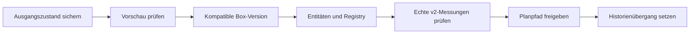

# Eine Anlage auf v2 umstellen

Betreiberablauf für bestehende v1-Anlagen. v2 umfasst Entitäten, Telemetrie, Flows und ausführbare Pläne; es ist kein generell passiver Schattenpfad mehr. [Verträge](contracts/v2/README.md) · [Ausführungshoheit](contracts/v2/plan-execution-ownership.md)

## Vorbereiten

- DB-Backup und vorherigen Stand von Entitäten, Zuordnungen, Flows, Flags und Image-Digests sichern. Auswirkungen auf aktive Geräte in einem abgestimmten Wartungsfenster prüfen.
- API-Migrationen, MQTT-ACL für `v2/#`, Gateway-Zuordnung und kompatible Core-/Node-RED-Version prüfen. Produktionsprofil ist leer; `local` lädt Demodaten.
- `VOLTPILOT_V2_PLAN_SITES` enthält kommagetrennte Anlagen-UUIDs. Ein ungültiger Eintrag kann den **gesamten** Optimierungslauf abbrechen.
- Konfigurationsänderungen über den tatsächlich verwendeten [Deploymentpfad](deploy.md) ausrollen. Keine zusätzliche VM-Optimierung neben dem Cluster starten.

## Schritte je Anlage

Alle folgenden Verwaltungsrouten liegen unter `/api/v1/admin/sites/{siteId}/v2-entities` und benötigen Admin-Authentifizierung. Bei mandantenbezogenen Kundenrouten gilt zusätzlich der jeweilige Tenant-Kontext.

| Schritt | Route / Aktion | Prüfen |
|---|---|---|
| 1. Vorschau | `GET /preview` | Typen, Rollen, Grenzen, Gateway und ausgelassene Stammdaten |
| 2. Box aktualisieren | Regulärer [OTA-Pfad](ota-autonomie.md) | Version, Selbsttest, lokale Oberfläche, Cloud-Verbindung |
| 3. Übernehmen | `POST /bootstrap` | Entitäten gegen Vorschau prüfen; Registry-Push bestätigen |
| 4. Bei Bedarf erneut senden | `POST /push` | Cloud-Publish und tatsächliche Übernahme auf der Box getrennt prüfen |
| 5. Planung freigeben | Anlagen-ID in `VOLTPILOT_V2_PLAN_SITES` | v2-Plan, Ausführungsmodus und Messwirkung prüfen |
| 6. Historie umstellen | `PUT /history-cutover`, `{}` für jetzt oder `{"at":"<ISO-Zeit>"}` | Erst nach belegter v2-Telemetrie setzen |

Vorschau schreibt nichts. Bootstrap ist wiederholbar, kann bestehende Einträge aber aus aktuellen Stammdaten aktualisieren. Bereits vorhandene Verbraucher außerhalb der Pilottypen in `skipped[]` sind nicht automatisch Fehler.

Entitätszeilen beeinflussen die Portalansicht bereits **ohne** Optimierungsflag. Nach dem Registry-Push können Ansichten bis zur ersten passenden Telemetrie leer sein. Bei ausbleibenden Werten: Gateway, ACL, Registry-Annahme und Entitäts-IDs prüfen.

## Abnahme

Cockpit/Topologie, Messwerte, Fahrplan, Geräteantwort und wirtschaftliche Ansicht am selben Zeitraum prüfen. Ein publizierter Plan oder grüner Registry-Push allein reicht nicht. Fehlende Messungen bleiben Lücken.

Die Historienbrücke kopiert keine Daten: Buckets mit Beginn vor dem Cutover lesen v1, ab dem Cutover v2. Eine Stunden-/Tagesgrenze erleichtert den Vergleich. Vollständige Netz-/Lastreihen benötigen passende Zählerentitäten und Messungen.

## Rücknahme

1. Betroffene Planung und Flows kontrolliert stoppen beziehungsweise auf den gesicherten Zustand zurückführen; retained Aufträge und deren Ablauf berücksichtigen.
2. Den Historien-Cutover bei Bedarf mit `DELETE /history-cutover` entfernen.
3. Entitäten und Zuordnungen gegen den gesicherten Ausgangszustand vergleichen. **Keine pauschale Löschung aller Anlagenentitäten:** inzwischen können Verbraucher, Messauswahlen und Kundenregeln daran hängen. Nur Änderungen dieser Umstellung gezielt zurücknehmen.
4. Falls nötig kompatible, bekannte Images wiederherstellen und reale Mess-/Steuerpfade prüfen. Kein automatisches Schema-Downgrade.

Flag und Cutover zurückzusetzen stellt die v1-Oberfläche nicht allein wieder her; dafür ist auch der Entitätszustand maßgeblich. Eine pauschale Zusage „keine Auswirkungen auf Erlöse oder Steuerung“ ist für heutige v2-Anlagen nicht haltbar.

`no_gateway_device` im Preview bedeutet: Die gespeicherte führende Box (`site.lead_device_id`) ist nicht mehr an dieser Anlage registriert. Die führende Box erneut auswählen; `LeadDeviceService` weicht nicht automatisch auf eine andere aus.
