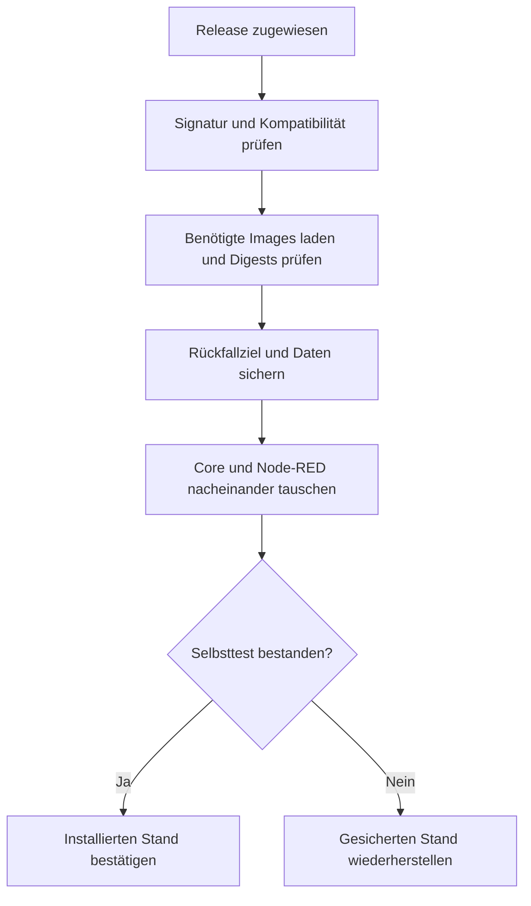

# Edge-Updates bedienen

In der Plattform-Geräteverwaltung das gewünschte Release und die Boxen wählen und **Aktualisieren** auslösen. Die Zuweisung bleibt gespeichert; eine offline befindliche Box übernimmt sie nach Wiederverbindung.

## Ablauf auf der Box



Die Geräte benötigen keine zweite Apply-Freigabe und keinen Autonomie-Schalter. Der Updater ist ein regulärer Dienst. Signaturen, Schutz gegen unzulässigen Versionsrückschritt, kompatibles Datenformat und ausreichender Speicher bleiben Voraussetzungen.

## Status richtig lesen

| Information | Bedeutung |
|---|---|
| Neueste Version | Neuester Eintrag im Release-Register |
| Ziel | Dieser Box zugewiesenes Release |
| Installiert / gemeldet | Von der Box berichtete Softwarestände |
| Bestätigt | Zugewiesener Stand und erforderlicher Selbsttest erfolgreich belegt |
| Fehlgeschlagen / zurückgenommen | Gerätegrund und Journal prüfen; andere Boxen können weiterlaufen |

Eine bestätigte Box muss nicht auf dem neuesten Release sein. Core und Palette haben eigene Versionsmeldungen; fehlende Meldungen nicht durch das Ziel ersetzen.

## Fehlersuche

1. Ziel, Geräteverbindung und konkreten Grund im Portal prüfen.
2. Bei Signaturfehlern Trust-Set, eingebackene Wurzel und unveränderte Manifestbytes prüfen.
3. Bei Downloadproblemen Registry-Zugang und Speicherplatz prüfen. Installer/Updatepfad übernehmen vorhandene geeignete Registry-Anmeldedaten; Credential-Helper benötigen gegebenenfalls den dokumentierten manuellen Weg.
4. Bei Rücknahme die Selbsttest-/Crashloop-Belege des neuen Containers prüfen. Historische Neustarts des alten Stands sind kein Beleg für das neue Release.
5. Nach Behebung erneut zuweisen. Ein protokollierter Fehlschlag ist keine permanente Sperre für jede spätere Zuweisung.

```bash
# Auf der Box; reine Diagnose:
docker compose logs --tail=100 updater core
curl -fsS http://127.0.0.1:8484/api/ota/target
```

## Wiederaufnahme und Rückfall

Der Updater schreibt einen dauerhaften Fortschrittszustand vor dem Tausch. Neustarts müssen denselben Vorgang fortsetzen. Images werden vor dem Stoppen geladen; Rückfallbelege umfassen lokale Images/Container und Datensicherung. Eine Rücknahme darf nicht von erreichbarer Registry abhängen.

Die Prüfung des neuen Stands wartet auf die nötigen Komponententausche und vergleicht die tatsächlichen Build-Stempel. Der Anti-Rollback-Boden darf die bereits bestätigte, unveränderte Zuweisung nicht erneut blockieren.

Für einen gezielten manuellen Wiederherstellungsweg `update.sh --help` und die geprüfte lokale Zuweisung verwenden; das Skript bietet `--from-target`. Kein geratenes Image-Tag aus einer Zwischenablage übernehmen.

## Weitere Informationen

[Signaturen, Veröffentlichung und Rotation](ota-signing.md), [Installer](../edge-app/DEPLOY.md), [OTA-Soak-Prüfstand](../edge-app/test/ota-soak/README.md).

Quellen: `internal/otaapply`, `internal/otaupdater`, `internal/otaverify` im [Core](../edge-app/core/), API-`RolloutService` und Portal-Geräteverwaltung.
