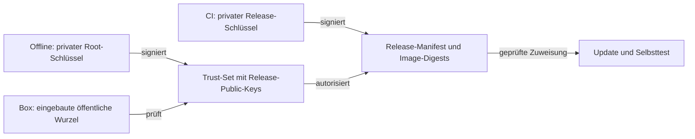

# OTA-Signaturen und Schlüssel

Jede Box prüft ein Release gegen ihre eingebaute öffentliche Wurzel. Die Veröffentlichung eines Releases und seine Zuweisung an Geräte sind getrennte Schritte.

## Vertrauenskette



- Die private Wurzel bleibt außerhalb von CI und Geräten. Release-Schlüssel dürfen in CI liegen.
- Ed25519 und getrennte Signaturdateien sind verbindlich. Signiert werden **exakte Dateibytes**, vorangestellt mit `voltpilot-ota-release-v1\n` beziehungsweise `voltpilot-ota-trust-set-v1\n`.
- Signierte Dateien nicht umformatieren, als JSON neu serialisieren oder aus Logs rekonstruieren.
- Release-Sequenz, `min_from_seq`, `allow_downgrade` und Datenformat schützen vor unzulässigen Rückschritten. `valid_until` ist kein verlässliches Sperrkriterium auf Geräten ohne verlässliche Uhr.

Verträge: [Manifest](contracts/ota-release-manifest.schema.json), [Signatur](contracts/ota-signature.schema.json). Implementierung: `otaverify.SigningInput` und `Verify` im [Core](../edge-app/core/internal/otaverify/).

## Werkzeug und erstmalige Schlüssel

```bash
cd edge-app/core
go build -o /tmp/vp-ota ./cmd/vp-ota
/tmp/vp-ota --help
```

In einem eigenen geschützten Verzeichnis, auf dem für die Root-Zeremonie vorgesehenen Offline-System:

```bash
vp-ota keygen --id root-a --role root --out .
vp-ota keygen --id release-a --role release --out .
vp-ota trust-set --key release-a.pub --out trust-set.json
vp-ota sign --key root-a.key --domain trust-set --in trust-set.json
```

Hier bezeichnet `vp-ota` das zuvor gebaute Werkzeug im eigenen PATH. Den öffentlichen Root-Key in `internal/otaverify/rootkeys.json` eintragen und das initiale Image über den vertrauenswürdigen Einrichtungsweg verteilen. Private `.key`-Dateien nicht ins Repository übernehmen. Das Trust-Set und seine Signatur gehören nach [edge-app/ota](../edge-app/ota/README.md).

## Reguläre Veröffentlichung

Der [Edge-Workflow](../.forgejo/workflows/edge-images.yaml) reagiert auf die vorgesehenen Edge-Tags beziehungsweise seine manuelle Release-Eingabe. Er baut Images, erstellt das Manifest, signiert, prüft und veröffentlicht die Release-Dateien. Die tatsächlich benötigten Tag-/Workflowparameter stehen im Workflow und in `tools/ota/release-publish.sh`.

| Eingabe | Zweck |
|---|---|
| `VP_OTA_RELEASE_KEY` | Privater Release-Schlüssel, niemals Root-Key |
| `VP_OTA_PUBLISHER_CLIENT_SECRET` | Keycloak-Dienstkonto zum Veröffentlichen |
| `VP_OTA_FORGEJO_TOKEN` oder Registry-/Forgejo-Zugang | Release-Assets und gegebenenfalls Tag-Push |
| `edge-app/ota/trust-set.json` und `.sig` | Root-signierte Zulassung der Release-Schlüssel |
| `edge-app/core/otastate.schema` | Version des persistenten Edge-Datenformats |

Ein Tag-Push mit einem ungeeigneten Actions-Token kann den nächsten Workflow nicht auslösen. Dafür den vorgesehenen echten Forgejo-Zugang des Workflows verwenden. Fehlende Signier-/Publisher-Secrets können Veröffentlichungsschritte auslassen; Workflow-Zusammenfassung und Release-Register prüfen.

Das Dienstkonto `edge-release-publisher` darf Releases und das öffentliche Trust-Set veröffentlichen, aber keine Geräteziele oder Rollouts setzen. Die Serverprüfung ist kein Ersatz für die kryptografische Verifikation auf der Box.

## Manueller Signierpfad

Ein Manifest mit `vp-ota manifest --help` aus **unveränderlichen Image-Digests**, korrekter Sequenz und `state_schema` erzeugen. Anschließend:

```bash
vp-ota sign --key release-a.key --domain release --in release.json
vp-ota verify --root baked --trust-set trust-set.json --manifest release.json
```

Zum Veröffentlichen den vorhandenen Helper `tools/ota/release-publish.sh` nutzen; dessen Hilfe nennt Eingaben und Authentifizierung. Manifest und Signatur unverändert als Assets und API-Registerinhalt transportieren. Das passende `vp-ota`-Binary muss die tatsächlich verwendete Root-Wurzel enthalten.

## Trust-Set auf Geräte bringen

Die API liefert die Rohdateien über `/api/v1/edge/trust-set/trust-set.json` und `.sig`. Der Installer lädt sie beim Einrichten; Bestandsboxen können sie gezielt mit `./install.sh --refresh-trust` übernehmen.

Die API speichert/formprüft die Veröffentlichung; **die Box prüft die Signatur**. Ein neues Trust-Set im Portal bedeutet daher noch keine erfolgte Übernahme durch jede bestehende Box. Der laufende OTA-Kanal darf weder Trust-Set noch eingebettete Wurzel als Teil seines eigenen Downloads ersetzen.

## Rotation und Verlust

| Situation | Vorgehen |
|---|---|
| Release-Schlüssel ablösen | Neuen Release-Key erzeugen, neues Trust-Set mit Root signieren, über Einrichtungsweg verteilen; erst danach damit signierte Releases zuweisen |
| Release-Schlüssel kompromittiert | Alten Key aus dem neu signierten Trust-Set entfernen; Verteilung und tatsächliche Übernahme auf den Boxen prüfen |
| Fehlerhafte Rotation | Vorheriges weiterhin vertrauenswürdiges Trust-Set über denselben unabhängigen Weg zurückspielen und Geräteprüfung wiederholen |
| Root-Key verloren | Sichere vorhandene Sicherung verwenden; ohne sie kann kein neues Trust-Set autorisiert werden |
| Root-Key kompromittiert | Neue Wurzel über einen unabhängig vertrauenswürdigen Einrichtungsweg verteilen; der kompromittierte OTA-Pfad kann seine Vertrauensbasis nicht selbst reparieren |

Das erste Image mit eingebauter Wurzel benötigt einen vertrauenswürdigen Bootstrap. Dieser Vertrauensübergang lässt sich nicht rückwirkend durch eine OTA-Signatur beweisen.

## Prüfung

```bash
bash tools/ota/test-release-publish.sh
bash tools/ota/test-release-workflow.sh
```

Dazu Go-Tests für `otaverify` und die [OTA-Fehlermatrix](../edge-app/test/ota-soak/README.md). Die Bedienung der Geräteziele steht im [Update-Handbuch](ota-autonomie.md).
