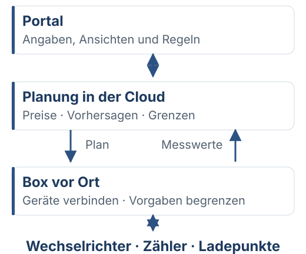
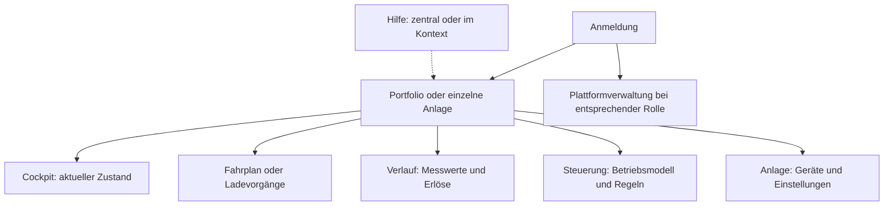

# Portal und Bedienmodell

Das Portal trennt Portfolio, einzelne Anlage und Plattformverwaltung. Welche Ansichten eine Anlage anbietet, ergibt sich aus ihren Komponenten und Betriebsfunktionen.

## Orientierung

Leere Bereiche werden nicht angeboten. Eine reine Ladeanlage kann Ladevorgänge anstelle eines Speicherfahrplans anzeigen. Unterseiten bleiben der gewählten Anlage zugeordnet; alte Routen werden gezielt umgeleitet.

Quellen: [Navigation](../frontend/portal/src/ebenenNav.ts), [Router](../frontend/portal/src/nav.ts), [Anlagenprojektion](../frontend/portal/src/surface.ts).

## Fachliche Grenzen

| Anzeige | Bedeutung |
|---|---|
| Aktueller Messwert | Gemessener Wert mit Datenalter; fehlend ist nicht null kW |
| Prognose | Erwartete Entwicklung, keine Messung |
| Fahrplan | Geplante Handlung; Guards können ihre Ausführung begrenzen |
| Bestätigter Auftrag | Annahme oder Geräteantwort; Wirkung braucht passende Rückmeldung |
| Erlöse / Ersparnis | Wirtschaftliche Einordnung eines Zeitraums mit den verfügbaren Daten |
| Gerätefreigabe | Modell-/gerätebezogene technische Freigabe, keine pauschale Herstellerzusage |

Geräteansichten führen über stabile Box-/Gerätereferenzen. Die physische Zielkomponente muss bei Registerzugriffen ausdrücklich bestimmt sein; eine Registeradresse allein ist kein Ziel.

## Steuerung und Geräte

Betriebsmodelle, Regeln und zeitlich begrenzte Handeingriffe werden in der Steuerung erklärt. Geräteeigenschaften und Messpunktauswahl gehören an die jeweilige Komponente. Änderungen müssen ihre wirkliche Wirkung und Voraussetzungen nennen.

Die Plattform-Geräteverwaltung öffnet mit Updates; Registrierung ist ein weiterer Reiter. Gemeldete Version, zugewiesenes Ziel und neuestes Release sind unterschiedliche Angaben. Eine bestätigte Installation ist nicht automatisch das neueste verfügbare Release.

## Hilfe und Abbildungen

`#/hilfe` öffnet die globale Hilfe; `#/hilfe/<artikel>` verlinkt direkt. Die kontextuelle Hilfe bleibt über einem Formular geöffnet, ohne dessen Eingaben zu verlieren. Sie darf nicht von erfolgreichen Anlagenabfragen oder abgeschlossenem Onboarding abhängen.

Die Hilfe verwendet dieselben Artikel im Zentrum und Dialog. Screenshots zeigen echte React-Komponenten mit eingefrorenen Beispieldaten; Erklärnummern sind separat zugängliche Beschriftungen. Workflow: [Hilfe bearbeiten](../frontend/portal/src/help/README.md).

## UI-Regeln für Änderungen

- Gemeinsame Komponenten, Tokens und Icons aus dem vorhandenen Designsystem verwenden.
- `VpPicker` für die vorhandene Auswahlinteraktion nutzen; API- und UI-Validierung zusammen halten.
- Fehler am Feld zeigen, erstes fehlerhaftes Feld fokussieren; `Input` reicht den Ref weiter.
- Schließen von Dialogn und Screenshot-Dialogen stellt den Fokus wieder her. Verschachtelte Overlays dürfen kein darunterliegendes Formular schließen.
- Auf Mobilgeräten Headerhöhe aus dem Layout entstehen lassen; keine geratenen Sticky-Offsets. Tabellen innerhalb ihres Rahmens scrollen lassen.
- Help-/Geräte-/Anlagen-Links einschließlich Queryparametern und Zurücknavigation erhalten.
- Messwerte und geplante Geldwerte nicht durch Farben allein unterscheiden; Beschriftung, Einheit und Datenstand nennen.

Tests: Navigation und `AppShell`, gezielte Komponenten-Tests sowie die Browserfälle `help`, `shell-layout`, `mobile-ui` und `box-updates`. Der [Portal-README](../frontend/portal/README.md) nennt die Befehle.
