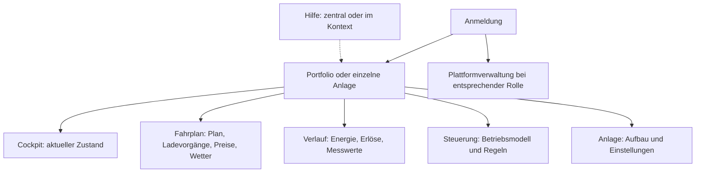

# Portal und Bedienmodell

Das Portal trennt Portfolio, einzelne Anlage und Plattformverwaltung. Welche Ansichten eine Anlage anbietet, ergibt sich aus ihren Komponenten und Betriebsfunktionen.

## Orientierung

Leere Bereiche werden nicht angeboten. Eine reine Ladeanlage kann Ladevorgänge anstelle eines Speicherfahrplans anzeigen. Preise und Wetter stehen beim Fahrplan, den sie erklären; ohne Fahrplan bleiben sie im Verlauf. Der Verlauf trägt Energie (Route `messwerte`), Erlöse und die einzelnen Messwerte (`einzelwerte`); Lesezeichen mit `messwerte?m=` leiten dorthin um. Die Lastspitzen-Seite hat keinen Reiter mehr und wird aus der Erlöse-Karte geöffnet.

Die Verlauf-Seiten teilen einen Rahmen (`components/VerlaufRahmen`): Zeitleiste, eine Statuszeile (gemessen/bewertet, Auflösung, Datenlage), eine Kennzahlenzeile, Diagramm mit Tabellen-Zwilling und CSV. Lücken bleiben leer (`verlaufRaster.ts`), Erklärungen stehen im ⓘ. Am Telefon werden Kennzahlen und Tabellen zu Listen. Die Erlöse-Seite führt in der Kennzahlenzeile die leicht hervorgehobene Kachel „VoltPilot-Steuerung“ (`savedSteuerungEur` gegenüber demselben Speicher ohne smarte Steuerung, Rechnung im ⓘ); sie ist ein Vergleich, kein Anteil des Ergebnisses, und steht deshalb nicht in der Abrechnung. Darunter stehen nebeneinander „Preise im Zeitraum“ (Eigenverbrauch, Einspeisung und Netzbezug je kWh als Balken auf einer Skala, mit denselben Ø-Preisen wie die Abrechnung; `preisVergleich.ts`) und bei Direktvermarktung „So verdient Ihre Anlage“ (Ø aller Solaranlagen, eigene Anlage an der Börse, Erlös je kWh mit der tatsächlich angekommenen Marktprämie; `soVerdient.ts`). Beide nutzen `balkenliste.ts`: Namen und Zahlen stehen als Text, die Balken werden beim ersten Sichtbarwerden aufgedeckt, nie aus null gezogen. Die Portfolio-Reiter „Energie“ und „Erlöse“ (`#/portfolio/messwerte`, `#/portfolio/erloese`) nutzen denselben Rahmen: Kennzahlen über alle Anlagen, darunter der Anlagen-Vergleich als Balkenliste mit Tabellen-Zwilling (`portfolioSeite.ts`); der Zeitverlauf steht auf der Anlage. Die Übersicht der Flotten-Ebene („Meine Anlagen“, bei Betreibern „Portfolio“) zeigt für jede Betriebsart dieselben vier Blöcke (Statuszeile, Heute mit VoltPilot-Steuerung und Tageskurve, Jetzt, Anlagen-Karten; `kundenUebersicht.ts`); die Betriebsart wählt nur die Navigation (`betriebsart.ts`). Die Diagramme der Verlaufsseiten laden als eigenes Stück (`CHART_CHUNK`) und werden bei offener Anlage im Leerlauf vorgeladen. Unterseiten bleiben der gewählten Anlage zugeordnet; alte Routen werden gezielt umgeleitet.

Der Bereich „Anlage“ hat zwei Reiter (Konzept „Anlage – neu gedacht“, Entscheide E1–E6):

- **Aufbau** (Route `modell`): eine Tabelle mit Gruppen Anlage → VoltPilot-Box → Gerät → Messwert, auch mit nur einer Box (Konzept „Aufbau und Gerätekatalog“, K1–K6). Spalten Gerät · Art · Zustand · Wert; die Suche findet Name, Modell und Kennung, die Filter grenzen nach Art, Zustand, Box und Hersteller ein (`aufbauTabelle.ts`). Am Telefon stehen die Filter hinter einem Knopf im Suchfeld, die Standortzeile entfällt. Ein Tippen öffnet den Kurzblick (zentriertes `Modal`, am Telefon Vollbild) mit allen Komponenten, Handlungen und dem Weg zur Geräteseite. Was eine Box meldet, aber noch nicht übernommen ist, steht gestrichelt in der Tabelle. Mit mehreren Boxen stehen die gemeldeten Geräte unter der führenden Box (`registry.deviceId`); die Ableitung ist `aufbauBaum.ts`.
- **Einstellungen** (Route `technik`): eine kurze Liste in vier Gruppen (Anlage, Strom & Geld, Speicher, Weiteres). Jede Zeile zeigt ihren Wert; Bearbeiten und „Wirkt auf …“ stehen im Blatt. Netzladen und der Umgang mit dem Speicher wirken direkt und bieten danach „Rückgängig“. Ein Schloss kennzeichnet Werte, die VoltPilot eingerichtet hat. `?abschnitt=` landet weiter auf der Gruppe; `abschnitt=geraet` führt in den Aufbau.

„Gerät hinzufügen“ (und „+ Gerät“ an einer Box) öffnet den Gerätekatalog (`GeraeteKatalog`, Ableitung `geraeteKatalog.ts`): Suche nach Marke oder Modell, die Arten als Filter, ohne Suche Art → Marke → Modell; was die Box meldet, steht obenan. Die Wege ohne Vorlage (Ladesäule mit OCPP, Batterie mit eigenem BMS, Modbus-Gerät) und eigene Vorlagen sind gewöhnliche Einträge; „Zähler“ macht ohne Zähler-Vorlage das gewählte Gerät zum Netz-Zähler. Nach der Wahl folgt die Einrichten-Seite (`Einrichten.tsx`): eine Seite mit Abschnitten statt Schritten, der Test mit echten Werten läuft von selbst, „Speichern“ erst mit Beleg und mit Grund im Fuß. Danach nennt der Aufbau, was entstanden ist, und springt darauf. VoltPilot-Box und Anlage stehen im Menü neben „Gerät hinzufügen“. Bearbeitet wird auf der Geräteseite. „Als App auf dem Handy“ steht im Konto-Menü. Die Prognosequalität ist ein Reiter nur für VoltPilot; Kunden sehen im Fahrplan unter „Worauf Ihr Plan achtet“ die mittlere Abweichung der Vorhersage je Viertelstunde, und `…/prognose` leitet sie in den Fahrplan.

Quellen: [Navigation](../frontend/portal/src/anlageNav.ts), [Router](../frontend/portal/src/nav.ts), [Anlagenprojektion](../frontend/portal/src/surface.ts), [Aufbau-Baum](../frontend/portal/src/aufbauBaum.ts), [Aufbau-Tabelle](../frontend/portal/src/aufbauTabelle.ts), [Gerätekatalog](../frontend/portal/src/geraeteKatalog.ts).

## Fachliche Grenzen

| Anzeige | Bedeutung |
|---|---|
| Aktueller Messwert | Gemessener Wert mit Datenalter; fehlend ist nicht null kW |
| Prognose | Erwartete Entwicklung, keine Messung |
| Fahrplan | Geplante Handlung; Guards können ihre Ausführung begrenzen |
| Bestätigter Auftrag | Annahme oder Geräteantwort; Wirkung braucht passende Rückmeldung |
| Erlöse / Ersparnis | Wirtschaftliche Einordnung eines Zeitraums mit den verfügbaren Daten |
| Gerätefreigabe | Modell-/gerätebezogene technische Freigabe, keine pauschale Herstellerzusage |

Geräteansichten führen über stabile Box-/Gerätereferenzen. Die physische Zielkomponente muss bei Registerzugriffen ausdrücklich bestimmt sein; eine Registeradresse allein ist kein Ziel.

## Steuerung und Geräte

Betriebsmodelle, Regeln und zeitlich begrenzte Handeingriffe werden in der Steuerung erklärt. Geräteeigenschaften und Messpunktauswahl gehören an die jeweilige Komponente. Änderungen müssen ihre wirkliche Wirkung und Voraussetzungen nennen.

Die Plattform-Geräteverwaltung öffnet mit Updates; Registrierung ist ein weiterer Reiter. Gemeldete Version, zugewiesenes Ziel und neuestes Release sind unterschiedliche Angaben. Eine bestätigte Installation ist nicht automatisch das neueste verfügbare Release.

## Hilfe und Abbildungen

`#/hilfe` öffnet die globale Hilfe; `#/hilfe/<artikel>` verlinkt direkt. Die kontextuelle Hilfe bleibt über einem Formular geöffnet, ohne dessen Eingaben zu verlieren. Sie darf nicht von erfolgreichen Anlagenabfragen oder abgeschlossenem Onboarding abhängen.

Die Hilfe verwendet dieselben Artikel im Zentrum und Dialog. Screenshots zeigen echte React-Komponenten mit eingefrorenen Beispieldaten; Erklärnummern sind separat zugängliche Beschriftungen. Workflow: [Hilfe bearbeiten](../frontend/portal/src/help/README.md).

## UI-Regeln für Änderungen

- Gemeinsame Komponenten, Tokens und Icons aus dem vorhandenen Designsystem verwenden.
- `VpPicker` für die vorhandene Auswahlinteraktion nutzen; API- und UI-Validierung zusammen halten.
- Fehler am Feld zeigen, erstes fehlerhaftes Feld fokussieren; `Input` reicht den Ref weiter.
- Schließen von Dialogn und Screenshot-Dialogen stellt den Fokus wieder her. Verschachtelte Overlays dürfen kein darunterliegendes Formular schließen.
- Auf Mobilgeräten Headerhöhe aus dem Layout entstehen lassen; keine geratenen Sticky-Offsets. Tabellen innerhalb ihres Rahmens scrollen lassen.
- Help-/Geräte-/Anlagen-Links einschließlich Queryparametern und Zurücknavigation erhalten.
- Messwerte und geplante Geldwerte nicht durch Farben allein unterscheiden; Beschriftung, Einheit und Datenstand nennen.

Tests: Navigation und `AppShell`, gezielte Komponenten-Tests sowie die Browserfälle `help`, `shell-layout`, `mobile-ui` und `box-updates`. Der [Portal-README](../frontend/portal/README.md) nennt die Befehle.
