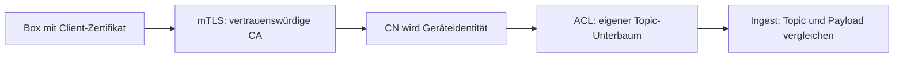

# MQTT-Sicherheit

Kundenboxen verbinden sich über MQTT-mTLS auf `8883`. Zertifikatsidentität und Geräte-ACL begrenzen den Zugriff auf den jeweiligen Topic-Unterbaum.



## Listener und Identität

- `8883`: Client-Zertifikat erforderlich; `verify_peer` und `fail_if_no_peer_cert` sind aktiv.
- `1883`: interner Backbone. Im eigenständigen Compose-Betrieb am Host Loopback; optional über die begrenzte [Datenebene](deploy.md#datenebene-und-cluster) für Cluster-Nodes erreichbar.
- `18083`: Brokerverwaltung, kein öffentlicher Gerätezugang.

Zertifikat: `O=tenant_id`, `OU=site_id`, `CN=device_id`; SPIFFE-SAN enthält dieselbe Identität. EMQX übernimmt CN als Benutzer-/Client-ID. In EMQX 5.8 gehören `peer_cert_as_username` und `peer_cert_as_clientid` zu den globalen `mqtt.*`-Einstellungen, nicht in den Listenerblock.

## ACL und Dateimounts

ACL-Regeln werden in Reihenfolge ausgewertet. Interne Dienste verwenden den vorgesehenen Backbone-Zugang; Geräte erhalten ihren eigenen `ems/{tenant}/{site}/{device}/…`-Pfad. v2 verwendet den geräteeigenen `v2/#`-Unterbaum. Eine gültige Zertifikatssignatur allein erteilt keinen fremden Topic-Zugriff.

`infra/mqtt/acl/` wird als Verzeichnis gemountet: API schreibbar, Broker lesbar. Einzeldatei-Mounts für `acl.conf` verhindern den atomaren Rename beziehungsweise halten den alten Inode fest.

ACL-Datei und laufender Authorizer sind getrennte Zustände. Nach einer manuellen Änderung den vorgesehenen Reload auslösen:

```bash
./tools/pki/reload-broker-authz.sh
```

Ein allgemeines `emqx ctl conf reload` ersetzt diesen Authorizer-Reload nicht. Die API hat dafür `BrokerAuthzReloader`.

## CA und Enrollment

```bash
./tools/pki/voltpilot-ca.sh init-ca --domain mqtt.example.com
./tools/pki/voltpilot-ca.sh list
```

`mqtt.example.com` durch den tatsächlichen Broker-Namen ersetzen. Weitere Befehle: `issue --tenant … --site … --device …`, `revoke --device …`, `gen-crl`. Schlüssel liegen im ignorierten `tools/pki/out/` und werden nicht committet.

Bei automatischem [Enrollment](connect-a-device.md) hält die API Zugriff auf die CA und signiert den von der Box erzeugten CSR. Damit gehört die API in die PKI-Vertrauensgrenze. Ohne diesen Betriebsweg kann Enrollment per `VOLTPILOT_ENROLLMENT_ENABLED=false` abgeschaltet werden.

Der Broker braucht lesbare `server.crt`, `server.key` und `device-ca.crt`. Den privaten Serverschlüssel gezielt für den EMQX-Prozess lesbar machen; keine pauschale Welt-Lesbarkeit.

## Widerruf

1. Gerätefreigabe mit dem PKI-Werkzeug widerrufen und ACL-Änderung laden. Default-Deny sperrt den nicht mehr zugelassenen Gerätepfad.
2. CRL erzeugen/verteilen. TLS-seitiger Widerruf greift nur, wenn die CRL-Prüfung tatsächlich konfiguriert und die aktuelle Liste verfügbar ist.
3. Verbindung und nicht mehr zulässige Publishes/Subscriptions prüfen. Ein geändertes File allein ist noch kein Wirksamkeitsnachweis.

## Prüfung

[PKI-Werkzeuge und Sicherheitsprüfung](../tools/pki/README.md); API-Enrollment-/Broker-Tests und Ingest-Identitätsprüfungen. Firewallregeln, Zertifikatsgültigkeit und effektive Listenerkonfiguration müssen in der jeweiligen Umgebung geprüft werden.
