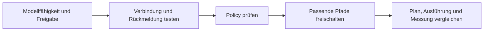

# Verbrauchersteuerung betreiben

Für wirksame Steuerung müssen Datenmodell, Geräteverbindung, Freigaben und Ausführungspfad zusammenpassen. [Funktionsmodell](verbrauchssteuerung.md), [go-e](../edge-app/nodered/GOE.md), [Shelly](../edge-app/nodered/SHELLY.md), [OCPP](edge-runtime.md#ocpp-und-lokale-netze).

## Freigaben

| Flag | Ebene | Code-/Vorlagendefault |
|---|---|---|
| `VOLTPILOT_CONSUMER_CONTROL_ENABLED` | API: Aktivierung / wirksame Handeingriffe | `false` |
| `VOLTPILOT_CONSUMER_POLICY_COMPILER_ENABLED` | API: Policy kompilieren und ausrollen | `false` |
| `OPTIMIZER_CONTROLLABLE_LOADS_ENABLED` | Optimierung: Verbraucher einplanen | `false` |
| `VP_CONSUMER_CONTROL_ENABLED` | Box: Verbraucherkommandos und Deadline-Fallback | `false` |

`VP_CONTROL_ENABLED` ist zusätzlich die globale Edge-Freigabe. Bei v2-Planung auch `VOLTPILOT_V2_PLAN_SITES` berücksichtigen. Der **effektive Deploymentwert** kann vom Codedefault abweichen; auf Cloud und Box getrennt prüfen.

Ein abgeschaltetes Aktivierungsflag verhindert neue wirksame Aktivierungen. **Stoppen und Pausieren müssen dennoch bereits ausgerollte Artefakte zurückziehen.** Beleg: `ConsumerPolicyActivationBrokerTest`.

## Geordnete Inbetriebnahme

1. Tatsächlich freigegebenen Gerätetyp im Katalog/Plattformregister prüfen. Ein generischer Simulator beweist keinen realen Treiber.
2. Gerät zuordnen und Verbindungstest am physischen Gerät durchführen. Typzertifizierung und dieser Verbindungstest sind unterschiedliche Nachweise.
3. Grenzen, Failsafe, Mindestzeiten und erlaubte Energiequellen setzen; Policy validieren/simulieren.
4. Nur benötigte Cloud-/Edge-Pfade freischalten. Den tatsächlichen Zustand im Portal und an der Box prüfen.
5. Gemessene Leistung, Readback und Aufgabenfortschritt vergleichen; nicht nur eine Zustellbestätigung ansehen.

## Diagnose

| Symptom | Prüfen |
|---|---|
| Gespeichert, aber nicht aktiv | API-Flags, Validierung, Compilerergebnis, Gerätebestätigung |
| Plan ohne Verbraucher | v2-Anlagenwahl, Optimizer-Flag, Verbindung, Regelgültigkeit |
| Plan da, Gerät steht | Edge-Flags, Modell-/Gerätefreigabe, Guards, Mindestzeiten |
| Aufgabe ohne Fortschritt | Messkanal, Frische und bestätigter Verbrauch |
| Frist gefährdet/verpasst | Restbedarf, gültiges Zeitfenster, Grenzen und Fallbackgrund |
| Regel bleibt nach Stop aktiv | Retained Artefaktrücknahme und Empfang an der Box |

## Beobachtung und Rücknahme

Metriken unter API-`/metrics`: `voltpilot_consumers*`, `voltpilot_consumer_tasks`, `voltpilot_consumer_tasks_at_risk`, `voltpilot_consumer_clamped`, `voltpilot_consumer_overrides_active` und `voltpilot_consumer_metrics_collect_age_seconds`. Der Collector muss selbst aktuell sein.

Zum Rücknehmen Policy pausieren/deaktivieren und die Rücknahme am Gerät kontrollieren. Danach bei Bedarf die zugehörigen Freigaben abschalten. Nur ein Flag umzulegen belegt weder eine gelöschte Regel noch den physischen Gerätezustand.

Ein erneuter Start benötigt wieder gültige Signale und Voraussetzungen. Historische Anforderungs-/Auditdaten nicht löschen, um einen Fehler scheinbar zu beheben.
