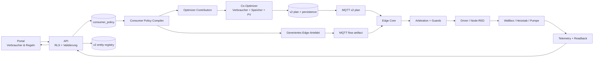

# Konzept: steuerbare Verbraucher in VoltPilot

**Status:** Überarbeiteter Entwurf nach Konzept-Review; Inkremente 1-6 gebaut
**Stand:** 2026-08-10
**Zielbild:** Portalnutzer können steuerbare Verbraucher anlegen, sicher konfigurieren, automatisch oder durch den Fahrplan betreiben und ihren Zustand sowie ihren geplanten und tatsächlichen Verbrauch nachvollziehen.

## 1. Kurzfassung

VoltPilot sollte einen Verbraucher nicht nur als schaltbares Gerät modellieren, sondern als Kombination aus vier getrennten Dingen:

1. **Komponente:** Was ist angeschlossen und wie viel Leistung darf es aufnehmen?
2. **Regelbarkeit:** Ein/Aus, feste Leistungsstufen oder stufenlos.
3. **Betriebsanforderungen:** Wann muss, darf oder soll der Verbraucher laufen?
4. **Energiepräferenz:** Wird bei knapper verfügbarer Leistung zuerst der Verbraucher oder zuerst der Speicher bedient?

Diese Trennung verhindert mehrdeutige Einstellungen. Eine Stallpumpe mit täglicher Mindestlaufzeit ist beispielsweise keine gewöhnliche Wenn/Dann-Automation, sondern eine **flexible Aufgabe mit Frist**. VoltPilot darf den Zeitpunkt optimieren, muss aber die Erfüllung separat nachweisen. Ein Heizstab von 13:00 bis 14:00 Uhr ist dagegen ein **fester Pflichtlauf**. Eine Wallbox, die beim Anstecken sofort mit maximal zulässiger Leistung laden soll, ist eine **reaktive Pflichtregel**.

Die bestehende Architektur ist dafür bereits vorbereitet:

- Verbraucher existieren als v2-Entitäten (`wallbox`, `heating-rod`, `generic-load`).
- `mqtt-schedule 2.0` kann pro Verbraucher `on_off` und `setpoint_kw` planen.
- `ControllableLoadEntity` existiert im Co-Optimizer bereits, der Dispatch ist aber bewusst noch nicht implementiert.
- Das Edge-Arbitrationsmodell und die Guard-Kette bleiben die einzige Stelle, die physische Befehle freigibt.
- Portalbereiche **Anlagen-Modell**, **Steuerung**, **Fahrplan** und **Cockpit** können die vier passenden Sichten auf denselben Verbraucher liefern.

Empfohlen wird deshalb **kein zweites allgemeines Automationssystem**. Stattdessen entsteht eine deklarative `ConsumerPolicy`, aus der VoltPilot sowohl Optimierungsbedingungen als auch – für reaktive Regeln – ein Edge-Artefakt ableitet.

### Bestehende Grundlagen

Dieses Konzept erweitert bewusst die vorhandenen Verträge und Portalentscheidungen:

- [Architektur](architecture.md)
- [v2-Entitätskonfiguration](contracts/v2/edge-entity-config.md)
- [v2-Planvertrag](contracts/v2/mqtt-schedule-2.0.md)
- [Edge-Arbitration und Guards](contracts/v2/edge-desired-arbitration.md)
- [Flow-Graph-Vertrag](contracts/v2/flow-graph.md)
- [Portal M4 · Steuerung](portal-v3/M4-steuerung.md)
- [Portal M5 · Automationen](portal-v3/M5-automationen.md)
- [Portal M6 · Anlagen-Modell](portal-v3/M6-komponenten.md)
- [Speicher-Energiezuordnung](attribution-three-pot.md)

## 2. Fachlich entschiedene Punkte

### Bestätigte Produktentscheidungen

| ID | Entscheidung |
|---|---|
| E1 | „Verbraucher vor/nach Speicher“ beschreibt eine Energiepräferenz innerhalb der gemeinsamen Optimierung, niemals eine Sicherheits- oder Netzpriorität. |
| E2 | Ein **Pflichtlauf darf Netzstrom verwenden**. „Muss laufen“ wird nicht durch eine Kosten- oder PV-Bedingung relativiert. Geräteschutz, physische Netzgrenzen und Vertragsvorgaben bleiben trotzdem höherrangig. |
| E3 | Ob der Speicher zugunsten eines Verbrauchers entladen werden darf, entscheidet der Nutzer. Die Frage erscheint nur an Standorten mit Speicher. |
| E4 | Bedingungen müssen als `UND` und als `ODER` kombinierbar sein. Bei nur einer Bedingung wird diese Frage gar nicht gezeigt. |
| E5 | Bei flexiblen Laufzeitaufgaben entscheidet der Nutzer, ob die Laufzeit zusammenhängend oder aufteilbar ist. |
| E6 | Hardware- und Protokollschnittstellen werden pro tatsächlich angebundenem Gerät umgesetzt. Dieses Konzept priorisiert keinen Herstellertreiber. |
| E7 | Zeitregeln verwenden die Zeitzone des Standorts; intern werden konkrete Intervalle in UTC ausgeführt. |
| E8 | „100 % Wallbox“ bedeutet 100 % der **effektiv zulässigen** Leistung: Minimum aus Nutzereinstellung, gemeldeter Hardware-/Fahrzeuggrenze und aktiven Guards. |
| E9 | Kollidieren Pflichtverbraucher, werden zuerst bereits bindende Mindestläufe geschützt und danach die frühere Frist bevorzugt. Nur bei einem erkannten Konflikt fragt das Portal nach einer festen Nutzerrangfolge. |
| E10 | Die Erlaubnis zur Speicherentladung wird als Standard pro Verbraucher gespeichert und kann unter „Weitere Einstellungen“ je einzelner Regel überschrieben werden. |
| E11 | Ein unverbundener Verbraucher darf vollständig als Entwurf konfiguriert werden. Planung und Aktivierung bleiben bis zur physischen Verbindung gesperrt. |

### Weitere Designfestlegungen dieses Entwurfs

Diese Punkte vervollständigen die Nutzerführung:

- Bei einer Preisschwelle wählt der Nutzer verständlich zwischen **Börsenpreis** und **meinem vollständigen Bezugspreis**. Die Auswahl erscheint erst nach Wahl einer Preisbedingung.
- Mehrere Regeln eines Verbrauchers werden automatisch zu einem Ziel zusammengeführt; der wirksame Grund bleibt in der Oberfläche sichtbar.

### Review-Entscheidungen 2026-08-09

Das Konzept-Review vom 09.08.2026 hat zehn Punkte verbindlich entschieden. Sie sind zusätzlich in
die betroffenen Abschnitte eingearbeitet.

| ID | Entscheidung |
|---|---|
| D1 | Kein Marktsignal-Down-Kanal. Preis- und Zeitbedingungen werden in der Cloud deterministisch zu konkreten UTC-Zeitfenstern kompiliert; reaktiv am Edge bleiben nur lokale Signale (Geräteverfügbarkeit, Speicher-SoC, gemessener PV-Überschuss/Netzfluss). Preis-Hysterese entfällt (deterministische Fenster flattern nicht), SoC-/Überschuss-Hysterese bleibt. `vp.price.current` kompiliert zu einem Plan-/Fensterbeitrag; ein produktiver Live-Preis-Downlink und dessen Entgating entfallen ersatzlos. Grund: eine Preiswahrheit (`SlotEconomics`/`pricing.py`), Hausgesetz „die Cloud bepreist, der Edge begrenzt“ (`slot_trim`/`loadfollow`/`surpluscharge`-Disziplin). |
| D2 | Lexikografik auf höchstens drei konditionale Stufen: (1) Pflichterfüllung (unbediente Pflichtläufe und Fristverletzungen als Slacks, nach Mindestlauf, `service_rank`, Frist), (2) Netzenergie – nur wenn mindestens ein Verbraucher `grid_energy_policy=avoid` trägt, (3) Ökonomie + bestehende deterministische Epsilon-Tie-Breaks. Schutz/Netz/Vertrag sind Constraints, keine Stufe. `consumer_first`/`storage_first` wird als deterministischer Tie-Break in der Epsilon-Klasse modelliert, nicht als eigene Stufe. Die Quellen-/Senken-Zuordnungsmatrix wird nur gebaut, wenn ein Verbraucher eine Quellen-Restriktion oder -Präferenz trägt. |
| D3 | Vierstufige Bestätigungshierarchie für den Erfüllungsnachweis: kWh-Messung → kW-Telemetrie → Relais-/Zustands-Readback (Energie „angenommen“) → kein Readback (nie „erfüllt“). kWh-Ziele bietet der Assistent nur bei vorhandenem Energie-/Leistungsmesskanal an; ohne Messung erscheint der ehrliche Satz „Ohne Messung kann VoltPilot die Erfüllung nicht nachweisen.“ |
| D4 | Stufenlose Verbraucher dürfen nicht-konvexe Leistungsbereiche `power_ranges_kw` tragen (je Bereich ein Binary, höchstens ein aktiver Bereich, Bereichswechsel unter Mindestlauf-/Umschaltpausen). Der erste reale Wallbox-Treiber (go-e) baut die Phasenumschaltung mit (Umschalt-Hysterese, Mindest-Umschaltpausen, Readback der Phasenlage). E8 bleibt gültig. |
| D5 | Frühzeitigkeits-Tie-Break sofort: bei Kostengleichheit werden flexible Aufgaben so früh wie möglich erfüllt (gleiche Klasse wie der Early-Charge-Tie-Break). Der lokale Deadline-Fallback ist als Inkrement 6 GEBAUT (§13.5, Vertragsentscheid D-20). |
| D6 | Energiepräferenz (`consumer_first`/`storage_first`) bleibt an Speicher-Standorten aktive Pflichtfrage – bewusst bestätigt, gegen den Vereinfachungsvorschlag „Default je Absicht“ entschieden. §4.2/§14.4 bleiben inhaltlich unverändert. |
| D7 | Die bestehenden Kunden-Flow-Vorlagen „Wallbox nur bei PV-Überschuss“ und „Heizstab-Zeitplan“ zeigen ab Inkrement 4 auf den Verbraucher-Regelbaukasten statt auf den Flow-Editor; der Node-RED-Editor bleibt Power-User-Tür (M4-Reihenfolge unverändert). Konflikte mit aktiven Flow-Claims werden ehrlich benannt (V-5). |
| D8 | Ereignis-Neuplanung als dritter Endpunkt `POST /replan` auf der bestehenden Solve-Fläche (`simulate-serve`): echter Zyklus gather → optimize → persist → publish je Site, semaphore-begrenzt wie Simulation/What-if. Der What-if-Endpunkt bleibt per Konstruktion ephemer. Debounce (5–10 s) und maximale Replan-Rate liegen in der API; Auslöser über einen eigenen Status-Listener. Der 15-Minuten-Tick bleibt Grundschlag. |
| D9 | Additiver `consumers`-Block im Status-Heartbeat je Verbraucher-Entity: `{state, reason_code, actual_kw, confirmed, requirement_progress}`. Eigener api-Listener (Geschwister-Regel), RLS-Tabelle `consumer_runtime_status` (eine Zeile je Entity, je Heartbeat wholesale ersetzt), Lesepfad je Site. Unbekannte Zustands-/Grundwörter werden beim Ingest verworfen; das Portal mappt `reason_code`s über eine reine, getestete TS-Tabelle. |
| D10 | Treiber-Reihenfolge nach der Simulator-Scheibe: zuerst go-e Wallbox (Consumer-Control-Executor mit Readback existiert; inkl. Phasenumschaltung, D4), danach der Shelly-Heizstab-Treiber (HTTP-Relais). Pilotanlagen (Captain-Angabe 09.08.2026): go-e Wallbox + Heizstab über Shelly; ein Shelly **mit** Leistungsmessung liefert D3-Bestätigungsstufe 2 (kW-Telemetrie), ohne nur Stufe 3 (Relais-Readback, Energie „angenommen“). |

Zusätzliche Review-Klarstellungen: die Zeitzonenführung bleibt in v1 faktisch Europe/Berlin
(bestehende Pinnung); ein Standort-Zeitzonenfeld wird vorgesehen, aber es entsteht keine
per-Tenant-Zeitzonen-Baustelle in diesem Feature. V1 enthält keinen kundenseitigen
Verbraucher-Erlösausweis; `consumer_plan_economics` bleibt optional und intern, ein späterer
Ausweis wird ausdrücklich als „geplant“ gelabelt.

## 3. Leitprinzipien

### 3.1 Nutzerwunsch ist nicht Geräteschutz

Die Reihenfolge bleibt unveränderlich:

```text
Geräteschutz > Netzvorgabe > Vertragsvorgabe > expliziter Nutzerwunsch > Fahrplan > Failsafe
```

„Egal was gerade ist“ bedeutet daher im Portal: **„mit höchster Nutzerpriorität, soweit Schutz und Netzvorgaben es zulassen“**. Die UI darf niemals behaupten, dass VoltPilot einen physisch oder regulatorisch unzulässigen Betrieb garantiert.

### 3.2 Ein Verbraucher hat genau eine fachliche Wahrheit

Die `ConsumerPolicy` ist die Quelle für Betriebsanforderungen, Priorität und Regelbarkeit. Daraus werden erzeugt:

- Solver-Eingaben und Fahrplan-Slots,
- reaktive Edge-Logik,
- Portal-Sätze und Statusanzeigen,
- Erfüllungs- und Audit-Ereignisse.

Eine generierte Verbraucher-Automation wird in der Steuerungsübersicht sichtbar, aber nicht als unabhängige zweite Regel separat bearbeitet. Ein Klick öffnet die Verbraucherregel.

### 3.3 Ohne Mess- oder Steuerquelle keine erfundene Funktion

- Angelegt, aber nicht verbunden: „Noch nicht verbunden“.
- Verbunden, aber ohne steuerbare Fähigkeit: „Nur Messung möglich“.
- Sollwert gesendet, aber kein Readback: „Ausführung nicht bestätigt“.
- Fehlende Telemetrie ist unbekannt, nicht `0` oder `AUS`.

### 3.4 Planung und schnelle Reaktion ergänzen sich

- Zeitfenster, Preise und flexible Aufgaben werden vorausschauend im Cloud-Fahrplan berücksichtigt.
- Fahrzeug angesteckt, SoC-Schwelle oder lokale Verfügbarkeit werden sofort am Edge ausgewertet.
- Eine relevante Zustandsänderung löst zusätzlich eine debouncte Neuoptimierung aus, damit Speicher und Verbraucher nach kurzer Übergangsphase wieder gemeinsam geplant werden.

### 3.5 Nutzbarkeit durch Kontext, nicht durch Funktionsverzicht

Keine Einstellung wird gestrichen, um das Formular kürzer zu machen. Stattdessen entscheidet ein
deterministischer Fragenbaum, wann eine Einstellung relevant ist. Jede automatisch gesetzte
Entscheidung erscheint vor Aktivierung in Klartext; jede seltene, aber gültige Möglichkeit bleibt
über „Weitere Einstellungen“ erreichbar. Diese Reachability ist Teil der automatisierten Tests.

## 4. Fachliches Modell

### 4.1 Begriffe

| Begriff | Bedeutung |
|---|---|
| **Verbraucher** | Kundenbegriff für eine steuerbare Verbrauchskomponente, z. B. Wallbox, Heizstab oder Pumpe. |
| **Entität** | Technische v2-Repräsentation im Backend/Edge; bleibt aus der Kundenoberfläche heraus. |
| **Steuerprofil** | Physische Regelbarkeit, Leistungsgrenzen, Stufen und Failsafe. |
| **Betriebsanforderung** | Ein Wunsch oder eine Verpflichtung, unter welchen Bedingungen wie viel Leistung laufen soll. |
| **Flexible Aufgabe** | Bedarf mit Menge/Dauer und Frist, dessen Zeitpunkt VoltPilot bestimmen darf. |
| **Pflichtlauf** | Höchster Nutzerwunsch; darf nur von Schutz, Netz oder Vertrag begrenzt werden. |
| **Energiepräferenz** | Reihenfolge relativ zum Speicher, falls Verbraucher und Speicher nicht gleichzeitig vollständig bedient werden können. |

### 4.2 Verbraucher-Stammdaten

Jeder Verbraucher benötigt mindestens:

| Feld | Pflicht | Beispiel / Semantik |
|---|---:|---|
| Name | ja | `Stallpumpe` |
| Typ | ja | Wallbox, Heizstab, Pumpe, generischer Verbraucher |
| Nennleistung | ja | `3.0 kW`, positiv |
| Regelart | ja | `on_off`, `stepped`, `continuous` |
| Energiepräferenz | ja | `consumer_first` oder `storage_first` |
| Failsafe | ja | in der Regel `off`, bei nativer Wallboxsteuerung optional `release` |
| Verbindung | für Aktivierung | Edge-Gerät und gemeldete Quelle/Driver |
| Netzbezug | kontextabhängig | Bei Pflichtlauf automatisch erlaubt; bei flexiblen/opportunistischen Regeln erlaubt, möglichst vermeiden oder verboten |
| Speicherentladung | nur mit Speicher | Nutzer entscheidet, ob der Speicher diesen Verbraucher versorgen darf |
| Aktiv | ja | pausierbarer Gesamtschalter |

Optionale erweiterte Geräteeigenschaften:

- Mindest-Einschaltzeit und Mindest-Ausschaltzeit,
- maximale Starts pro Tag,
- Anlaufleistung und Anlaufdauer,
- Rampe in kW/min,
- Verfügbarkeits-Messwert, z. B. `vehicle_connected`,
- Bestätigungs-Messwert, z. B. `power_kw` oder `relay_state`,
- Verhalten nach Kommunikationsausfall,
- zulässige Betriebsmodi des Herstellers.

### 4.3 Regelarten

#### Ein/Aus

Zulässige Leistungen sind `0` und die effektive Nennleistung. Intern wird bevorzugt `on_off` verwendet; falls der Driver nur `setpoint_kw` unterstützt, darf der Edge-Adapter `AUS → 0` und `EIN → effective_max_power_kw` abbilden.

#### Feste Stufen

Die Stufen werden als explizite Liste gespeichert, nicht nur als Schrittweite:

```json
{ "levels_kw": [0, 1.5, 3.0, 4.5] }
```

Dadurch sind auch ungleichmäßige Herstellerstufen darstellbar. Jede Stufe muss aufsteigend, nicht negativ und höchstens so groß wie die effektive Nennleistung sein.

#### Stufenlos

Benötigt mindestens:

```json
{
  "min_power_kw": 1.4,
  "max_power_kw": 11.0,
  "resolution_kw": 0.1
}
```

Unterhalb der Mindestleistung ist der Verbraucher aus. Oberhalb wird der Sollwert auf Raster und Guard-Grenzen geklemmt.

Optional dürfen stufenlose Verbraucher **nicht-konvexe Leistungsbereiche** tragen:

```json
{ "power_ranges_kw": [[1.4, 3.7], [4.2, 11.0]] }
```

Die Liste enthält disjunkte, aufsteigende `[min, max]`-Bereiche – etwa 1- und 3-phasiges Laden
einer Wallbox – jeweils innerhalb der effektiven Nennleistung. Unterhalb des kleinsten Minimums
ist der Verbraucher aus. Fehlt das Feld, gilt der einfache `[min_power_kw, max_power_kw]`-Bereich.
Die Solverkopplung je Bereich beschreibt §12.2, die Edge-Umschaltung §13.1.

### 4.4 Effektive Leistungsgrenze

Die vom Nutzer angegebene Leistung darf niemals eine physische Fähigkeit erweitern:

```text
effective_max_power_kw = min(
  user_rated_power_kw,
  hardware_reported_max_kw,
  driver_capability_max_kw,
  active_guard_max_kw
)
```

Fehlt eine technische Grenze, wird sie nicht erfunden. Widersprechen sich Nutzereinstellung und Hardware, zeigt das Portal den kleineren wirksamen Wert und einen Hinweis.

## 5. Betriebsanforderungen

Jede Anforderung hat folgende gemeinsamen Merkmale:

- Name und Aktiv-Schalter,
- Ziel als `Ein`, Prozent, kW oder Gerätemodus,
- Gültigkeit und Wiederholung,
- Verbindlichkeit,
- erlaubte Energiequellen,
- optional Hysterese, Mindestlauf- und Mindestpausezeit,
- Status: geplant, aktiv, erfüllt, blockiert oder verpasst.

Die Energiefrage folgt der Verbindlichkeit: Bei **„Muss laufen“** setzt VoltPilot den
Netzbezug automatisch auf erlaubt und zeigt das in der Zusammenfassung, statt eine
widersprüchliche Zusatzfrage zu stellen. Bei flexiblen oder opportunistischen Anforderungen
kann der Nutzer Netzstrom erlauben, möglichst vermeiden oder ausschließen. Die Entscheidung,
ob der Speicher entladen werden darf, bleibt davon unabhängig.

### 5.1 Reaktiver Pflichtlauf

Ein Ziel gilt sofort, solange eine Bedingung erfüllt ist.

Beispiel Wallbox:

```text
WENN Fahrzeug verbunden
DANN 100 %
VERBINDLICHKEIT Pflichtlauf
```

Die Verfügbarkeit muss positiv und frisch bestätigt sein. Ein unbekannter oder veralteter `vehicle_connected`-Wert startet keine Ladung. Das Beenden kann mit einer kurzen Ausschaltverzögerung entprellt werden.

### 5.2 Festes Zeitfenster

Ein Ziel gilt in einem wiederkehrenden lokalen Zeitfenster.

Beispiel Heizstab:

```text
TÄGLICH 13:00–14:00 Europe/Berlin
ZIEL Ein
VERBINDLICHKEIT Pflichtlauf
```

Sommer-/Winterzeit wird bei der Expansion in konkrete UTC-Intervalle berücksichtigt. Eine Dauerangabe bedeutet verstrichene Zeit; ein einstündiger Pflichtlauf bleibt auch an Zeitumstellungstagen 60 Minuten lang.

### 5.3 Bedingte Regel

Bedingungen bilden einen eingeschränkten, validierbaren Baum. Sobald eine zweite Bedingung
hinzukommt, fragt der Baukasten mit zwei Satzkarten: **„Alle müssen zutreffen (UND)“** oder
**„Mindestens eine muss zutreffen (ODER)“**. Bei einer Bedingung ist diese Auswahl verborgen:

```text
ANY / ALL / NOT
  └─ Signal + Operator + Schwelle + Hysterese (nur bei lokalen Signalen)
```

Zulässige Signale im ersten Inkrement:

- Börsenpreis oder vollständiger Bezugspreis,
- Speicher-SoC,
- PV-Überschuss,
- Netzbezug/-einspeisung,
- Verbraucher-/Geräteverfügbarkeit,
- lokales Zeitfenster.

Beispiel Heizstab mit `ODER`:

```text
WENN Börsenpreis < 5 ct/kWh
ODER Speicher-SoC > 80 %
DANN Ein
```

Mit `UND` würde derselbe Verbraucher nur laufen, wenn **gleichzeitig** der Preis unter 5
ct/kWh liegt und der Speicher mehr als 80 % geladen ist. Verschachtelte Gruppen bleiben über
„Weitere Logik“ möglich, werden aber nicht im einfachen Standardpfad gezeigt.

Preis- und Zeitbedingungen werden in der Cloud deterministisch zu Zeitfenstern kompiliert (D1)
und tragen deshalb **keine Hysterese** – ein vorberechnetes Fenster flattert nicht. Nur lokal am
Edge ausgewertete Signale brauchen Hysterese:

- SoC: ein über `80 %`, aus unter `75 %`,
- PV-Überschuss/Netzfluss: analog mit einem kleinen Rückschaltabstand.

Ohne Hysterese könnte ein solcher Verbraucher an einer verrauschten Schwelle häufig schalten.

### 5.4 Flexible Aufgabe

Eine flexible Aufgabe beschreibt **was bis wann erledigt sein muss**, nicht den Startzeitpunkt.

Beispiel Stallpumpe:

```text
TÄGLICH zwischen 00:00 und 24:00
MINDESTENS 60 Minuten
ZUSAMMENHÄNGEND ja
LEISTUNG 2,2 kW
ZEITPUNKT VoltPilot
```

Alternativ zur Laufzeit kann ein Energiebedarf angegeben werden, z. B. `8 kWh bis 06:30`. Für stufenlose Geräte darf die Aufgabe Laufzeit und Mindestenergie kombinieren.

Der Fahrplan berücksichtigt dabei:

- Preis,
- PV-Prognose,
- Speicherzustand und Reserven,
- Netz- und Leistungsspitzenlimits,
- andere Verbraucherpflichten,
- Mindestlauf/-pause und zusammenhängende Blöcke,
- Restzeit bis zur Frist.

Je näher die Frist kommt, desto weniger verschiebbar ist der noch offene Bedarf. Kann die Aufgabe wegen Schutz-, Netz- oder Geräteproblemen nicht vollständig erfüllt werden, bleibt der Gesamtplan lösbar und die Aufgabe erhält einen expliziten Nichterfüllungsgrund.
Fällt die Cloud aus, startet das Gerät die Aufgabe notfalls selbst - der edge-lokale Deadline-Fallback aus Inkrement 6 (§13.5).

### 5.5 Opportunistischer Betrieb

Optional für spätere Ausbaustufen: Ein Verbraucher darf laufen, wenn Energie besonders günstig oder überschüssig ist, besitzt aber keine Mindestpflicht. Beispiel: Heizstab nutzt PV-Überschuss bis zur Temperaturgrenze. Nicht ausgeführte Energie ist hier kein Fehler.

## 6. Bedeutung „vor oder nach dem Speicher“

Diese Einstellung wird im Portal als zwei verständliche Optionen angeboten:

Physikalisch kann hinter einem gemeinsamen Netzanschlusspunkt nicht gemessen werden, welches
einzelne Elektron von PV, Speicher oder Netz zu welchem Verbraucher fließt. VoltPilot verwendet
deshalb eine **virtuelle, bilanztreue Energiezuordnung** im Optimierer. Pro Slot werden die realen
Quellen `PV`, `Speicherentladung` und `Netzbezug` den Senken `Grundlast`, einzelnen Verbrauchern,
`Speicherladung` und `Netzeinspeisung` zugeordnet. Zeilen- und Spaltensummen müssen exakt mit der
physischen Standortbilanz übereinstimmen; dieselbe kWh darf niemals doppelt vergeben werden.

Für Verbraucher `c` gilt konzeptionell:

```text
consumer_power[c,t]
  = from_pv[c,t] + from_storage[c,t] + from_grid[c,t]
```

- „Speicher nicht verwenden“ setzt `from_storage[c,t] = 0`.
- „Kein Netzstrom“ bei einer nicht verpflichtenden Regel setzt `from_grid[c,t] = 0`.
- „Netzstrom möglichst vermeiden“ belegt diesen Anteil mit einer nachrangigen Strafpräferenz.
- Ein Pflichtlauf lässt `from_grid` zu, ohne Netzstrom zu erzwingen, wenn PV oder Speicher
  verfügbar und freigegeben sind.

Diese Zuordnung ist die gemeinsame Grundlage für Solverbedingungen und Portal-Erklärungen. Die
Ist-Auswertung heißt ausdrücklich „bilanziell zugeordnet“, nicht „physisch gemessen“.

### Verbraucher zuerst

„Wenn nicht beides gleichzeitig möglich ist, reduziert VoltPilot zuerst das optionale Laden des Speichers und bedient dann den Verbraucher.“

- Pflichtläufe bleiben Pflichtläufe.
- Flexible Verbraucher werden gegenüber **optionalem** Speicherladen bevorzugt.
- Ob der Speicher zusätzlich für den Verbraucher entladen werden darf, entscheidet der Nutzer
  in einer separaten, nur bei vorhandenem Speicher sichtbaren Frage.

### Speicher zuerst

„VoltPilot hält zuerst den geplanten Speicherstand; verschiebbare oder modulierbare Verbraucher nutzen die danach verfügbare Leistung.“

- Ein noch verschiebbarer Pumpenlauf wird eher nach hinten gelegt.
- Ein modulierbarer Heizstab wird reduziert, bevor ein geplanter Speicherzielwert aufgegeben wird.
- Ein Pflichtlauf wird nicht stillschweigend zu einer optionalen Regel. Muss er wegen einer höheren Schutzebene gekürzt werden, wird das als Abweichung ausgewiesen.

### Was die Einstellung ausdrücklich nicht tut

- Sie vergibt keine Edge-Priorität `safety`, `grid` oder `contract`.
- Sie umgeht keine §14a-, SoC-, Leistungs- oder Gerätegrenze.
- Sie verändert keine Hardwarefähigkeit.
- Sie entscheidet nicht automatisch, ob Netzstrom oder Speicherentladung erlaubt ist.

Die Speicherentladung wird nicht aus „zuerst“ abgeleitet: Auch ein Verbraucher mit
`consumer_first` kann auf „Speicher nicht entladen“ stehen, und ein `storage_first`-Verbraucher
kann nach Erreichen der Speicherziele aus freigegebener Speicherenergie versorgt werden.

## 7. Konflikt- und Zustandsauflösung

Pro Verbraucher werden alle Nutzerregeln zuerst zu **einem** Ziel zusammengeführt. Dadurch kämpfen nicht mehrere Flows um dieselbe Entität.

Empfohlene interne Reihenfolge:

1. Schutz-, Netz- und Vertragsgrenzen,
2. temporärer manueller Stopp,
3. temporärer manueller Start/Boost,
4. reaktiver oder zeitlicher Pflichtlauf,
5. fällige flexible Aufgabe,
6. normaler optimierter Fahrplan,
7. opportunistischer Betrieb,
8. Failsafe.

Bei mehreren gleichzeitig wahren Regeln:

- `AUS` aus einem manuellen Stopp gewinnt innerhalb der Nutzerwünsche.
- Sonst gewinnt der höchste verlangte zulässige Sollwert.
- Gerätemindestzeiten können das unmittelbare Umschalten verzögern.
- Jede Entscheidung führt einen maschinenlesbaren `reason_code` mit.

Die technische Edge-Arbitration bleibt anschließend unverändert wirksam: reaktive Pflichtregeln nutzen den bestehenden begrenzten Flow-Override oberhalb des Marktplans, aber unter Vertrag, Netz und Schutz. Flexible Fahrplanslots laufen als Klasse `market`.

### Konflikte zwischen mehreren Verbrauchern

Die Priorität gegenüber dem Speicher löst keinen Konflikt zwischen zwei gleichzeitigen
Pflichtverbrauchern. Deshalb trägt eine Anforderung zusätzlich einen fachlichen `service_rank`.
Das Portal fragt ihn nicht vorsorglich ab, sondern nur, wenn statischer Check oder Simulation
eine reale Überschneidung erkennen. Ohne Nutzerwahl gilt:

1. bereits begonnener, technisch einzuhaltender Mindestlauf,
2. frühere Frist,
3. stabile Requirement-ID als rein technischer Tie-Break.

Eine Leistungsaufteilung wird nur angeboten, wenn beide Geräte anhand ihrer Capabilities
modulierbar sind. Ein/Aus-Verbraucher werden nicht mit einer erfundenen Teilleistung geplant.

## 8. Zielarchitektur



### 8.1 Zuständigkeiten

| Schicht | Verantwortung |
|---|---|
| Portal | Eingabe, verständliche Vorschau, Simulation, Status und Abweichungen. |
| API | Tenantgrenzen, fachliche Validierung, Versionierung, Aktivierung, Audit. |
| Policy Compiler | Eine Policy deterministisch in Solver- und Edge-Anteile übersetzen. |
| Optimizer | Slotplanung aller Speicher, Erzeuger und Verbraucher an einem Netzanschlusspunkt. |
| Edge | Schnelle lokale Bedingungen, Planaktivierung, Staleness, Arbitration, Guard-Clamps und Readback. |
| Driver | Übersetzung der generischen Kommandos in herstellerspezifische Schreibvorgänge. |

## 9. Persistenzmodell

### 9.1 Bestehende Entität weiterverwenden

Der physische/logische Verbraucher bleibt eine `measurement_point`-basierte v2-Entität mit `entity_type`, `capabilities`, `guard_config`, optional `edge_source_id` und `device_id`. Es entsteht keine zweite Gerätetabelle.

### 9.2 Neue Tabelle `consumer_profile`

Empfohlene Felder:

```text
entity_id                 UUID PRIMARY KEY -> measurement_point(id)
tenant_id                 UUID NOT NULL
site_id                   UUID NOT NULL
control_kind              TEXT  -- on_off | stepped | continuous
rated_power_kw            NUMERIC(10,3) > 0
min_power_kw              NUMERIC(10,3) NULL
levels_kw                 JSONB NULL
resolution_kw             NUMERIC(10,3) NULL
storage_relation          TEXT  -- consumer_first | storage_first
default_grid_energy_policy TEXT -- allow | avoid | forbid; Pflichtregeln erzwingen allow
allow_storage_discharge   BOOLEAN
default_service_rank      SMALLINT NULL -- erst nach erkanntem Konflikt gesetzt
availability_channel      TEXT NULL
confirmation_channel      TEXT NULL
min_on_seconds            INTEGER NULL
min_off_seconds           INTEGER NULL
max_starts_per_day        INTEGER NULL
failsafe                  TEXT  -- off | release
enabled                   BOOLEAN NOT NULL DEFAULT false
version                   BIGINT NOT NULL DEFAULT 1
created_at / updated_at   TIMESTAMPTZ
```

Validierung:

- `levels_kw` nur bei `stepped`, muss `0` enthalten und streng aufsteigen.
- `min_power_kw` und `resolution_kw` nur bei `continuous`.
- Nennleistung und Stufen dürfen die serverseitig bekannte Hardwaregrenze nicht erweitern.
- `failsafe=release` nur, wenn Driver und Entitätskatalog dies erlauben.
- Bei `enforcement=must_run` ist eine Policy mit `grid_energy_policy=forbid` ungültig; die
  geführte UI erzeugt diese widersprüchliche Kombination gar nicht.
- `service_rank` ist fachliche Konfliktauflösung zwischen Verbraucherwünschen und darf niemals
  auf eine höhere Edge-Arbitrationsklasse abgebildet werden.
- `availability_channel` und `confirmation_channel` folgen dem offenen v2-Kanalvokabular
  (`CHANNEL_RE`), nicht Freitext.
- tenant- und site-FKs müssen zur referenzierten Entität passen.

### 9.3 Neue Tabelle `consumer_policy`

```text
policy_id                 UUID PRIMARY KEY
entity_id                 UUID NOT NULL -> consumer_profile(entity_id)
tenant_id / site_id       UUID NOT NULL
version                   INTEGER NOT NULL
lifecycle                 TEXT -- draft | active | retired
document                  JSONB NOT NULL
content_hash              TEXT NOT NULL
created_by                TEXT
created_at / activated_at TIMESTAMPTZ
UNIQUE(entity_id, version)
```

Pro Verbraucher gibt es höchstens eine aktive Version. Layout- oder Portalzustände gehören nicht in den gehashten Policy-Inhalt.

### 9.4 Erfüllung und Status

`consumer_requirement_state` speichert den aktuellen Erfüllungsstand wiederkehrender Aufgaben:

```text
requirement_instance_id   UUID PRIMARY KEY
requirement_id            UUID / stable document id
entity_id                 UUID
period_start / deadline   TIMESTAMPTZ
required_energy_kwh       NUMERIC NULL
required_runtime_seconds  INTEGER NULL
actual_energy_kwh         NUMERIC NOT NULL DEFAULT 0
actual_runtime_seconds    INTEGER NOT NULL DEFAULT 0
energy_confirmation       TEXT NULL -- measured | integrated | assumed
state                     TEXT -- pending | running | fulfilled | missed | blocked
reason_code               TEXT NULL
updated_at                TIMESTAMPTZ
```

Die tatsächliche Erfüllung wird aus bestätigter Verbrauchertelemetrie abgeleitet, nicht aus dem gesendeten Sollwert.

Der Erfüllungsnachweis folgt einer **Bestätigungshierarchie** nach verfügbarem Messkanal:

1. **Energiemessung (kWh):** bestätigt Laufzeit- und Energieziele als „erfüllt“.
2. **Leistungstelemetrie (kW):** Laufzeit exakt, Energie integriert; „erfüllt“.
3. **Relais-/Zustands-Readback:** bestätigt nur Laufzeitziele als „erfüllt“; Energie wird als
   „angenommen (Nennleistung × Zeit)“ gekennzeichnet (`energy_confirmation = assumed`).
4. **Kein Readback:** nie „erfüllt“; Status „Ausführung nicht bestätigt“.

Sobald Energie nur aus Nennleistung × Zeit hochgerechnet ist, trägt der Erfüllungszustand die
Kennzeichnung „angenommen“ (§14.13).

### 9.5 Planpersistenz

Der bisherige v1-`schedule`-Datensatz ist standort-/speicherzentriert. Für v2 wird eine additive Persistenz benötigt:

- `site_plan_run`: Plan-Metadaten und Standortökonomie,
- `entity_plan_slot`: `(plan_id, entity_id, time, command, target_value, reason_code, requirement_id)`,
- optional `consumer_plan_economics`: erwartete Kosten, verschobene Energie und vermiedene Kosten.

Damit können Fahrplan, Plan-vs.-Ist und „Warum läuft die Pumpe jetzt?“ ohne Rekonstruktion aus einem MQTT-Payload beantwortet werden.

Persistenz-Disziplin: `entity_plan_slot` erhält ab der ersten Migration eine Retention (180 Tage
wie `schedule`) und den Index `(entity_id, time, generated_at DESC)` für SkipScan; Leser folgen dem
bestehenden DISTINCT-ON-LATERAL-Muster. RLS-Tabellen erhalten nur Retention, nie Kompression
(gemessene Timescale-Einschränkung).

V1 enthält keinen kundenseitigen Verbraucher-Erlösausweis; `consumer_plan_economics` bleibt
optional und rein intern. Ein späterer Geld-Ausweis für Verbraucher wird ausdrücklich als
„geplant“ gelabelt.

### 9.6 Migration und RLS

- Neue, datumsbasierte Flyway-Migration; bereits angewandte Migrationen bleiben unverändert.
- Alle Tabellen erhalten `tenant_id`, `ENABLE/FORCE ROW LEVEL SECURITY` und dieselbe Default-Deny-Policy wie bestehende Entitäts-/Flow-Tabellen.
- Der Runtime-App-User erhält nur die notwendigen Rechte.
- Dev-Seeds, die Demo-Tenants referenzieren, müssen existenzgeguardet sein.

## 10. Policy-Vertrag

Neuer bindender Vertrag: `docs/contracts/v2/consumer-policy.schema.json`.

Eine Policy gehört immer genau **einem** Verbraucher. Das Heizstab-Beispiel kann zwei
Anforderungen in einer Policy kombinieren:

```json
{
  "schema_version": "1.0",
  "entity_id": "heater-01",
  "timezone": "Europe/Berlin",
  "requirements": [
    {
      "id": "heater-noon",
      "kind": "fixed_window",
      "enforcement": "must_run",
      "recurrence": { "days": "daily", "from": "13:00", "to": "14:00" },
      "target": { "kind": "on_off", "value": true }
    },
    {
      "id": "heater-cheap-or-full",
      "kind": "reactive",
      "enforcement": "must_run",
      "condition": {
        "any": [
          {
            "signal": "market.spot_price_ct_kwh",
            "operator": "lt",
            "value": 5
          },
          {
            "signal": "storage.soc_pct",
            "operator": "gt",
            "value": 80,
            "reset_value": 75,
            "max_age_s": 30
          }
        ]
      },
      "target": { "kind": "on_off", "value": true }
    }
  ]
}
```

Die Wallbox hat ein eigenes Dokument mit der reaktiven Anforderung:

```json
{
  "schema_version": "1.0",
  "entity_id": "wallbox-01",
  "timezone": "Europe/Berlin",
  "requirements": [
    {
      "id": "charge-when-connected",
      "kind": "reactive",
      "enforcement": "must_run",
      "condition": {
        "signal": "consumer.vehicle_connected",
        "operator": "eq",
        "value": 1,
        "max_age_s": 20
      },
      "target": { "kind": "percent", "value": 100 }
    }
  ]
}
```

Auch die Stallpumpe besitzt eine eigene Policy:

```json
{
  "schema_version": "1.0",
  "entity_id": "pump-01",
  "timezone": "Europe/Berlin",
  "requirements": [
    {
      "id": "pump-daily-hour",
      "kind": "flexible_task",
      "enforcement": "required_by_deadline",
      "recurrence": { "days": "daily", "from": "00:00", "to": "24:00" },
      "demand": { "runtime_minutes": 60, "contiguous": true },
      "target": { "kind": "on_off", "value": true }
    }
  ]
}
```

Vertragsregeln:

- Stabile Requirement-IDs für Audit und Erfüllungszuordnung.
- Maximale Baumtiefe und Elementanzahl gegen missbräuchlich große Dokumente.
- Keine freien Ausdrücke oder Topics im geführten Modell.
- Signalnamen kommen aus einem serverseitigen Katalog.
- Dreizustandslogik `true | false | unknown`; unbekannte Eingangswerte werden nicht als `0` behandelt.
- Preis- und Zeitbedingungen werden vom Compiler deterministisch zu Zeitfenstern expandiert; sie
  tragen keine Hysterese (`reset_value`) und kein `max_age_s`. Nur lokal ausgewertete Signale
  (Verfügbarkeit, SoC, PV-Überschuss/Netzfluss) tragen `max_age_s` und optionale Hysterese (D1).
- Jede Anforderung darf `allow_storage_discharge` und `service_rank` optional überschreiben;
  ohne Wert gelten die Verbraucher-Defaults.
- `must_run` impliziert `grid_energy_policy=allow`; flexible/opportunistische Anforderungen
  tragen `allow`, `avoid` oder `forbid` explizit bzw. erben den Verbraucher-Default.
- `24:00` ist nur als Ende eines lokalen Tagesfensters erlaubt und wird als `00:00` des
  Folgetags normalisiert; über Mitternacht laufende Fenster tragen diese Semantik explizit.
- `content_hash` wird aus kanonischem JSON erzeugt.

## 11. API-Entwurf

Alle Kundenendpunkte sind tenantgescoped; `tenant_id` und `site_id` werden nicht aus frei wählbaren Bodyfeldern vertraut.

| Methode | Pfad | Zweck |
|---|---|---|
| `GET` | `/api/v1/sites/{siteId}/consumer-options` | Standort- und capability-gefilterte Typen, Signale, Defaults und Vorlagen für den Fragenbaum. |
| `GET` | `/api/v1/sites/{siteId}/consumers` | Verbraucher mit Live-/Planstatus auflisten. |
| `POST` | `/api/v1/sites/{siteId}/consumers` | Verbraucherentwurf anlegen; serverseitig erlaubte Fähigkeiten/Guards ableiten. |
| `GET/PATCH` | `/api/v1/sites/{siteId}/consumers/{id}` | Stammdaten lesen/ändern, optimistisch über `version`/ETag. |
| `DELETE` | `/api/v1/sites/{siteId}/consumers/{id}` | Fachlich stilllegen; keine harte Löschung von Audit-/Erfüllungsdaten. Physische Registry-Bereinigung erst nach Deaktivierung. |
| `GET/PUT` | `/api/v1/sites/{siteId}/consumers/{id}/policy` | Aktive Policy lesen bzw. neue Draft-Version speichern. |
| `POST` | `/api/v1/sites/{siteId}/consumers/{id}/policy/simulate` | Vorschau, Konflikte, fehlende Fähigkeiten und nötige Rangentscheidungen für einen Zeitraum erzeugen; setzt auf das ephemere What-if-Vehikel des Solve-Service auf (Draft-Policy als Override, semaphore-begrenzt), kein neuer Rechenpfad. |
| `POST` | `/api/v1/sites/{siteId}/consumers/{id}/policy/activate` | Validieren, kompilieren und atomar aktivieren. |
| `POST` | `/api/v1/sites/{siteId}/consumers/{id}/pause` | Verbrauchersteuerung pausieren; Failsafe aktivieren. |
| `POST` | `/api/v1/sites/{siteId}/consumers/{id}/override` | Zeitlich begrenzter manueller Start/Stopp. |
| `DELETE` | `/api/v1/sites/{siteId}/consumers/{id}/override` | Manuellen Eingriff beenden. |
| `GET` | `/api/v1/sites/{siteId}/consumers/{id}/status` | Soll/Ist, Halter, Grund, nächste Aktion, Aufgabenerfüllung. |
| `GET` | `/api/v1/sites/{siteId}/consumer-schedule` | Verbraucher-Slots für Fahrplanansicht. |

Wichtige HTTP-Semantik:

- `400`: syntaktisch/fachlich ungültig,
- `404`: fremder Standort/Verbraucher unter RLS,
- `409`: Versionskonflikt, aktive Claim-Kollision oder noch verbundener Verbraucher beim Löschen,
- `422`: Gerät kann gewünschte Regelart nicht ausführen,
- `503`: Compiler/Edge-Verteilung nicht verfügbar; aktive Version bleibt unverändert.

Die OpenAPI-Datei wird im selben Inkrement aktualisiert. Aktivierung ist atomar: Ein Compiler- oder Publish-Fehler darf die bisher aktive Policy nicht ersetzen.

## 12. Co-Optimizer-Erweiterung

### 12.1 Eingangsdaten

`ControllableLoadEntity` wird erweitert um:

```text
entity_id
control_kind
max_power_kw / min_power_kw / levels_kw
storage_relation
grid_energy_policy
min_on/off, max_starts, ramp
requirements[]
initial_state
```

`CoOptimizationInput.__post_init__` darf anschließend nicht mehr grundsätzlich auf einer nichtleeren `controllable_loads`-Liste abbrechen. Bei leerer Liste muss das Modell mathematisch und im Payload bytegleich zum heutigen Verhalten bleiben.

### 12.2 Entscheidungsvariablen

Pro Verbraucher `c` und Slot `t`:

- `load_power[c,t] >= 0`,
- `is_on[c,t] ∈ {0,1}` für Ein/Aus und Mindestleistung,
- `level_selected[c,t,l] ∈ {0,1}` für Stufen,
- `start[c,t]`, `stop[c,t]` für Mindestlauf/-pause und Startbegrenzung,
- `unserved[c,r,t] >= 0` bzw. Erfüllungsslack für ehrlich lösbare Konflikte.
- virtuelle Zuordnungsvariablen `source_to_sink[source,sink,t] >= 0` für die
  bilanztreue Energieherkunft aus §6.

Kopplung nach Regelart:

```text
on_off:     load_power = rated_power * is_on
stepped:    load_power = Σ(level_l * level_selected_l), Σ level_selected_l = 1
continuous: min_power * is_on <= load_power <= max_power * is_on
```

Trägt ein stufenloser Verbraucher `power_ranges_kw` (§4.3), erhält jeder Bereich ein eigenes
Binary; höchstens ein Bereich ist je Slot aktiv, und `load_power` liegt im aktiven Bereich.
Bereichswechsel – etwa 1-/3-phasiges Laden – unterliegen denselben Mindestlauf- und
Umschaltpausen wie Ein/Aus-Schaltungen.

Die Standortbilanz wird erweitert:

```text
grid_import - grid_export
  = base_uncontrollable_load
  + Σ controllable_load_power
  + Σ storage_charge - Σ storage_discharge
  + Σ curtailment - Σ generation
```

Die Zuordnungsmatrix erhält zusätzlich für jeden Slot:

```text
Σ_sinks source_to_sink[source,sink,t] = physical_source_power[source,t]
Σ_sources source_to_sink[source,sink,t] = physical_sink_power[sink,t]
```

Damit werden `allow_storage_discharge`, `grid_energy_policy` und die Reihenfolge gegenüber der
Speicherladung als echte Solverbedingungen/-präferenzen modelliert, ohne eine kWh doppelt zu
verwenden. Die Matrix verändert die physische Bilanz nicht; sie erklärt und beschränkt deren
zulässige Aufteilung.

Die Zuordnungsmatrix wird **nur gebaut, wenn mindestens ein Verbraucher eine Quellen-Restriktion
oder -Präferenz trägt** (`allow_storage_discharge=false` oder `grid_energy_policy != allow`).
Trägt kein Verbraucher eine solche Einschränkung, entfällt die Matrix und das Modell bleibt klein
(D2).

### 12.3 Anforderungen als Constraints

- Festes Fenster: Zielleistung in den betroffenen Slots, mit Erfüllungsslack nur unterhalb höherer Schutzebenen.
- Flexible Laufzeit: `Σ is_on[t] * slot_minutes >= required_minutes` innerhalb des Fensters.
- Flexible Energie: `Σ load_power[t] * slot_hours >= required_kwh`.
- Zusammenhängend: Startvariablen und genau ein Laufblock je Instanz.
- Aufteilbar: mehrere Laufblöcke erlaubt, jeweils weiterhin unter Mindestlauf/-pause und maximalen
  Starts; die Nutzerwahl wird nicht nachträglich vom Optimizer umgedeutet.
- Mindestlauf/-pause: klassische Unit-Commitment-Constraints.
- Preis-/Zeitbedingung: in der Cloud deterministisch zu Zeitfenstern kompiliert und als bekannte
  Slots aktiviert; kein Edge-Marktsignal (D1).
- SoC-/Verfügbarkeitsbedingung: im Edge sofort auswerten; Zustand an den Optimizer melden und bei Änderung neu planen. Eine spätere MILP-Kopplung an den prognostizierten SoC ist möglich, aber nicht für das erste sichere Inkrement nötig.
- Pflichtlauf: Netzanteil zulässig; Kosten bleiben Teil des Nachweises, dürfen aber die
  Pflichtanforderung nicht verdrängen.
- Frühzeitigkeit: bei kostengleichen Lösungen wird der noch offene flexible Bedarf früh statt
  spät verplant (deterministischer Tie-Break, siehe §12.4).
- Verbraucher-Konflikt: bereits bindende Mindestläufe als Betriebsconstraint einhalten;
  verbleibenden Erfüllungsslack nach `service_rank` und Frist lexikografisch minimieren.

### 12.4 Priorität ohne willkürliche Big-M-Eurotricks

Schutz, Netz und Vertrag sind harte **Constraints, keine Stufe**. Über den zulässigen Bereich
entscheidet eine lexikografische Lösung mit **höchstens drei konditionalen Stufen** (D2):

1. **Stufe 1 – Pflichterfüllung.** Unbediente Pflichtläufe und Fristverletzungen werden als Slacks
   lexikografisch minimiert: zuerst bereits bindende Mindestläufe, dann `service_rank`, dann die
   frühere Frist.
2. **Stufe 2 – Netzenergie (nur bedingt vorhanden).** Nur wenn mindestens ein Verbraucher
   `grid_energy_policy=avoid` trägt, werden die zugeordneten Netz-kWh minimiert. Ohne einen solchen
   Verbraucher entfällt diese Stufe vollständig.
3. **Stufe 3 – Ökonomie.** Energiekosten, Erlöse, Leistungsspitze, Batterieverschleiß und
   Terminalwert werden zusammen mit den bestehenden deterministischen Epsilon-Tie-Breaks optimiert.
   `consumer_first`/`storage_first` wird als deterministischer Tie-Break in dieser bestehenden
   Epsilon-Klasse modelliert (Indifferenz-Präferenz bei kostengleichen Lösungen), **nicht als eigene
   Stufe**.

Als weiterer deterministischer Tie-Break der Stufe 3 gilt: **bei Kostengleichheit werden flexible
Aufgaben so früh wie möglich erfüllt** (D5, dieselbe Klasse wie der bestehende
Early-Charge-Tie-Break, klein genug, um echte Preisunterschiede nie zu überstimmen). Das
verkleinert das Fenster, in dem ein Cloud-Ausfall eine Frist reißt.

So kann kein zufällig gewählter Strafpreis dazu führen, dass ein sehr negativer Börsenpreis einen Nutzer-Pflichtlauf „wegkauft“ oder umgekehrt die ökonomische Zielfunktion numerisch zerstört.

Die lexikografische Stufenfixierung hält eine dokumentierte Toleranz oberhalb des gepinnten
MIP-Gaps ein; die deterministischen Epsilon-Tie-Breaks werden dafür nie aufgeweicht.

### 12.5 Ergebnis und Publisher

`SitePlan` erhält `loads: list[LoadDispatch]`. Der vorhandene `publisher_v2` ergänzt pro Verbraucher eine Entität mit vollständigem Slotraster:

```json
{
  "entity_id": "pump-main",
  "kind": "consumer",
  "slots": [
    { "start": "2026-08-10T01:00:00Z", "commands": { "on_off": true } },
    { "start": "2026-08-10T01:15:00Z", "commands": { "on_off": true } }
  ]
}
```

Das vorhandene `mqtt-schedule 2.0` unterstützt diese Kommandos bereits; sein Schema muss dafür nicht strukturell geändert werden. Publisher, Parser, Edge-Executor und Persistenz benötigen aber Consumer-Testvektoren.

## 13. Edge-Ausführung

### 13.1 Standardpfad

```text
Plan/reaktive Policy
  → Desired
  → per-entity Arbitration
  → Consumer Guard [0, effective_max]
  → Mindestlauf/Rampe/Netz- und Vertragsguards
  → generisches Command
  → Driver
  → Readback
```

Der generische v2-Pfad ist im Repo bereits weiter als der Optimizer: `internal/plan2` liest
`setpoint_kw` und `on_off` unabhängig vom informativen `kind`, injiziert jeden aktiven
Entitätsslot als `market`-Wunsch, und die Consumer-Guard-Klemme begrenzt auf
`[0, max_consumption_kw]`. Für go-e existiert außerdem bereits ein
Consumer-Control-Executor mit Readback. Die Implementierung muss diese vorhandenen Bausteine
daher mit Consumer-Planvektoren absichern und um fehlende Heizstab-/Pumpen-Driver ergänzen;
Parser, Arbitration und Guard-Kette werden nicht neu erfunden oder gelockert.

Mindest-Ein-/Ausschaltzeit, maximale Starts pro Tag und Rampe sind **zeitliche Invarianten** und
werden am Edge durch einen eigenen **zustandsbehafteten Zyklen-Guard** durchgesetzt (Zustand:
letzte Schaltzeitpunkte und Startzähler; Muster wie `PeakTracker`/`Despiker`). Der Guard ist
restrict-only und trägt einen ehrlichen Grund in den Status („wartet – Mindestpause“). Die reine
Leistungsklemme `[0, effective_max]` genügt dafür nicht, weil reaktive Regeln und Arbitration
schneller schalten können als jeder Plan.

Der erste reale Wallbox-Treiber (go-e) baut die **Phasenumschaltung** mit: Umschalt-Hysterese und
Mindest-Umschaltpausen schonen die Fahrzeug-Elektronik, der Readback bestätigt die tatsächliche
Phasenlage (D4). Der zulässige Leistungsbereich folgt dem aktiven `power_ranges_kw`-Bereich (§4.3,
§12.2).

### 13.2 Reaktive Regeln

Der Policy Compiler erzeugt je Verbraucher höchstens ein abgeleitetes Edge-Flow-Artefakt mit genau einem Entity-Claim. Alle Bedingungen werden darin vor dem Aktionsknoten zusammengeführt. Dadurch bleibt die bestehende Exklusivitätsregel V-5 erfüllt.

Ein reaktiver Pflichtlauf emittiert einen `flow`-Wunsch mit `override=true` und kurzer TTL, die fortlaufend erneuert wird. Der bestehende maximale Override-Zeitraum von vier Stunden bleibt wirksam; längere feste Pflichtfenster gehören in den Marktplan und nicht in einen dauerhaften Override.

Der heutige allgemeine Katalognode `vp.entity.control` bietet bewusst keinen frei wählbaren
Override-Schalter. Das soll so bleiben: Der Policy Compiler darf `override=true` ausschließlich
aus der validierten Semantik `enforcement=must_run` in das **generierte, nicht separat
editierbare** Artefakt stempeln. Eine beliebige Kunden-Flow-Aktion erhält dadurch keine neue
Möglichkeit, den Marktplan zu überstimmen. Dafür sind Compiler-, Validator- und Golden-Artifact-
Tests nötig; der Edge-Desired-Vertrag unterstützt den begrenzten Override bereits.

### 13.3 Preis- und Zeitbedingungen werden in der Cloud kompiliert

Es gibt bewusst **keinen Marktsignal-Down-Kanal** an den Edge. Day-Ahead-Preise sind zum
Lieferzeitpunkt vollständig bekannt; der Policy-Compiler expandiert Preis- und Zeitbedingungen
deterministisch zu konkreten UTC-Zeitfenstern. Diese Fenster fließen

- **(a)** als Solver-Slots in den Marktplan und
- **(b)** für `UND`/`ODER`-Kombinationen mit lokalen Signalen als vorberechnete Zeitfenster in das
  generierte Edge-Artefakt.

Reaktiv am Edge bleiben **ausschließlich lokale Signale**: Geräteverfügbarkeit (z. B.
`vehicle_connected`), Speicher-SoC und gemessener PV-Überschuss/Netzfluss. Für diese Signale gelten
weiterhin Frische (`max_age_s`) und Hysterese; ein vorberechnetes Preis- oder Zeitfenster flattert
nicht und braucht keine Hysterese.

Das folgt dem Hausgesetz **„die Cloud bepreist, der Edge begrenzt“** (die Disziplin von
`slot_trim`/`loadfollow`/`surpluscharge`) und wahrt die eine Preiswahrheit
(`SlotEconomics`/`pricing.py`): Preise werden an genau einer Stelle bewertet, nie zusätzlich am
Gerät. Der Katalog-Node `vp.price.current` kompiliert deshalb zu einem Plan- bzw. Fensterbeitrag;
ein produktiver Live-Preis-Downlink und dessen Entgating entfallen ersatzlos.

### 13.4 Schnelle Neuplanung

Folgende Edge-Ereignisse lösen über den Statuskanal eine Neuplanung aus:

- Fahrzeug verbunden/getrennt,
- Pflichtregel aktiv/inaktiv,
- Aufgabe vorzeitig erfüllt,
- Verbraucher nicht verfügbar,
- relevante SoC-Schwelle überschritten,
- Sollwert dauerhaft geklemmt oder Readback abweichend.

Die Auslöser erreichen die API über einen **eigenen Status-Listener** (Geschwister-Muster: ein
eigener Block bekommt einen eigenen Listener, nie den early-return eines bestehenden Listeners
erweitern). Die API debounced pro Standort (z. B. 5–10 Sekunden) und begrenzt die maximale
Replan-Rate. Der On-Demand-Replan läuft als **dritter Endpunkt `POST /replan`** auf der bestehenden
Solve-Fläche des optimization-Service (`simulate-serve`): ein echter Zyklus
`gather → optimize → persist → publish` für genau eine Site, semaphore-begrenzt wie Simulation und
What-if. Der What-if-Endpunkt bleibt per Konstruktion ephemer und unangetastet (er importiert weder
Persistence noch Publisher). Der 15-Minuten-Tick bleibt der Grundschlag. Bis zum neuen Plan deckt
das Netz die Bilanzdifferenz, soweit Guards dies erlauben; Schutz- und Netzgrenzen bleiben wirksam.

### 13.5 Offline und Staleness

- Ein stale v2-Plan zieht seine `market`-Wünsche wie bisher zurück.
- Lokal auswertbare, aktive Pflichtregeln dürfen offline weiterlaufen, solange alle benötigten Signale frisch sind.
- Preis- und Zeitregeln laufen nur bis zum Ende des letzten vorberechneten Fensters; danach ist die Bedingung `unknown`.
- Flexible Aufgaben ohne frischen Plan werden nicht eigenmächtig zu beliebigen Zeiten gestartet.
  Der lokale Deadline-Fallback (Inkrement 6, GEBAUT; Vertragsentscheid D-20) startet eine `required_by_deadline`-Aufgabe stattdessen SPÄTESTENS bei „Frist minus Restbedarf minus eine Slot-Marge“ selbst - nie früher (Notnagel, kein zweiter Optimierer), nur solange kein frischer v2-Plan liegt, und ausschließlich aus BESTÄTIGTEM eigenem Fortschritt (gemessene Telemetrie; unbekannter Fortschritt startet nichts).
  Die Anforderungsdaten erreichen den Edge als additiver `flex_requirements`-Block im Registry-Push (`edge-entity.schema.json`); der Wunsch läuft als interne Arbitrationsklasse `deadline-fallback` (Rang zwischen `flow` und `market`, NIE `override`) durch die NORMALE Kette - Verbraucher-Klemme, Zyklen-Guard und §14a/Netz/Vertrag gelten wörtlich weiter, ein zurückkehrender frischer Plan und jede reaktive Pflichtregel übernehmen nahtlos.
  Der Heartbeat meldet den Eigenstart mit dem §15-Grund `flex_deadline_fallback`; nach der Frist wird die Aufgabe ehrlich verpasst statt außerhalb ihres Fensters zu laufen.
  Preis- und Zeitregeln bekommen NIE einen Eigenstart (voriger Punkt: nach dem letzten Fenster ist die Bedingung `unknown`).
- Danach gilt der Entitäts-Failsafe `off` oder `release`.

## 14. Portal-Konzept

### 14.1 Informationsarchitektur

Es wird im ersten Inkrement kein zusätzlicher dauerhafter Hauptnavigationseintrag benötigt:

| Bereich | Verbraucherfunktion |
|---|---|
| **Anlagen-Modell** | Verbraucher anlegen, verbinden, umbenennen und technische Grunddaten pflegen. |
| **Steuerung** | Regeln/Aufgaben erstellen, aktivieren, pausieren und ihren lebenden Zustand sehen. |
| **Cockpit** | Aktuelle Verbraucherleistung und wichtigste nächste Aktion überblicken. |
| **Fahrplan** | Geplante Verbraucherslots gemeinsam mit Speicher, PV, Netz und Preis sehen. |
| **Historie** | Soll/Ist, Energie, Laufzeit und Erfüllung auswerten. |

Verbraucherdetails öffnen als bookmarkfähige Detailansicht oder Drawer aus diesen Bereichen. In der bestehenden M1-Navigation darf keine verwaiste neue Route entstehen; falls ein neuer `AnlagenSub` eingeführt wird, muss er aus der projizierten Surface erreichbar und in den Navigationsguards enthalten sein.

### 14.2 UX-Grundmodell: wenige Fragen, vollständige Möglichkeiten

Die Mächtigkeit der Funktion darf nicht als langer Konfigurationsbogen beim Nutzer ankommen.
VoltPilot verwendet deshalb **eine Oberfläche mit schrittweiser Offenlegung**, nicht getrennte
„Einfach“- und „Experten“-Modi:

1. Zuerst wird nur das gewünschte Ergebnis abgefragt.
2. Die nächste Frage ergibt sich aus der vorherigen Antwort und aus den Fähigkeiten der Anlage.
3. Automatisch erkannte Werte werden vorausgefüllt und müssen nur bei einem Widerspruch bestätigt werden.
4. Seltene Optionen liegen unter **„Weitere Einstellungen (N)“**, bleiben dort aber vollständig editierbar.
5. Vor dem Aktivieren zeigt VoltPilot immer den vollständigen wirksamen Regelsatz einschließlich aller Defaults.

Verborgene Komplexität darf kein verborgenes Verhalten bedeuten. Die Zusammenfassung nennt daher
auch automatisch gesetzte Fakten wie „Netzstrom ist für diesen Pflichtlauf erlaubt“ oder
„Bei Ausfall schaltet der Verbraucher aus“.

### 14.3 Zwei getrennte Aufgaben: Komponente anlegen und Betrieb festlegen

Das Anlegen eines Verbrauchers und das Erstellen seiner Regeln werden visuell getrennt. So muss
jemand, der nur eine Wallbox verbinden möchte, nicht sofort Zeit-, Preis- und Speicherfragen
beantworten.

#### Teil A · Verbraucher anlegen

Einstieg: **Anlagen-Modell → „Komponente hinzufügen“ → „Verbraucher“**.

1. **Verbindung wählen:** Ein bereits vom Edge gefundenes Gerät auswählen oder „Jetzt noch nicht verbinden“.
2. **Was ist das?** Nur bei fehlender/mehrdeutiger Geräteerkennung: Wallbox, Heizstab, Pumpe oder anderer Verbraucher.
3. **Name und Leistung:** Erkannte Werte übernehmen; nur fehlende Pflichtwerte abfragen.
4. **Regelbarkeit bestätigen:** Erkannte Fähigkeiten anzeigen. Wenn unbekannt: Ein/Aus, Stufen oder stufenlos wählen und nur die dazugehörigen Felder öffnen.
5. **Speichern:** Die Komponente ist angelegt. Ohne Verbindung bleibt sie ehrlich im Zustand „Noch nicht verbunden“.

Danach bietet die Erfolgsseite genau zwei Wege:

- **„Jetzt festlegen, wann er laufen soll“** – empfohlener Primärweg,
- **„Später“** – führt zurück ins Anlagen-Modell, ohne eine leere Pseudo-Automation anzulegen.

#### Teil B · Verhalten festlegen

Der Nutzer wählt zuerst eine Absichtskarte:

| Karte | Kundensatz | Fachliches Ergebnis |
|---|---|---|
| **Sofort reagieren** | „Wenn etwas passiert, soll der Verbraucher reagieren.“ | Reaktive Bedingung |
| **Feste Zeiten** | „Der Verbraucher soll zu bestimmten Zeiten laufen.“ | Festes Zeitfenster |
| **Bis zu einer Frist erledigen** | „VoltPilot darf den besten Zeitpunkt wählen.“ | Flexible Aufgabe |
| **Günstige Energie nutzen** | „Nur bei passendem Preis, PV-Überschuss oder Ladestand.“ | Bedingter/opportunistischer Betrieb |

Gerätetypen liefern nur sinnvolle Startvorlagen, keine Einschränkungen:

- Wallbox: „Bei verbundenem Auto laden“,
- Heizstab: „Zu fester Zeit“ oder „Bei Überschuss/Preis/Ladestand“,
- Pumpe: „Tägliche Mindestlaufzeit“,
- anderer Verbraucher: alle vier Absichtskarten.

Jede Vorlage ist nach dem Auswählen vollständig veränderbar.

### 14.4 Kontextabhängiger Fragenbaum

| Kontext | Dann fragen/anzeigen | Sonst nicht zeigen |
|---|---|---|
| Gerät meldet Typ, Leistung und Fähigkeiten eindeutig | Werte als bestätigte Zusammenfassung übernehmen | Typ-/Capability-Fragen |
| Regelart `on_off` | Ziel `Ein/Aus` | Stufen, Mindestleistung, Auflösung |
| Regelart `stepped` | verfügbare Stufen und Zielstufe | stufenlose Felder |
| Regelart `continuous` | Minimum, Maximum, Auflösung bzw. Prozent/kW-Ziel | Stufenliste |
| Standort hat einen Speicher | Verbraucher/Speicher zuerst und Speicherentladung | alle Speicherfragen |
| genau eine Bedingung | direkt mit Ziel fortfahren | UND/ODER-Auswahl |
| zweite Bedingung wird hinzugefügt | „Alle (UND)“ oder „Mindestens eine (ODER)“ | verschachtelte Logik |
| Preisbedingung gewählt | Börsenpreis oder vollständiger Bezugspreis und Schwelle (in der Cloud zu Zeitfenstern kompiliert, keine Hysterese) | Preisdetails |
| flexible Laufzeit gewählt | Minuten/Stunden und zusammenhängend oder aufteilbar | Laufzeitteilung |
| Energie-/Leistungsmesskanal vorhanden (Capability-Schnittmenge, §16) | kWh-Ziel als flexible Aufgabe anbieten | kWh-Ziel; stattdessen ehrlicher Hinweis „Ohne Messung kann VoltPilot die Erfüllung nicht nachweisen.“ |
| flexibler Energiebedarf gewählt | kWh und Frist | Frage nach zusammenhängender Laufzeit, sofern keine Mindestlaufzeit existiert |
| `Muss laufen` gewählt | Hinweis „Netzstrom erlaubt“ | bearbeitbare Netzstromfrage |
| flexibel/opportunistisch gewählt | Netzstrom erlauben, vermeiden oder ausschließen | Pflichtlauf-Hinweis |
| Hardware meldet Verfügbarkeit | „Wenn verfügbar/verbunden“ als Bedingung anbieten | nicht ausführbare Verfügbarkeitsregel |
| statischer oder simulierter Pflichtkonflikt erkannt | Rangfolge der betroffenen Verbraucher abfragen | globale Prioritätsliste |

Diese Logik muss als reine, unit-getestete Ableitung umgesetzt werden, zum Beispiel
`consumerQuestions(context, draft) → Question[]`. Die React-Komponenten rendern nur das Ergebnis;
sie verteilen die Sichtbarkeitsregeln nicht über einzelne Formulare.

### 14.5 Geführter Regelbaukasten

Der Baukasten baut den Satz von links nach rechts und zeigt immer nur den nächsten relevanten
Block:

```text
WENN    [Auto verbunden ▼]                         [+ Bedingung]
        └ ab der zweiten Bedingung: [UND] [ODER]
DANN    [Laden ▼] [100 % ▼]
GÜLTIG  [Solange die Bedingung gilt ▼]
ZIEL    [Muss laufen ▼]
```

Für eine flexible Aufgabe sieht derselbe Bereich bewusst anders aus:

```text
AUFGABE [Täglich ▼] [60 Minuten]
ZEIT    [zwischen 00:00] [und 24:00]
LAUF    [Zusammenhängend ▼]
PLANUNG [VoltPilot wählt den Zeitpunkt]
```

Beim Hinzufügen einer zweiten Bedingung erscheinen zwei Satzkarten statt technischer Operatoren:

- **Alle Bedingungen müssen zutreffen (UND)**
- **Mindestens eine Bedingung muss zutreffen (ODER)**

Verschachtelte Logik bleibt unter **„Weitere Logik“** möglich. Dort werden Gruppen als
eingerückte Satzblöcke dargestellt, niemals als frei editierbarer JSON- oder Ausdrucksbaum.

Unter dem Formular steht permanent eine Vorschau aus derselben Policy-Ableitung, zum Beispiel:

> Wenn der Börsenpreis unter 5 ct/kWh liegt oder der Speicher mehr als 80 % geladen ist, schaltet VoltPilot den Heizstab ein. Netzstrom ist erlaubt. Der Speicher darf dafür nicht entladen werden. Geräteschutz und Netzvorgaben bleiben wirksam.

Direkt bei der Auswahl **„Muss laufen“** steht einmalig die kurze Erklärung:

> VoltPilot führt diesen Lauf unabhängig von Preis und verfügbarer Solarenergie aus und darf
> dafür Strom aus dem Netz beziehen. Nur Geräteschutz, Netz- oder Vertragsgrenzen können ihn
> begrenzen.

### 14.6 Defaults, weitere Einstellungen und Änderbarkeit

Gute Defaults reduzieren Eingaben, dürfen aber immer sichtbar und reversibel sein:

| Einstellung | Empfohlener Default | Sichtbarkeit |
|---|---|---|
| Failsafe | `off`, bei nativer Wallbox ggf. `release` aus Gerätekatalog | Zusammenfassung; editierbar, wenn Hardware mehrere Optionen erlaubt |
| Preis-/Zeitbedingung | in der Cloud zu Zeitfenstern kompiliert, keine Hysterese (D1) | kein Hysteresefeld; als Satz erklärt |
| SoC-Hysterese | 5 Prozentpunkte | direkt unter SoC-Schwelle, vorausgefüllt |
| PV-Überschuss-Hysterese | kleiner Rückschaltabstand | direkt unter Überschuss-Schwelle, vorausgefüllt |
| Mindestlauf/-pause | aus Driver/Katalog, sonst keine erfundene Grenze | nur bei vorhandener/aktivierter Grenze |
| Netzstrom bei Pflichtlauf | erlaubt | nicht als Frage, aber als klarer Satz |
| Speicherentladung | keine stille Annahme; Nutzerwahl bei erster relevanter Regel | nur wenn Speicher existiert |
| Laufzeitteilung | zusammenhängend als Empfehlung, aber Nutzerwahl | nur bei Laufzeitaufgabe |
| Zeitzone | Standort-Zeitzone | in Zusammenfassung; Feld vorgesehen, in v1 faktisch Europe/Berlin (bestehende Pinnung); änderbar nur durch Standortpflege |

„Weitere Einstellungen“ enthält unter anderem Mindestlauf/-pause, maximale Starts, Rampe,
regelbezogene Abweichung vom Verbraucher-Standard für Speicherentladung und mehrstufige
Bedingungsgruppen. Der geschlossene Bereich zeigt als Teaser beispielsweise
„Weitere Einstellungen (3) · Hysterese, Mindestlaufzeit, Speicherverwendung“, damit nichts
unsichtbar wirkt.

### 14.7 Prüfen statt blind speichern

Vor der Aktivierung zeigt eine einzige Prüfseite:

- den vollständigen deutschen Regelsatz,
- den betroffenen Verbraucher und die wirksame maximale Leistung,
- Netzstrom- und Speicherverhalten,
- eine 24-h-Vorschau bzw. bei wiederkehrenden Aufgaben die nächste Instanz,
- erwartete Kosten/Verlagerung nur, wenn dafür belastbare Daten existieren,
- Konflikte und nicht verfügbare Geräteeigenschaften,
- Failsafe und Verhalten bei fehlenden Signalen,
- bei flexiblen Aufgaben den ehrlichen Hinweis „Bei Verbindungsausfall startet VoltPilot die Aufgabe spätestens zur Frist selbst - Schutz- und Netzgrenzen bleiben wirksam.“ (der lokale Deadline-Fallback aus Inkrement 6, §13.5).

Vorschau und Simulation setzen auf das ephemere What-if-Vehikel des Solve-Service auf
(Draft-Policy als Override, semaphore-begrenzt), nicht auf einen neuen Rechenpfad.

Primäraktion: **„Regel aktivieren“**. Bei einer bestehenden aktiven Regel wird zunächst ein
Entwurf bearbeitet; bis zur Aktivierung läuft die alte Version weiter. „Verwerfen“ stellt die
laufende Version wieder her. Technische Begriffe wie kompilieren oder ausrollen gehören nur in
die Admin-Diagnose.

### 14.8 Konflikte erst dann erklären, wenn sie existieren

VoltPilot soll keine abstrakte Prioritätsmatrix beim Einrichten verlangen. Der statische Check
und die Simulation suchen stattdessen nach Überschneidungen:

```text
Konflikt am Werktag 13:00–14:00
Wallbox benötigt bis zu 11 kW, Heizstab 3 kW; verfügbar sind 12 kW.

Was ist in diesem Fall wichtiger?
(•) Wallbox zuerst
( ) Heizstab zuerst
( ) Leistung aufteilen      ← nur wenn beide Geräte modulieren können
```

Flexible Aufgaben werden zunächst automatisch verschoben. Eine Rangfrage erscheint nur, wenn
zwei nicht verschiebbare Nutzerwünsche tatsächlich kollidieren. Laufzeit, Frist und aktive
Geräteschutzgrenzen bleiben im Erklärungstext sichtbar. Für einen unvorhergesehenen Laufzeitkonflikt
verwendet der Edge dieselbe gespeicherte Rangfolge; ohne Auswahl gilt deterministisch die frühere
Frist und anschließend die stabile Requirement-ID – niemals Last-writer-wins.

### 14.9 Mobile, Barrierefreiheit und Wiederaufnahme

- Auf Mobilgeräten ist der Assistent eine vertikale Folge kompakter Seiten, kein breiter Stepper.
- Jede Seite nennt „Schritt X von Y“, wobei `Y` anhand des Fragenbaums aktualisiert wird.
- Zurücknavigation verliert keine Eingaben; ein Entwurf kann später fortgesetzt werden.
- Karten sind echte Radio-/Checkbox-Gruppen, Schalter besitzen zugängliche Namen und Statuswerte werden nie nur farblich vermittelt.
- Ein ungültiger Submit fokussiert die erste fehlerhafte Eingabe und zeigt Inline-Fehler; Primärbuttons werden nicht kommentarlos deaktiviert.
- Ein Review ist als Text vollständig lesbar; Diagramme sind Ergänzung, nicht die einzige Erklärung.

### 14.10 Darstellung im Cockpit

Die Geometrie des bestehenden großen Energieflussdiagramms bleibt unverändert. Der Hausverbrauch bleibt die physikalische Summe. Direkt unter bzw. neben dem Hero erscheint nur dann ein kompakter Verbraucherstreifen, wenn steuerbare Verbraucher existieren:

```text
┌ Steuerbare Verbraucher · 5,2 kW ─────────────────────────────────────┐
│ ● Wallbox     3,0 / 11 kW   Lädt · Auto verbunden                    │
│ ● Heizstab    2,2 / 3 kW    Preisregel · bis 14:00                   │
│ ○ Stallpumpe  0 / 2,2 kW    Geplant 02:15 · heute 0/60 min           │
└──────────────────────────────────────────────────────────────────────┘
```

Im Widget-Raster kommt eine Kachel **„Verbraucher“** hinzu:

- aktuelle Summe in kW,
- Anzahl laufend / bereit / gestört,
- nächste geplante Aktion,
- kritischste offene Aufgabe, z. B. „Stallpumpe: noch 60 min bis 24:00“.

Ein Klick öffnet ein reiches Modal mit Einzelverbrauchern, Tagesfortschritt und Verlauf. Ohne Quelle wird keine Kachel erfunden; mit Quelle, aber ohne Wert steht `—`.

### 14.11 Darstellung im Fahrplan

Der Fahrplan ist der wichtigste grafische Nachweis der gemeinsamen Optimierung:

```text
Leistung
  +6 kW     ▓▓ Wallbox          ▒▒ Heizstab       ░░ Pumpe
  +3 kW  ▓▓▓▓▓▓▓▓          ▒▒▒▒▒▒▒▒        ░░░░
   0 kW ───────────────────────────────────────────── Zeit
  -3 kW        Speicher entlädt ─────
          00   03   06   09   12   15   18   21
Preis       ▁▁▂▅▇▃▂▁▁▃▆▇▅▂▁
```

Darstellungsregeln:

- Verbraucher als positive gestapelte Leistungsflächen/-balken,
- Speicher weiterhin mit eigener Vorzeichenlogik,
- harte Zeitfenster schraffiert und mit Schloss gekennzeichnet,
- flexible Verfügbarkeitsfenster als dezenter Rahmen,
- tatsächlich gewählter Lauf als gefüllte Fläche,
- Preis auf separater Achse,
- Tooltip: Ziel, Grund, Preis, erwartete Quelle, Pflicht-/Flexstatus,
- keine ausschließliche Farbcodierung; Icon, Muster und Text ergänzen die Farbe.

Bei Klick auf einen Slot erscheint zum Beispiel:

```text
Stallpumpe · 02:15–03:15
VoltPilot hat diesen Zeitraum gewählt, weil der Bezugspreis niedrig ist.
Tagesziel: 60 min · danach erfüllt
Speicher: zuerst · Netzgrenze: eingehalten
```

### 14.12 Darstellung in Steuerung

Die vorhandene Kapsel „Automationen“ enthält Verbraucherregeln als lebende Zeilen:

```text
Heizstab · Günstig oder Speicher voll   EIN · SoC 84 %
Wallbox · Laden wenn verbunden          BEREIT · kein Auto
Stallpumpe · Täglich 60 Minuten          GEPLANT · 02:15
```

Im bestehenden Dialog „＋ Neue Automation“ bleibt die M4-Reihenfolge
**Vorlage → geführter Baukasten → Node-RED-Editor** unverändert. „Verbraucher steuern“ ist der
erste passende Anwendungsfall **innerhalb** des geführten Baukastens, keine vierte Tür. Wird der
Baukasten aus einem Verbraucherdetail geöffnet, ist der Verbraucher bereits vorausgewählt.
Generierte Policy-Flows tragen den Herkunftshinweis „Aus Verbraucherregel“ und öffnen beim
Bearbeiten wieder denselben Regelbaukasten.

Mit Inkrement 4 zeigen die bestehenden Kunden-Flow-Vorlagen „Wallbox nur bei PV-Überschuss“ und
„Heizstab-Zeitplan“ (`frontend/portal/src/flows/customerTemplates.ts`) auf den
Verbraucher-Regelbaukasten statt auf den Flow-Editor (D7); der Node-RED-Editor bleibt als
Power-User-Tür erhalten, die M4-Reihenfolge bleibt unverändert. Bestehende aktive Flows bleiben
gültig. Legt ein Nutzer eine Verbraucherregel auf eine Entität mit aktivem Flow-Claim, zeigt der
Baukasten den Konflikt ehrlich an („wird bereits durch Automation X gesteuert“, V-5-Claims),
statt zwei Regeln um dieselbe Entität kämpfen zu lassen.

### 14.13 Detailseite eines Verbrauchers

Reihenfolge:

1. Statuskopf: Name, Verbindung, aktuell/angefordert, Bestätigung.
2. Heute: Energie, Laufzeit, erfüllte/offene Aufgaben.
3. Nächste 24 Stunden: Mini-Fahrplan.
4. Regeln und flexible Aufgaben.
5. Energiepräferenz und Netzbezugsverhalten.
6. Technische Details nur in der vorhandenen Plattform-Admin-Schicht.

Mögliche Statuswerte:

| Status | Kundentext |
|---|---|
| `disconnected` | Noch nicht verbunden |
| `offline` | Gerät meldet sich nicht |
| `ready` | Bereit |
| `running_forced` | Läuft · Pflichtregel |
| `running_optimized` | Läuft · von VoltPilot geplant |
| `waiting` | Wartet auf passenden Zeitpunkt |
| `fulfilled` | Tagesziel erfüllt |
| `clamped` | Begrenzt · Schutz/Netzvorgabe |
| `missed` | Ziel nicht vollständig erreicht |
| `unknown` | Zustand nicht bestätigt |

Für verbundene, steuerbare Verbraucher enthält der Statuskopf die kontextabhängigen
Sofortaktionen **„Jetzt starten“**, **„Jetzt stoppen“** und **„Automatik fortsetzen“**. Ein
manueller Start verlangt eine Endzeit bzw. Dauer und zeigt vorher wirksame Leistung sowie den
Hinweis auf möglichen Netzbezug. Der Eingriff ist zeitlich begrenzt, im Status deutlich sichtbar
und verändert die gespeicherte Regel nicht.

Ist die Energie nur aus Nennleistung × Zeit hochgerechnet (Bestätigungshierarchie Stufe 3, §9.4),
wird sie im Erfüllungszustand als „angenommen“ gekennzeichnet, nie als gemessen ausgegeben.

## 15. Ereignisse, Audit und Erklärbarkeit

Jede Zustandsänderung erzeugt ein fachliches Ereignis mit mindestens:

```text
tenant_id, site_id, entity_id
policy_id, policy_version, requirement_id
occurred_at
event_type
requested, granted, actual
reason_codes[]
plan_id
```

Wichtige `reason_code`s:

- `vehicle_connected`,
- `fixed_window`,
- `price_below_threshold`,
- `soc_above_threshold`,
- `flex_deadline`,
- `flex_deadline_fallback` (Inkrement 6: das Gerät hat die flexible Aufgabe selbst gestartet, damit die Frist hält),
- `optimizer_selected_low_cost`,
- `consumer_first`,
- `storage_first`,
- `guard_rated_power`,
- `guard_grid_limit`,
- `device_offline`,
- `readback_mismatch`,
- `signal_stale`.

Diese Codes speisen Portaltexte, Supportdiagnose und Metriken; Texte werden nicht im Optimizer fest verdrahtet.

### 15.1 Status-Rückkanal des Edge

Zusätzlich zu den fachlichen Ereignissen trägt der Status-Heartbeat einen **additiven
`consumers`-Block**: je Verbraucher-Entity `{state, reason_code, actual_kw, confirmed,
requirement_progress}`. Der Block wird von einem **eigenen api-Listener** ingestet
(Geschwister-Regel: ein eigener Block bekommt einen eigenen Listener; niemals den early-return
eines bestehenden Listeners erweitern) und in die RLS-Tabelle `consumer_runtime_status` (eine
Zeile je Entity, je Heartbeat wholesale ersetzt) geschrieben; ein Lesepfad je Site liefert ihn an
das Portal. Unbekannte Zustands- oder Grundwörter werden beim Ingest verworfen, nie gespeichert.
Das Portal übersetzt `reason_code`s über eine reine, getestete TS-Tabelle; keine Oberfläche
durchsucht deutsche Sätze.

## 16. Sicherheit und Berechtigungen

- Kunden dürfen nur Verbraucher am eigenen Standort erstellen und konfigurieren; RLS bleibt die zweite Schranke.
- Der Body darf weder `tenant_id` noch fremde `site_id` wirksam setzen.
- Kunden dürfen keine rohen Guard-Grenzen, Topics, Register oder erhöhte Arbitration-Klassen wählen.
- Die API bildet die angeforderte Regelart auf die **Schnittmenge** der gemeldeten Gerätefähigkeiten ab.
- Aktivierung erfordert erfolgreiche Validierung und, für reale Steuerung, erfolgreiche Kompilierung/Verteilung.
- Deaktivieren und Pausieren müssen auch dann funktionieren, wenn der Aktivierungs-Feature-Flag aus ist.
- Jede Änderung, Aktivierung, Pause und jeder manuelle Override wird auditiert.
- Manuelle Overrides haben eine TTL und werden nie retained als unbegrenzt gültiger Wunsch wiederbelebt.

## 17. Fehler- und Fallbackverhalten

| Situation | Verhalten | Portal |
|---|---|---|
| Verbraucher nicht verbunden | Nicht in Solver/Plan aufnehmen | „Noch nicht verbunden“ |
| Telemetrie stale | Bedingung `unknown`, kein neuer Start | Warnstatus mit letztem Zeitpunkt |
| Readback fehlt | Sollwert nicht als Ist zählen | „Ausführung nicht bestätigt“ |
| Plan stale | Markt-Wunsch zurückziehen | Failsafe + Hinweis |
| Preis-/Zeitfenster abgelaufen | Preis-/Zeitregel nicht neu aktivieren; Bedingung `unknown` | „Fenster abgelaufen“ |
| Flexible Aufgabe gefährdet | Sofortige Neuplanung, Priorität innerhalb Nutzerwünschen erhöhen | „Frist gefährdet“ |
| Cloud-Ausfall vor der Frist einer flexiblen Aufgabe | Edge-lokaler Deadline-Fallback: Eigenstart spätestens bei Frist minus Restbedarf, unter allen Guards (§13.5); bei unbekanntem Fortschritt kein Start | Lauf mit Grund `flex_deadline_fallback` |
| Pflichtlauf durch Netzlimit geklemmt | Plan bleibt lösbar, Abweichung speichern | „Durch Netzvorgabe begrenzt“ |
| Policy-Kompilierung fehlgeschlagen | Aktive Version unverändert lassen | Aktivierung fehlgeschlagen |
| Edge offline bei Aktivierung | Policy kann gespeichert, aber nicht als laufend behauptet werden | „Noch nicht auf Gerät bestätigt“ |

## 18. Observability

Metriken:

- Anzahl aktiver/verbundener/gestörter Verbraucher,
- Policy-Compile- und Deploy-Erfolg,
- Replan-Latenz nach lokalem Ereignis,
- Soll-/Ist-Abweichung in kW und Dauer,
- erfüllte/verpasste flexible Aufgaben,
- durch Guard geklemmte Befehle nach Grund,
- Anzahl Starts und Schaltzyklen,
- Verbraucherenergie nach PV-/Speicher-/Netz-Zuordnung, soweit messbar,
- Kosten mit Steuerung gegenüber definierter Baseline.

Die Metriken schließen an den bestehenden `/metrics`-Vertrag an (siehe `k8s-readiness.md`
„Metriken (Prometheus)“). Gauge-Namen enden **nie auf `_total`** (Prometheus-Client-Falle);
erfüllte und verpasste Aufgaben werden als Zähler je Grund geführt.

Logs und Traces tragen `tenant_id`, `site_id`, `entity_id`, `policy_version` und `plan_id`, aber keine unnötigen personenbezogenen Daten.

## 19. Umsetzung in Inkrementen

### Inkrement 1: Vertrag und Verbraucher-Stammdaten

- Offene Produktentscheidungen schließen.
- `consumer-policy.schema.json` und OpenAPI ergänzen.
- Migrationen, RLS, Repository und Kunden-CRUD implementieren.
- Anlagen-Modell-Assistent bauen.
- Noch keine realen Befehle; Status klar „Steuerung noch nicht aktiviert“.

### Inkrement 2: Optimizer im Shadow-Modus

- `ControllableLoadEntity` vollständig modellieren.
- Solver-Variablen und Anforderungen für Ein/Aus, Stufen, stufenlos und nicht-konvexe
  `power_ranges_kw` ergänzen (D4).
- Dreistufige Lexikografik (D2) und den Frühzeitigkeits-Tie-Break (D5) implementieren; die
  Zuordnungsmatrix nur bei Quellen-Restriktion/-Präferenz aufbauen.
- Verbraucher in `SitePlan`, v2 Publisher und v2 Persistenz aufnehmen.
- Fahrplan mit Verbraucher-Layern darstellen.
- Gegen bestehende Anlagen beweisen: leere Verbraucherliste bleibt zum Golden-Modell bytegleich.

### Inkrement 3: Edge und Simulator

- Den vorhandenen generischen `plan2 → market desired → arbitration → consumer guard`-Pfad mit
  echten Consumer-Planvektoren und Planstaleness nachweisen.
- Zustandsbehafteten Zyklen-Guard (Mindestlauf/-pause, Starts/Tag, Rampe) am Edge durchsetzen,
  restrict-only, mit ehrlichem Grund im Status.
- Den bestehenden go-e-Executor weiterverwenden; fehlende Heizstab-/Pumpen-Driver,
  Failsafe-/Readback- und Statuspfade ergänzen.
- Simulierte Wallbox, Heizstab und Pumpe bereitstellen.
- `plan → desired → arbitration → guard → command → readback` E2E beweisen.
- Reale Treiber folgen der Simulator-Scheibe in der Reihenfolge go-e Wallbox (inkl.
  Phasenumschaltung, D4) → Shelly-Heizstab-Treiber (D10, siehe §23).

### Inkrement 4: Reaktive Regeln

- Policy Compiler für ein abgeleitetes Edge-Artefakt.
- Preis- und Zeitbedingungen in der Cloud deterministisch zu Zeitfenstern kompilieren – kein
  Marktsignal-Down-Kanal; `vp.price.current` kompiliert zu einem Plan-/Fensterbeitrag (D1).
- standardisierte lokale Verfügbarkeits-, SoC- und PV-Überschuss-Signale.
- Bestehende Kunden-Flow-Vorlagen auf den Verbraucher-Regelbaukasten umstellen (D7).
- Ereignis-Neuplanung als `POST /replan` auf dem Solve-Service, debounced über einen eigenen
  Status-Listener (D8).
- Hysterese der lokalen Signale, Fensterablauf und ein einziger Claim je Verbraucher beweisen.

### Inkrement 5: Produktivierung

- Shadow-vs.-Ist auswerten.
- Feature-Flags und Kill-Switches pro API, Optimizer und Edge.
- Canaries je Hardwaretyp.
- Portal-Cockpit, Historie, Erfüllungsnachweis und Supportdiagnose vervollständigen.
- Erfüllungs-Ledger in die Historie-Ereignisspur aufnehmen.
- Benachrichtigung „Frist gefährdet“ (`vp.notify.push`) als Anschlussarbeit benennen.
- Operator-Runbook und kontrollierten Rollback dokumentieren.

Empfohlene Flags:

```text
VOLTPILOT_CONSUMER_CONTROL_ENABLED
OPTIMIZER_CONTROLLABLE_LOADS_ENABLED
VOLTPILOT_CONSUMER_POLICY_COMPILER_ENABLED
VP_CONSUMER_CONTROL_ENABLED
```

Ein ausgeschalteter Aktivierungsflag darf bereits ausgerollte Artefakte nicht als gestoppt erscheinen lassen; der echte Stopppfad muss Policies deaktivieren und retained Artefakte zurückziehen.

### Inkrement 6: Lokaler Deadline-Fallback (gebaut)

- Für flexible Aufgaben existiert der edge-lokale Deadline-Fallback: Start spätestens bei Frist
  minus Restbedarf (plus eine dokumentierte Slot-Marge), unter allen Guards, mit eigener
  getesteter Semantik (D5; Semantik + Verteilweg in §13.5, Vertragsentscheid D-20).
- Der Fallback greift nur, wenn kein frischer Plan vorliegt, und verkleinert das Fenster, in dem
  ein Cloud-Ausfall eine Frist reißt; der Restbedarf kommt aus bestätigtem eigenem Fortschritt,
  der einen Neustart des Geräts überlebt.
- Er gehört zur Verbrauchssteuerung und hängt am Edge-Flag `VP_CONSUMER_CONTROL_ENABLED`
  (Vorgabe AUS; mit Flag aus byte-identisches Verhalten).
- Die Prüfseite nennt seither die ehrliche neue Zusage statt des offenen Entfallen-Hinweises
  (§14.7); der Heartbeat-Grund `flex_deadline_fallback` steht im §15-Vokabular, Ingest und
  Portal-Map kennen ihn.

## 20. Betroffene Komponenten

| Bereich | Hauptänderungen |
|---|---|
| `docs/contracts/v2` | Consumer-Policy-Vertrag, Beispiele und Entscheidungseinträge (kein Marktsignal-Down-Kanal, D1). |
| `docs/contracts/openapi.yaml` | Consumer-CRUD, Policy, Simulation, Status und Fahrplan. |
| `services/api` | Migrationen, RLS-Repositories, Policy-Validierung/-Compiler, Status, Audit und Events; `consumers`-Status-Listener + RLS-Tabelle `consumer_runtime_status` + Lesepfad (D9); Replan-Auslöser über eigenen Status-Listener, debounced, ruft `POST /replan` des Solve-Service (D8). |
| `services/optimization/simulation` | `POST /replan` als dritter Endpunkt der Solve-Fläche (`simulate-serve`), semaphore-begrenzt; What-if bleibt ephemer (D8). |
| `services/optimization/entities.py` | `ControllableLoadEntity` vom Platzhalter zum vollständigen Modell erweitern, inkl. `power_ranges_kw` (D4). |
| `services/optimization/co_solver.py` | Lastvariablen, Bilanz, Anforderungen, dreistufige Lexikografik + Tie-Breaks (D2, D5), bedingte Zuordnungsmatrix und Extraktion. |
| `services/optimization/publisher_v2.py` | `LoadDispatch` in `mqtt-schedule 2.0` publizieren. |
| `edge-app/core/internal/plan2` / `agent/arbitration.go` | Vorhandene generische Consumer-Slotausführung mit Vertrags-/E2E-Vektoren absichern; nicht typabhängig verzweigen. |
| `edge-app/core/internal/entities` / `desired` | Vorhandenen Consumer-Guard und Priority-Vertrag unverändert wiederverwenden; zustandsbehafteten Zyklen-Guard (Mindestlauf/-pause, Starts/Tag, Rampe) ergänzen; Status-/Readback-Lücken schließen. |
| `edge-app/core/internal/agent/consumer_control.go` / `edge-app/nodered` | Bestehenden go-e-Pfad wiederverwenden (inkl. Phasenumschaltung, D4) und Driver-/Simulatorpfade ergänzen (Shelly-Heizstab-Treiber, D10); additiver `consumers`-Status-Block im Heartbeat (D9). |
| `frontend/portal` | Assistent, Policy-Baukasten, Consumer-Status, Cockpit-Strip, Fahrplan-Layer, `reason_code`-Mapping-Tabelle (rein, getestet) und Tests. |

## 21. Teststrategie

### Vertragstests

- gültige/ungültige Policies pro Regelart,
- `UND`/`ODER`, Hysterese, unbekannte Signale,
- Schedule-2.0-Beispiele mit Ein/Aus-, Stufen- und stufenlosem Verbraucher,
- Portal/API/Edge verwenden dieselben Golden-Vektoren.

### API- und RLS-Tests

- Tenant A kann Verbraucher von Tenant B weder lesen noch schreiben,
- Body-`tenant_id` wird ignoriert/abgelehnt,
- Hardwarefähigkeit kann nicht durch Kundenwerte erweitert werden,
- Policy-Versionierung und atomare Aktivierung,
- Fremdstandort liefert 404 statt Information-Leak,
- Deaktivierung funktioniert unabhängig vom Aktivierungsflag.

### Optimizer-Tests

- leere Verbraucherliste bleibt zum bestehenden Golden-Modell äquivalent,
- Ein/Aus, Stufen und stufenlos,
- fester Pflichtlauf 13–14 Uhr,
- Preisbedingung,
- tägliche zusammenhängende 60-Minuten-Aufgabe,
- dieselbe Aufgabe als auf mehrere Blöcke verteilbare Laufzeit,
- Pflichtlauf nutzt bei fehlender lokaler Energie zulässigen Netzbezug,
- virtuelle Energiezuordnung: Quellen-/Senkensummen, kein doppelter PV-/Speicheranteil,
- `allow_storage_discharge=false` weist dem Verbraucher keine Speicherenergie zu,
- `consumer_first` gegen gleichzeitiges Speicherladen,
- `storage_first` verschiebt/reduziert flexible Last,
- mehrere Verbraucher an einem Netzanschlusspunkt,
- kollidierende Pflichtverbraucher folgen `service_rank`, Frist und stabilem Tie-Break,
- Netzlimit macht Wunsch teilweise unerfüllbar, Modell bleibt lösbar,
- DST-Tage, Mitternachtsfenster und rollender Horizont,
- deterministische Lösung bei ökonomisch gleichwertigen Slots.

### Edge-Tests

- Planstaleness und Failsafe,
- Guard klemmt überhöhten und negativen Verbrauchersollwert,
- reaktive Regel preemptet Marktplan, niemals Grid/Contract/Safety,
- Hysterese verhindert Flattern,
- stale Fahrzeug-/Preis-/SoC-Signal startet nicht,
- Command und Readback stimmen bzw. Abweichung wird gemeldet,
- Aktivieren/Deaktivieren löscht retained Zustände korrekt.

### Portal-Tests

- Assistent validiert leere/negative Leistung und Stufen,
- `consumerQuestions` zeigt für jede Kombination aus Anlagenkontext, Regelart und bisheriger
  Antwort genau die relevanten nächsten Fragen,
- bei einer Bedingung gibt es keine UND/ODER-Frage; ab der zweiten sind beide Wege erreichbar,
- ohne Speicher erscheinen weder Speicherreihenfolge noch Entladefreigabe,
- `Muss laufen` zeigt Netzstrom als erlaubten Fakt statt einer widersprüchlichen Auswahl,
- Laufzeitaufgaben bieten zusammenhängend und aufteilbar; reine Energieaufgaben fragen dies nur
  zusammen mit einer Laufzeitanforderung,
- jede fachliche Policy-Eigenschaft ist über Standardpfad oder „Weitere Einstellungen“ erreichbar
  (Reachability-Guard gegen versehentlich verlorene Möglichkeiten),
- keine internen Begriffe (Broker, Pipeline, RLS, Compiler, Topic, Register) auf der Kundenfläche
  (Copy-Guard-Erweiterung),
- alle automatisch gesetzten Defaults erscheinen im Review,
- eine Rangfolge wird erst bei simuliertem Pflichtkonflikt abgefragt,
- verständlicher Satz entspricht dem Policy-Dokument,
- unverbundener Verbraucher behauptet keinen Livezustand,
- Cockpit und Fahrplan zeigen keine erfundenen Nullen,
- Status und Grund sind nicht nur über Farbe erkennbar,
- Responsive-Nachweis bei 375, 768 und 1440 px ohne horizontalen Overflow,
- Tastaturbedienung, Fokusführung und Screenreader-Namen.

### E2E-Szenarien

1. Auto anstecken → Wallbox sofort auf effektives Maximum → Replan passt Speicher an.
2. 13:00 Uhr → Heizstab startet → Readback bestätigt → 14:00 Uhr endet der Pflichtlauf.
3. Vorberechnetes Preisfenster aktiv oder SoC steigt über 80 % → Heizstab startet; die SoC-Hysterese beendet stabil, das Preisfenster endet zum vorberechneten Zeitpunkt.
4. Stallpumpe wird im günstigsten zulässigen zusammenhängenden Stundenblock geplant und als erfüllt markiert.
5. Netzlimit kollidiert mit Pflichtlauf → Guard begrenzt, Portal zeigt Grund und Fehlmenge.
6. Cloud fällt während eines Pflichtfensters aus → die lokal auswertbare Pflichtregel läuft mit frischen Signalen weiter; nach Wiederkehr synchronisiert der Replan Speicher und Verbraucher.
7. Verbraucher wird während einer aktiven Regel getrennt → die Regel geht ehrlich auf `unknown`/„nicht verbunden“, kein erfundener Livezustand, Guard und Failsafe greifen.

## 22. Abnahmekriterien für das Gesamtfeature

1. Ein Portalnutzer kann einen Verbraucher ohne technische Begriffe anlegen und später mit einer Edge-Quelle verbinden.
2. Ein/Aus, explizite Stufen und stufenlose Regelung werden im gesamten Pfad korrekt erhalten.
3. Die vier Beispielszenarien sind im generischen Simulator und über den realen v2-Steuerpfad nachgewiesen; reale Driver folgen unabhängig pro Device.
4. Verbraucher und Speicher werden in **einem** Standortmodell gemeinsam optimiert.
5. „Verbraucher zuerst“ und „Speicher zuerst“ erzeugen in einem Golden-Szenario nachweisbar unterschiedliche, fachlich erwartete Pläne.
6. Schutz-, Netz- und Vertragsgrenzen gewinnen immer; ein überhöhter Wunsch kommt geklemmt am Driver an.
7. Flexible Aufgaben weisen Ist-Erfüllung aus Telemetrie nach und zeigen verpasste Ziele samt Grund.
8. Cockpit, Steuerung, Fahrplan, Anlagen-Modell und Historie zeigen konsistente Werte und Gründe aus derselben Policy-/Statusquelle.
9. Ein bestehender Standort ohne steuerbare Verbraucher verhält sich funktional und im Optimizer unverändert.
10. Aktivierung, Pause, Deaktivierung und Rollback sind auditiert und über dokumentierte Kill-Switches kontrollierbar.
11. Der Standardassistent zeigt nie eine nachweislich irrelevante Frage; alle ausgeblendeten
    Möglichkeiten bleiben kontextabhängig oder unter „Weitere Einstellungen“ erreichbar.
12. UND und ODER, zusammenhängende und aufteilbare Laufzeit sowie erlaubte/verbotene
    Speicherentladung sind jeweils in Golden-Policy und Portaltest nachgewiesen.
13. Ein Pflichtlauf erlaubt Netzstrom automatisch und nennt dies vor Aktivierung ausdrücklich.
14. Zwei kollidierende Pflichtverbraucher führen zu einer erklärten Rangentscheidung; ohne
    Konflikt wird keine abstrakte Verbraucher-Prioritätsmatrix verlangt.
15. Energieherkunft wird als bilanzielle Zuordnung bezeichnet und erfüllt im Solver für jeden Slot
    die Quellen-/Senkensummen ohne Doppelzählung.
16. Bei leerer Verbraucherliste bleibt die Co-Optimizer-Golden-Suite bytegleich zum bestehenden
    Modell.
17. Das Solver-Laufzeitbudget bleibt mit Verbrauchern beherrschbar: p95 < 5 s pro Standort
    gemessen; die lexikografische Stufenfixierung hält eine dokumentierte Toleranz oberhalb des
    gepinnten MIP-Gaps ein, ohne die deterministischen Epsilon-Tie-Breaks aufzuweichen.

## 23. Empfohlene erste vertikale Scheibe

Die erste Scheibe priorisiert **keinen Hersteller und kein reales Geräteprotokoll**. Sie verwendet
einen generischen, vollständig mess- und steuerbaren Consumer-Simulator, der Ein/Aus, Stufen,
stufenlos, Verfügbarkeit und Readback abbilden kann. Daran werden in einem Durchstich bewiesen:

- fester Pflichtlauf mit erlaubtem Netzstrom,
- flexible Laufzeit mit Nutzerwahl „zusammenhängend/aufteilbar“,
- `UND`- und `ODER`-Bedingungsgruppen,
- Verbraucher-/Speicherpräferenz plus Nutzerwahl zur Speicherentladung,
- Konflikt zweier Pflichtverbraucher und erst dann abgefragter `service_rank`,
- gemeinsame Optimierung, Schedule-2.0-Ausführung und Ist-Erfüllung.

Reale Driver werden anschließend unabhängig pro Device angebunden. Jeder Driver muss dieselben
Capability-, Guard-, Staleness- und Readback-Verträge erfüllen; die Verbraucher-Policy erhält
keinen herstellerspezifischen Sonderpfad.

Treiber-Reihenfolge nach der Simulator-Scheibe (D10, Pilotanlagen laut Captain-Angabe 09.08.2026 =
go-e Wallbox + Heizstab über Shelly):

1. **go-e Wallbox** – der erste reale Treiber; **GEBAUT** (Ampere-Vorgabe `amp`, Freigabe `frc`,
   Phasenumschaltung D4 über `psm` mit Umschalt-Hysterese/Mindestpausen im zustandsbehafteten
   `goe.PhaseSwitcher`, Failsafe `release`, D11-Verbindungs-Schreibtest; Details
   `edge-app/nodered/GOE.md` + `edge-app/AGENTS.md`). Der Typ `wallbox` bleibt bis zur
   Bench-Session unzertifiziert (Katalog-Flip = eigener Mini-PR, D11).
2. **Shelly-Heizstab-Treiber** – HTTP-Relais. Ein Shelly **mit** Leistungsmessung liefert
   D3-Bestätigungsstufe 2 (kW-Telemetrie: Laufzeit exakt, Energie integriert); ein Shelly **ohne**
   Leistungsmessung liefert nur Stufe 3 (Relais-Readback: Laufzeit bestätigt, Energie „angenommen“).
