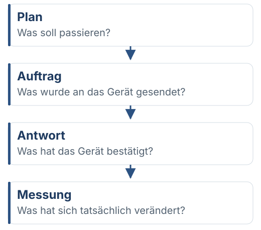
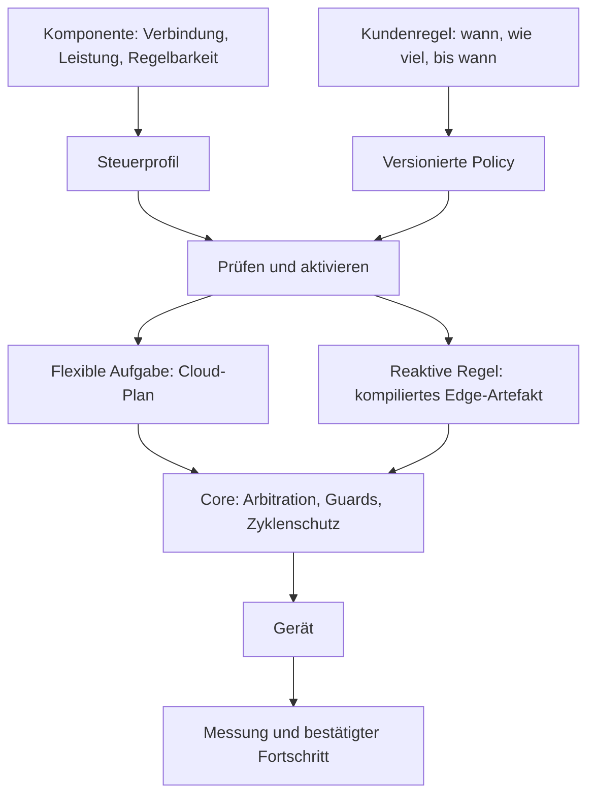

# Steuerbare Verbraucher

VoltPilot verbindet das physische Steuerprofil eines Verbrauchers mit einer Betriebsregel. Cloud-Planung, lokale Reaktion und Geräteschutz haben getrennte Aufgaben; die Freigaben bestimmen, welcher Pfad aktiv ist.

## Modell

| Begriff | Bedeutung |
|---|---|
| Komponente / Entität | Physisches beziehungsweise steuerbares Objekt mit stabiler Identität |
| Steuerprofil | Ein/Aus, Stufen oder kontinuierliche Leistung; Grenzen und Failsafe |
| Policy | Versionierte Betriebsanforderungen, aktivierbar und pausierbar |
| Flexible Aufgabe | Benötigte Energie/Laufzeit innerhalb eines Fensters mit Frist |
| Reaktive Regel | Reagiert auf gültige lokale Signale oder vorberechnete Fenster |
| Handeingriff | Zeitlich begrenzte Änderung; keine Umgehung technischer Grenzen |

Quellen: `consumer_profile`, `consumer_policy` und Anforderungszustände in API/Flyway; [Policy-Schema](contracts/v2/consumer-policy.schema.json).

## Regel und Energiequelle

Eine Regel beschreibt Ziel, Bedingung/Zeitfenster, Verbindlichkeit und erlaubte Energiequellen. Ein/Aus-Verbraucher erhalten keine erfundene Teilleistung. Leistungsstufen, Mindestlaufzeit, Mindestpause und Startgrenzen müssen zur tatsächlichen Fähigkeit passen.

- Pflichtbedarf darf Netzstrom verwenden; das erzwingt keinen Netzbezug, wenn eine andere erlaubte Quelle genügt.
- Speicherentladung und Netzbezug sind getrennte Entscheidungen.
- „Verbraucher zuerst“ beziehungsweise „Speicher zuerst“ ordnet flexible Nutzung gegenüber dem Speicher ein, hebt aber keine Schutzgrenze auf.
- Energiezuordnung zwischen PV, Speicher, Netz und einzelnen Verbrauchern ist bilanziell. Sie ist keine Messung der physischen Herkunft einzelner Elektronen.
- Lokale Zeitfenster werden mit Zeitzone in konkrete Zeitintervalle umgesetzt. Sommerzeit und verstrichene Laufzeit getrennt behandeln.

## Vorrang und Aktivierung

Mehrere Anforderungen eines Verbrauchers werden zu einem zulässigen Ziel zusammengeführt. Schutz-, Netz- und Vertragsgrenzen bleiben über Nutzerwünschen. Reaktive Pflichtregeln können einen Marktplan über den begrenzten Flow-Override verdrängen; flexible Slots laufen über den Marktplan.

Die **technisch verbindlichen** Klassen, Quellberechtigungen und TTLs stehen unter [Arbitration](contracts/v2/edge-desired-arbitration.md). Eine vereinfachte Reihenfolge im Portal darf diese Regeln nicht ersetzen.

Bei fehlgeschlagener Kompilierung bleibt der bisher aktive Stand maßgeblich. Speicherung einer Policy oder MQTT-Zustellung allein beweist noch keine laufende Geräteausführung. Deaktivieren/Pausieren muss ausgerollte Artefakte auch bei abgeschalteten Aktivierungsflags zurückziehen.

## Offline-Verhalten

| Situation | Verhalten |
|---|---|
| Marktplan veraltet | Markt-Wünsche zurückziehen; lokale zulässige Wünsche/Failsafe übernehmen |
| Lokale Pflichtregel, Signale frisch | Kann innerhalb der Schutzgrenzen weiter ausgewertet werden |
| Benötigtes Signal unbekannt/veraltet | Kein erfundener Wahrheitswert und kein neuer Start daraus |
| Vorberechnetes Preis-/Zeitfenster endet | Bedingung unbekannt; keine unbegrenzte Fortsetzung |
| Fristaufgabe ohne frischen v2-Plan | Begrenzter Deadline-Fallback nur mit bestätigtem eigenem Fortschritt |

Der Deadline-Fallback nutzt `flex_requirements` aus dem Registry-Push und beginnt erst am berechneten spätesten Startpunkt. Er ist intern zwischen `flow` und `market` eingeordnet, durchläuft dieselben Guards und weicht einem frischen Plan. Unbekannter Fortschritt startet keine Aufgabe; nach Fristende wird ein verpasster Bedarf als solcher ausgewiesen.

## Rückmeldung und Portal

Die Kundenoberfläche trennt Gerät anlegen, Betriebsregel erstellen und Ausführung prüfen. Tatsächliche Zustände sind etwa geplant, aktiv, begrenzt, unbestätigt oder verpasst. Sollleistung zählt nicht als gemessene Erfüllung.

Geräte-/Typfreigabe, Verbindungsprüfung und globale Flags sind verschiedene Voraussetzungen. Herstelleradapter für go-e und Shelly sowie OCPP sind vorhanden; ihre Existenz bedeutet keine pauschale Freigabe jedes realen Modells.

## Betrieb und Tests

[Betriebshandbuch](verbrauchssteuerung-betrieb.md) für Flags, Freigabe und Rücknahme. Belege: API-`ConsumerApiTest`, Policy-Compiler-/Broker-Tests, Co-Solver-Szenarien, Edge-Arbitration-/Deadline-/Zyklenschutztests und Portal-Regeltests.
