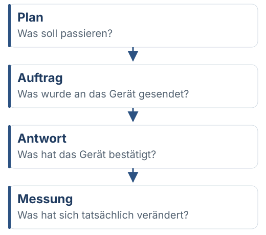
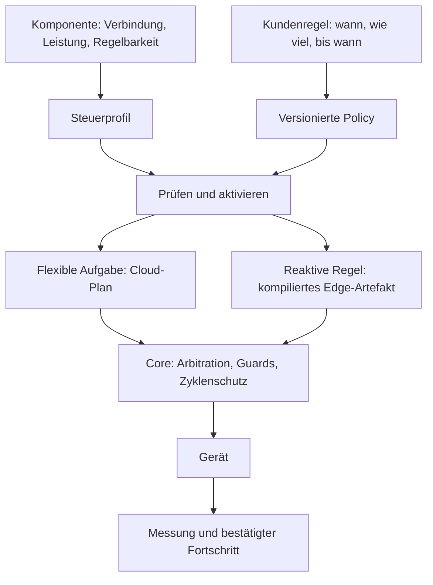

# Steuerbare Verbraucher

VoltPilot verbindet das physische Steuerprofil eines Verbrauchers mit einer Betriebsregel. Cloud-Planung, lokale Reaktion und Geräteschutz haben getrennte Aufgaben; die Freigaben bestimmen, welcher Pfad aktiv ist.

```mermaid
flowchart TD
    G["Komponente: Verbindung, Leistung, Regelbarkeit"] --> Profil["Steuerprofil"]
    Wunsch["Kundenregel: wann, wie viel, bis wann"] --> Policy["Versionierte Policy"]
    Profil --> Validieren["Prüfen und aktivieren"]
    Policy --> Validieren
    Validieren --> Plan["Flexible Aufgabe: Cloud-Plan"]
    Validieren --> Reaktiv["Reaktive Regel: kompiliertes Edge-Artefakt"]
    Plan --> Core["Core: Arbitration, Guards, Zyklenschutz"]
    Reaktiv --> Core
    Core --> IO["Gerät"]
    IO --> Nachweis["Messung und bestätigter Fortschritt"]
```

## Modell

| Begriff | Bedeutung |
|---|---|
| Komponente / Entität | Physisches beziehungsweise steuerbares Objekt mit stabiler Identität |
| Steuerprofil | Ein/Aus, Stufen oder kontinuierliche Leistung; Grenzen und Failsafe |
| Policy | Versionierte Betriebsanforderungen, aktivierbar und pausierbar |
| Flexible Aufgabe | Benötigte Energie/Laufzeit innerhalb eines Fensters mit Frist |
| Reaktive Regel | Reagiert auf gültige lokale Signale oder vorberechnete Fenster |
| Handeingriff | Zeitlich begrenzte Änderung; keine Umgehung technischer Grenzen |

Quellen: `consumer_profile`, `consumer_policy` und Anforderungszustände in API/Flyway; [Policy-Schema](contracts/v2/consumer-policy.schema.json).

## Regel und Energiequelle

Eine Regel beschreibt Ziel, Bedingung/Zeitfenster, Verbindlichkeit und erlaubte Energiequellen. Ein/Aus-Verbraucher erhalten keine erfundene Teilleistung. Leistungsstufen, Mindestlaufzeit, Mindestpause und Startgrenzen müssen zur tatsächlichen Fähigkeit passen.

- Pflichtbedarf darf Netzstrom verwenden; das erzwingt keinen Netzbezug, wenn eine andere erlaubte Quelle genügt.
- Speicherentladung und Netzbezug sind getrennte Entscheidungen.
- „Verbraucher zuerst“ beziehungsweise „Speicher zuerst“ ordnet flexible Nutzung gegenüber dem Speicher ein, hebt aber keine Schutzgrenze auf.
- Energiezuordnung zwischen PV, Speicher, Netz und einzelnen Verbrauchern ist bilanziell. Sie ist keine Messung der physischen Herkunft einzelner Elektronen.
- Lokale Zeitfenster werden mit Zeitzone in konkrete Zeitintervalle umgesetzt. Sommerzeit und verstrichene Laufzeit getrennt behandeln.

## Vorrang und Aktivierung

Mehrere Anforderungen eines Verbrauchers werden zu einem zulässigen Ziel zusammengeführt. Schutz-, Netz- und Vertragsgrenzen bleiben über Nutzerwünschen. Reaktive Pflichtregeln können einen Marktplan über den begrenzten Flow-Override verdrängen; flexible Slots laufen über den Marktplan.

Die **technisch verbindlichen** Klassen, Quellberechtigungen und TTLs stehen unter [Arbitration](contracts/v2/edge-desired-arbitration.md). Eine vereinfachte Reihenfolge im Portal darf diese Regeln nicht ersetzen.

Bei fehlgeschlagener Kompilierung bleibt der bisher aktive Stand maßgeblich. Speicherung einer Policy oder MQTT-Zustellung allein beweist noch keine laufende Geräteausführung. Deaktivieren/Pausieren muss ausgerollte Artefakte auch bei abgeschalteten Aktivierungsflags zurückziehen.

Eine **Szene** (Steuerung neu, E6; `SzenenService`, `/sites/{id}/scene`) ist kein eigener Schaltweg: sie pausiert die gewählten Verbraucher über denselben Pausenweg und merkt sich, welche sie selbst pausiert hat. Beim Beenden setzt sie genau diese fort; ein vorher pausiertes oder zwischendurch von Hand fortgesetztes Gerät bleibt unberührt. Weil Fortsetzen das Steuerungs-Flag braucht, verweigert der Server das Einschalten einer Szene ohne `voltpilot.consumer-control.enabled`. Was beim Beenden nicht fortgesetzt werden kann, bleibt in der Szene und wird benannt.

## Sonne + Speicher

Ladequelle unter „Womit laden?“ neben „Nur Sonne“, „Sonne + Minimum“ und „Günstig“; die Moduswahl „Aus · Smart · Schnell“ bleibt (Kapitän, 06.10.2026). Steckt ein Auto, bekommt es den PV-Überschuss **plus** die Speicherenergie über einer **Untergrenze**: so viel bleibt im Speicher, dass das Haus laut vorsichtiger Prognose bis zur nächsten Erzeugung ohne Netzbezug auskommt. Netzstrom gibt es in dieser Quelle nicht. Bestandsaufnahme und Entscheidungen: [Konzept](konzepte/sonne-speicher/README.md).

| Teil | Regel | Ort |
|---|---|---|
| Wort | Steuerart `quelle=ueberschuss`, `ueberschussModus=speicher`; Box-Bahn `nur_sonne` plus `charge_points[].storage_release`. Eine Box ohne das Flag fährt „Nur Sonne“. Karte `optionen.quellen[ueberschuss_speicher]` mit Sperrgrund (keine PV, keine OCPP-Säule, kein Speicher, keine Kapazität) | API `SteuerartSatz`, Portal `steuerung/laden.ts`, [Vektoren](contracts/v2/sonne-speicher-vectors.json) |
| Untergrenze | Cloud, je Viertelstunde im v1-Fahrplan (`slots[].ev_release_floor_soc_pct`, `ev_release_max_discharge_kw`, `ev_release_reason`) | `services/optimization/…/storage_release.py` |
| Freigabe | Box, gegen Messwerte; jede Unbekannte endet als „Nur Sonne“ | `edge-app/core/internal/lastmgmt/release.go` |
| Reserve | je Anlage, `site_charging_config.storage_release_reserve_kwh`, 0–100 kWh, `null` = Vorgabe **1,0 kWh** | `PUT /sites/{id}/charging-config/storage-release`, Portal Reiter Laden |

**Rechnung (Cloud).** Rückwärts in gespeicherten kWh: `E(Ende) = E_lo`; Defizit-Slot `E(t) = E(t+1) + min(Last'−PV', P_ent)·Δt/η`, Überschuss-Slot `E(t) = E(t+1) − min(PV'−Last', P_lad)·Δt·η`; dann `max(E_lo, ·)`. `E_lo` ist der Reservestapel des Speichers plus Reserve der Anlage. Die Kappung nach unten ist Kausalität (ein späterer Überschuss bezahlt kein früheres Defizit); der volle Speicher steckt in der Kappung bei `E_hi`: braucht die Zukunft mehr, als er fasst, ist Netzbezug dort ohnehin unvermeidlich, und die Rechnung läuft ab „voll“ weiter. Ist schon der Bedarf jetzt gekappt, gibt es keine Freigabe. Eine Freigabe bis zur Untergrenze erhöht den prognostizierten Netzbezug nie; ein Überschuss-Slot hält den höheren seiner beiden Ränder.

**Horizont.** Bis zur nächsten Erzeugung: nach der nächsten Nacht die erste Viertelstunde, in der die vorsichtige Sonne die vorsichtige Last deckt, sonst der ganze nächste Tag (ein trüber Folgetag hebt die Untergrenze). Der Fahrplan endet mit den Börsenpreisen, vor der Day-Ahead-Veröffentlichung also um Mitternacht; die Rechnung läuft dann über die frische gespeicherte Last- und PV-Prognose weiter (höchstens 48 h, ohne Handel). Reicht auch sie nicht so weit, gibt es keine Freigabe (`prognose_zu_kurz`).

**Vorsicht und Reserve.** Last × (1 + Q0,9 des gemessenen relativen Nachtfehlers), PV × (1 − |Q0,1| des gemessenen PV-Tagesfehlers), je Anlage und aktivem Modell, nur in die vorsichtige Richtung ([Prognosen](forecasting.md#unsicherheit-für-sonne--speicher)). Unter sieben auswertbaren Nächten/Tagen gelten +25 % / −30 % (größte belegte Nachtabweichung der Plattform: +24 %). Die Reserve von **1,0 kWh** kommt dazu und deckt, was die Viertelstundenrechnung nicht sieht: späteren Sonnenaufgang, bis zu 15 Minuten alten Fahrplan, Unschärfe des gemessenen Ladestands; sie trägt eine übliche Nacht-Grundlast von 0,3–0,5 kW zwei bis drei Stunden. Eine größere Pauschale würde die schon eingerechnete Prognose-Unsicherheit doppelt zählen; wer mehr Sicherheit will, stellt die Reserve höher.

**Rückfall „Nur Sonne“.** Ohne Untergrenze (Grund im Fahrplan): kein gemessener Ladestand, Speicher von Regel oder Handeingriff gehalten, Prognose fehlt oder ist älter als 120 min (`prognose_veraltet`), reicht nicht bis zur nächsten Erzeugung (`prognose_zu_kurz`), Nachtbedarf oder Reserve über der Kapazität. Die Box gibt zusätzlich nichts frei ohne frischen Fahrplan, ohne Untergrenze im laufenden Slot (`plan_handelt`), bei unbekanntem oder veraltetem Ladestand, ohne frische Messung, wenn VoltPilot den Speicher gerade nicht führt (`speicherpfad`: pausiert, gehalten, Planrückfall, Gerät nicht freigegeben oder unbestätigt), bei BMS-Sperre und nach gemessenem Netzbezug während der Freigabe (über 0,5 kW für 90 s → 15 min Sperre, `wirkung`). Hysterese: Start 2 Punkte über der Untergrenze, Stopp 0,5 Punkte darüber.

**Fahrplan gegen Kundenwahl.** Die Untergrenze entsteht nach dem Lösen; Zielfunktion, Arbitrage und STUR-Messlatte bleiben unverändert, jeder 15-min-Lauf rechnet vom gemessenen Ladestand neu. In Handels-Viertelstunden (geplanter Netzbezug über 0,05 kW: günstige Stunde, Netzladen, PV-Bus-Laden mit parallelem Bezug; oder Speicherverkauf) gibt es keine Untergrenze – der Fahrplan gewinnt; ein geplanter Verkauf hebt die Untergrenze davor. In Eigenverbrauchs-Viertelstunden gewinnt die Kundenwahl: plant der Fahrplan dort ein Laden des Speichers, senkt die Box es auf den gemessenen Wert `pv − load` (nur nach unten, durch Untergrenze und Guards begrenzt), damit das Auto nicht aus dem Netz lädt, während die Sonne den Speicher füllt. Speicherenergie im Auto ist bilanziell Eigenverbrauch; Plan- und Messseite verwenden dieselben Tarifgrundlagen wie bisher.

**Physik.** Die Wallbox ist Hauslast (`house = pv + grid − battery`); der Speicher deckt sie über seine normale Regelung (Eigenverbrauch, Defizitdeckung, Lastfolge). Es gibt keinen neuen Schreibhebel am Speicher, nur die Absenkung einer geplanten Ladung. Führt VoltPilot den Speicher nicht (fehlende Modell-/Gerätefreigabe, unbestätigte Rückmeldung), gibt die Box nichts frei.

**Mehrere Ladepunkte, Vorrang, andere Verbraucher.** Die Freigabe ist eine Leistung: `min(Entladeleistung laut Plan, Nennband, BMS) − Hausdefizit, das der Speicher schon deckt`. Der Zuteiler bucht sie als weitere Lesart derselben Überschuss-Bahn und zieht jede quellengebundene Zuteilung davon ab; alle Ladepunkte auf der Quelle bekommen sie zusammen höchstens einmal, verteilt wie bisher (Rangliste beziehungsweise Vorrang-Säulen zuerst, gleiche Ränge fair). Bei gemischten Quellen wird stufenweise gefüllt: kein „Nur Sonne“-Nachbar erreicht Speicherenergie, und kein Ladepunkt auf „Sonne + Speicher“ nimmt ihm seine Sonne. Über der Untergrenze erreicht ein Ladepunkt auf der Quelle den ganzen Überschuss plus Freigabe, auch wenn der Speicher sonst vor den Autos steht („Speicher vor Auto“ oder Rangliste); an oder unter ihr bekommt er nur, was nach dem Speicher übrig bleibt, auch bei „Auto vor Speicher“ – die Untergrenze hat die Sonne für die Nacht eingeplant. Ladepunkte auf anderen Quellen behalten den Vorrang der Anlage. Andere Verbraucher bekommen keine freigegebene Speicherenergie; was der Speicher für sie deckt, ist Hausdefizit und verkleinert die Freigabe.

**Ladeziel.** Kombinierbar: das Ziel bleibt dieselbe Anforderung wie bei „Nur Sonne“ mit Ziel („Sonne und freigegebener Speicher zuerst, Rest in den günstigsten Stunden“); wie es seinen Rest lädt, ändert die Quelle nicht. Die Freigabe kommt nur in Eigenverbrauchs-Viertelstunden des Speicherplans dazu und verkleinert den Rest. Den Netzrest verlangt der Kunde mit dem Ziel ausdrücklich; „kein Netzstrom“ gilt für die Quelle ohne Ziel. Zieht die Anlage während einer Freigabe Netzstrom, nimmt die Wirkungsprüfung die Freigabe zurück.

**Nachweis.** Rechnung: `test_storage_release.py` (12:00 sonnig, 12:00 vor der Day-Ahead-Veröffentlichung, 20:00, trüber Folgetag, voller Speicher, veraltete Prognose, Monotonie, Handel). Box: `release_test.go`, `release_vectors_test.go` und `ocpp_release_test.go` gegen den OCPP-Simulator. **Nur im Simulator belegt:** dass der reale Speicher die Wallbox über seine Eigenverbrauchsregelung deckt und die Ladungsabsenkung wirkt; einen Hardware-Prüfstand ersetzt das nicht. Zur Laufzeit sichert die Wirkungsprüfung (gemessener Netzbezug → Sperre) diese Annahme ab.

## Offline-Verhalten

| Situation | Verhalten |
|---|---|
| Marktplan veraltet | Markt-Wünsche zurückziehen; lokale zulässige Wünsche/Failsafe übernehmen |
| Lokale Pflichtregel, Signale frisch | Kann innerhalb der Schutzgrenzen weiter ausgewertet werden |
| Benötigtes Signal unbekannt/veraltet | Kein erfundener Wahrheitswert und kein neuer Start daraus |
| Vorberechnetes Preis-/Zeitfenster endet | Bedingung unbekannt; keine unbegrenzte Fortsetzung |
| Fristaufgabe ohne frischen v2-Plan | Begrenzter Deadline-Fallback nur mit bestätigtem eigenem Fortschritt |

Der Deadline-Fallback nutzt `flex_requirements` aus dem Registry-Push und beginnt erst am berechneten spätesten Startpunkt. Er ist intern zwischen `flow` und `market` eingeordnet, durchläuft dieselben Guards und weicht einem frischen Plan. Unbekannter Fortschritt startet keine Aufgabe; nach Fristende wird ein verpasster Bedarf als solcher ausgewiesen.

## Rückmeldung und Portal

Die Kundenoberfläche trennt Gerät anlegen, Betriebsregel erstellen und Ausführung prüfen. Tatsächliche Zustände sind etwa geplant, aktiv, begrenzt, unbestätigt oder verpasst. Sollleistung zählt nicht als gemessene Erfüllung.

Geräte-/Typfreigabe, Verbindungsprüfung und globale Flags sind verschiedene Voraussetzungen. Herstelleradapter für go-e und Shelly sowie OCPP sind vorhanden; ihre Existenz bedeutet keine pauschale Freigabe jedes realen Modells.

## Betrieb und Tests

[Betriebshandbuch](verbrauchssteuerung-betrieb.md) für Flags, Freigabe und Rücknahme. Belege: API-`ConsumerApiTest`, Policy-Compiler-/Broker-Tests, Co-Solver-Szenarien, Edge-Arbitration-/Deadline-/Zyklenschutztests und Portal-Regeltests.
