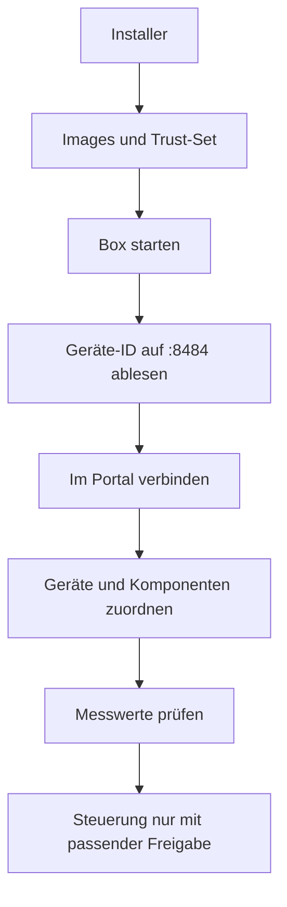

# Box installieren und betreiben

Der Installer richtet die Kunden-Box aus vorgefertigten Images ein. Er benötigt Docker-Zugriff, Registry-Zugang und Verbindungen zu Portal, MQTT-Broker sowie den lokalen Geräten.

## Einrichten

In einem eigenen Installationsverzeichnis auf der Box:

```bash
curl -fsSLO https://git.tecmaxx.de/mamotec/voltpilot-ems/raw/branch/main/edge-app/install.sh
chmod +x install.sh
./install.sh
```

Das Skript erzeugt `docker-compose.yml` und `.env`, prüft Voraussetzungen und startet Core, Node-RED und Updater. Die tatsächlichen Cloud-Adressen kommen aus der Einrichtung; die Vorgabe ist `https://portal.voltpilot.de`.



Die selbst erzeugte ID hat sechs Nutzzeichen und ein Prüfzeichen hinter `edge-`. Sticker mit `VP-` müssen in der Plattform-Registry registriert sein. Keine ähnliche Ersatz-ID anlegen, wenn das Verbinden fehlschlägt.

## Lokale Adressen

| Zweck | Standard |
|---|---|
| Box-Web-App | `http://<box>:8484` |
| Node-RED-Servicezugang | `http://<box>:1881` |
| OCPP | `ws://<box>:8887/ocpp/<kennung>` |
| MQTT-Bus am Host | `127.0.0.1:1884` |

Web, Editor und OCPP nur im Kundennetz bereitstellen. Für die Cloud benötigt die Box ausgehendes HTTPS und MQTT-mTLS `8883`; keine öffentliche Weiterleitung zur Box.

## Konfiguration

[`.env.example`](.env.example) enthält die unterstützten Optionen. SoC-/Leistungsgrenzen müssen zur realen Anlage passen. Der Portal-Geräteweg verteilt Konfiguration; lokale Einrichtungsfunktionen bleiben für Diagnose und bestehende Installationen verfügbar.

`VP_CONTROL_ENABLED` ist die globale Steuerungsfreigabe; Verbraucher benötigen zusätzlich `VP_CONSUMER_CONTROL_ENABLED`. Ein eingeschalteter OCPP-Server allein aktiviert keine optimierte Verteilung. `VP_DEV_*` auf Kundenboxen leer lassen.

## Funktion prüfen

```bash
docker compose ps
docker compose logs --tail=80 core nodered updater
curl -fsS http://127.0.0.1:8484/health
```

Prüfen: richtige Referenz, erfolgreicher Claim, Zertifikat, MQTT-Verbindung und frische Messwerte. Bei mehreren Erzeugern Quellenzuordnung und Standortbilanz prüfen. Physische Schreibtests ausschließlich nach [Prüfstandanleitung](nodered/CONTROL-BENCH.md).

## Updates und Trust-Set

Reguläre Updates im Portal zuweisen: [Edge-Updates](../docs/ota-autonomie.md). Core, Node-RED und Updater gehören zum Installationsstack; ein zusätzliches `ota`-Profil ist nicht erforderlich.

```bash
./install.sh --refresh-trust
```

Dieser gezielte Einrichtungsweg aktualisiert nur das Trust-Set. Die Signaturkette wird nicht vom laufenden OTA-Download umgangen. [Schlüssel und Rotation](../docs/ota-signing.md).

## LAN-Logger nicht aus dem Container erreichbar? (Host-Networking)

Bei geeigneten Linux-Installationen kann das vorhandene Override helfen, wenn ein Logger über Bridge/NAT nicht erreichbar ist:

```bash
docker compose -f docker-compose.yml -f docker-compose.hostnet.yml up -d
```

Das Override gehört zum Repository-Checkout. Nicht ungeprüft auf einen vom Installer erzeugten Stack übertragen. Host-Netzwerk verändert Erreichbarkeit und Portbelegung; Hinweise in der [Override-Datei](docker-compose.hostnet.yml) beachten.

## Fehler eingrenzen

| Symptom | Nächster Schritt |
|---|---|
| ID abgewiesen | ID exakt übernehmen; Sticker-Registry oder Prüfziffer prüfen |
| Warten auf Zertifikat | Claim und konfigurierte Portal-Adresse prüfen |
| MQTT nicht verbunden | DNS, Port 8883, Zertifikat und Broker-ACL prüfen |
| Quelle bleibt ohne Daten | Node-RED-Logs, Protokoll, Unit-ID und konkurrierende Verbindungen prüfen |
| Plan vorhanden, keine Steuerung | Gerätefreigabe, Flags, Guards und Readback getrennt prüfen |
| Update fehlgeschlagen | Gerätegrund und Journal lesen; [OTA-Handbuch](../docs/ota-autonomie.md) |
